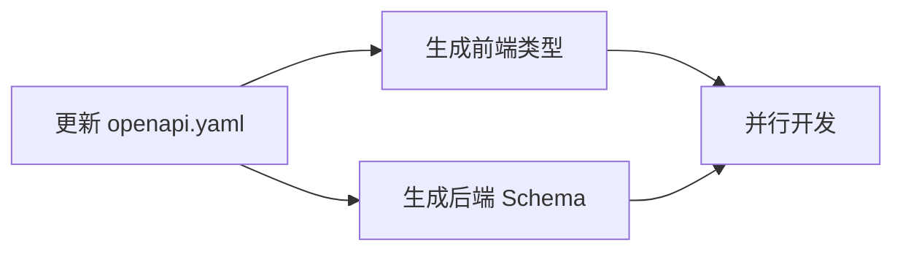

# 规则层级

## 优先级

```
1. docs/openapi.yaml          (API 契约)
2. docs/standards/            (代码规范)
3. .cursorrules (根目录)       (全局规约)
4. 子目录 .cursorrules         (团队自定义)
```

冲突时，高优先级覆盖低优先级。

## 职责

### 架构师
- 维护 `docs/openapi.yaml`
- 维护 `docs/standards/`
- 审核 `docs/decisions/`

### 前端开发者
- 遵守 `openapi.yaml` 和 `standards/frontend.md`
- 可在 `frontend/.cursorrules` 自定义

### 后端开发者
- 遵守 `openapi.yaml` 和 `standards/backend.md`
- 可在 `backend/.cursorrules` 自定义

## 工作流



详见: [架构理念](./architecture/PHILOSOPHY.md)
