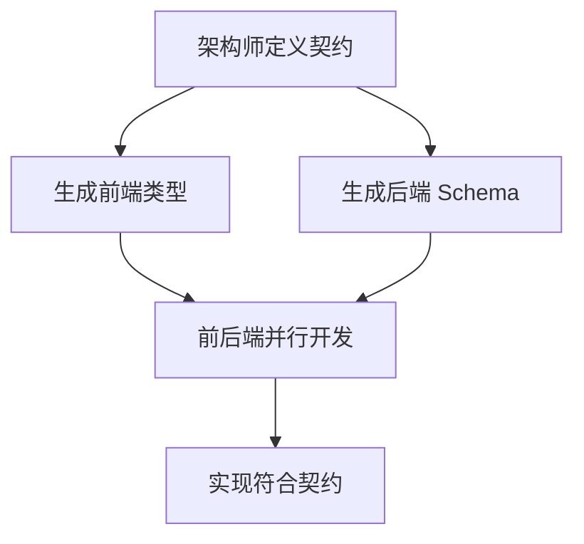

# 架构理念

## 为什么这样设计？

### 问题
- 前后端接口经常不一致
- 规则分散在各处，难以维护
- 职责不清，互相干扰
- 文档与代码不同步

### 解决方案

#### 1. Contract-First (契约优先)
**做法**: 先定义 `openapi-target.yaml`，再生成类型，最后写代码。

**好处**:
- 前后端基于同一契约并行开发
- 类型自动生成，避免手写错误
- 接口一致性有保障

#### 2. SSOT (Single Source of Truth)
**做法**: 每个领域只有一个权威来源。
- API 契约: `openapi-target.yaml`
- 代码规范: `docs/standards/`

**好处**:
- 避免规则冲突
- 修改一处，全局生效
- 易于维护

#### 3. Separation of Concerns (关注点分离)
**做法**: 不同角色管理不同领域。
- 架构师: 契约、规范、决策
- 开发者: 实现、团队约定

**好处**:
- 职责清晰
- 减少冲突
- 提高效率

## 工作流



## 规则层级

```
1. docs/openapi-target.yaml (API 契约)
2. docs/standards/ (代码规范)
3. .cursorrules (根目录) (全局规约)
4. 子目录 .cursorrules (团队自定义)
```

冲突时，高优先级覆盖低优先级。

## 结果

- 前后端高效并行开发
- 规范清晰，易于遵守
- 文档精简，避免冗余
- 团队协作顺畅
