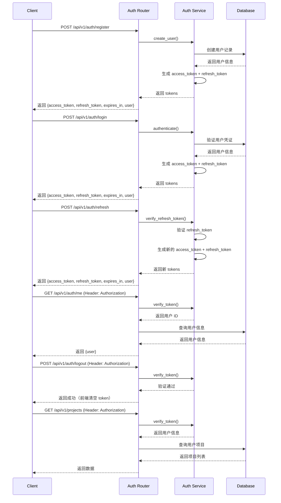

# Authentication Service

## 认证方案

Spectra 采用 **JWT (JSON Web Token)** 认证方案，支持用户注册、登录、Token 刷新、退出登录和用户信息查询。

## 认证流程



## 实现方案

### 1. 依赖安装

```python
# requirements.txt
python-jose[cryptography]==3.3.0
passlib[bcrypt]==1.7.4
python-multipart==0.0.6
```

### 2. Auth Service

```python
# services/auth_service.py
from datetime import datetime, timedelta
from jose import JWTError, jwt
from passlib.context import CryptContext

SECRET_KEY = os.getenv("JWT_SECRET_KEY", "your-secret-key")
ALGORITHM = "HS256"
ACCESS_TOKEN_EXPIRE_MINUTES = 30
REFRESH_TOKEN_EXPIRE_DAYS = 7

pwd_context = CryptContext(schemes=["bcrypt"], deprecated="auto")

class AuthService:
    """认证服务"""
    
    def hash_password(self, password: str) -> str:
        """密码哈希"""
        return pwd_context.hash(password)
    
    def verify_password(self, plain: str, hashed: str) -> bool:
        """验证密码"""
        return pwd_context.verify(plain, hashed)
    
    def create_access_token(self, data: dict) -> str:
        """生成 Access Token (短期有效)"""
        to_encode = data.copy()
        expire = datetime.utcnow() + timedelta(
            minutes=ACCESS_TOKEN_EXPIRE_MINUTES
        )
        to_encode.update({"exp": expire, "type": "access"})
        return jwt.encode(to_encode, SECRET_KEY, algorithm=ALGORITHM)
    
    def create_refresh_token(self, data: dict) -> str:
        """生成 Refresh Token (长期有效)"""
        to_encode = data.copy()
        expire = datetime.utcnow() + timedelta(
            days=REFRESH_TOKEN_EXPIRE_DAYS
        )
        to_encode.update({"exp": expire, "type": "refresh"})
        return jwt.encode(to_encode, SECRET_KEY, algorithm=ALGORITHM)
    
    def verify_token(self, token: str, token_type: str = "access") -> dict:
        """验证 JWT Token"""
        try:
            payload = jwt.decode(token, SECRET_KEY, algorithms=[ALGORITHM])
            if payload.get("type") != token_type:
                raise HTTPException(
                    status_code=401,
                    detail=f"Invalid token type, expected {token_type}"
                )
            return payload
        except JWTError:
            raise HTTPException(
                status_code=401,
                detail="Invalid authentication credentials"
            )
    
    def create_token_pair(self, user_id: str) -> dict:
        """生成 access_token 和 refresh_token 对"""
        access_token = self.create_access_token({"sub": user_id})
        refresh_token = self.create_refresh_token({"sub": user_id})
        return {
            "access_token": access_token,
            "refresh_token": refresh_token,
            "expires_in": ACCESS_TOKEN_EXPIRE_MINUTES * 60  # 秒
        }

auth_service = AuthService()
```

### 3. Auth Router

```python
# routers/auth.py
from fastapi import APIRouter, HTTPException, Depends
from fastapi.security import HTTPBearer, HTTPAuthorizationCredentials
from pydantic import BaseModel, EmailStr, Field

router = APIRouter(prefix="/api/v1/auth", tags=["Authentication"])
security = HTTPBearer()

# Request Models
class RegisterRequest(BaseModel):
    email: EmailStr
    password: str = Field(..., min_length=8)
    username: str = Field(..., min_length=3, max_length=50, pattern=r'^[a-zA-Z0-9_-]+$')
    fullName: str | None = None

class LoginRequest(BaseModel):
    email: EmailStr
    password: str

class RefreshTokenRequest(BaseModel):
    refresh_token: str

# Response Models
class UserInfo(BaseModel):
    id: str
    email: str
    username: str
    fullName: str | None
    createdAt: str

class AuthResponseData(BaseModel):
    access_token: str
    refresh_token: str
    expires_in: int
    user: UserInfo

@router.post("/register")
async def register(request: RegisterRequest):
    """用户注册
    
    参数:
        - email: 邮箱地址
        - password: 密码（最少8位）
        - username: 用户名（3-50位，只能包含字母、数字、下划线和连字符）
        - fullName: 姓名（可选）
    
    返回:
        - success: 操作是否成功
        - data: {access_token, refresh_token, expires_in, user}
        - message: 操作消息
    """
    # 检查邮箱是否已存在
    existing = await db_service.get_user_by_email(request.email)
    if existing:
        return {
            "success": False,
            "error": {
                "code": "CONFLICT",
                "message": "Email already registered"
            },
            "message": "该邮箱已被注册"
        }, 409
    
    # 检查用户名是否已存在
    existing_username = await db_service.get_user_by_username(request.username)
    if existing_username:
        return {
            "success": False,
            "error": {
                "code": "CONFLICT",
                "message": "Username already taken"
            },
            "message": "该用户名已被使用"
        }, 409
    
    # 创建用户
    hashed_password = auth_service.hash_password(request.password)
    user = await db_service.create_user(
        email=request.email,
        password=hashed_password,
        username=request.username,
        full_name=request.fullName
    )
    
    # 生成 Token 对
    tokens = auth_service.create_token_pair(user.id)
    
    return {
        "success": True,
        "data": {
            **tokens,
            "user": {
                "id": user.id,
                "email": user.email,
                "username": user.username,
                "fullName": user.full_name,
                "createdAt": user.created_at.isoformat()
            }
        },
        "message": "注册成功"
    }

@router.post("/login")
async def login(request: LoginRequest):
    """用户登录
    
    参数:
        - email: 邮箱地址
        - password: 密码
    
    返回:
        - success: 操作是否成功
        - data: {access_token, refresh_token, expires_in, user}
        - message: 操作消息
    """
    # 验证用户
    user = await db_service.get_user_by_email(request.email)
    if not user or not auth_service.verify_password(
        request.password, user.password
    ):
        return {
            "success": False,
            "error": {
                "code": "UNAUTHORIZED",
                "message": "Invalid email or password"
            },
            "message": "邮箱或密码错误"
        }, 401
    
    # 生成 Token 对
    tokens = auth_service.create_token_pair(user.id)
    
    return {
        "success": True,
        "data": {
            **tokens,
            "user": {
                "id": user.id,
                "email": user.email,
                "username": user.username,
                "fullName": user.full_name,
                "createdAt": user.created_at.isoformat()
            }
        },
        "message": "登录成功"
    }

@router.post("/refresh")
async def refresh_token(request: RefreshTokenRequest):
    """刷新 Access Token
    
    实现：基础 JWT 续期
    - 验证 refresh_token 有效性
    - 生成新的 access_token 和 refresh_token
    - 返回新的 token 对和过期时间
    
    参数:
        - refresh_token: 长期有效的刷新令牌
    
    返回:
        - success: 操作是否成功
        - data: {access_token, refresh_token, expires_in, user}
        - message: 操作消息
    """
    try:
        # 验证 refresh_token
        payload = auth_service.verify_token(
            request.refresh_token, 
            token_type="refresh"
        )
        user_id = payload.get("sub")
        
        # 查询用户信息
        user = await db_service.get_user_by_id(user_id)
        if not user:
            return {
                "success": False,
                "error": {
                    "code": "UNAUTHORIZED",
                    "message": "User not found"
                },
                "message": "用户不存在"
            }, 401
        
        # 生成新的 Token 对
        tokens = auth_service.create_token_pair(user.id)
        
        return {
            "success": True,
            "data": {
                **tokens,
                "user": {
                    "id": user.id,
                    "email": user.email,
                    "username": user.username,
                    "fullName": user.full_name,
                    "createdAt": user.created_at.isoformat()
                }
            },
            "message": "Token 刷新成功"
        }
    except HTTPException as e:
        return {
            "success": False,
            "error": {
                "code": "UNAUTHORIZED",
                "message": str(e.detail)
            },
            "message": "Token 无效或已过期"
        }, 401

@router.post("/logout")
async def logout(current_user = Depends(get_current_user)):
    """退出登录
    
    实现：轻量级实现（第一版）
    - 不查库/Redis
    - 直接返回成功响应
    - 依赖前端清空本地 token
    
    设计决策：降低开发成本，后续可扩展为 token 黑名单机制
    
    返回:
        - success: 操作是否成功
        - message: 操作消息
    """
    return {
        "success": True,
        "message": "退出登录成功"
    }

@router.get("/me")
async def get_current_user_info(current_user = Depends(get_current_user)):
    """获取当前用户信息
    
    实现：
    - 从 JWT token 中提取 user_id
    - 查询数据库获取用户完整信息
    - 返回用户信息（不包含密码）
    
    返回:
        - success: 操作是否成功
        - data: {user}
        - message: 操作消息
    """
    return {
        "success": True,
        "data": {
            "user": {
                "id": current_user.id,
                "email": current_user.email,
                "username": current_user.username,
                "fullName": current_user.full_name,
                "createdAt": current_user.created_at.isoformat()
            }
        },
        "message": "获取用户信息成功"
    }
```

### 4. 依赖注入

```python
# utils/dependencies.py
from fastapi import Depends, HTTPException
from fastapi.security import HTTPBearer, HTTPAuthorizationCredentials

security = HTTPBearer()

async def get_current_user(
    credentials: HTTPAuthorizationCredentials = Depends(security)
):
    """获取当前用户"""
    token = credentials.credentials
    payload = auth_service.verify_token(token)
    user_id = payload.get("sub")
    
    user = await db_service.get_user_by_id(user_id)
    if not user:
        raise HTTPException(status_code=401, detail="User not found")
    
    return user
```

### 5. 保护路由

```python
# routers/projects.py
from utils.dependencies import get_current_user

@router.get("/projects")
async def get_projects(current_user = Depends(get_current_user)):
    """获取当前用户的项目列表"""
    projects = await db_service.get_user_projects(current_user.id)
    return {"success": True, "data": projects}
```

## 安全配置

```python
# .env
JWT_SECRET_KEY=your-super-secret-key-change-in-production
JWT_ALGORITHM=HS256
ACCESS_TOKEN_EXPIRE_MINUTES=30
REFRESH_TOKEN_EXPIRE_DAYS=7
```

## API 端点总览

| 端点 | 方法 | 认证 | 描述 | 状态码 |
|------|------|------|------|--------|
| `/api/v1/auth/register` | POST | ❌ | 用户注册 | 200, 400, 409 |
| `/api/v1/auth/login` | POST | ❌ | 用户登录 | 200, 400, 401 |
| `/api/v1/auth/refresh` | POST | ❌ | 刷新 Token | 200, 400, 401 |
| `/api/v1/auth/logout` | POST | ✅ | 退出登录 | 200, 401 |
| `/api/v1/auth/me` | GET | ✅ | 获取当前用户信息 | 200, 401 |

## 响应格式规范

### 成功响应

```json
{
  "success": true,
  "data": {
    "access_token": "eyJhbGciOiJIUzI1NiIsInR5cCI6IkpXVCJ9...",
    "refresh_token": "eyJhbGciOiJIUzI1NiIsInR5cCI6IkpXVCJ9...",
    "expires_in": 1800,
    "user": {
      "id": "user_123",
      "email": "user@example.com",
      "username": "john_doe",
      "fullName": "John Doe",
      "createdAt": "2026-02-25T10:00:00Z"
    }
  },
  "message": "登录成功"
}
```

### 错误响应

```json
{
  "success": false,
  "error": {
    "code": "UNAUTHORIZED",
    "message": "Invalid email or password"
  },
  "message": "邮箱或密码错误"
}
```

## Token 机制说明

### Access Token
- **有效期**: 30 分钟（可配置）
- **用途**: 访问受保护的 API 端点
- **存储**: 前端内存或 sessionStorage（推荐）
- **刷新**: 过期前使用 refresh_token 刷新

### Refresh Token
- **有效期**: 7 天（可配置）
- **用途**: 获取新的 access_token
- **存储**: 前端 localStorage 或 httpOnly cookie（推荐）
- **安全**: 仅用于 `/auth/refresh` 端点

### Token 刷新流程

1. 前端检测 access_token 即将过期（如剩余 5 分钟）
2. 调用 `/api/v1/auth/refresh` 并传入 refresh_token
3. 后端验证 refresh_token 有效性
4. 生成新的 access_token 和 refresh_token
5. 前端更新本地存储的 tokens

### Logout 实现说明

**第一版轻量实现**：
- 后端不维护 token 黑名单
- 不查询数据库或 Redis
- 直接返回成功响应
- 依赖前端清空本地存储的 tokens

**设计决策**：
- 降低开发成本，快速迭代
- 适用于 MVP 阶段
- Token 过期时间较短（30分钟），安全风险可控

**后续扩展方向**：
- 实现 token 黑名单机制（Redis）
- 支持设备管理和远程登出
- 添加异常登录检测

## 相关文档

- [Security Design](./security.md) - 权限检查、限流设计
- [Error Handling](./error-handling.md) - 认证错误处理
