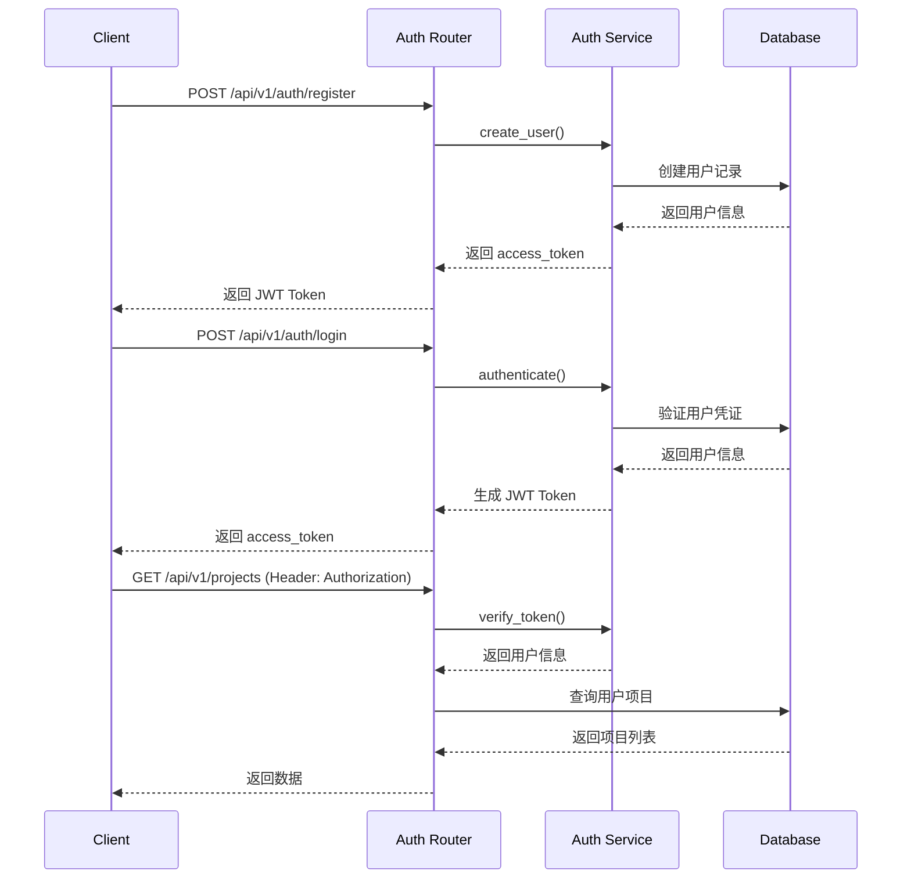

# Authentication Service

## 认证方案

Spectra 采用 **JWT (JSON Web Token)** 认证方案，支持用户注册、登录、Token 刷新。

## 认证流程



## 实现方案

### 1. 依赖安装

```python
# requirements.txt
python-jose[cryptography]==3.3.0
passlib[bcrypt]==1.7.4
python-multipart==0.0.6
```

### 2. Auth Service

```python
# services/auth_service.py
from datetime import datetime, timedelta
from jose import JWTError, jwt
from passlib.context import CryptContext

SECRET_KEY = os.getenv("JWT_SECRET_KEY", "your-secret-key")
ALGORITHM = "HS256"
ACCESS_TOKEN_EXPIRE_MINUTES = 30

pwd_context = CryptContext(schemes=["bcrypt"], deprecated="auto")

class AuthService:
    """认证服务"""
    
    def hash_password(self, password: str) -> str:
        """密码哈希"""
        return pwd_context.hash(password)
    
    def verify_password(self, plain: str, hashed: str) -> bool:
        """验证密码"""
        return pwd_context.verify(plain, hashed)
    
    def create_access_token(self, data: dict) -> str:
        """生成 JWT Token"""
        to_encode = data.copy()
        expire = datetime.utcnow() + timedelta(
            minutes=ACCESS_TOKEN_EXPIRE_MINUTES
        )
        to_encode.update({"exp": expire})
        return jwt.encode(to_encode, SECRET_KEY, algorithm=ALGORITHM)
    
    def verify_token(self, token: str) -> dict:
        """验证 JWT Token"""
        try:
            payload = jwt.decode(token, SECRET_KEY, algorithms=[ALGORITHM])
            return payload
        except JWTError:
            raise HTTPException(
                status_code=401,
                detail="Invalid authentication credentials"
            )

auth_service = AuthService()
```

### 3. Auth Router

```python
# routers/auth.py
from fastapi import APIRouter, HTTPException, Depends
from fastapi.security import HTTPBearer, HTTPAuthorizationCredentials

router = APIRouter(prefix="/auth", tags=["Authentication"])
security = HTTPBearer()

@router.post("/register")
async def register(request: RegisterRequest):
    """用户注册"""
    # 检查用户是否存在
    existing = await db_service.get_user_by_email(request.email)
    if existing:
        raise HTTPException(status_code=400, detail="User already exists")
    
    # 创建用户
    hashed_password = auth_service.hash_password(request.password)
    user = await db_service.create_user(
        email=request.email,
        password=hashed_password,
        name=request.name
    )
    
    # 生成 Token
    token = auth_service.create_access_token({"sub": user.id})
    
    return {"access_token": token, "token_type": "bearer"}

@router.post("/login")
async def login(request: LoginRequest):
    """用户登录"""
    # 验证用户
    user = await db_service.get_user_by_email(request.email)
    if not user or not auth_service.verify_password(
        request.password, user.password
    ):
        raise HTTPException(
            status_code=401, 
            detail="Incorrect email or password"
        )
    
    # 生成 Token
    token = auth_service.create_access_token({"sub": user.id})
    
    return {"access_token": token, "token_type": "bearer"}
```

### 4. 依赖注入

```python
# utils/dependencies.py
from fastapi import Depends, HTTPException
from fastapi.security import HTTPBearer, HTTPAuthorizationCredentials

security = HTTPBearer()

async def get_current_user(
    credentials: HTTPAuthorizationCredentials = Depends(security)
):
    """获取当前用户"""
    token = credentials.credentials
    payload = auth_service.verify_token(token)
    user_id = payload.get("sub")
    
    user = await db_service.get_user_by_id(user_id)
    if not user:
        raise HTTPException(status_code=401, detail="User not found")
    
    return user
```

### 5. 保护路由

```python
# routers/projects.py
from utils.dependencies import get_current_user

@router.get("/projects")
async def get_projects(current_user = Depends(get_current_user)):
    """获取当前用户的项目列表"""
    projects = await db_service.get_user_projects(current_user.id)
    return {"success": True, "data": projects}
```

## 安全配置

```python
# .env
JWT_SECRET_KEY=your-super-secret-key-change-in-production
JWT_ALGORITHM=HS256
ACCESS_TOKEN_EXPIRE_MINUTES=30
```

## 相关文档

- [Security Design](./security.md) - 权限检查、限流设计
- [Error Handling](./error-handling.md) - 认证错误处理
