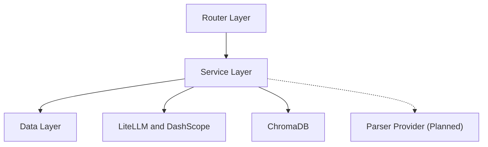

# Backend Architecture Overview

> 状态说明（2026-03-02）：本文档描述后端架构，技术栈落地状态以 `../tech-stack.md` 为准。

## 概述

Spectra 后端基于 **FastAPI + Python 3.11 + Prisma ORM** 构建，采用分层架构设计，支持对话交互、文件处理、RAG 检索、课件生成等核心功能。

## 架构原则

- **分层清晰**：Router -> Service -> Data 三层分离
- **异步优先**：所有 IO 操作使用 async/await
- **类型安全**：全面使用 Type Hints 和 Pydantic v2
- **可扩展**：服务层模块化，易于添加新功能
- **可测试**：依赖注入，便于单元测试

## 技术栈

| 组件 | 技术选型 | 用途 |
|------|---------|------|
| Web 框架 | FastAPI | REST API 服务 |
| 语言 | Python 3.11 | 异步支持、类型提示 |
| ORM | Prisma | 数据库操作 |
| 数据验证 | Pydantic v2 | 请求/响应模型 |
| 数据库 | SQLite -> PostgreSQL | 开发/生产环境 |
| 向量数据库 | ChromaDB | RAG 检索 |
| LLM 接口 | LiteLLM | 统一 LLM 调用 |
| 文档解析 | pypdf + python-docx + python-pptx | MVP 轻量解析 |
| 视频理解 | Qwen-VL API（规划中） | 关键帧提取（未接入） |
| 课件生成 | Marp CLI + Pandoc | PPT/Word 生成 |

## 目录结构

```text
backend/
├── main.py # FastAPI 应用入口
├── routers/ # API 路由层
├── services/ # 业务逻辑层
├── schemas/ # Pydantic 数据模型
├── utils/ # 工具函数
├── prisma/ # 数据库
├── uploads/ # 上传文件存储
├── chroma_data/ # ChromaDB 数据
├── requirements.txt # 依赖列表
├── requirements-dev.txt # 开发依赖
└── pytest.ini # 测试配置
```

## 架构分层



## 相关文档

- [Router Layer](./router-layer.md) - API 路由设计
- [Service Layer](./service-layer.md) - 业务逻辑设计
- [Authentication](./authentication.md) - 认证服务
- [Security](./security.md) - 安全设计
- [Error Handling](./error-handling.md) - 错误处理
- [Logging](./logging.md) - 日志设计
