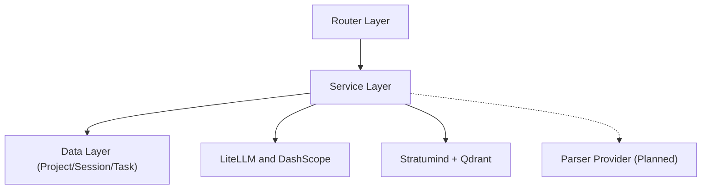

# Backend Architecture Overview

> 状态说明（2026-03-12）：本文档描述后端架构与下一阶段演进方向，技术栈落地状态以 `../tech-stack.md` 为准。

## 概述

Spectra 后端基于 **FastAPI + Python + Prisma ORM** 构建，采用分层架构设计，当前已完成 **session-first** 生成链路（`GenerationSession`），并围绕 `Project` 承载资料、对话、生成与导出。下一阶段在不破坏现有接口的前提下扩展 `reference / version / artifact / candidate-change`，形成 Project-Space 的引用与外化能力。

## 架构原则

- **分层清晰**：Router -> Service -> Data 三层分离
- **异步优先**：所有 IO 操作使用 async/await
- **类型安全**：全面使用 Type Hints 和 Pydantic v2
- **可扩展**：服务层模块化，易于添加新功能
- **可测试**：依赖注入，便于单元测试

## 技术栈

| 组件 | 技术选型 | 用途 |
|------|---------|------|
| Web 框架 | FastAPI | REST API 服务 |
| 语言 | Python 3.11+ | 异步支持、类型提示 |
| ORM | Prisma | 数据库操作 |
| 数据验证 | Pydantic v2 | 请求/响应模型 |
| 数据库 | PostgreSQL | 开发/演示/生产环境 |
| 检索层 | Stratumind + Qdrant | 文本 RAG 检索 |
| LLM 接口 | LiteLLM | 统一 LLM 调用 |
| 文档解析 | pypdf + python-docx + python-pptx | MVP 轻量解析 |
| 视频理解 | Qwen-VL API（规划中） | 关键帧提取（未接入） |
| 课件生成 | Marp CLI + Pandoc | PPT/Word 生成 |

## 目录结构

```text
backend/
├── main.py # FastAPI 应用入口
├── routers/ # API 路由层
├── services/ # 业务逻辑层
├── schemas/ # Pydantic 数据模型
├── utils/ # 工具函数
├── prisma/ # 数据库
├── uploads/ # 上传文件存储
├── stratumind/ # 检索微服务
├── requirements.txt # 依赖列表
├── requirements-dev.txt # 开发依赖
└── pytest.ini # 测试配置
```

## 领域模型（当前 + 规划）

当前已落地的主干对象：

- `Project`：空间/库容器（对外可称“课程空间/个人空间”）。
- `GenerationSession`：工作会话隔离，承载对话与草稿链路。
- `GenerationTask`：异步任务执行记录（不承载产品主语义）。
- `Upload` / `ParsedChunk`：资料上传与切片。
- `Conversation`：会话对话记录（按 session 归档）。

下一阶段规划补齐：

- `ProjectReference`：空间引用关系（`follow` / `pinned`，主基底/辅助引用）。
- `ProjectVersion`：正式版本锚点（可引用、可导出）。
- `Artifact`：导出/按需外化结果（归属项目，记录来源会话与版本）。
- `CandidateChange`：候选变更（协作提交/审核）。

## 架构分层



## 相关文档

- [Router Layer](./router-layer.md) - API 路由设计
- [Service Layer](./service-layer.md) - 业务逻辑设计
- [Authentication](./authentication.md) - 认证服务
- [Security](./security.md) - 安全设计
- [Error Handling](./error-handling.md) - 错误处理
- [Logging](./logging.md) - 日志设计
