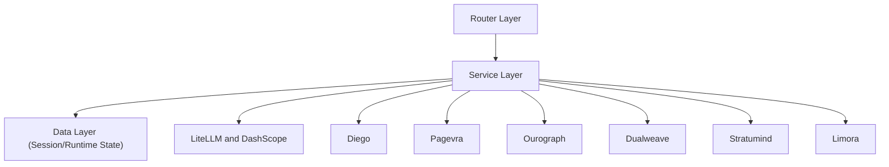

# Backend Architecture Overview

> Status: `current`
> 状态说明（2026-04-16）：本文档描述当前后端架构与运行边界。技术栈落地状态以 `../tech-stack.md` 为准。

## 概述

Spectra 后端基于 **FastAPI + Python + Prisma ORM** 构建，当前形态是 **workflow shell**：围绕 `Project` 和 `GenerationSession` 承载资料、对话、生成、预览、导出与正式状态绑定；正式能力由六个外部 authority services 提供。

## 架构原则

- **分层清晰**：Router -> Service -> Data 三层分离
- **异步优先**：所有 IO 操作使用 async/await
- **类型安全**：全面使用 Type Hints 和 Pydantic v2
- **可扩展**：服务层模块化，易于添加新功能
- **可测试**：依赖注入，便于单元测试

## 技术栈

| 组件 | 技术选型 | 用途 |
|------|---------|------|
| Web 框架 | FastAPI | REST API 服务 |
| 语言 | Python 3.11+ | 异步支持、类型提示 |
| ORM | Prisma | 数据库操作 |
| 数据验证 | Pydantic v2 | 请求/响应模型 |
| 数据库 | PostgreSQL | 开发/演示/生产环境 |
| 检索层 | Stratumind + Qdrant | 文本 RAG 检索 |
| LLM 接口 | LiteLLM | 统一 LLM 调用 |
| 文档解析 | pypdf + python-docx + python-pptx | MVP 轻量解析 |
| 视频理解 | Qwen-VL API（规划中） | 关键帧提取（未接入） |
| 课件生成 | Diego | AI 课件/PPT 主生成服务 |
| 渲染与 Office 外化 | Pagevra | 预览、PPTX、DOCX 渲染服务 |
| 正式知识状态 | Ourograph | Project/Reference/Version/Artifact/CandidateChange/Member |
| 身份容器 | Limora | 登录、会话、组织/成员身份 |

## 目录结构

```text
backend/
├── main.py # FastAPI 应用入口
├── routers/ # API 路由层
├── services/ # 业务逻辑层
├── schemas/ # Pydantic 数据模型
├── utils/ # 工具函数
├── prisma/ # 数据库
├── uploads/ # 上传文件存储
├── requirements.txt # 依赖列表
├── requirements-dev.txt # 开发依赖
└── pytest.ini # 测试配置
```

## 领域模型与服务边界

Spectra backend 现在是 workflow shell，不再把外部能力复制在母体内：

- `Project`：空间/库容器（对外可称“课程空间/个人空间”）。
- `GenerationSession`：工作会话隔离，承载对话与草稿链路。
- `Upload` / `ParsedChunk`：资料上传与切片。
- `Conversation`：会话对话记录（按 session 归档）。
- `ProjectReference / ProjectVersion / Artifact / CandidateChange / ProjectMember`：正式语义归 `Ourograph`。
- AI 课件/PPT 主生成归 `Diego`。
- 渲染、预览、PPTX/DOCX 外化归 `Pagevra`。
- 上传解析、检索召回、身份容器分别归 `Dualweave / Stratumind / Limora`。

## 架构分层



## 相关文档

- [Router Layer](./router-layer.md) - API 路由设计
- [Service Layer](./service-layer.md) - 业务逻辑设计
- [Authentication](./authentication.md) - 认证服务
- [Security](./security.md) - 安全设计
- [Error Handling](./error-handling.md) - 错误处理
- [Logging](./logging.md) - 日志设计
