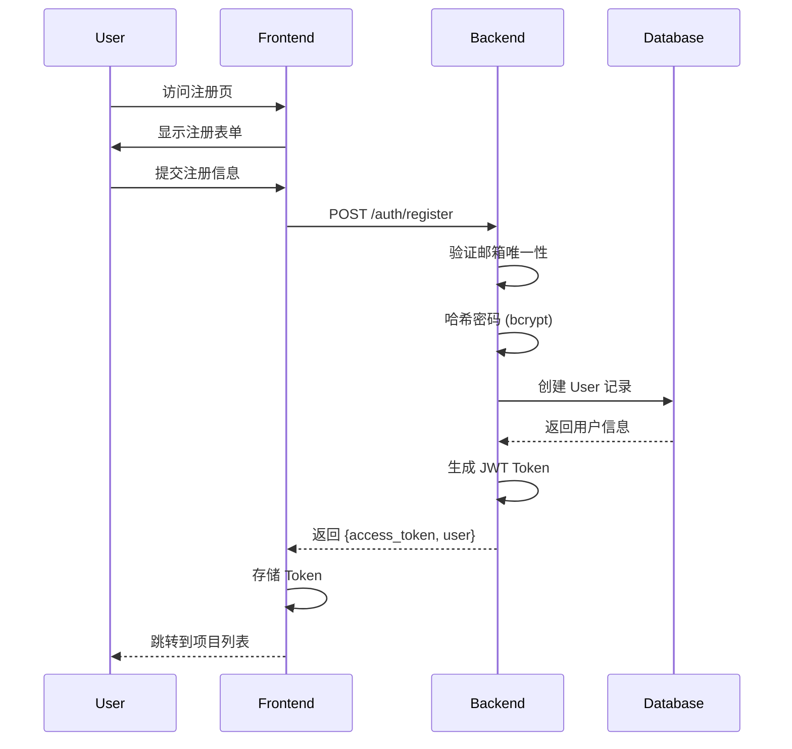
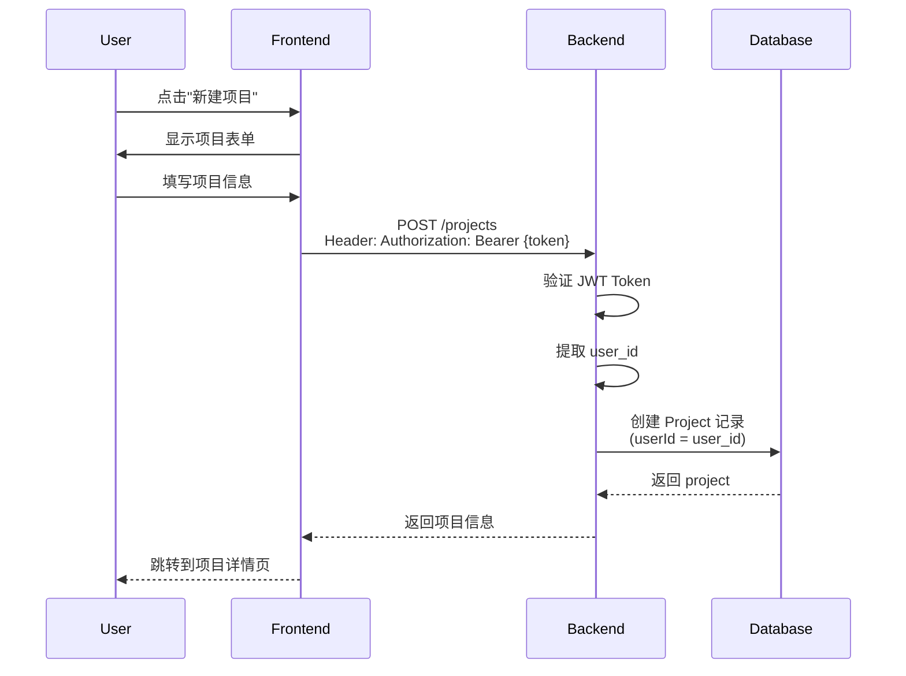
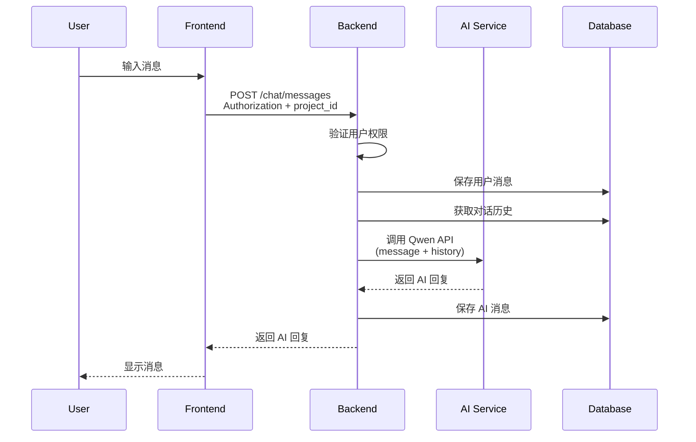
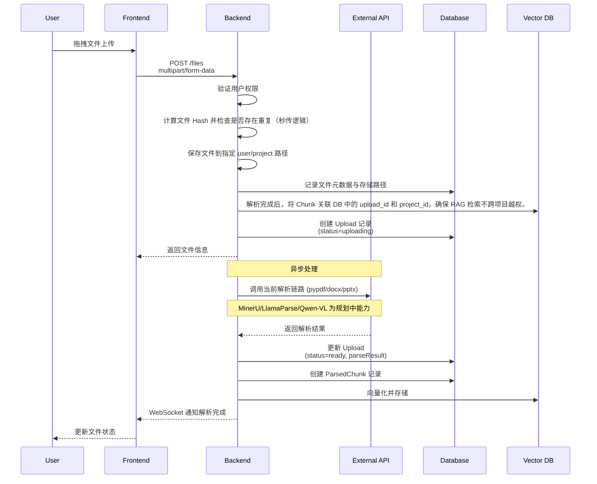
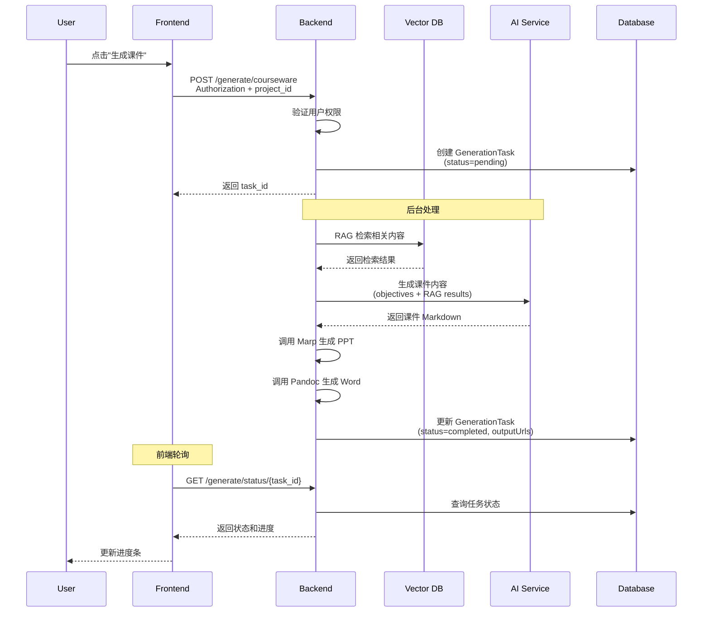
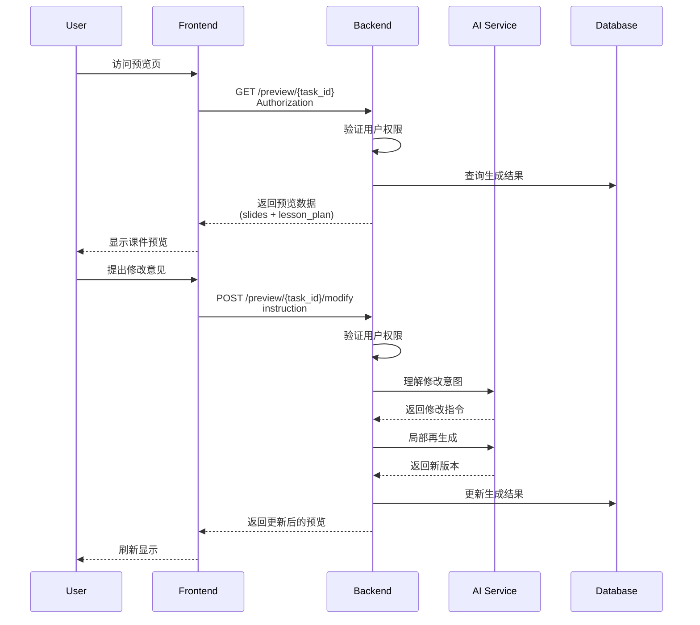

# Data Flow Design

## 核心业务流程

### 1. 用户注册与登录

### 2. 创建项目

### 3. 对话交互

### 4. 文件上传与解析

### 5. 课件生成

### 6. 预览与修改

## 数据流特点

### 认证流
- 所有 API 请求都需要 JWT Token
- Token 在请求头中传递：`Authorization: Bearer {token}`
- 后端自动验证 Token 并提取 user_id

### 权限流
- 所有资源访问都检查 userId
- Project、Upload、GenerationTask 都关联 userId
- 自动过滤非当前用户的数据

### 异步流
- 文件解析异步处理
- 课件生成异步处理
- 前端通过轮询或 WebSocket 获取状态

### 幂等流
- 关键操作支持幂等性键
- 防止重复提交
- 缓存响应结果

## 相关文档

- [Security Architecture](./security-architecture.md) - 安全架构
- [API Specification](../../openapi.yaml) - API 定义
