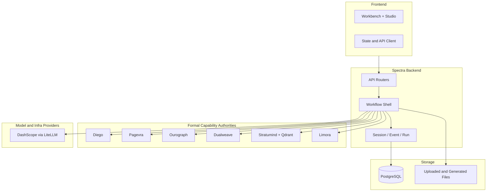

# System Architecture Overview

> Status: `current`
> 状态说明（2026-04-16）：本文档描述当前可用于产品和文档叙事的系统总览。技术栈落地状态以 `../tech-stack.md` 为准。

## 概述

Spectra 当前的稳定形态不是“一个大一统后端”，而是：

- `Spectra frontend`：界面、交互、状态展示
- `Spectra backend`：workflow shell，负责 Session、事件流、任务编排、API 聚合与下载绑定
- 六个正式能力源：`Diego / Pagevra / Ourograph / Dualweave / Stratumind / Limora`

核心工作流是：

`Project -> Session -> Generate/Preview/Artifact -> 回写 formal state`

其中：

- `Project` 是长期知识空间
- `GenerationSession` 是过程态工作会话
- `Artifact / Version / Reference / CandidateChange / Member` 的正式语义归 `Ourograph`
- AI PPT 主生成归 `Diego`
- 预览、渲染、PPTX/DOCX 外化归 `Pagevra`

## 系统架构图

## 当前主模型

- `Project`：长期空间/库容器
- `GenerationSession`：工作会话与过程态隔离
- `Upload / ParsedChunk / Conversation`：资料与对话上下文
- `Run / Event / Artifact binding`：过程与结果的编排侧语义

说明：

- `GenerationTask` 只应视为历史执行基础设施名词，不再是产品主模型。
- 对外讲述时，不应把 `task-first` 叙事当成当前系统结构。

## 六个正式能力源

- `Diego`：AI courseware / PPT generation
- `Pagevra`：render / preview / PPTX / DOCX export
- `Ourograph`：formal project-space state
- `Dualweave`：upload / ingest / parse orchestration
- `Stratumind`：retrieval / vector recall / semantic context
- `Limora`：identity / login session / org-member identity

## 相关文档

- [Service Boundaries](../service-boundaries.md)
- [Tech Stack](../tech-stack.md)
- [Backend Overview](../backend/overview.md)
- [Security Architecture](./security-architecture.md)
