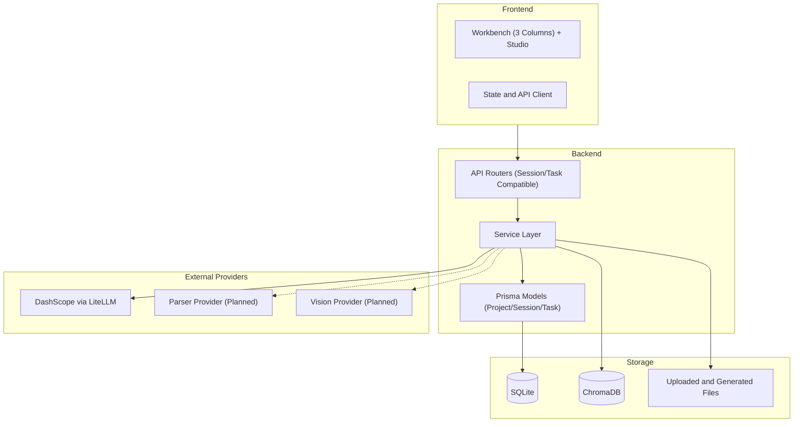

# System Architecture Overview

> 状态说明（2026-03-06）：本文档含“当前实现”和“目标架构（会话化）”。技术栈落地状态以 `../tech-stack.md` 为准。

## 概述

Spectra 是一个多模态 AI 互动式教学智能体，采用前后端分离架构，支持 NotebookLM 风格三栏工作台（资料/对话/大纲）、RAG 检索增强和 Gamma 风格大纲驱动课件生成。

## 系统架构图

## 技术栈

### 前端
- **框架**: Next.js 15 (App Router)
- **语言**: TypeScript
- **样式**: Tailwind CSS + Shadcn/ui
- **状态管理**: Zustand

### 后端
- **框架**: FastAPI
- **语言**: Python 3.11
- **ORM**: Prisma
- **数据库**: SQLite -> PostgreSQL
- **向量数据库**: ChromaDB

### 外部服务
- **LLM（已实现）**: DashScope (Qwen 3.5, via LiteLLM)
- **文档解析（规划中）**: MinerU / LlamaParse 可插拔
- **视频理解（规划中）**: Qwen-VL API

## 架构主线（2026-03）

- 产品主流程从 `task` 升级为 `session`（大纲先行、确认后生成）。
- 前端主界面采用三栏信息架构，Gamma 生成作为 Studio 入口能力。
- Marp/Pandoc 渲染层继续保留，作为会话流的导出执行阶段。

## 相关文档

- [Data Flow](./data-flow.md) - 数据流设计
- [Security Architecture](./security-architecture.md) - 安全架构
- [Deployment](../deployment.md) - 部署架构
