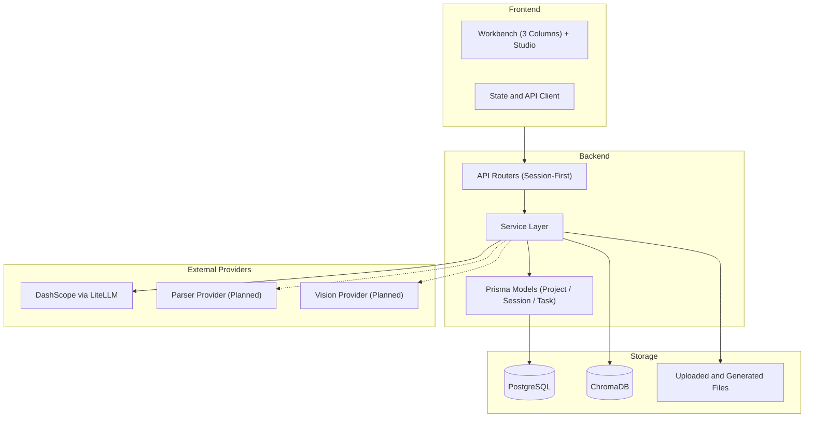

# System Architecture Overview

> 状态说明（2026-03-12）：本文档描述“当前实现 + 下一阶段演进方向”。技术栈落地状态以 `../tech-stack.md` 为准。

## 概述

Spectra 是一个 **session-first** 的课件生产工作台：以 `Project` 作为空间/库的统一容器，以 `GenerationSession` 作为工作会话，围绕上传资料、RAG 检索、生成、预览修改与导出形成稳定主流程。下一阶段在不推翻现有主干的前提下，扩展到“可引用、可协作、可按需外化”的 Project-Space 模型（参考 `docs/project/*_2026-03-09.md`）。

## 系统架构图

## 技术栈

### 前端
- **框架**: Next.js 15 (App Router)
- **语言**: TypeScript
- **样式**: Tailwind CSS + Shadcn/ui
- **状态管理**: Zustand

### 后端
- **框架**: FastAPI
- **语言**: Python 3.11
- **ORM**: Prisma
- **数据库**: PostgreSQL
- **向量数据库**: ChromaDB

### 外部服务
- **LLM（已实现）**: DashScope (Qwen 3.5, via LiteLLM)
- **文档解析（规划中）**: MinerU / LlamaParse 可插拔
- **视频理解（规划中）**: Qwen-VL API

## 核心对象（当前 + 规划）

当前主干：

- `Project`：空间/库容器
- `GenerationSession`：会话隔离与生成链路
- `Upload / ParsedChunk`：资料与切片
- `GenerationTask`：执行记录（兼容层）
- `Conversation`：对话记录（会话归档）

下一阶段：

- `ProjectReference`：空间引用关系
- `ProjectVersion`：正式版本锚点
- `Artifact`：按需外化/导出结果
- `CandidateChange`：候选变更与协作提交

## 架构主线（2026-03）

- **已落地**：生成链路从 `task` 升级为 `session`（大纲先行、确认后生成），预览/导出走会话级路径。
- **当前主语义**：`Project` 为空间/库容器，`GenerationSession` 为工作会话隔离。
- **下一阶段**：在现有 `project + session` 上增量扩展 `reference / version / artifact / candidate-change`，形成 Project-Space 的引用与外化模型。

## 相关文档

- [Security Architecture](./security-architecture.md) - 安全架构
- [Deployment](../deployment.md) - 部署架构
- [Project-Space 演进索引](../../project/SPACE_MODEL_INDEX_2026-03-09.md)
