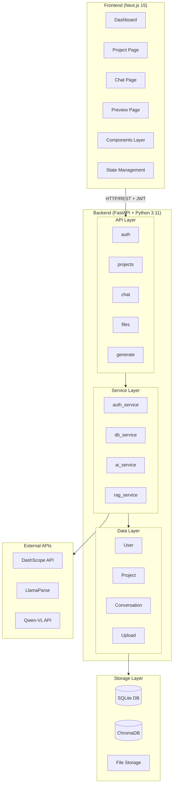

# System Architecture Overview

## 概述

Spectra 是一个多模态 AI 互动式教学智能体，采用前后端分离架构，支持对话式交互、多模态资料处理、RAG 检索增强和课件自动生成。

## 系统架构图

## 技术栈

### 前端
- **框架**: Next.js 15 (App Router)
- **语言**: TypeScript
- **样式**: Tailwind CSS + Shadcn/ui
- **状态管理**: Zustand

### 后端
- **框架**: FastAPI
- **语言**: Python 3.11
- **ORM**: Prisma
- **数据库**: SQLite → PostgreSQL
- **向量数据库**: ChromaDB

### 外部服务
- **LLM**: DashScope (Qwen 3.5)
- **文档解析**: LlamaParse
- **视频理解**: Qwen-VL API

## 相关文档

- [Data Flow](./data-flow.md) - 数据流设计
- [Security Architecture](./security-architecture.md) - 安全架构
- [Deployment](./deployment.md) - 部署架构
- [Scalability](./scalability.md) - 扩展性设计
