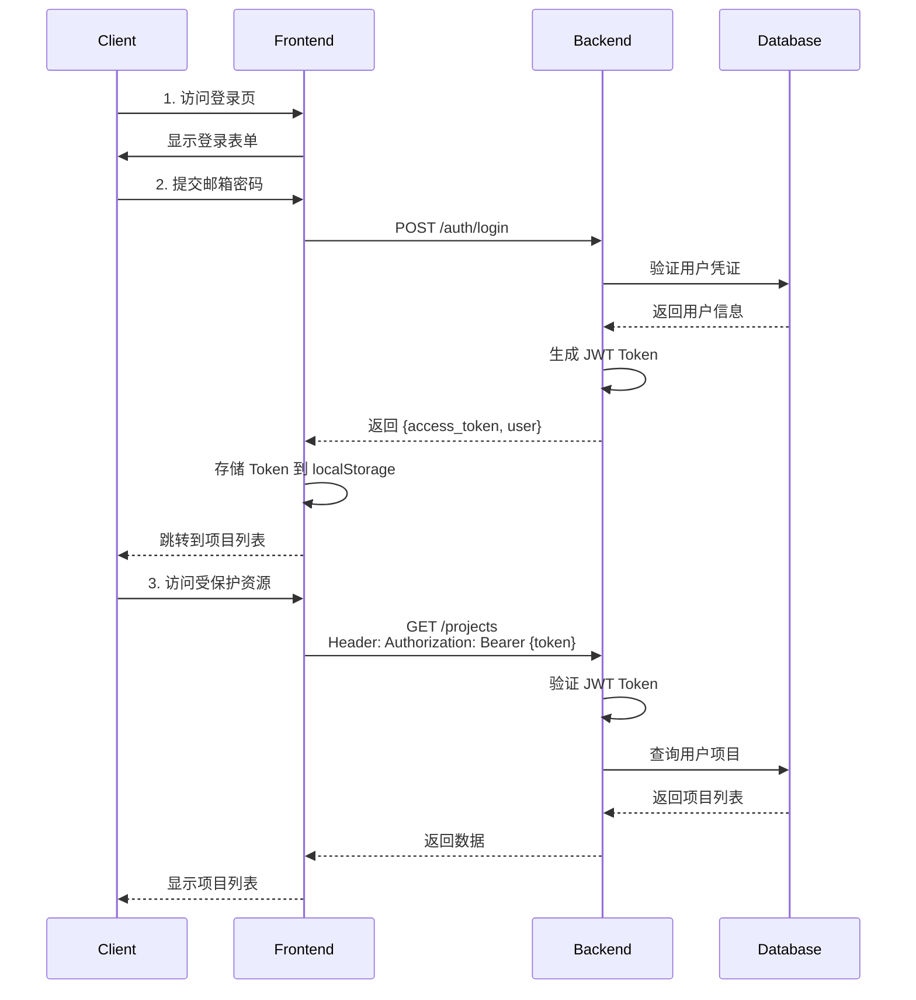

# Security Architecture

## 认证架构

### JWT 认证流程



### Token 管理

**Token 生成**：
```python
# services/auth_service.py
def create_access_token(user_id: str) -> str:
    payload = {
        "sub": user_id,
        "exp": datetime.utcnow() + timedelta(minutes=30)
    }
    return jwt.encode(payload, SECRET_KEY, algorithm="HS256")
```

**Token 验证**：
```python
# utils/dependencies.py
async def get_current_user(
    credentials: HTTPAuthorizationCredentials = Depends(security)
):
    token = credentials.credentials
    payload = jwt.decode(token, SECRET_KEY, algorithms=["HS256"])
    user_id = payload.get("sub")
    return await db_service.get_user_by_id(user_id)
```
**双 Token 刷新机制 (Refresh Token)**
- Access Token：有效期 30 分钟，用于常规 API 请求。
- Refresh Token：有效期 7 天，存储在 HTTP-only Cookie 中。

前端 Axios/Fetch 拦截器捕获 401 错误。
自动调用 /auth/refresh 接口。
后端验证有效后颁发新 Access Token，实现用户无感知续期。

避免老师在长达 1 小时的备课/预览修改过程中突然被强制退出。

## 授权架构

### 数据隔离

每个用户只能访问自己的数据，通过 `userId` 字段实现：

```python
# routers/projects.py
@router.get("/projects")
async def get_projects(current_user = Depends(get_current_user)):
    # 自动过滤当前用户的项目
    projects = await db_service.get_user_projects(current_user.id)
    return {"success": True, "data": projects}
```

### 权限检查

```python
# utils/dependencies.py
async def verify_project_access(
    project_id: str,
    current_user = Depends(get_current_user)
):
    project = await db_service.get_project(project_id)
    
    if not project:
        raise HTTPException(status_code=404)
    
    if project.userId != current_user.id:
        raise HTTPException(status_code=403, detail="Access denied")
    
    return project
```

## API 安全

### CORS 配置

```python
# main.py
app.add_middleware(
    CORSMiddleware,
    allow_origins=["http://localhost:5173"],
    allow_credentials=True,
    allow_methods=["*"],
    allow_headers=["*"],
)
```

### 限流保护

```python
# main.py
from slowapi import Limiter

limiter = Limiter(key_func=get_remote_address)
app.state.limiter = limiter

# routers/generate.py
@router.post("/courseware")
@limiter.limit("5/minute")
async def create_generation_task(request: Request, data: GenerateRequest):
    # 每分钟最多 5 次生成请求
    pass
```

### 幂等性保护

```python
# routers/generate.py
@router.post("/courseware")
async def create_generation_task(
    request: GenerateRequest,
    idempotency_key: str = Header(None, alias="Idempotency-Key")
):
    if idempotency_key:
        # 检查是否重复请求
        existing = await idempotency_service.check(idempotency_key)
        if existing:
            return existing.response
    
    # 执行业务逻辑
    result = await generation_service.create_task(request)
    
    # 缓存响应
    if idempotency_key:
        await idempotency_service.store(idempotency_key, result)
    
    return result
```

## 数据安全

### 密码安全

```python
# services/auth_service.py
from passlib.context import CryptContext

pwd_context = CryptContext(schemes=["bcrypt"], deprecated="auto")

def hash_password(password: str) -> str:
    return pwd_context.hash(password)

def verify_password(plain: str, hashed: str) -> bool:
    return pwd_context.verify(plain, hashed)
```

### 输入验证

```python
# schemas/auth.py
from pydantic import BaseModel, EmailStr, Field

class RegisterRequest(BaseModel):
    email: EmailStr
    password: str = Field(min_length=8, max_length=100)
    username: str = Field(min_length=3, max_length=50, pattern="^[a-zA-Z0-9_-]+$")
```

### SQL 注入防护

使用 Prisma ORM 自动防护：
```python
# 安全 - Prisma 自动参数化
project = await prisma.project.find_unique(where={"id": project_id})

# 危险 - 不要使用原始 SQL
# cursor.execute(f"SELECT * FROM projects WHERE id = '{project_id}'")
```

## 敏感信息保护

### 环境变量

```bash
# .env
JWT_SECRET_KEY=your-super-secret-key-change-in-production
DASHSCOPE_API_KEY=sk-xxx
LLAMA_PARSE_API_KEY=llx-xxx

# .gitignore
.env
*.key
```

### 日志脱敏

```python
# utils/log_sanitizer.py
def sanitize_log_data(data: dict) -> dict:
    sensitive_keys = ["password", "token", "api_key", "secret"]
    
    sanitized = {}
    for key, value in data.items():
        if any(s in key.lower() for s in sensitive_keys):
            sanitized[key] = "***REDACTED***"
        else:
            sanitized[key] = value
    
    return sanitized
```

## 安全最佳实践

1. **永远不要在客户端存储敏感信息**
2. **使用 HTTPS 传输数据**（生产环境）
3. **定期更新依赖包**
4. **实施最小权限原则**
5. **记录所有安全相关事件**
6. **定期进行安全审计**

## 相关文档

- [Authentication](../backend/authentication.md) - 认证实现
- [Security Design](../backend/security.md) - 后端安全设计
- [Frontend Authentication](../frontend/authentication.md) - 前端认证
