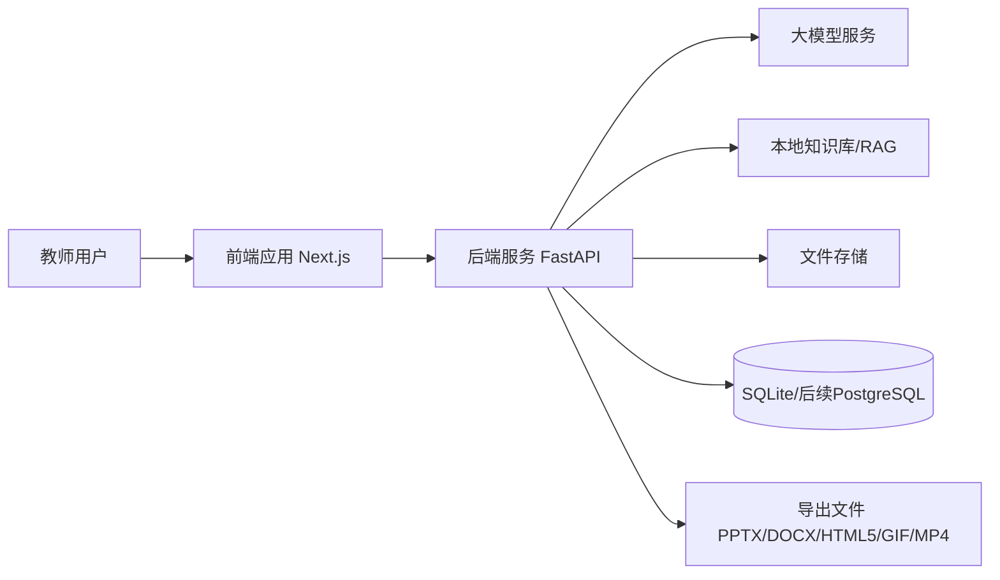

# 系统边界

## 边界目标
明确 Spectra 在首版与后续迭代中“负责什么、不负责什么”，避免需求膨胀，并为 API 规划与迭代规划提供约束。

## 系统内能力（In Scope）
以下能力属于系统职责范围（对应 `feature-list.md`）：

1. 教师项目与会话管理
- 创建/查询项目，维护项目状态与上下文
- 保存多轮对话历史并支持继续编辑

2. 教学需求采集与理解
- 支持文字输入与语音输入
- 主动追问并结构化提取教学要素（目标、重难点、时长、风格）

3. 多模态资料处理
- 上传并管理 PDF、Word、PPT、图片、视频等资料
- 进行文档解析、视频关键帧提取、可引用片段生成

4. 本地知识库 RAG
- 支持知识资料入库、检索、召回
- 在生成结果中提供来源追溯信息

5. 课件与教案生成
- 生成 `.pptx` 课件与 `.docx` 教案
- 支持至少一种互动/动画内容的导出或集成（HTML5/GIF/MP4 之一）

6. 预览、修改与再生成
- 提供预览界面
- 支持对话式修改、页级修改、再生成闭环

## 系统外能力（Out of Scope）
当前阶段不纳入系统职责：

1. 教务系统/LMS 全量替代
- 不负责排课、成绩管理、学生档案、考试组织等教务域能力

2. 实时多人协同编辑
- 不提供类似在线文档的多人实时光标协作（后续可评估）

3. 完整课堂执行平台
- 不负责课堂点名、实时互动答题运营、教学直播推流

4. 全自动教学内容担保
- 系统输出为“教学辅助草稿”，教师仍是最终审核责任人

5. 外部版权素材自动授权
- 不自动解决第三方素材版权授权与合规归属问题

## 外部系统交互边界
| 外部对象 | 交互内容 | 边界责任 |
|---|---|---|
| 教师用户（Web） | 需求输入、文件上传、预览修改、下载导出 | 系统负责流程与生成能力；教师负责教学正确性最终确认 |
| 大模型服务 | 意图理解、内容生成、改写润色 | 系统负责提示词编排、上下文裁剪与结果回填 |
| 本地知识库/向量检索组件 | 文档切片、向量化、召回片段 | 系统负责索引构建、召回策略与来源标注 |
| 文件存储（本地或对象存储） | 上传资料、生成产物读写 | 系统负责访问控制、生命周期与可下载性 |

## 接口边界（当前契约）
以 `docs/openapi.yaml` 为准，当前边界内接口包括：

- 项目域：`/api/v1/projects`、`/api/v1/projects/{project_id}`
- 对话域：`/api/v1/chat/messages`
- 上传域：`/api/v1/files`、`/api/v1/projects/{project_id}/files`
- 生成域：`/api/v1/generate/courseware`、`/api/v1/generate/status/{task_id}`

## 上下文边界图

## 边界验收口径（首版）
1. 至少支持两类异构资料解析并用于生成（如 PDF + 视频）。
2. 形成“输入-生成-修改-再生成-导出”闭环。
3. 提供可追溯来源信息（至少到文件级）。
