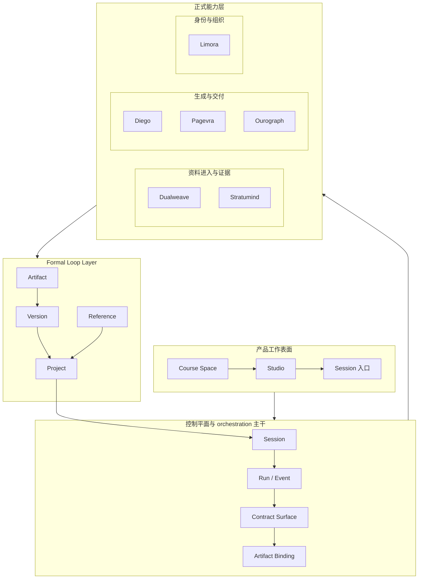

# 4-1 总体分层架构图

## 版本

`文档版本`

## 适配场景

`Word 纵向`

## 图类型

`分层架构图`

## 这张图只回答什么

`Spectra` 不是单体后端，也不是空心网关；它如何以产品工作表面、控制平面、正式能力层和知识循环回流共同成立为一个持续演化的系统。

## 主阅读路径

先看纵向中心主干，再看左右语义分区，最后看底部 formal loop 如何回流到中层控制平面。

## 来源与事实锚点

- `docs/competition/04-architecture.md`
- `docs/architecture/system/overview.md`
- `docs/architecture/backend/overview.md`
- `docs/architecture/service-boundaries.md`
- `docs/project/SYSTEM_PHILOSOPHY_2026-03-19.md`

## 现有图问题检测

- 旧版更像“四层清单图”，系统主干不够强
- 控制平面虽在，但 engineering weight 还不够
- 底部回流层不够像 formal loop layer
- `Reference` 缺位，容易让系统看起来只会回写自己
- `结论`：`需彻底重画`

## 信息分层设计

- 第 1 层：产品工作表面
- 第 2 层：控制平面与 orchestration 主干
- 第 3 层：正式能力 authority 三分组
- 第 4 层：formal loop layer

## 分组设计

- 中心纵轴：`Course Space / Studio / Session入口 -> Session / Run / Event / Contract / Binding`
- 左侧能力区：资料进入与证据
- 右侧能力区：身份与组织
- 中下能力区：生成与交付
- 底部正式回流区：`Artifact / Version / Project / Reference`

## 密度策略

- `高密度`
- 这张图必须更像“系统成立方式蓝图”，不是章节目录配图；允许多一层对象，但必须靠语义分区和中心主干解压

## 画幅与布局约束

- `A4 纵向`
- 中心主干必须最强，形成明显的纵向 spine
- 正式能力层不能平铺成一排服务名
- 底部回流区必须像正式系统语言层，而不是收尾区
- 各语义区之间保留明显留白，避免混成一张网络图

## 优化后的 Mermaid 骨架

## 中文手绘主 Prompt

请重绘一张用于中国高校竞赛正文、商业方案书正文或技术说明文档的高级系统蓝图图。  
这张图是 `A4 纵向` 图，不是横向 PPT 图。  
它要回答：`Spectra` 如何通过产品工作表面、控制平面、正式能力层和 formal loop layer，共同成立为一个持续演化的系统。

这不是层级目录图，而是一张真正的纵向系统蓝图。  
画面必须有一个明显的中心主干：

- `Course Space`
- `Studio`
- `Session入口`
- `Session`
- `Run / Event`
- `Contract Surface`
- `Artifact Binding`

围绕这个中心主干，再展开正式能力层的三大语义分区：

- `资料进入与证据`
  - `Dualweave`
  - `Stratumind`
- `生成与交付`
  - `Diego`
  - `Pagevra`
  - `Ourograph`
- `身份与组织`
  - `Limora`

最底部必须是一个很明确的 `Formal Loop Layer`，包含：

- `Artifact`
- `Version`
- `Project`
- `Reference`

并且要表现：

1. `Artifact -> Version -> Project` 的正式回流  
2. `Reference -> Project` 的跨空间条件关系  
3. `Project -> Session` 的反向影响，让底层回流重新作用于中层控制平面

整体视觉风格要求：

- 专业
- 高级
- 低饱和
- 克制
- 简约多彩
- 中文系统蓝图风格
- 语义分区清楚
- 中心主干最强
- 分组标题明显大于节点标题
- 保留充足留白
- 不要小字解释段落

必须让外部生成系统理解：这张图重点是“系统如何成立”，不是“这一章分几层”。

## 英文补充关键词（可选）

- `portrait system blueprint`
- `strong central spine`
- `clear semantic zones`
- `separate control plane from authorities`
- `readable Chinese labels`

## 统一风格负面约束

- 禁止做成层级目录图
- 禁止把四层混成一张网
- 禁止正式能力平铺成 logo 墙
- 禁止把 formal loop layer 画成普通收尾层
- 禁止缩小中文字体换信息密度
- 禁止科技海报风和赛博霓虹

## 审图备注

- 这张图的关键是“中心主干”和“底部 formal loop”。
- 看起来必须像系统成立蓝图，而不是章节结构示意。
