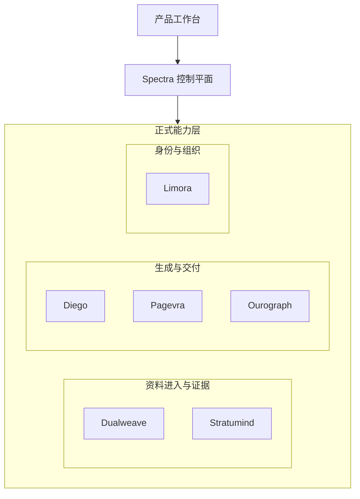

# 4-1 总体分层架构图

## 版本

`答辩版`

## 适配场景

`PPT 横向`

## 图类型

`分层架构图`

## 这张图只回答什么

`Spectra` 为什么是“产品工作台 + 控制平面 + 六个正式能力”组成的分层系统，而不是大一统后端。

## 主阅读路径

先看横向三层，再看底层三组正式能力与六个 authority 的分区。

## 来源与事实锚点

- `docs/competition/04-architecture.md`
- `docs/architecture/system/overview.md`
- `docs/architecture/backend/overview.md`
- `docs/architecture/service-boundaries.md`

## 现有图问题检测

- backend 容易被误画成全能能力池
- authority 容易被平铺成一排，缺少分组
- Studio 容易被误画成 formal service
- `结论`：`需彻底重画`

## 信息分层设计

- 第 1 层：产品工作台
- 第 2 层：Spectra 控制平面
- 第 3 层：正式能力层

## 分组设计

- 左侧：资料进入与证据
- 中间：生成与交付
- 右侧：身份与组织

## 密度策略

- `中密度`
- 用于开场总览，但必须保留 enough detail，让评委一眼知道系统确实有分工

## 画幅与布局约束

- `16:9` 宽屏横向
- 采用横向三层结构
- 每层都要明显成带状展开
- 底层三组要有代表节点，不允许只写三个空组名

## 优化后的 Mermaid 骨架

## 中文手绘主 Prompt

请重绘一张用于中国高校竞赛答辩 PPT 的高级系统分层图。  
这张图是 `16:9` 横向图，不是正文竖图。  
图要回答的问题是：`Spectra` 不是大一统后端，而是由产品工作台、控制平面和正式能力层组成的分层系统。  
画面采用清晰的横向三层结构：上层是 `产品工作台`，中层是 `Spectra 控制平面`，下层是 `正式能力层`。  
最下层必须再分成三个分区：`资料进入与证据`、`生成与交付`、`身份与组织`。  
三个分区里要出现代表性正式能力节点：`Dualweave`、`Stratumind`、`Diego`、`Pagevra`、`Ourograph`、`Limora`。  
整体要有答辩图该有的“有料感”，不是极简空壳图，但也不能做成字很小的服务矩阵。  
风格必须专业、高级、克制、低饱和、简约多彩，像中文答辩图、系统蓝图和咨询式信息设计图的结合。  
所有标签优先用中文短词，节点标题大、分区标题更大，适合放进 PPT 半页宽时仍然清晰。

## 英文补充关键词（可选）

- `wide systems blueprint`
- `clear layered grouping`
- `large readable labels`
- `low saturation`
- `presentation-ready architecture`

## 统一风格负面约束

- 禁止默认 Mermaid 风格
- 禁止把 backend 画成全能服务池
- 禁止把 Studio 画成正式能力
- 禁止底层六个服务无分组平铺
- 禁止小字密集注释

## 审图备注

- 这张图要“层次清楚 + 信息不空”。
- 答辩版也必须让人感觉系统真有分工，不是只有三条大框。
