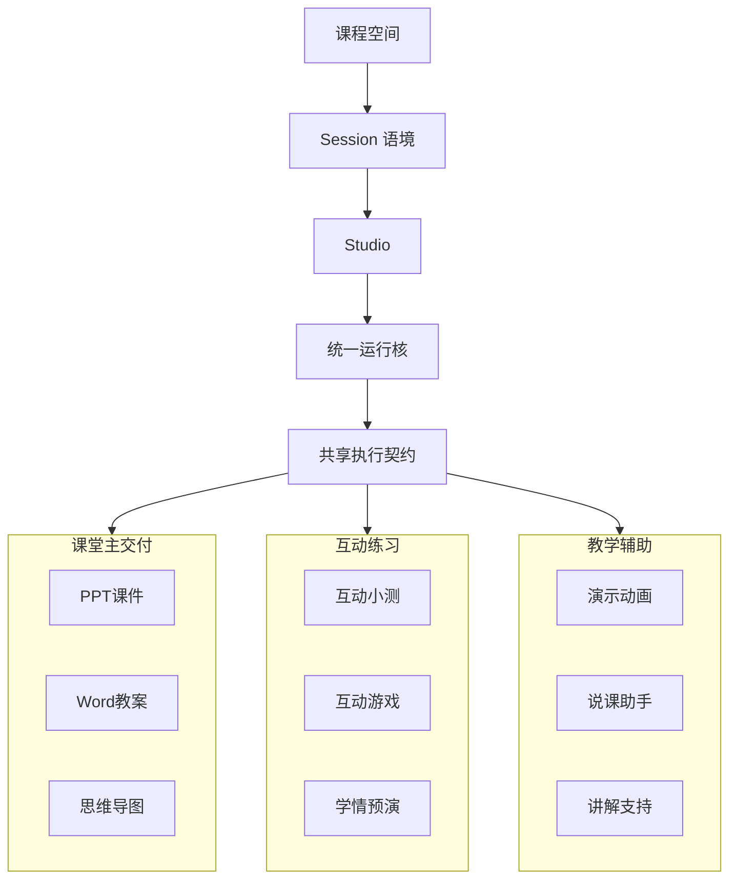

# 4-2 Studio 产品面与多模态外化图

## 版本

`文档版本`

## 适配场景

`Word 纵向`

## 图类型

`产品能力簇图`

## 这张图只回答什么

`Studio` 如何在同一课程空间和统一运行核之上，组织多模态教学成果的持续外化。

## 主阅读路径

先看纵向中轴，再看三簇能力逐层展开，最后看各簇代表成果。

## 来源与事实锚点

- `docs/competition/04-architecture.md`
- `frontend/components/project/features/studio/StudioPanel.tsx`
- `frontend/lib/sdk/studio-cards.ts`

## 现有图问题检测

- 旧图容易像功能入口列表
- 缺少课程空间与统一运行契约
- 缺少能力簇内的代表性展开
- `结论`：`需中度重构`

## 信息分层设计

- 第 1 层：课程空间与 Session 语境
- 第 2 层：Studio 运行核与共享契约
- 第 3 层：三大能力簇
- 第 4 层：各簇代表成果

## 分组设计

- 上部：课程空间 / Session
- 中部：Studio / 统一运行核 / 共享执行契约
- 下部：三簇能力纵向展开

## 密度策略

- `高密度`
- 用于正文，允许每簇补 2 到 3 个代表成果

## 画幅与布局约束

- `A4 纵向`
- 中轴明显
- 能力簇纵向堆叠或左右错层展开
- 每簇要比答辩版更完整

## 优化后的 Mermaid 骨架

## 中文手绘主 Prompt

请重绘一张用于中国高校竞赛正文或商业方案书正文的高级产品能力簇图。  
这张图是 `A4 纵向` 图。  
它要表达：`Studio` 不是零散工具集合，而是在 `课程空间` 和 `Session语境` 之上，以 `统一运行核` 和 `共享执行契约` 为中轴，持续外化多模态教学成果。  
画面应采用纵向展开结构。  
上方是 `课程空间` 与 `Session语境`，中部是 `Studio`、`统一运行核`、`共享执行契约`，下方再展开三大能力簇：`课堂主交付`、`互动练习`、`教学辅助`。  
每个能力簇都必须带代表成果，形成“中心运行核 -> 能力簇 -> 成果”的完整阅读逻辑。  
整体风格要求专业、高级、低饱和、克制、简约多彩，适合中文 Word 正文阅读。  
允许信息比答辩版更多，但绝不能通过压小中文字号来换密度。

## 英文补充关键词（可选）

- `portrait capability map`
- `vertical cluster layout`
- `readable Chinese labels`
- `low saturation infographic`
- `shared runtime axis`

## 统一风格负面约束

- 禁止画成产品功能清单
- 禁止像应用商店分类页
- 禁止只有簇名没有代表成果
- 禁止通过多行小字解释来补信息
- 禁止过亮、过艳的彩色块

## 审图备注

- 文档版本需要更完整，但重点仍是“统一运行核”。
- 三簇成果展开要有秩序，不能散成功能云。
