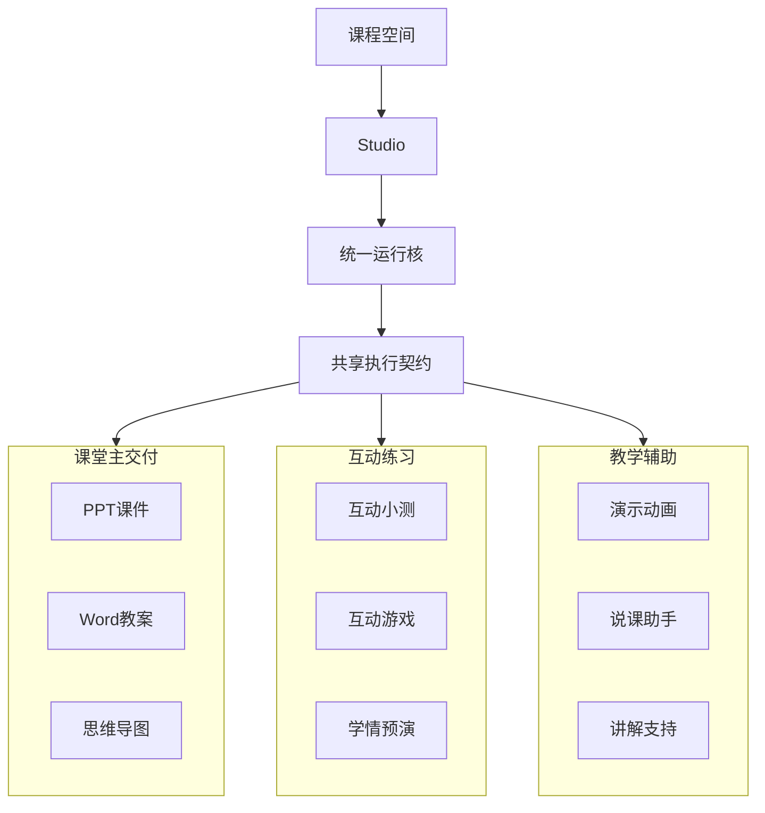

# 4-2 Studio 产品面与多模态外化图

## 版本

`答辩版`

## 适配场景

`PPT 横向`

## 图类型

`产品能力簇图`

## 这张图只回答什么

为什么 `Studio` 是统一内容工坊，而不是若干零散工具按钮。

## 主阅读路径

先看中心运行核，再看横向展开的三簇能力与每簇代表性成果。

## 来源与事实锚点

- `docs/competition/04-architecture.md`
- `frontend/components/project/features/studio/StudioPanel.tsx`
- `frontend/lib/sdk/studio-cards.ts`

## 现有图问题检测

- 容易变成 feature list
- 容易缺少共享执行契约
- 容易画得过空，看不出真实产品力
- `结论`：`需中度重构`

## 信息分层设计

- 第 1 层：课程空间
- 第 2 层：Studio 统一运行核
- 第 3 层：三大能力簇

## 分组设计

- 中心：`Studio`
- 左侧：`课堂主交付`
- 中间下方：`互动练习`
- 右侧：`教学辅助`

## 密度策略

- `中密度`
- 答辩版需要有内容感，每个能力簇必须带代表项

## 画幅与布局约束

- `16:9` 宽屏横向
- 中心核必须明显
- 三簇能力横向展开
- 每簇保留 2 到 3 个代表项

## 优化后的 Mermaid 骨架

## 中文手绘主 Prompt

请重绘一张用于中国高校竞赛答辩 PPT 的高级产品能力簇图。  
这张图是 `16:9` 横向图。  
它要回答：为什么 `Studio` 是统一内容工坊，而不是一堆零散工具按钮。  
画面必须强调中心结构：顶部是 `课程空间`，中心是 `Studio`，下接 `统一运行核` 和 `共享执行契约`。  
从中心向外横向展开三个能力簇：`课堂主交付`、`互动练习`、`教学辅助`。  
每个能力簇都要带代表性成果，不能只有空组名。  
课堂主交付可以放 `PPT课件`、`Word教案`、`思维导图`；互动练习可以放 `互动小测`、`互动游戏`、`学情预演`；教学辅助可以放 `演示动画`、`说课助手`、`讲解支持`。  
整体气质要专业、高级、低饱和、克制、简约多彩，像中文答辩图与高端产品能力图的结合。  
标签必须大、短、清楚，不要菜单页感，不要很多小图标散点。

## 英文补充关键词（可选）

- `capability cluster map`
- `strong center`
- `wide presentation layout`
- `large readable labels`
- `premium product infographic`

## 统一风格负面约束

- 禁止画成菜单页
- 禁止把 Studio 画成后台服务
- 禁止只剩三条空线没有代表能力
- 禁止图标堆满四周
- 禁止文字太小

## 审图备注

- 答辩版要让人觉得“能力真不少”，但仍要围绕中心核阅读。
- 三个能力簇比具体工具名更重要。
