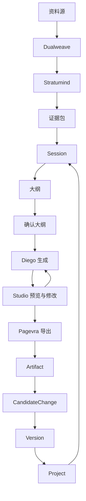

# 4-3 Session 主链闭环图

## 版本

`文档版本`

## 适配场景

`Word 纵向`

## 图类型

`闭环 / 主链图`

## 这张图只回答什么

`Session` 如何吸纳证据、驱动生成、形成 Artifact，并通过正式状态回流持续影响后续生成。

## 主阅读路径

自上而下看纵向主链，再看中段局部反馈和底部正式回流。

## 来源与事实锚点

- `docs/competition/04-architecture.md`
- `docs/architecture/api-contract.md`
- `docs/project/SYSTEM_PHILOSOPHY_2026-03-19.md`
- generation / session / artifact 相关实现

## 现有图问题检测

- 旧图容易把主链压成单行
- 容易看不出 `Project` 对后续生成的持续影响
- 容易弱化 `Studio` 只是工作表面
- `结论`：`需彻底重画`

## 信息分层设计

- 第 1 层：资料进入与证据
- 第 2 层：Session 控制点
- 第 3 层：生成与预览
- 第 4 层：正式回流

## 分组设计

- 上部：资料进入链
- 中部：Session / 大纲 / 确认
- 中下部：生成 / 预览 / 导出
- 底部：Artifact / CandidateChange / Version / Project

## 密度策略

- `高密度`
- 文档版本允许补出 `CandidateChange` 作为演化入口

## 画幅与布局约束

- `A4 纵向`
- 纵向主链明显
- 中部控制点和底部回流区都要有空间
- 允许一条局部 refine 反馈

## 优化后的 Mermaid 骨架

## 中文手绘主 Prompt

请重绘一张用于中国高校竞赛正文或技术方案正文的高级纵向闭环图。  
这张图是 `A4 纵向` 图。  
它要解释 `Session` 如何吸纳证据、驱动生成、经过预览修改、导出 Artifact，并通过正式状态回流持续影响后续生成。  
画面必须自上而下展开：最上方是 `资料源 -> Dualweave -> Stratumind -> 证据包`；中上部是 `Session -> 大纲 -> 确认大纲`；中下部是 `Diego生成 -> Studio预览与修改 -> Pagevra导出`；底部是 `Artifact -> CandidateChange -> Version -> Project`。  
必须保留 `Studio预览与修改 -> Diego生成` 的局部反馈，以及 `Project -> Session` 的全局回流。  
整体风格专业、高级、低饱和、克制、简约多彩，适合中文 Word 正文阅读。  
信息可以比答辩版更多，但依然要靠分层、分组、留白来保证可读性。

## 英文补充关键词（可选）

- `portrait closed-loop diagram`
- `vertical process architecture`
- `clear hierarchy`
- `readable Chinese labels`
- `premium systems infographic`

## 统一风格负面约束

- 禁止画成单条细长流水线
- 禁止把 `Studio` 画成正式能力
- 禁止省略 `CandidateChange`
- 禁止底部回流区像普通文件管理
- 禁止通过密集文字解释流程

## 审图备注

- 文档版本要更强调“演化入口”。
- 纵向布局里，中上部和底部都要留出足够呼吸感。
