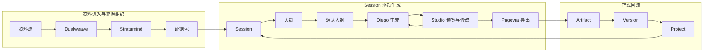

# 4-3 Session 主链闭环图

## 版本

`答辩版`

## 适配场景

`PPT 横向`

## 图类型

`闭环 / 主链图`

## 这张图只回答什么

为什么 `Spectra` 的生成是“资料进入 -> Session 驱动 -> Artifact 正式回流”的闭环，而不是一次性黑箱出图。

## 主阅读路径

从左到右看三段主链，再看一条关键回流返回 `Session`。

## 来源与事实锚点

- `docs/competition/04-architecture.md`
- `docs/architecture/api-contract.md`
- `docs/architecture/service-boundaries.md`
- session / generation / artifact 相关实现

## 现有图问题检测

- 容易把 `Studio` 画成 authority
- 容易把右侧回流弱化成普通导出
- 容易把整个图画成单向流水线
- `结论`：`需彻底重画`

## 信息分层设计

- 左段：资料进入与证据组织
- 中段：Session 驱动生成
- 右段：Artifact 正式回流

## 分组设计

- 左：资料源 / Dualweave / Stratumind
- 中：Session / Outline / 生成 / 预览
- 右：Artifact / Version / Project

## 密度策略

- `中密度`
- 答辩版也要保留关键控制点，不能只剩三块大框

## 画幅与布局约束

- `16:9` 宽屏横向
- 三段横向主链
- 中段必须最重
- 只保留一条清晰回流箭头

## 优化后的 Mermaid 骨架

## 中文手绘主 Prompt

请重绘一张用于中国高校竞赛答辩 PPT 的高级闭环主链图。  
这张图是 `16:9` 横向图。  
它要回答：为什么 `Spectra` 的生成不是一次性黑箱，而是“资料进入 -> Session 驱动生成 -> Artifact 正式回流”的闭环。  
画面必须采用左中右三段主链布局。  
左侧是 `资料进入与证据组织`，包含 `资料源`、`Dualweave`、`Stratumind`、`证据包`。  
中间是最重要的一段 `Session 驱动生成`，必须保留 `Session`、`大纲`、`确认大纲`、`Diego生成`、`Studio预览与修改`、`Pagevra导出`。  
右侧是 `正式回流`，包含 `Artifact`、`Version`、`Project`。  
整张图只保留一条关键回流，从 `Project` 返回 `Session`。  
整体风格专业、高级、低饱和、克制、简约多彩，标签用中文短词，大字清楚，适合答辩讲解。

## 英文补充关键词（可选）

- `wide closed-loop process map`
- `clear left-center-right grouping`
- `large readable labels`
- `presentation diagram`
- `low saturation`

## 统一风格负面约束

- 禁止把 Studio 画成能力 owner
- 禁止省略确认大纲
- 禁止把右侧回流画成普通文件归档
- 禁止交叉箭头过多
- 禁止小字流程表

## 审图备注

- 中段必须最有重量。
- 答辩版不是极简版，关键控制点一定要在。
