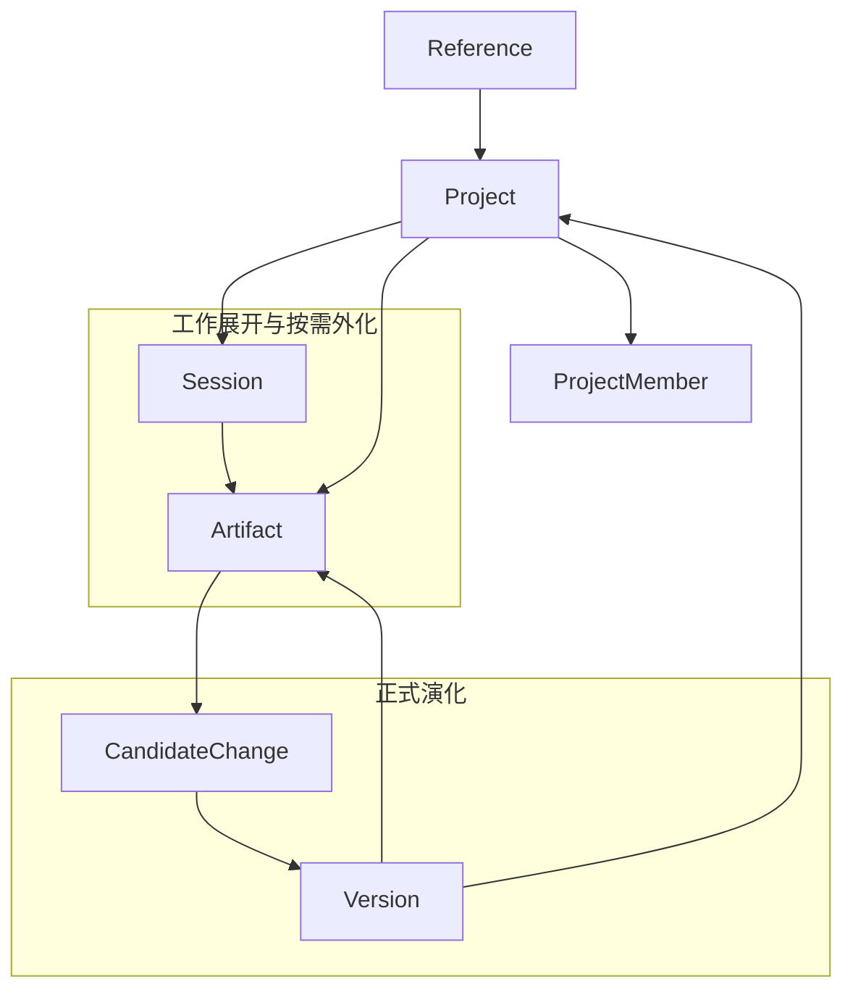

# 4-4 知识空间对象关系图

## 版本

`单版本`

## 默认适配场景

`Word 正文`

## 图类型

`本体 / 状态图`

## 这张图只回答什么

`Project`、`Session`、`Artifact`、`Version`、`Reference`、`CandidateChange`、`ProjectMember` 共同构成的是什么样的知识空间对象关系，而不是“生成文件 + 历史记录”的弱系统。

## 主阅读路径

先看中心 `Project`，再看左侧工作展开对象、右侧正式演化对象、上方跨空间条件关系、下方协作治理边界。

## 来源与事实锚点

- `docs/competition/04-architecture.md`
- `docs/project/SYSTEM_PHILOSOPHY_2026-03-19.md`
- `docs/architecture/system/overview.md`
- `docs/architecture/backend/overview.md`
- `docs/archived/project-space/PROJECT_SPACE_EVOLUTION_DESIGN_2026-03-09.md`
- `docs/archived/project-space/PROJECT_SPACE_DATA_MODEL_ADDENDUM_2026-03-12.md`

## 现有图问题检测

- 容易被画成“Session 生成 Artifact，再变成 Version”的单线流程图
- 容易弱化 `Reference` 的跨空间条件作用
- 容易漏掉 `ProjectMember`，导致项目空间协作语义消失
- 容易让 `Artifact` 看起来像系统本体，而不是按需外化结果
- `结论`：`需中度重构`

## 信息分层设计

- 中心层：`Project`
- 左侧工作层：`Session`、`Artifact`
- 右侧演化层：`CandidateChange`、`Version`
- 上部条件层：`Reference`
- 下部治理层：`ProjectMember`

## 分组设计

- 中心：`Project`
- 左：工作展开与按需外化
- 右：候选变更与正式锚点
- 上：跨空间条件关系
- 下：成员与协作边界

## 密度策略

- `中高密度`
- 这张图要有明显“本体图”质感，信息可以更多，但必须通过语义分区解压

## 画幅与布局约束

- `A4 纵向` 或接近正方形
- `Project` 必须位于视觉中心
- 上下左右四个语义区必须明显
- 不追求流程感，而追求“对象关系 + 条件关系 + 演化关系”的同时成立

## 优化后的 Mermaid 骨架

## 中文手绘主 Prompt

请重绘一张用于中国高校竞赛正文的高级知识空间对象关系图。  
这张图默认适配 `Word 正文`，适合 `A4 纵向` 或接近正方形的版式。  
它要表达：系统本体不是导出文件，而是一个以 `Project` 为中心、可生成、可引用、可协作、可演化的知识空间对象网络。

画面必须让 `Project` 位于视觉中心，并形成明显的四个语义分区：

- 左侧是 `工作展开与按需外化`
  - `Session`
  - `Artifact`
  - 表达 `Session` 可以产出 `Artifact`
- 右侧是 `正式演化`
  - `CandidateChange`
  - `Version`
  - 表达 `Artifact` 进入候选变更后形成新的正式锚点
- 上方是 `Reference`
  - 表达跨空间条件关系
  - 说明一个空间可以成为另一个空间的条件来源
- 下方是 `ProjectMember`
  - 表达项目空间中的正式协作和治理边界

必须体现这些真实语义：

1. `Project` 是统一知识空间中心  
2. `Session` 是工作展开过程，不是正式状态本体  
3. `Artifact` 是按需外化结果，不是终点  
4. `CandidateChange` 是正式演化入口  
5. `Version` 是正式状态锚点，并会回到 `Project`  
6. `Reference` 是跨空间条件机制  
7. `ProjectMember` 是项目空间语义的一部分，而不是额外外挂的权限表  
8. `Version -> Artifact` 可以表达“某个正式锚点下的外化结果”

整体风格要求：

- 专业
- 高级
- 低饱和
- 克制
- 简约多彩
- 中文信息设计图风格
- 结构理性
- 分区清楚
- 留白充足
- 标签大而短
- 不要小字解释段落

这张图必须更像“正式知识空间本体图”，而不是“课件文件关系图”。

## 英文补充关键词（可选）

- `formal ontology map`
- `project-centered semantic model`
- `portrait system diagram`
- `clear semantic zones`
- `readable Chinese labels`

## 统一风格负面约束

- 禁止画成线性流程图
- 禁止把 `Artifact` 画成中心
- 禁止省略 `Reference`
- 禁止省略 `ProjectMember`
- 禁止把 `Project` 弱化成普通容器
- 禁止密集小字说明

## 审图备注

- 这张图的目标是把“知识空间本体”立住。
- 外部系统最容易把它画成流程图，所以语义分区一定要强。
