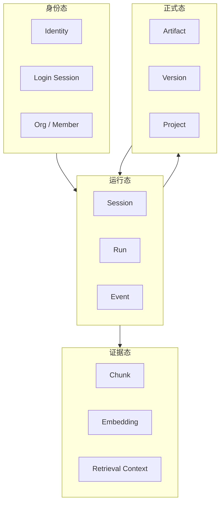

# 4-5 数据与状态设计图

## 版本

`文档版本`

## 适配场景

`Word 纵向`

## 图类型

`分层架构图`

## 这张图只回答什么

`Spectra` 的运行态、证据态、身份态、正式态如何分层存在，并通过有限的关键关系形成完整循环。

## 主阅读路径

自上而下看四层，再看层内代表对象和层间关键关系。

## 来源与事实锚点

- `docs/competition/04-architecture.md`
- `docs/architecture/system/kernel-note.md`
- `docs/architecture/service-boundaries.md`
- `docs/architecture/backend/overview.md`

## 现有图问题检测

- 旧图容易把数据状态和服务边界混成一层
- 旧图容易忽略正式态对后续运行的影响
- `结论`：`需彻底重画`

## 信息分层设计

- 第 1 层：运行态
- 第 2 层：证据态
- 第 3 层：身份态
- 第 4 层：正式态

## 分组设计

- 每层作为纵向卡片
- 每层内部保留 2 到 3 个代表对象
- 层间仅保留关键方向关系

## 密度策略

- `高密度`
- 文档版本允许每层多一项代表对象

## 画幅与布局约束

- `A4 纵向`
- 四层纵向堆栈
- 关系线不宜过多
- 层内对象排列整齐，优先小组块

## 优化后的 Mermaid 骨架

## 中文手绘主 Prompt

请重绘一张用于中国高校竞赛正文或技术说明文档的高级状态分层图。  
这张图是 `A4 纵向` 图。  
它要表达 `Spectra` 的状态不是混乱堆叠，而是由 `运行态`、`证据态`、`身份态`、`正式态` 四层组成，并通过少量关键关系形成循环。  
画面必须采用纵向四层堆栈，每一层都带代表对象。  
运行态包括 `Session`、`Run`、`Event`；证据态包括 `Chunk`、`Embedding`、`Retrieval Context`；身份态包括 `Identity`、`Login Session`、`Org / Member`；正式态包括 `Artifact`、`Version`、`Project`。  
只保留关键关系，例如 `身份态 -> 运行态`、`运行态 -> 证据态`、`运行态 -> 正式态`、`正式态 -> 运行态`。  
整体风格要专业、高级、低饱和、克制、简约多彩，适合中文 Word 正文阅读。  
信息可以更完整，但不能通过缩小中文字号换取密度。

## 英文补充关键词（可选）

- `portrait state layering infographic`
- `vertical stacked layout`
- `clear hierarchy`
- `readable Chinese labels`
- `premium systems map`

## 统一风格负面约束

- 禁止画成数据表清单
- 禁止层间密密麻麻的网状连线
- 禁止把正式态画成普通文件区
- 禁止通过缩小字来增加信息
- 禁止高亮色泛滥

## 审图备注

- 文档版本的重点是“层内对象更完整”。
- 看上去应该稳、清楚、成熟，而不是技术堆砌。
