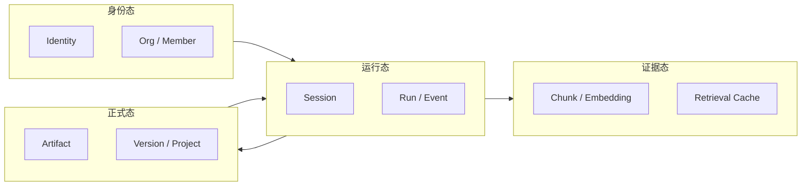

# 4-5 数据与状态设计图

## 版本

`答辩版`

## 适配场景

`PPT 横向`

## 图类型

`分层架构图`

## 这张图只回答什么

为什么 `Spectra` 的数据不是一锅库表，而是运行态、证据态、身份态、正式态分层协同。

## 主阅读路径

先看横向四层，再看每层的代表对象。

## 来源与事实锚点

- `docs/competition/04-architecture.md`
- `docs/architecture/system/kernel-note.md`
- `docs/architecture/service-boundaries.md`

## 现有图问题检测

- 容易把状态全画成数据库
- 容易把 identity 和 formal state 混成一层
- 容易过空，看不出层内对象
- `结论`：`需彻底重画`

## 信息分层设计

- 第 1 层：运行态
- 第 2 层：证据态
- 第 3 层：身份态
- 第 4 层：正式态

## 分组设计

- 左到右四层带状展开
- 每层保留 2 个代表对象

## 密度策略

- `中密度`
- 答辩版要明显分层，也要有代表状态对象

## 画幅与布局约束

- `16:9` 宽屏横向
- 四层并排或横向分带
- 层标题必须很清楚

## 优化后的 Mermaid 骨架

## 中文手绘主 Prompt

请重绘一张用于中国高校竞赛答辩 PPT 的高级状态分层图。  
这张图是 `16:9` 横向图。  
它要回答：`Spectra` 的数据不是一锅库表，而是 `运行态`、`证据态`、`身份态`、`正式态` 四层协同。  
画面采用横向四层带状结构，每一层都必须有代表对象。  
运行态可以放 `Session`、`Run / Event`；证据态可以放 `Chunk / Embedding`、`Retrieval Cache`；身份态可以放 `Identity`、`Org / Member`；正式态可以放 `Artifact`、`Version / Project`。  
层与层之间只保留几条关键关系，不要做成数据库连接图。  
整体风格要专业、高级、低饱和、克制、简约多彩，标签大、短、清楚，适合答辩展示。

## 英文补充关键词（可选）

- `state layering diagram`
- `wide layered data map`
- `large readable labels`
- `low saturation`
- `presentation infographic`

## 统一风格负面约束

- 禁止画成数据库 ER 图
- 禁止四层没有代表对象
- 禁止把身份态和正式态混成一个分区
- 禁止小字堆满
- 禁止高饱和科技风

## 审图备注

- 四层标题必须强。
- 答辩版要让人一眼知道“状态分层很清楚”。
