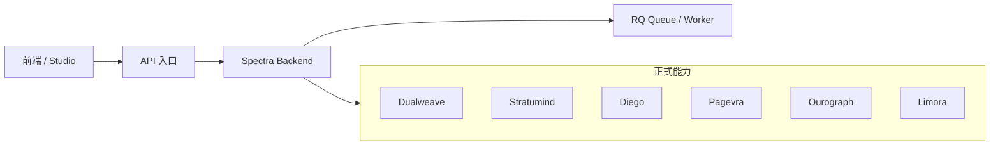

# 4-7 当前运行拓扑图

## 版本

`单版本`

## 默认适配场景

`PPT / Word 通用`

## 图类型

`分层架构图`

## 这张图只回答什么

当前运行现实里，`Spectra` 本地后端与六个正式能力、队列和前端之间到底如何协同。

## 主阅读路径

先看前端和 backend，再看 worker / queue，再看外部 authority。

## 来源与事实锚点

- `docs/competition/04-architecture.md`
- `docs/architecture/backend/overview.md`
- `docs/architecture/service-boundaries.md`
- queue / worker 相关实现

## 现有图问题检测

- 容易混进旧 monolith 叙事
- 容易把私有服务都平铺成基础设施图
- `结论`：`需彻底重画`

## 信息分层设计

- 第 1 层：前端与入口
- 第 2 层：backend 与 queue
- 第 3 层：正式能力 authority

## 分组设计

- 左：用户入口
- 中：Spectra backend / queue / worker
- 右：六个正式能力

## 密度策略

- `中密度`
- 强调 current runtime reality，不展开历史遗留大堆服务

## 画幅与布局约束

- 横向或接近方形都可
- 三层三栏清楚
- 以协同关系为主，不以机器资源为主

## 优化后的 Mermaid 骨架

## 中文手绘主 Prompt

请重绘一张用于中国高校竞赛答辩或正文的当前运行拓扑图。  
这张图不是历史微服务大全图，而是当前运行现实图。  
画面应采用清晰的三栏布局：左侧是 `前端 / Studio` 与 `API入口`，中间是 `Spectra Backend` 与 `RQ Queue / Worker`，右侧是六个正式能力 `Dualweave`、`Stratumind`、`Diego`、`Pagevra`、`Ourograph`、`Limora`。  
重点要让人看出 backend 是控制平面，queue 是执行支撑，正式能力在外部。  
整体风格专业、高级、低饱和、克制、简约多彩，标签短、清楚、适合中文阅读。  
不要把它画成基础设施监控图，也不要画成旧式大一统后端图。

## 英文补充关键词（可选）

- `runtime topology`
- `control plane with authorities`
- `clear three-column layout`
- `low saturation`
- `readable labels`

## 统一风格负面约束

- 禁止旧 monolith 大杂烩
- 禁止把 queue 画成主角
- 禁止把六个 authority 混成基础设施组件
- 禁止密集服务器图标

## 审图备注

- 这张图的重点是“当前运行现实”，不是“未来部署愿景”。
- 右侧六个正式能力要有分区感，但不必展开内部细节。
