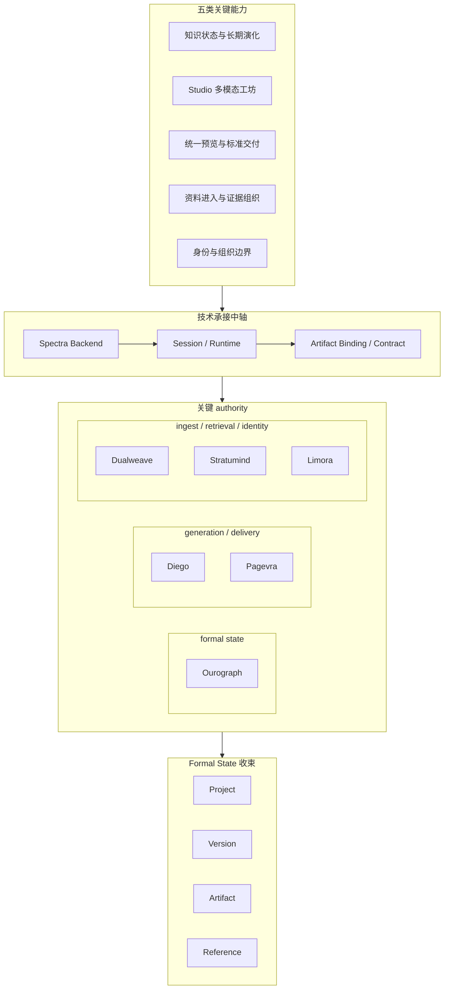

# 5-1 关键技术总体架构图

## 版本

`文档版本`

## 适配场景

`Word 纵向`

## 图类型

`分层架构图`

## 这张图只回答什么

第 5 章的五类关键能力，如何通过统一的技术承接中轴、外部 authority 和 formal state 收束，被真正做成一套可控系统。

## 主阅读路径

先看最上层五类能力条带，再看中层承接中轴，接着看下层 authority 三分组，最后看最底部 formal state 收束层。

## 来源与事实锚点

- `docs/competition/05-key-technologies.md`
- `docs/competition/92-final-submission-draft.md`
- `docs/architecture/service-boundaries.md`
- `docs/architecture/backend/overview.md`
- `docs/project/SYSTEM_PHILOSOPHY_2026-03-19.md`

## 现有图问题检测

- 当前版本仍偏“能力层 -> 技术层 -> authority 层”的抽象示意
- 中层承接关系不够像中轴
- 底部 formal state 收束过于抽象
- `结论`：`需中度重构`

## 信息分层设计

- 第 1 层：五类关键能力条带
- 第 2 层：技术承接中轴
- 第 3 层：authority 三分组
- 第 4 层：formal state 收束层

## 分组设计

- 上部能力条带：
  - `知识状态与长期演化`
  - `Studio 多模态工坊`
  - `统一预览与标准交付`
  - `资料进入与证据组织`
  - `身份与组织边界`
- 中部承接中轴：
  - `Spectra Backend`
  - `Session / Runtime`
  - `Artifact Binding / Contract`
- 下部 authority 三分组：
  - `formal state`
  - `generation / delivery`
  - `ingest / retrieval / identity`
- 底部收束层：
  - `Project / Version / Artifact / Reference`

## 密度策略

- `高密度`
- 这张图必须更像第 5 章的总纲蓝图，允许信息更强，但必须让“能力如何被技术承接”一眼可读

## 画幅与布局约束

- `A4 纵向`
- 中层承接中轴必须明显强于上下层
- 上层能力不要画成孤立标题清单，要像能力条带
- 下层 authority 必须分区，不可平铺
- 底部收束层要具体，不能只写一句抽象话

## 优化后的 Mermaid 骨架

## 中文手绘主 Prompt

请重绘一张用于中国高校竞赛正文的关键技术总体架构图。  
这张图是 `A4 纵向` 图。  
它不是一般的技术清单图，而是第 5 章的总纲蓝图：要让读者一眼看懂“五类关键能力，分别通过什么技术承接链和 authority，最终收束成正式系统语言”。

画面必须采用四层纵向结构：

第一层是 `五类关键能力`，要做成明显的能力条带，而不是五个孤立标题：

- `知识状态与长期演化`
- `Studio 多模态工坊`
- `统一预览与标准交付`
- `资料进入与证据组织`
- `身份与组织边界`

第二层是最重要的 `技术承接中轴`：

- `Spectra Backend`
- `Session / Runtime`
- `Artifact Binding / Contract`

第三层是 `关键 authority`，必须分成三组：

- `formal state`
  - `Ourograph`
- `generation / delivery`
  - `Diego`
  - `Pagevra`
- `ingest / retrieval / identity`
  - `Dualweave`
  - `Stratumind`
  - `Limora`

第四层是 `Formal State 收束`，不能只写抽象词，必须具体出现：

- `Project`
- `Version`
- `Artifact`
- `Reference`

这张图必须让人看出：

1. 每类能力不是凭空成立，而是被中层承接中轴接住  
2. 外部 authority 提供正式能力边界  
3. 最终所有关键技术都要回到正式系统语言，而不是散落的技术点  
4. 整张图是“能力如何被技术真正做成”的总图，不是技术 logo 墙

整体风格要求：

- 专业
- 高级
- 低饱和
- 克制
- 简约多彩
- 中文系统蓝图风格
- 分组标题大于节点标题
- 语义分区清楚
- 中轴明显
- 保留充分留白
- 不要长句小字解释

## 英文补充关键词（可选）

- `portrait technology blueprint`
- `capability-to-tech mapping`
- `strong middle axis`
- `clear semantic grouping`
- `readable Chinese labels`

## 统一风格负面约束

- 禁止技术名平铺成云图
- 禁止 authority 平铺成 logo 墙
- 禁止中层不成轴
- 禁止底部 formal state 收束过于抽象
- 禁止缩小中文字体换信息密度

## 审图备注

- 这张图应该像第 5 章总图，而不是一张普通说明图。
- 最重要的是“能力 -> 中轴 -> authority -> formal state”这条阅读链。
