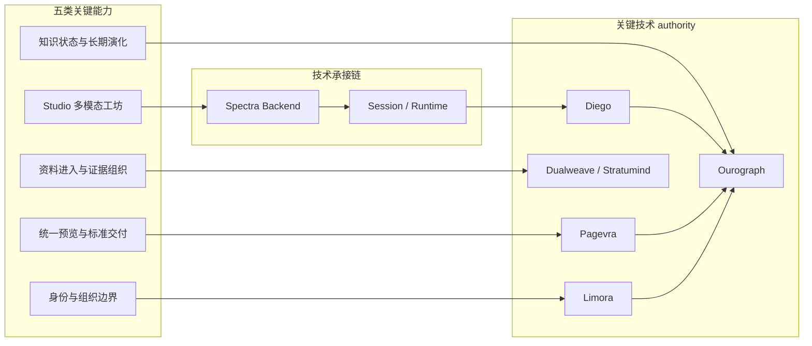

# 5-1 关键技术总体架构图

## 版本

`答辩版`

## 适配场景

`PPT 横向`

## 图类型

`分层架构图`

## 这张图只回答什么

第 5 章要讲的五类关键技术能力，分别由什么技术承接链支撑起来。

## 主阅读路径

先看左侧五类产品能力，再看中间承接链，再看右侧关键 authority 和控制平面。

## 来源与事实锚点

- `docs/competition/05-key-technologies.md`
- `docs/competition/92-final-submission-draft.md`
- `docs/architecture/service-boundaries.md`
- `docs/architecture/backend/overview.md`

## 现有图问题检测

- 旧图容易把技术链画成一堆服务名
- 容易把 backend 误画成能力 owner
- 五组能力之间容易缺少统一结构
- `结论`：`需中度重构`

## 信息分层设计

- 左层：五类关键能力
- 中层：技术承接链
- 右层：formal authorities / control plane

## 分组设计

- 左：知识状态、多模态工坊、标准交付、证据底座、身份边界
- 中：Backend / Session / Runtime 承接
- 右：Ourograph、Diego、Pagevra、Dualweave / Stratumind、Limora

## 密度策略

- `中密度`
- 答辩版强调“一眼看懂五类能力背后各有技术承接链”，不展开所有内部细节

## 画幅与布局约束

- `16:9` 宽屏横向
- 左中右三栏
- 五类能力可做成纵向五条条带，统一汇入中轴，再分流到右侧 authority

## 优化后的 Mermaid 骨架

## 中文手绘主 Prompt

请重绘一张用于中国高校竞赛答辩 PPT 的关键技术总体架构图。  
这张图是 `16:9` 横向图。  
它要回答：第 5 章讲的五类关键能力，背后分别由什么技术承接链支撑。  
画面采用左中右三栏结构。  
左侧是五类关键能力：`知识状态与长期演化`、`Studio多模态工坊`、`统一预览与标准交付`、`资料进入与证据组织`、`身份与组织边界`。  
中间是 `Spectra Backend` 和 `Session / Runtime` 作为控制平面承接链。  
右侧是关键 authority：`Ourograph`、`Diego`、`Pagevra`、`Dualweave / Stratumind`、`Limora`。  
要明显表达“每一组产品能力背后，都有清晰技术承接链”，而不是把技术名平铺成海报。  
整体风格专业、高级、低饱和、克制、简约多彩，中文标签大而短，适合答辩横向展示。

## 英文补充关键词（可选）

- `technology architecture overview`
- `wide grouped layout`
- `clear capability-to-tech mapping`
- `low saturation`
- `presentation-ready systems diagram`

## 统一风格负面约束

- 禁止服务名平铺海报
- 禁止把 backend 画成 formal owner
- 禁止五类能力没有分组
- 禁止文字太小

## 审图备注

- 这张图更像“技术总纲图”。
- 五类能力和右侧 authority 的映射关系必须直观。
