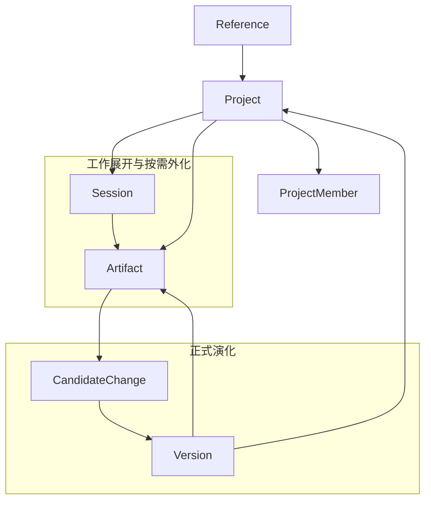

# 5-2 知识状态与版本演化图

## 版本

`单版本`

## 默认适配场景

`Word 正文`

## 图类型

`本体 / 状态图`

## 这张图只回答什么

`Project` 不是文件夹，`Artifact` 也不是终点；知识空间如何通过 `Version`、`CandidateChange`、`Reference` 和 `ProjectMember` 形成正式状态、协作边界与长期演化。

## 主阅读路径

先看中心 `Project`，再看左侧工作与外化结果，接着看右侧正式演化链，最后看上方引用关系和下方成员边界。

## 来源与事实锚点

- `docs/competition/05-key-technologies.md`
- `docs/project/SYSTEM_PHILOSOPHY_2026-03-19.md`
- `docs/architecture/system/overview.md`
- `docs/architecture/backend/overview.md`
- `docs/archived/project-space/PROJECT_SPACE_EVOLUTION_DESIGN_2026-03-09.md`
- `docs/archived/project-space/PROJECT_SPACE_DATA_MODEL_ADDENDUM_2026-03-12.md`
- `frontend/lib/sdk/generate.ts`

## 现有图问题检测

- 容易被画成 `Artifact -> CandidateChange -> Version` 的单线版本流
- 容易丢掉 `Reference`，看不出跨空间复用语义
- 容易丢掉 `ProjectMember`，看不出正式协作边界
- 容易忽略 `Artifact` 既可来自 `Session`，也可基于 `Version`
- `结论`：`需中度重构`

## 信息分层设计

- 中心层：`Project` 作为正式知识空间中心
- 左侧工作层：`Session`、`Artifact`
- 右侧演化层：`CandidateChange`、`Version`
- 上部条件层：`Reference`
- 下部治理层：`ProjectMember`

## 分组设计

- 中心：`Project`
- 左：工作展开与按需外化
- 右：候选变更与正式锚点
- 上：跨空间条件关系
- 下：成员与协作边界

## 密度策略

- `中高密度`
- 这张图要比普通状态图更“本体化”，可以信息更多，但关系必须稳，不要炸成网

## 画幅与布局约束

- `A4 纵向` 优先，也可接近正方形
- `Project` 必须位于视觉中心
- 上下左右都要形成清晰语义分区
- 关系箭头分主次：
  - 主关系：`Session -> Artifact -> CandidateChange -> Version -> Project`
  - 次关系：`Reference -> Project`、`Project -> ProjectMember`
- 不要把整张图画成流程图；它首先是正式对象关系图

## 优化后的 Mermaid 骨架

## 中文手绘主 Prompt

请重绘一张用于中国高校竞赛正文的高级知识状态与版本演化图。  
这张图默认适配 `Word 正文`，更适合 `A4 纵向` 或接近正方形的版式。  
它要回答的不是“文件怎么迭代”，而是：`Project` 如何作为正式知识空间中心，通过 `Session`、`Artifact`、`CandidateChange`、`Version`、`Reference`、`ProjectMember` 形成正式状态、跨空间复用和协作治理。

画面必须把 `Project` 放在视觉中心，并形成明确的上下左右语义分区：

- 左侧是 `工作展开与按需外化`：
  - `Session`
  - `Artifact`
  - 表达 `Session` 可以产出 `Artifact`
- 右侧是 `正式演化`：
  - `CandidateChange`
  - `Version`
  - 表达 `Artifact` 进入 `CandidateChange`，被接受后形成新的 `Version`
- 上方是 `Reference`
  - 表达一个知识空间可以被另一个空间条件化引用
  - `Reference` 是跨空间关系，不是流程节点
- 下方是 `ProjectMember`
  - 表达项目空间的正式成员与协作边界

必须体现这些关键语义：

1. `Project` 是长期知识空间，不是普通文件夹  
2. `Artifact` 是按需外化结果，不是系统本体终点  
3. `CandidateChange` 是正式演化入口，不是临时备注  
4. `Version` 是正式状态锚点，会重新回到 `Project`  
5. `Reference` 让一个空间成为另一个空间的条件  
6. `ProjectMember` 说明正式协作边界属于项目空间语义的一部分  
7. `Artifact` 既来自工作过程，也会受到正式版本语义约束，因此可以表现 `Version -> Artifact` 的关系

整体视觉风格要求：

- 专业
- 高级
- 低饱和
- 克制
- 简约多彩
- 中文信息设计图风格
- 结构理性
- 分区明确
- 留白充足
- 标签大而短
- 不要小字解释段落

这张图必须更像“正式知识空间本体图”，而不是“版本流程图”。

## 英文补充关键词（可选）

- `formal ontology map`
- `project-centered state model`
- `portrait systems diagram`
- `clear semantic zones`
- `readable Chinese labels`

## 统一风格负面约束

- 禁止画成 Git 提交链
- 禁止画成普通文件版本树
- 禁止省略 `Reference`
- 禁止省略 `ProjectMember`
- 禁止把 `Project` 画成边缘节点
- 禁止把整张图压成一条线性流程
- 禁止密集小字说明

## 审图备注

- 这张图的重点是“正式对象关系”，不是“执行过程”。
- `Project` 必须是绝对中心。
- 上下左右分区要明显，不然外部生成系统很容易又画回线性流程图。
