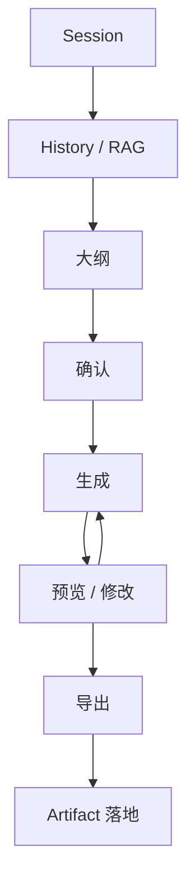

# 5-3 Session 生成与 refine 闭环图

## 版本

`文档版本`

## 适配场景

`Word 纵向`

## 图类型

`闭环 / 主链图`

## 这张图只回答什么

`Session` 内部如何通过上下文装配、大纲确认、生成、预览修改和导出形成可追踪闭环。

## 主阅读路径

自上而下看主链，再看中段 refine 反馈与底部结果落地。

## 来源与事实锚点

- `docs/competition/05-key-technologies.md`
- `docs/competition/05-key-technologies-src/01-session-loop.md`
- session generation 相关实现

## 现有图问题检测

- 旧图阶段层次不清
- 容易弱化上下文和结果落地
- `结论`：`需中度重构`

## 信息分层设计

- 第 1 层：上下文装配
- 第 2 层：大纲控制
- 第 3 层：生成与 refine
- 第 4 层：导出与落地

## 分组设计

- 上部：上下文
- 中上：大纲与确认
- 中下：生成与预览修改
- 底部：导出与结果

## 密度策略

- `高密度`
- 比答辩版多一层内部机制

## 画幅与布局约束

- `A4 纵向`
- 纵向分段明显
- 中下部允许一条 refine 回路

## 优化后的 Mermaid 骨架

## 中文手绘主 Prompt

请重绘一张用于中国高校竞赛正文的 Session 生成与 refine 闭环图。  
这张图是 `A4 纵向` 图。  
它要展示 `Session` 内部如何从 `History / RAG` 装配上下文，进入 `大纲`、`确认`、`生成`、`预览/修改`、`导出`，并最终形成 `Artifact落地`。  
画面必须按纵向分段组织，层次清楚，中下部保留一条 refine 回路。  
整体风格专业、高级、低饱和、克制、简约多彩，适合正文阅读，不要靠缩小文字增加信息。

## 英文补充关键词（可选）

- `portrait process architecture`
- `refine loop`
- `clear vertical grouping`
- `readable Chinese labels`

## 统一风格负面约束

- 禁止单线到底没有层次
- 禁止省略上下文装配
- 禁止省略 Artifact 落地
- 禁止密集注释

## 审图备注

- 文档版本要让“上下文装配”和“落地结果”都出现。
- 这张图应该有完整闭环感。
