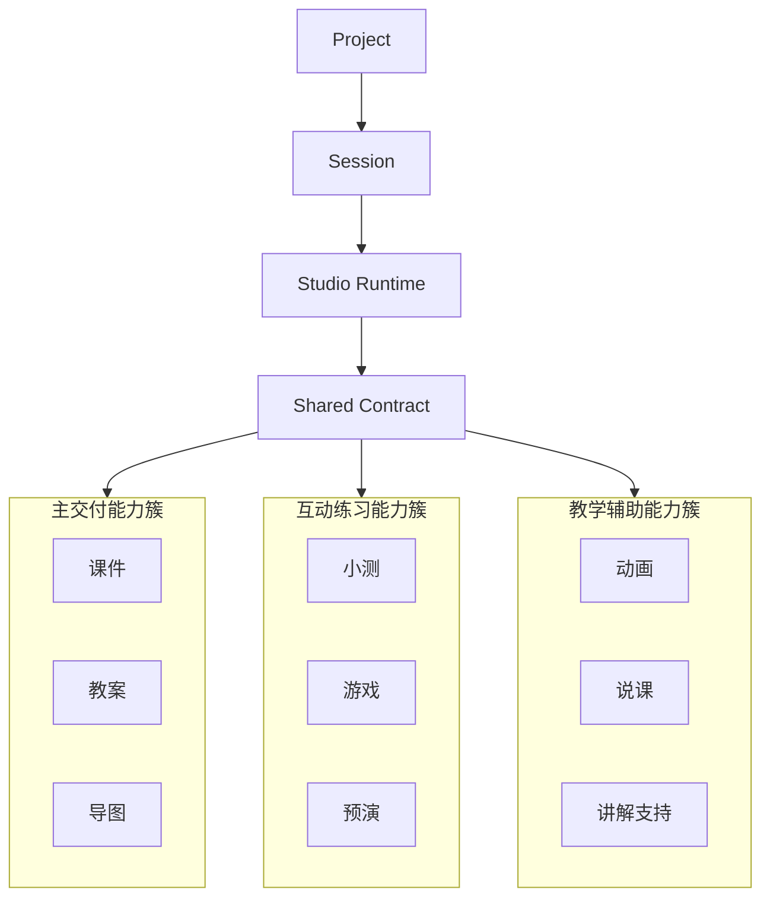

# 5-4 Studio 多模态外化能力图

## 版本

`文档版本`

## 适配场景

`Word 纵向`

## 图类型

`产品能力簇图`

## 这张图只回答什么

`Project` 与 `Session` 如何通过统一运行核支撑多模态外化，并把能力簇组织成可持续复用的结构。

## 主阅读路径

先看纵向中轴，再看三大能力簇的纵向展开和代表成果。

## 来源与事实锚点

- `docs/competition/05-key-technologies.md`
- `docs/competition/05-key-technologies-src/02-studio-generation.md`
- frontend studio tools

## 现有图问题检测

- 容易缺少 `Project / Session` 语义
- 容易把能力簇画成平铺功能海报
- `结论`：`需中度重构`

## 信息分层设计

- 第 1 层：Project / Session
- 第 2 层：Runtime / Shared Contract
- 第 3 层：三大能力簇
- 第 4 层：代表成果

## 分组设计

- 上部：Project / Session
- 中部：Runtime / Shared Contract
- 下部：三簇展开

## 密度策略

- `高密度`
- 每簇允许 2 到 3 个代表成果

## 画幅与布局约束

- `A4 纵向`
- 纵向中轴明显
- 三簇上下展开或错层展开

## 优化后的 Mermaid 骨架

## 中文手绘主 Prompt

请重绘一张用于中国高校竞赛正文的 Studio 多模态外化能力图。  
这张图是 `A4 纵向` 图。  
核心必须是纵向中轴：`Project -> Session -> Studio Runtime -> Shared Contract`。  
在中轴下方展开三大能力簇：`主交付能力簇`、`互动练习能力簇`、`教学辅助能力簇`，并给出代表成果。  
整张图要体现“统一运行核支撑多模态外化”的技术逻辑，而不是产品功能海报。  
整体风格专业、高级、低饱和、克制、简约多彩，中文标签清楚，适合正文阅读。

## 英文补充关键词（可选）

- `portrait capability map`
- `shared runtime`
- `vertical product clusters`
- `readable Chinese labels`

## 统一风格负面约束

- 禁止平铺功能清单
- 禁止没有中轴
- 禁止每个节点都写一句话
- 禁止缩小字号

## 审图备注

- 文档版本要更强调运行核和共享契约。
- 三簇代表成果可以更完整，但仍要有秩序。
