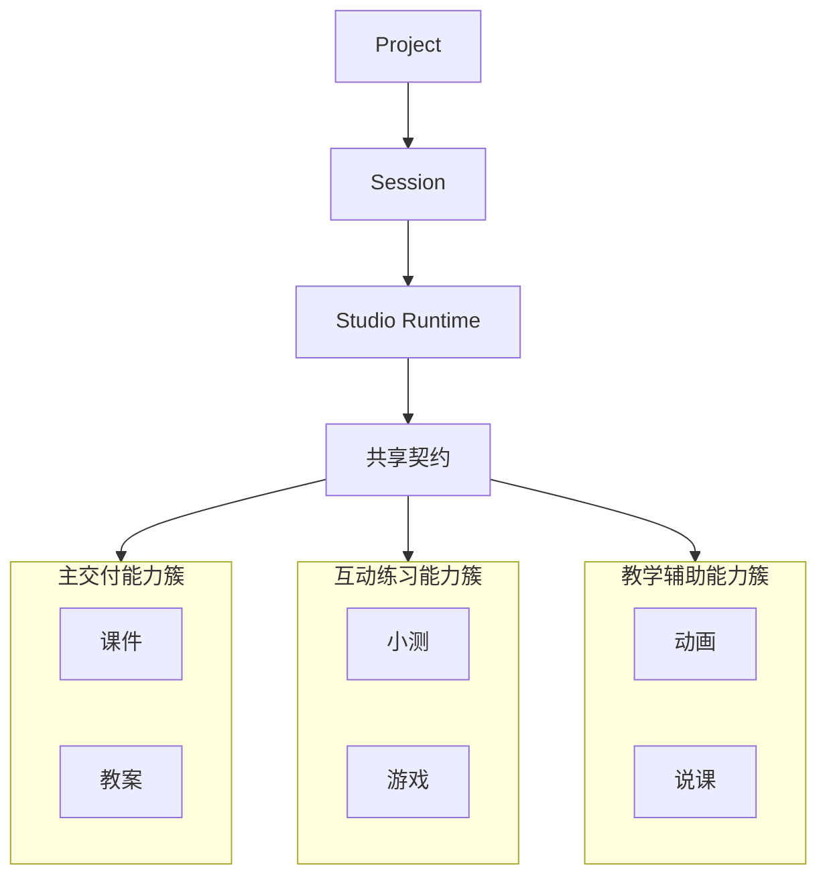

# 5-4 Studio 多模态外化能力图

## 版本

`答辩版`

## 适配场景

`PPT 横向`

## 图类型

`产品能力簇图`

## 这张图只回答什么

为什么多模态能力共享同一会话与运行契约，而不是多个分裂工具链。

## 主阅读路径

先看中轴运行核，再看横向三簇能力和代表产出。

## 来源与事实锚点

- `docs/competition/05-key-technologies.md`
- `docs/competition/05-key-technologies-src/02-studio-generation.md`
- frontend studio tools

## 现有图问题检测

- 容易变成产物列表
- 中轴共享契约不够突出
- `结论`：`需中度重构`

## 信息分层设计

- Project / Session
- Studio Runtime
- Capability Clusters

## 分组设计

- 中轴：`Project -> Session -> Studio Runtime`
- 外围：主交付、互动练习、教学辅助

## 密度策略

- `中密度`
- 答辩版保留代表能力，但仍以中轴最重要

## 画幅与布局约束

- `16:9` 横向
- 中轴必须压住外围
- 每簇保留 2 个代表项

## 优化后的 Mermaid 骨架

## 中文手绘主 Prompt

请重绘一张用于中国高校竞赛答辩 PPT 的 Studio 多模态外化能力图。  
这张图是 `16:9` 横向图。  
核心中轴必须是 `Project -> Session -> Studio Runtime -> 共享契约`，再从中轴分出三大能力簇：`主交付能力簇`、`互动练习能力簇`、`教学辅助能力簇`。  
每个能力簇保留少量代表项，让评委看出“确实能外化出不同成果”，但中轴必须仍然最重要。  
整体风格专业、高级、低饱和、克制、简约多彩，像中文答辩图与高端 capability map 的结合。

## 英文补充关键词（可选）

- `capability map`
- `runtime axis`
- `wide layout`
- `large readable labels`

## 统一风格负面约束

- 禁止变成功能菜单
- 禁止外围节点比中轴更抢眼
- 禁止写成工具清单
- 禁止小字

## 审图备注

- 答辩版要强调整体共享运行核。
- 能力簇要有代表项，但不必展开过细。
