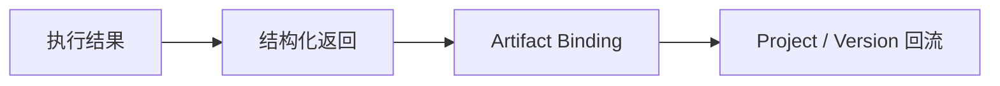

# 5-6 关键接口与契约实现图

## 版本

`单版本`

## 默认适配场景

`PPT / Word 通用`

## 图类型

`契约 / 泳道实现图`

## 这张图只回答什么

结果如何通过契约返回、绑定 Artifact，并重新进入正式系统语言。

## 主阅读路径

从左到右看执行返回、结构化结果、Artifact 绑定与正式回流。

## 来源与事实锚点

- `docs/competition/05-key-technologies.md`
- `docs/architecture/api-contract.md`
- artifact binding 相关实现

## 现有图问题检测

- 容易和总览图重复
- 需要更突出“回流实现”
- `结论`：`需中度重构`

## 信息分层设计

- 执行层
- 契约结果层
- 绑定层
- 回流层

## 分组设计

- 左：执行结果
- 中：结构化契约返回
- 右：Artifact 绑定与回流

## 密度策略

- `中密度`
- 强调结果如何回流，不展开所有实现细节

## 画幅与布局约束

- 横向优先
- 卡片分段
- 箭头少而清楚

## 优化后的 Mermaid 骨架

## 中文手绘主 Prompt

请重绘一张用于中国高校竞赛答辩或正文的关键接口与契约实现图。  
这张图强调：结果不是停留在接口返回，而是通过 `Artifact Binding` 重新进入 `Project / Version` 的正式回流。  
画面采用清晰的横向分段结构：`执行结果 -> 结构化返回 -> Artifact Binding -> Project / Version回流`。  
整体风格专业、高级、低饱和、克制、简约多彩，适合中文阅读。

## 英文补充关键词（可选）

- `binding pipeline`
- `contract return`
- `artifact binding`
- `clean horizontal layout`

## 统一风格负面约束

- 禁止只画接口返回不画回流
- 禁止写成代码实现图
- 禁止小字注释
- 禁止参数爆炸

## 审图备注

- 这张图和 4-6 的区别是“更强调结果回流”。
- `Artifact Binding` 必须是中间重点节点。
