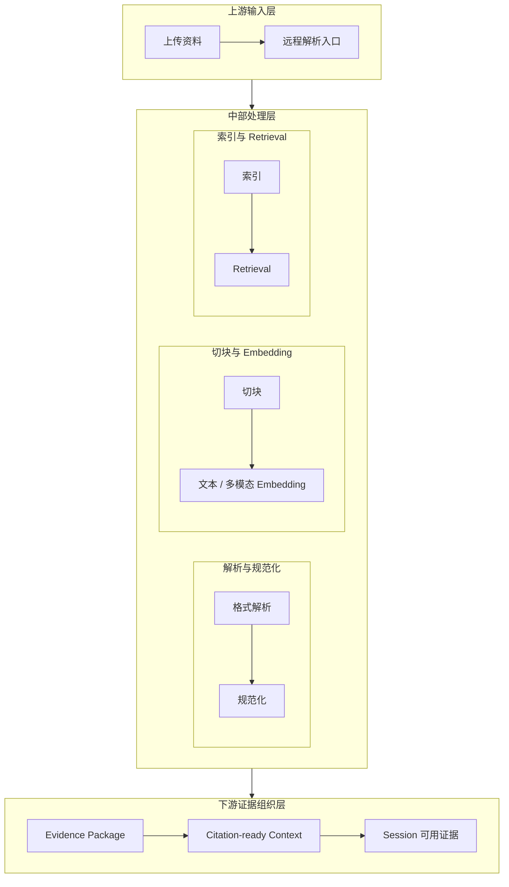

# 5-7 多模态资料进入与证据组织图

## 版本

`文档版本`

## 适配场景

`Word 纵向`

## 图类型

`分层 / 契约图`

## 这张图只回答什么

多模态资料不是简单跑过一条 RAG 管线，而是如何被解析、规范化、向量化、检索并重新组织成可引用、可消费的证据结果。

## 主阅读路径

先看上游输入层，再看中部三簇处理层，最后看下游证据组织层如何进入 `Session`。

## 来源与事实锚点

- `docs/competition/05-key-technologies.md`
- `docs/competition/05-key-technologies-src/03-rag-evidence.md`
- upload / parse / embedding / retrieval 相关实现

## 现有图问题检测

- 当前版本仍偏纵向管线图
- `Evidence Package` 有了，但整体还不够像“证据组织架构”
- retrieval 区容易被外部系统误画成数据库监控图
- `结论`：`需中度重构`

## 信息分层设计

- 第 1 层：上游输入层
- 第 2 层：中部处理层
- 第 3 层：下游证据组织层

## 分组设计

- 上部输入层：
  - `上传资料`
  - `远程解析入口`
- 中部处理层三簇：
  - `解析与规范化`
  - `切块与 Embedding`
  - `索引与 Retrieval`
- 下部证据组织层：
  - `Evidence Package`
  - `Citation-ready Context`
  - `Session 可用证据`

## 密度策略

- `高密度`
- 这张图不是流程表，而是“证据组织核心层”图；允许多一些节点，但必须用分区解压

## 画幅与布局约束

- `A4 纵向`
- 采用“三段式纵向架构”，不是单线五段管线
- 中层三簇必须形成明显并列分区
- 下游证据组织层必须明显独立，不可与 retrieval 混成一层

## 优化后的 Mermaid 骨架

## 中文手绘主 Prompt

请重绘一张用于中国高校竞赛正文的高级多模态资料进入与证据组织图。  
这张图是 `A4 纵向` 图。  
它要强调：系统做的不是“资料跑过一条 RAG 管线”，而是把多模态资料转化为可引用、可被 `Session` 消费的证据结果。

画面必须采用三段式纵向架构：

第一层是 `上游输入层`

- `上传资料`
- `远程解析入口`

第二层是 `中部处理层`，必须分成三个并列子区：

- `解析与规范化`
  - `格式解析`
  - `规范化`
- `切块与 Embedding`
  - `切块`
  - `文本 / 多模态 Embedding`
- `索引与 Retrieval`
  - `索引`
  - `Retrieval`

第三层是 `下游证据组织层`

- `Evidence Package`
- `Citation-ready Context`
- `Session 可用证据`

必须表达这些关键意思：

1. 输入资料先进入远程解析入口  
2. 中部不是一条细长流水线，而是三个语义清楚的处理簇  
3. `Retrieval` 的结果不会停留在检索层，而会被重新组织  
4. `Evidence Package` 和 `Citation-ready Context` 说明证据结果已经具备可引用性  
5. 终点是 `Session 可用证据`，不是数据库中的记录

整体风格要求：

- 专业
- 高级
- 低饱和
- 克制
- 简约多彩
- 中文技术蓝图风格
- 分区清楚
- 留白充分
- 组标题明显大于节点标题
- 不要小字说明

这张图必须更像“检索与证据组织核心层”，而不是普通技术流水账。

## 英文补充关键词（可选）

- `evidence organization architecture`
- `portrait semantic pipeline`
- `clear processing clusters`
- `citation-ready context`
- `readable Chinese labels`

## 统一风格负面约束

- 禁止画成单线 RAG 流程表
- 禁止 retrieval 区像数据库监控图
- 禁止把 `Evidence Package` 和 `Session 可用证据` 混成一个节点
- 禁止缩小字体
- 禁止密密麻麻的箭头

## 审图备注

- 重点是“证据组织”，不是“流程跑完”。
- 中层三簇和下层证据层必须都清楚，缺一就会退回普通流程图。
