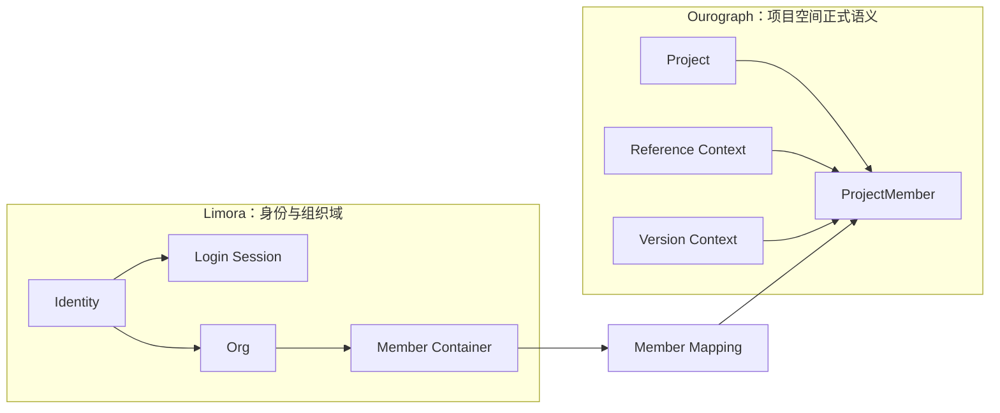

# 5-8 权限、身份与组织治理图

## 版本

`单版本`

## 默认适配场景

`Word 正文`

## 图类型

`本体 / 状态图`

## 这张图只回答什么

`Limora` 与 `Ourograph` 如何分工：前者负责身份、登录会话、组织和成员容器，后者负责项目空间内的正式成员语义、版本上下文与引用条件，而不是一个“member”管全部。

## 主阅读路径

先看左侧 `Limora` 身份与组织域，再看右侧 `Ourograph` 项目空间域，最后看两域之间通过成员映射和项目语义建立联系。

## 来源与事实锚点

- `docs/competition/05-key-technologies.md`
- `docs/architecture/service-boundaries.md`
- `docs/architecture/backend/overview.md`
- `docs/project/SYSTEM_PHILOSOPHY_2026-03-19.md`
- `docs/archived/project-space/PROJECT_SPACE_DATA_MODEL_ADDENDUM_2026-03-12.md`

## 现有图问题检测

- 容易把 `Limora` 和 `Ourograph` 画成双 owner
- 容易把组织成员和项目空间成员混成一个概念
- 容易只画权限树，反而丢掉项目空间正式语义
- `结论`：`需中度重构`

## 信息分层设计

- 左域：身份、登录会话、组织与成员容器
- 右域：项目空间、项目成员、引用与版本上下文
- 中间联系层：成员映射与边界衔接

## 分组设计

- 左：`Limora`
- 右：`Ourograph`
- 中：域间映射

## 密度策略

- `中高密度`
- 这张图不需要列权限细目，而要把“边界清楚 + 关系成立”讲明白

## 画幅与布局约束

- `A4 纵向` 或纵向双栏
- 左右双域必须明显
- 中间映射关系要存在，但不能画成一锅线

## 优化后的 Mermaid 骨架

## 中文手绘主 Prompt

请重绘一张用于中国高校竞赛正文的高级权限、身份与组织治理图。  
这张图默认适配 `Word 正文`，更适合纵向双栏结构。  
它要说明：`Limora` 和 `Ourograph` 不是同一个 owner，它们分别负责不同层次的正式语义。

画面必须分成两个大域：

- 左边是 `Limora：身份与组织域`
  - `Identity`
  - `Login Session`
  - `Org`
  - `Member Container`
- 右边是 `Ourograph：项目空间正式语义`
  - `Project`
  - `ProjectMember`
  - `Reference Context`
  - `Version Context`

中间要有一层很清楚但不喧宾夺主的 `Member Mapping`，表达：

1. 身份与组织成员容器来自 `Limora`  
2. 项目空间里的正式成员语义来自 `Ourograph`  
3. 组织成员不直接等价于项目成员  
4. 项目成员会受到 `Reference` 和 `Version` 上下文条件影响  
5. `Limora` 是身份 authority，`Ourograph` 是项目空间 formal semantics authority

整体风格要求：

- 专业
- 高级
- 低饱和
- 克制
- 简约多彩
- 中文信息设计图风格
- 左右双域清楚
- 标签大而短
- 结构理性
- 不要权限树大海报

这张图必须让读者理解：系统不是“谁都管 member”，而是分层治理。

## 英文补充关键词（可选）

- `identity governance map`
- `clear domain boundary`
- `dual-domain diagram`
- `readable Chinese labels`
- `low saturation`

## 统一风格负面约束

- 禁止把 `Limora` 和 `Ourograph` 画成双 owner
- 禁止把组织成员和项目成员混成一个节点
- 禁止做成权限树海报
- 禁止省略 `Member Mapping`
- 禁止小字和密集权限细目

## 审图备注

- 这张图的关键不是权限点有多少，而是“边界与映射关系”。
- 左右双域必须明显，不然外部系统很容易画成普通组织架构图。
