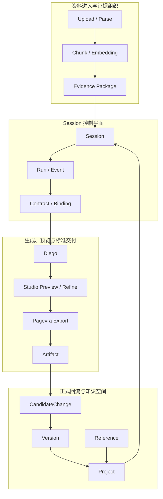

# 5-9 系统级能力闭环图

## 版本

`文档版本`

## 适配场景

`Word 纵向`

## 图类型

`闭环 / 主链图`

## 这张图只回答什么

从资料进入、证据组织、Session 驱动、生成交付到正式回流，整个系统如何形成“生产即沉淀、沉淀即交付”的系统级能力闭环。

## 主阅读路径

先看自上而下的五段主链，再看中部控制平面如何串接各段，最后看底部正式回流如何重新作用于后续生成。

## 来源与事实锚点

- `docs/competition/05-key-technologies.md`
- `docs/project/SYSTEM_PHILOSOPHY_2026-03-19.md`
- `docs/architecture/system/overview.md`
- `docs/architecture/service-boundaries.md`
- 当前 upload / rag / session / generate / artifact binding 主链实现

## 现有图问题检测

- 容易被画成“五个阶段排排站”
- 容易缺少控制平面，看不出系统如何被串起来
- 容易弱化底部正式回流，使闭环像口号而不是结构
- `结论`：`需彻底重画`

## 信息分层设计

- 第 1 层：资料进入与证据组织
- 第 2 层：Session 控制平面
- 第 3 层：生成、预览与标准交付
- 第 4 层：正式回流与知识空间

## 分组设计

- 上部：输入与证据
- 中部：Session / Contract / Orchestration
- 中下部：Diego / Pagevra / Artifact
- 底部：Version / Project / Reference 回流

## 密度策略

- `高密度`
- 文档版本必须更像“系统闭环蓝图”，不是阶段标题清单

## 画幅与布局约束

- `A4 纵向`
- 纵向四层结构，不是单线五框
- 中层控制平面必须明显
- 底部回流层必须完整，且要反向作用到中层

## 优化后的 Mermaid 骨架

## 中文手绘主 Prompt

请重绘一张用于中国高校竞赛正文的高级系统级能力闭环图。  
这张图是 `A4 纵向` 图。  
它要真正把系统级闭环画成结构，而不是口号：

1. `资料进入与证据组织`
2. `Session 控制平面`
3. `生成、预览与标准交付`
4. `正式回流与知识空间`

画面必须采用纵向四层结构：

- 第一层 `资料进入与证据组织`
  - `Upload / Parse`
  - `Chunk / Embedding`
  - `Evidence Package`
- 第二层 `Session 控制平面`
  - `Session`
  - `Run / Event`
  - `Contract / Binding`
- 第三层 `生成、预览与标准交付`
  - `Diego`
  - `Studio Preview / Refine`
  - `Pagevra Export`
  - `Artifact`
- 第四层 `正式回流与知识空间`
  - `CandidateChange`
  - `Version`
  - `Project`
  - `Reference`

必须体现这些关键关系：

1. `Evidence Package` 进入 `Session`
2. `Session / Contract` 驱动正式生成与交付
3. `Artifact` 不停留在交付层，而是进入 `CandidateChange`
4. `Version` 与 `Project` 构成正式回流
5. `Reference` 说明知识空间之间还存在条件关系
6. `Project` 会重新影响后续 `Session`

整体风格要求：

- 专业
- 高级
- 低饱和
- 克制
- 简约多彩
- 中文系统蓝图风格
- 分层明确
- 留白充足
- 标签大而短
- 不要小字解释段落

这张图必须让人一眼看出：系统不是一组孤立能力，而是从输入到底部正式回流都能闭合的结构。

## 英文补充关键词（可选）

- `system capability blueprint`
- `portrait closed-loop architecture`
- `clear layered hierarchy`
- `readable Chinese labels`
- `premium infographic`

## 统一风格负面约束

- 禁止画成五个阶段标题排排站
- 禁止没有中层控制平面
- 禁止底部回流区被弱化
- 禁止把 `Reference` 省掉
- 禁止压小字体
- 禁止科技海报风或炫技网状连线

## 审图备注

- 这张图的关键是“控制平面”和“正式回流”必须都存在。
- 文档版本要明显比答辩版更像完整系统蓝图，而不是增强版流程图。
