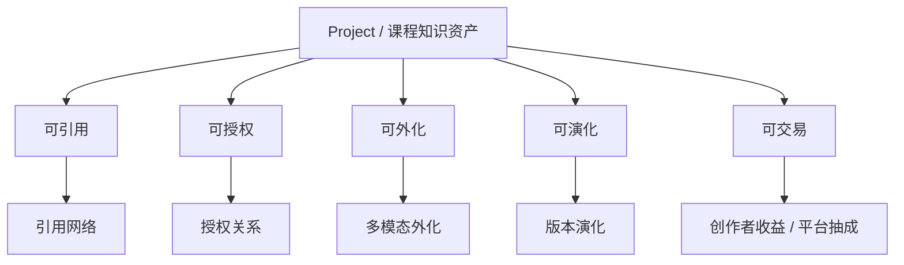

# 8-1 课程知识资产节点图

## 版本

`文档版本`

## 适配场景

`Word 纵向`

## 图类型

`商业 / 资产网络图`

## 这张图只回答什么

为什么 `Project / 课程库` 不是普通文件夹，而是一个可引用、可授权、可外化、可演化、可交易的课程知识资产节点，并能向外扩展出关系网络。

## 主阅读路径

先看中心资产节点，再看第二圈资产属性，最后看第三圈关系网络与商业动作。

## 来源与事实锚点

- `docs/competition/08-business-plan.md`
- `docs/competition/08-business-plan-src/01-course-asset-network.md`
- `docs/project/SYSTEM_PHILOSOPHY_2026-03-19.md`

## 现有图问题检测

- 当前版本资产属性有了，但关系网络和商业动作层还不够具体
- 容易被画成抽象价值口号图
- `结论`：`需中度重构`

## 信息分层设计

- 第 1 层：中心资产节点
- 第 2 层：五类资产属性
- 第 3 层：关系网络与商业动作

## 分组设计

- 中心：`Project / 课程知识资产`
- 中圈：`可引用`、`可授权`、`可外化`、`可演化`、`可交易`
- 外圈：
  - `引用网络`
  - `授权关系`
  - `多模态外化`
  - `版本演化`
  - `创作者收益 / 平台抽成`

## 密度策略

- `高密度`
- 这张图要从“资产属性图”抬升到“资产节点 + 关系网络图”，但仍要保持中心最强

## 画幅与布局约束

- `A4 纵向`
- 中心辐射或洋葱层结构
- 第二圈和第三圈都要有明显层级
- 外圈关系点不宜超过 5 个，避免稀碎

## 优化后的 Mermaid 骨架

## 中文手绘主 Prompt

请重绘一张用于中国高校竞赛正文的高端课程知识资产节点图。  
这张图是 `A4 纵向` 图。  
它不能只是“资产五性”的概念海报，而要明确表达：`Project / 课程库` 为什么是课程知识资产节点，以及它如何向外扩展出关系网络与商业动作。

画面采用明显的三层辐射结构：

第一层是中心资产节点：

- `Project / 课程知识资产`

第二层是五类资产属性：

- `可引用`
- `可授权`
- `可外化`
- `可演化`
- `可交易`

第三层是这些属性向外延伸出的关系网络与商业动作：

- `引用网络`
- `授权关系`
- `多模态外化`
- `版本演化`
- `创作者收益 / 平台抽成`

必须让人看出：

1. 中心不是文件，而是课程知识资产节点  
2. 五类属性不是空口号，而会延伸出真实关系和商业动作  
3. `Reference / Version / Artifact / Member` 这些系统对象是资产网络成立的基础  
4. 这张图在商业上要表达“一个优质课程库越被使用、引用和外化，它的资产价值就越高”

整体风格要求：

- 专业
- 高级
- 低饱和
- 克制
- 简约多彩
- 中文商业系统图风格
- 中心最强
- 第二圈属性清楚
- 第三圈关系点稳而不碎
- 不要小字说明

## 英文补充关键词（可选）

- `asset node network`
- `radial business model`
- `portrait layered infographic`
- `clear value network`
- `readable Chinese labels`

## 统一风格负面约束

- 禁止做成抽象口号海报
- 禁止只有五个价值词没有关系层
- 禁止把中心资产节点弱化
- 禁止外圈节点过多过碎
- 禁止小字和高饱和商业海报风

## 审图备注

- 这张图的关键是“资产节点”加“关系网络”要同时成立。
- 如果只有资产属性，没有外圈关系，图就会重新变空。
