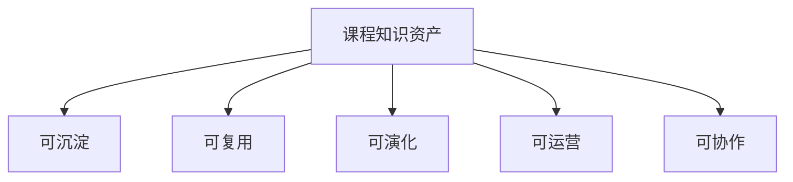

# 8-1 课程知识资产节点图

## 版本

`答辩版`

## 适配场景

`PPT 横向`

## 图类型

`商业 / 生态图`

## 这张图只回答什么

为什么课程资产不是普通文件，而是可沉淀、可复用、可演化、可运营的知识资产节点。

## 主阅读路径

先看中心资产节点，再看外围五种属性。

## 来源与事实锚点

- `docs/competition/08-business-plan.md`
- `docs/competition/08-business-plan-src/01-assetization.md`

## 现有图问题检测

- 容易变成商业口号图
- 容易缺少资产节点中心感
- `结论`：`需中度重构`

## 信息分层设计

- 中心资产
- 五种资产属性

## 分组设计

- 中心：课程知识资产
- 外围：可沉淀、可复用、可演化、可运营、可协作

## 密度策略

- `中密度`
- 答辩版要快读，但不能空

## 画幅与布局约束

- `16:9` 横向
- 中心辐射
- 五个属性分区清楚

## 优化后的 Mermaid 骨架

## 中文手绘主 Prompt

请重绘一张用于中国高校竞赛答辩 PPT 的课程知识资产节点图。  
这张图是 `16:9` 横向图。  
中心必须是 `课程知识资产`，外围展示五个属性：`可沉淀`、`可复用`、`可演化`、`可运营`、`可协作`。  
画面要有强中心感和资产感，不要做成空洞商业口号图。  
整体风格专业、高级、低饱和、克制、简约多彩，标签大、短、清楚。

## 英文补充关键词（可选）

- `asset node map`
- `center radial infographic`
- `presentation-ready`
- `low saturation`

## 统一风格负面约束

- 禁止普通概念海报
- 禁止中心不突出
- 禁止只有五个词没有资产感
- 禁止高饱和

## 审图备注

- 答辩版要像“资产节点”而不是“理念海报”。
- 外围五性要有均衡但不能同权过强。
