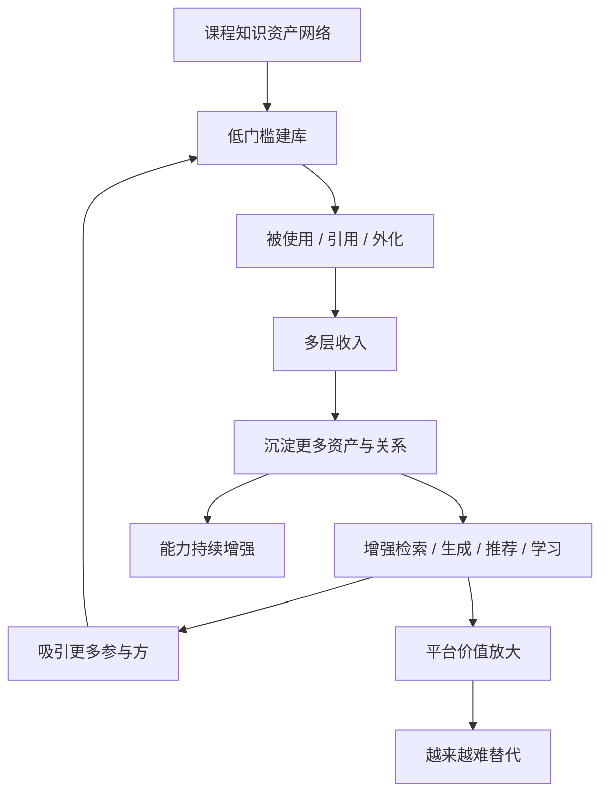

# 8-2 商业飞轮图

## 版本

`文档版本`

## 适配场景

`Word 纵向`

## 图类型

`闭环 / 商业图`

## 这张图只回答什么

`Spectra` 的商业飞轮为什么不是“用户多了就增长”这种空泛叙事，而是围绕课程库、引用关系、多模态成果和学习反馈形成的平台级复利。

## 主阅读路径

先看中心平台价值，再看中圈六步飞轮，最后看外圈能力放大与结果层。

## 来源与事实锚点

- `docs/competition/08-business-plan.md`
- `docs/competition/08-business-plan-src/03-business-flywheel.md`
- `docs/competition/08-business-plan-src/01-course-asset-network.md`

## 现有图问题检测

- 当前版本飞轮有了，但“平台级复利”表达还不够强
- 中心价值和外圈结果层之间关系还不够清楚
- `结论`：`保留飞轮结构，补强平台复利语义`

## 信息分层设计

- 第 1 层：中心平台价值
- 第 2 层：六步飞轮
- 第 3 层：能力放大与增长结果

## 分组设计

- 中心：`课程知识资产网络`
- 中圈六步飞轮：
  - `低门槛建库`
  - `被使用 / 引用 / 外化`
  - `多层收入`
  - `沉淀更多资产与关系`
  - `增强检索 / 生成 / 推荐 / 学习`
  - `吸引更多参与方`
- 外圈结果层：
  - `平台价值放大`
  - `能力持续增强`
  - `越来越难替代`

## 密度策略

- `高密度`
- 这张图要从“商业飞轮示意图”升级成“平台级复利飞轮图”，允许多一层结果表达，但仍要保持飞轮感

## 画幅与布局约束

- `A4 纵向`
- 中心 + 中圈 + 外圈三层结构
- 六步飞轮标签要短
- 外圈结果层不宜过多，避免压碎飞轮

## 优化后的 Mermaid 骨架

## 中文手绘主 Prompt

请重绘一张用于中国高校竞赛正文的高端商业飞轮图。  
这张图是 `A4 纵向` 图。  
它不能只表达“用户增长”，而要明确表达 `Spectra` 的平台级复利：课程库越多、引用越多、外化越多、学习反馈越多，平台能力就越强，进而吸引更多参与方进入。

画面采用三层结构：

第一层中心是：

- `课程知识资产网络`

第二层是六步飞轮：

- `低门槛建库`
- `被使用 / 引用 / 外化`
- `多层收入`
- `沉淀更多资产与关系`
- `增强检索 / 生成 / 推荐 / 学习`
- `吸引更多参与方`

第三层是外圈结果层：

- `平台价值放大`
- `能力持续增强`
- `越来越难替代`

必须让人看出：

1. 这条飞轮不是普通 SaaS 增长闭环  
2. 课程知识资产网络是飞轮中心  
3. “使用”本身会反过来增强检索、生成、推荐和学习能力  
4. 平台价值来自能力和资产网络同步增长，而不是只来自销售动作  
5. 最终结果是平台越来越难被替代

整体风格要求：

- 专业
- 高级
- 低饱和
- 克制
- 简约多彩
- 中文商业系统图风格
- 飞轮感强
- 中心节点稳定
- 外圈结果层克制但有力
- 不要小字说明

## 英文补充关键词（可选）

- `platform flywheel`
- `network effects diagram`
- `portrait business loop`
- `clear concentric hierarchy`
- `readable Chinese labels`

## 统一风格负面约束

- 禁止口号堆砌
- 禁止只剩抽象增长循环
- 禁止飞轮不闭合
- 禁止结果层过多过碎
- 禁止缩小字体

## 审图备注

- 这张图的关键是“平台级复利”，不是“用户越多越好”。
- 中心资产网络和外圈结果层都要在，但不能压过六步飞轮本身。
