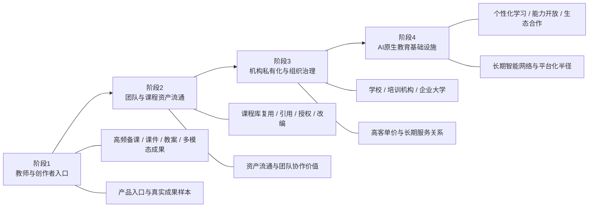

# 8-3 市场进入路径图

## 版本

`单版本`

## 默认适配场景

`PPT / Word 通用`

## 图类型

`商业 / 路径图`

## 这张图只回答什么

`Spectra` 为什么必须按“由轻到重、由工具到资产、由单点到平台”的节奏进入市场，而不是一开始就卖完整平台愿景。

## 主阅读路径

沿横向四阶段推进，先看每阶段的核心客群，再看对应能力基础和商业半径扩展。

## 来源与事实锚点

- `docs/competition/08-business-plan.md`
- `docs/competition/08-business-plan-src/05-go-to-market.md`

## 现有图问题检测

- 原图只有四个阶段名，缺少具体场景和客群
- 读者很难看出“为什么这样走、每一步靠什么成立”
- `结论`：`保留路径结构，补足场景与能力基础`

## 信息分层设计

- 上层：四阶段进入路径
- 中层：对应核心客群 / 场景
- 下层：对应能力基础 / 商业结果

## 分组设计

- 第一阶段：教师与创作者入口
- 第二阶段：团队与课程资产流通
- 第三阶段：机构私有化与组织治理
- 第四阶段：AI 原生教育基础设施

## 密度策略

- `中密度`
- 这张图要比以前更具体，但仍保持路径图的清晰推进感

## 画幅与布局约束

- 横向优先
- 四阶段要清楚拉开
- 每阶段允许带两行补充：
  - `核心客群 / 场景`
  - `能力基础 / 商业结果`
- 不能变成密密麻麻的战略表格

## 优化后的 Mermaid 骨架

## 中文手绘主 Prompt

请重绘一张用于中国高校竞赛答辩或正文的市场进入路径图。  
这张图不能只有四个阶段名字，而要让人看懂“每一阶段服务谁、靠什么能力成立、商业半径如何扩大”。

画面采用横向四阶段推进结构：

1. `阶段1：教师与创作者入口`
2. `阶段2：团队与课程资产流通`
3. `阶段3：机构私有化与组织治理`
4. `阶段4：AI原生教育基础设施`

每个阶段都要带两类补充信息：

- `核心客群 / 场景`
- `能力基础 / 商业结果`

具体建议：

- 阶段1：
  - `高频备课 / 课件 / 教案 / 多模态成果`
  - `产品入口与真实成果样本`
- 阶段2：
  - `课程库复用 / 引用 / 授权 / 改编`
  - `资产流通与团队协作价值`
- 阶段3：
  - `学校 / 培训机构 / 企业大学`
  - `高客单价与长期服务关系`
- 阶段4：
  - `个性化学习 / 能力开放 / 生态合作`
  - `长期智能网络与平台化半径`

必须让读者一眼看出：

1. 这条路径是由轻到重  
2. 是从真实产品入口走向课程资产，再走向组织平台，再走向长期基础设施  
3. 每一步都建立在上一阶段已经成立的能力基础上  
4. 这不是空想蓝图，而是有节奏的市场进入路径

整体风格要求：

- 专业
- 高级
- 低饱和
- 克制
- 简约多彩
- 中文策略路径图风格
- 节奏感明确
- 标签清楚
- 留白充足
- 不要小字表格感

## 英文补充关键词（可选）

- `go-to-market roadmap`
- `staged growth path`
- `horizontal strategy infographic`
- `clear phase expansion`
- `readable Chinese labels`

## 统一风格负面约束

- 禁止只有四个空阶段名
- 禁止没有客群和能力基础
- 禁止时间轴写得太密像甘特图
- 禁止长段小字
- 禁止高饱和咨询海报风

## 审图备注

- 这张图的重点是“路径为什么成立”，不是“阶段名字好不好听”。
- 四阶段都要带明确场景，不然外部系统很容易画成空洞路线图。
