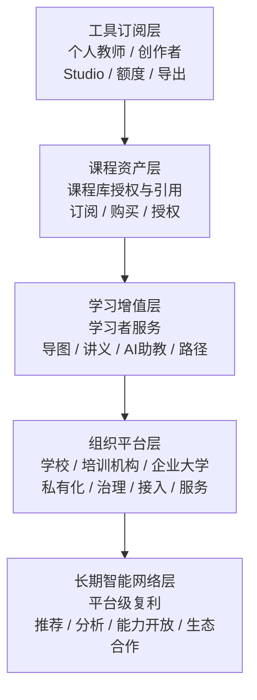

# 8-4 收入层级堆栈图

## 版本

`单版本`

## 默认适配场景

`PPT / Word 通用`

## 图类型

`商业 / 收入架构图`

## 这张图只回答什么

为什么 `Spectra` 的收入结构不是单一订阅点，而是从入口层到复利层逐步抬升的五层收入架构。

## 主阅读路径

自下而上看五层收入，再看每层对应的客户对象和价值载体，最后理解“越往上越依赖资产、关系和长期网络”的抬升逻辑。

## 来源与事实锚点

- `docs/competition/08-business-plan.md`
- `docs/competition/08-business-plan-src/04-revenue-layers.md`

## 现有图问题检测

- 原图只有五层名字，缺少“面向谁”和“卖什么”
- 读者不容易看出为什么它是层级抬升，而不是五个并列收费点
- `结论`：`保留堆栈结构，补足收入架构语义`

## 信息分层设计

- 左侧：五层收入级别
- 右侧：每层对应客户 / 价值载体
- 整体：由入口层到复利层的抬升关系

## 分组设计

- 第 1 层：工具订阅层
- 第 2 层：课程资产层
- 第 3 层：学习增值层
- 第 4 层：组织平台层
- 第 5 层：长期智能网络层

## 密度策略

- `中密度`
- 保持堆栈图的直观，但每层至少补一个“对象”和一个“价值载体”，让商业逻辑站住

## 画幅与布局约束

- 纵向堆栈优先
- 每层不要只写一个短标签
- 每层允许两行信息：
  - `客户对象`
  - `价值载体 / 收入方式`
- 整体仍然要简洁，不做商业表格

## 优化后的 Mermaid 骨架

## 中文手绘主 Prompt

请重绘一张用于中国高校竞赛答辩或正文的高端收入层级架构图。  
这张图不能只写五个收费层名字，而要让读者一眼看懂：每一层面向谁、卖什么、为什么越往上越高级。

画面采用清晰的纵向五层堆栈结构：

1. `工具订阅层`
   - 面向：`个人教师 / 创作者`
   - 价值载体：`Studio / 生成额度 / 导出能力 / 私有课程空间`
2. `课程资产层`
   - 面向：`课程库授权与引用方`
   - 收入方式：`订阅 / 购买 / 授权`
3. `学习增值层`
   - 面向：`学习者服务`
   - 价值载体：`导图 / 讲义 / AI助教 / 个性化路径`
4. `组织平台层`
   - 面向：`学校 / 培训机构 / 企业大学`
   - 价值载体：`私有化 / 权限治理 / 校本资源接入 / 定制服务`
5. `长期智能网络层`
   - 面向：`平台级复利`
   - 价值载体：`推荐 / 知识资产分析 / 能力开放 / 生态合作`

必须让整张图表达出：

1. 这五层不是并列收费清单，而是从入口层到复利层的逐步抬升  
2. 越往上，越依赖课程资产、关系网络和长期反馈  
3. 前几层回答“平台怎么赚钱”，最上层回答“平台为什么越来越难替代”  
4. 这是一张收入架构图，不是财务表，也不是订阅价格表

整体风格要求：

- 专业
- 高级
- 低饱和
- 克制
- 简约多彩
- 中文商业架构图风格
- 纵向层级明确
- 越往上层视觉上略有“抬升感”
- 标签清楚
- 不要小字说明

## 英文补充关键词（可选）

- `revenue architecture stack`
- `layered business model`
- `vertical value ladder`
- `clear visual hierarchy`
- `readable Chinese labels`

## 统一风格负面约束

- 禁止像财务表
- 禁止只有五个空层名
- 禁止每层没有客户对象和价值载体
- 禁止长段小字
- 禁止彩色过多
- 禁止把它画成价格页

## 审图备注

- 这张图的重点是“收入层级为什么能逐层抬升”。
- 每层都要同时站住“客户对象”和“价值载体”，否则就会重新变空。
