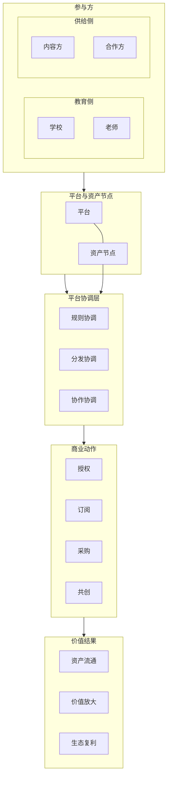

# 8-5 平台生态关系图

## 版本

`文档版本`

## 适配场景

`Word 纵向`

## 图类型

`商业 / 生态图`

## 这张图只回答什么

平台如何围绕资产节点，在教育侧、供给侧、平台协调层和商业动作层之间形成可持续运转的生态关系，而不是简单列出参与方。

## 主阅读路径

先看顶部参与方双分区，再看中部 `平台 + 资产节点` 双中心，接着看协调层，最后看底部商业动作层。

## 来源与事实锚点

- `docs/competition/08-business-plan.md`
- `docs/competition/08-business-plan-src/05-ecosystem.md`

## 现有图问题检测

- 当前版本仍偏“参与方 -> 平台 -> 动作”的结构示意
- 平台协调层不够有存在感
- 平台与资产节点的双中心关系不够强
- 资产节点还不够“活”，容易被外部模型弱化成平台内部内容块
- `结论`：`需中度重构`

## 信息分层设计

- 第 1 层：参与方双分区
- 第 2 层：平台与资产节点双中心
- 第 3 层：平台协调层
- 第 4 层：商业动作层
- 第 5 层：价值结果层

## 分组设计

- 上部参与方双分区：
  - `教育侧：学校 / 老师`
  - `供给侧：内容方 / 合作方`
- 中部双中心：
  - `平台`
  - `资产节点`
- 中下协调层：
  - `规则协调`
  - `分发协调`
  - `协作协调`
- 底部商业动作层：
  - `授权`
  - `订阅`
  - `采购`
  - `共创`
- 最底结果层：
  - `资产流通`
  - `价值放大`
  - `生态复利`

## 密度策略

- `高密度`
- 这张图必须更像平台生态协调图与资产流动图的结合，而不是参与方清单；允许信息更强，但不能失去双中心、协调层和结果层

## 画幅与布局约束

- `A4 纵向`
- 纵向五层结构
- 平台和资产节点必须都具有中心地位
- 协调层必须作为独立一层，不可省略
- 参与方不可平铺成通讯录
- `资产节点` 必须单独连到协调层，表达“关系围绕资产发生”
- `平台` 和 `资产节点` 要语义对等、形态不同，不允许一个大一个小把资产压没
- 商业动作层下面必须再接一层“价值结果”，避免图停在交易动作上显得过平
- 画面要像“商业系统协调蓝图”，不是抽象概念海报

## 优化后的 Mermaid 骨架

## 中文手绘主 Prompt

请重绘一张用于中国高校竞赛正文的高端平台生态协调图。  
这张图是 `A4 纵向` 图。  
它必须表达：平台不是简单连接几类参与方，而是围绕 `资产节点` 组织教育侧、供给侧、平台协调和商业动作，形成可持续运转的生态结构。

画面必须采用纵向四层结构：

第一层 `参与方` 要分成两个明显分区：

- `教育侧`
  - `学校`
  - `老师`
- `供给侧`
  - `内容方`
  - `合作方`

第二层必须是双中心：

- `平台`
- `资产节点`

两者必须是语义对等但形态不同的双中心：

- `平台` 更像稳定系统结构
- `资产节点` 更像关系发生与价值流动的核心载体

第三层必须是独立的 `平台协调层`：

- `规则协调`
- `分发协调`
- `协作协调`

第四层是 `商业动作`：

- `授权`
- `订阅`
- `采购`
- `共创`

第五层必须补一层 `价值结果`：

- `资产流通`
- `价值放大`
- `生态复利`

必须让人看出：

1. 平台与资产节点共同构成生态中心  
2. 教育侧和供给侧不是同一种参与方  
3. 真正让生态运转起来的是围绕资产发生的协调机制  
4. 商业动作是生态运行的结果表达，而不是平台本体  
5. 整张图是“平台围绕资产协调生态”的图，不是参与方通讯录，也不是组织结构图  
6. 协调层不是平台单方面下发规则，而是围绕资产节点展开的规则、分发与协作机制  
7. 商业动作不会停在交易本身，而会继续沉淀为 `资产流通`、`价值放大` 和 `生态复利`

整体风格要求：

- 专业
- 高级
- 低饱和
- 克制
- 简约多彩
- 中文商业系统图风格
- 咨询式信息设计风格
- 商业架构蓝图风格
- 双中心清楚
- 协调层明显
- 结果层清楚
- 分区标题大于节点标题
- 留白充足
- 不要小字说明

具体美术风格要更明确：

- 不要抽象通用科技海报
- 不要只有几块纯色矩形
- 要像高端咨询公司或一级投行风格的信息设计图
- 采用低饱和灰蓝、雾青、灰绿、暖灰、少量暗金或低饱和橙作强调
- 使用卡片分区、细描边、轻阴影、明显层级间距
- `平台` 用稳定矩形或中枢结构块表示
- `资产节点` 用更有“流动核心感”的圆形或发光核心节点表示
- `协调层` 要像三条结构化控制带，而不是说明文字
- `商业动作层` 要像结果通道，不像功能菜单
- `价值结果层` 要有更轻但更高层的“抬升感”
- 适当加入极简图标或符号，但绝不能做成图标拼贴海报
- 中文标签大而清楚，层标题明显大于节点标题

最后必须明确表达一句隐含结构逻辑：

**平台不是生态唯一中心，资产节点必须成为关系发生的核心载体，协调层围绕资产而非平台展开。**

## 英文补充关键词（可选）

- `platform ecosystem coordination`
- `portrait business system map`
- `dual center layout`
- `clear stakeholder zones`
- `readable Chinese labels`
- `consulting-style infographic`
- `editorial business blueprint`
- `asset-driven ecosystem`

## 统一风格负面约束

- 禁止参与方平铺成通讯录
- 禁止画成组织结构图
- 禁止平台中心不明显
- 禁止资产节点被弱化成普通节点
- 禁止省略协调层
- 禁止把协调机制画成平台单方面控制
- 禁止把资产节点画成平台里的附属内容块
- 禁止停在“商业动作层”就结束
- 禁止画成抽象通用概念海报
- 禁止只有几块大色块没有信息结构
- 禁止缩小字体

## 审图备注

- 这张图最容易被画歪成“平台中心图”或“参与方清单”，所以双中心、`资产节点 -> 协调层`、协调层独立存在这三件事一定要强。
- 文档版本应该有商业级系统协调图和资产流动图的双重气质，而不是普通生态示意图。
- 如果外部系统第一次生成仍然太抽象，优先继续强化“咨询式信息设计风格”和“价值结果层”的可见度。
