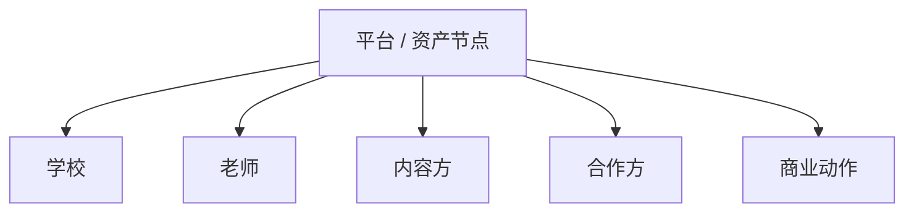

# 8-5 平台生态关系图

## 版本

`答辩版`

## 适配场景

`PPT 横向`

## 图类型

`商业 / 生态图`

## 这张图只回答什么

平台如何围绕中心资产节点连接学校、老师、内容与合作方，形成生态关系。

## 主阅读路径

先看中心资产平台，再看三分区参与方和商业动作。

## 来源与事实锚点

- `docs/competition/08-business-plan.md`
- `docs/competition/08-business-plan-src/05-ecosystem.md`

## 现有图问题检测

- 容易过空或过散
- 容易不像生态图而像组织架构图
- `结论`：`需中度重构`

## 信息分层设计

- 中心平台层
- 参与方层
- 关系动作层

## 分组设计

- 中心：平台 / 资产节点
- 左：学校与老师
- 右：内容与合作方
- 下：商业动作

## 密度策略

- `中密度`
- 答辩版要有三分区感，但不展开太深

## 画幅与布局约束

- `16:9` 横向
- 中心节点强
- 三分区明确

## 优化后的 Mermaid 骨架

## 中文手绘主 Prompt

请重绘一张用于中国高校竞赛答辩 PPT 的平台生态关系图。  
这张图是 `16:9` 横向图。  
中心必须是 `平台 / 资产节点`，周围分成明显分区，至少包括 `学校`、`老师`、`内容方`、`合作方`，并通过一个 `商业动作` 区表现平台如何协调关系。  
整体风格专业、高级、低饱和、克制、简约多彩，像中文答辩图与高端生态关系图的结合。  
这张图要有生态感和平台感，不能空，也不能像组织结构图。

## 英文补充关键词（可选）

- `ecosystem map`
- `platform hub`
- `wide relationship diagram`
- `low saturation`

## 统一风格负面约束

- 禁止组织架构图风格
- 禁止只有参与方没有平台中心
- 禁止关系太散
- 禁止小字

## 审图备注

- 答辩版重点是“平台中心 + 三分区生态”。
- 节点数可以适当，但必须围绕中心。
