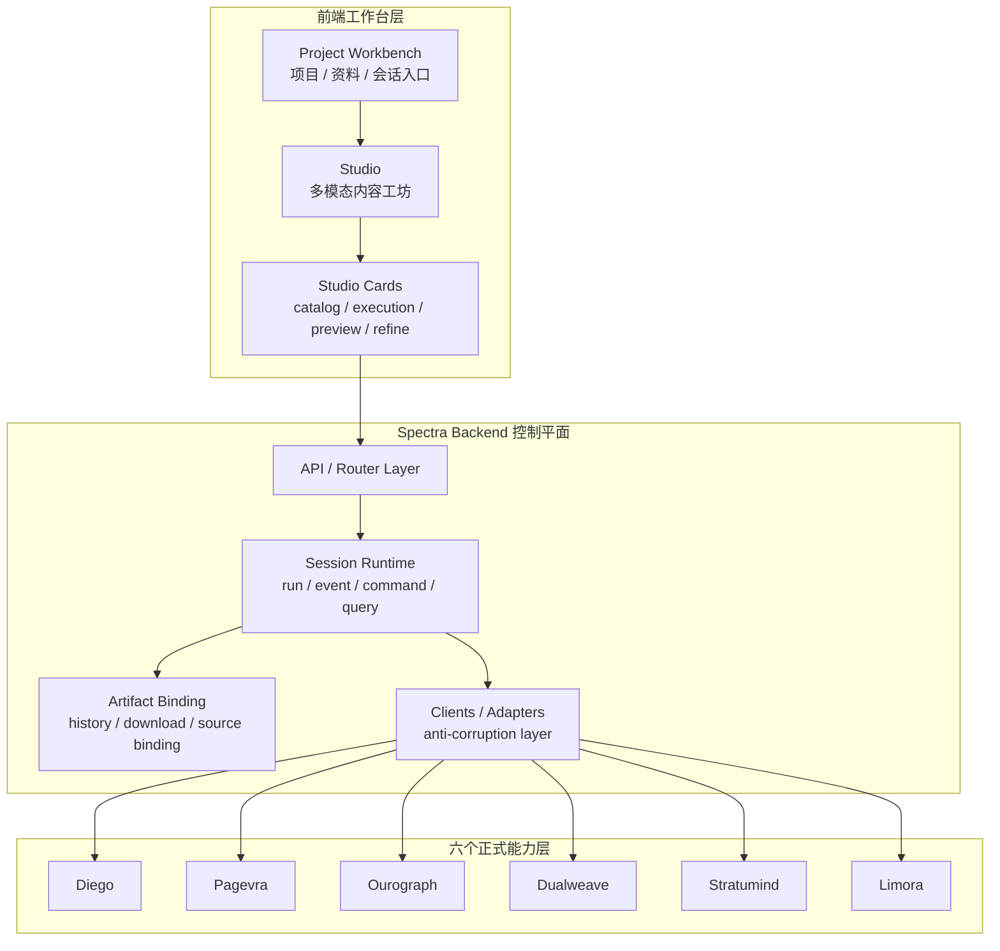
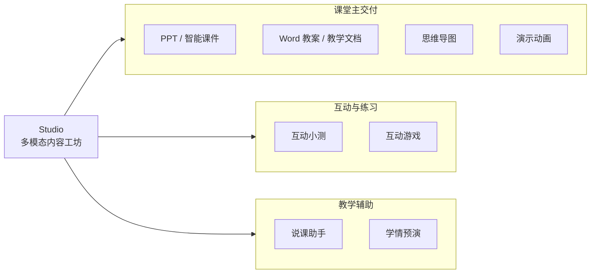
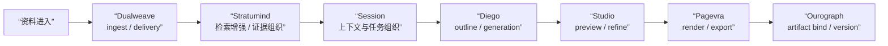
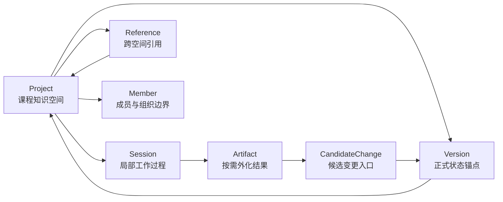
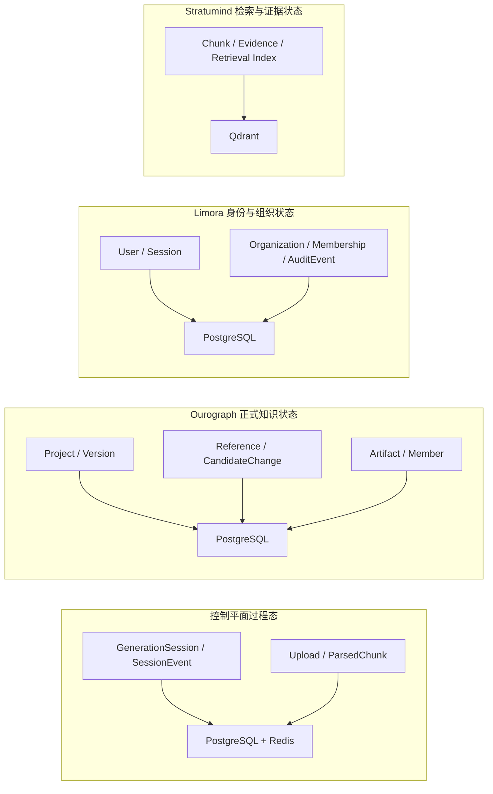
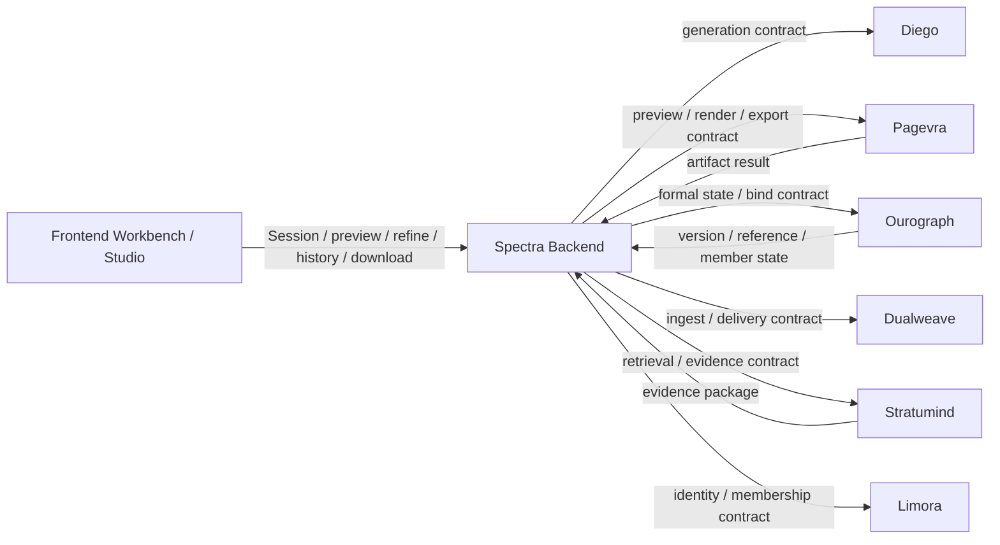
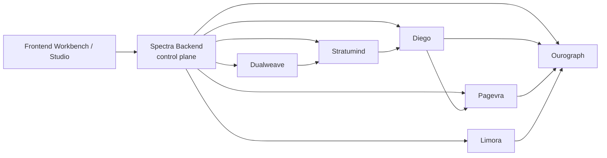

# 4. 系统设计

## 4.1 设计目标

`Spectra` 的系统设计核心逻辑在于：课程知识空间系统必须同时支撑教师一次真实备课行为的四类业务目标：

1. 教学内容生产；
2. 多模态成果外化；
3. 正式知识状态沉淀；
4. 后续复用、引用与持续演化。

本章说明当前系统如何同时满足以下四项设计判断：

- 系统本体是课程知识空间，导出文件为按需外化结果；
- `Studio` 是统一多模态内容工坊，围绕同一课程空间组织多类外化能力；
- `Spectra Backend` 是控制平面（Control Plane），负责工作流编排与契约整形；
- 六个正式能力层各自承接独立的权责边界，不替代系统本体。

## 4.2 系统本体与设计判断

系统设计的核心逻辑在于：`Spectra` 是围绕课程知识空间运作的课程知识系统。系统长期目标为沉淀、复用、引用和演化课程知识，因此不能采用”前端 + 大后端 + 导出文件”的传统架构形态。

系统长期维护的对象是 `Project` 所承载的课程知识空间，以及围绕它形成的 `Version`、`Reference`、`CandidateChange` 和 `Member` 关系。`PPT`、教案、导图、动画、互动内容、说课稿和学情预演都是知识空间的按需外化结果。

系统同时容纳过程态和正式态。`Session` 承接一次具体工作展开，负责组织会话、资料、任务、事件和生成过程；正式知识状态则由 `Project / Artifact / Version / Reference / CandidateChange / Member` 承接。两者若混为一层，系统将退化为一次性工具。

产品体验统一，内部边界清晰。教师看到的是统一工作台和 `Studio` 多模态内容工坊，内部则是控制平面和六个正式能力层协同运作。统一体验建立在清晰边界之上。

## 4.3 前端工作台与 Studio 产品面

`Spectra` 的前端产品面更接近一个课程知识工作台，教师在其中完成资料进入、会话推进、成果预览、修改、下载和后续沉淀。这里要成立的是同一个工作空间，而不是一组彼此脱节的工具页。

`Studio` 是这个工作台中最重要的产品面。它围绕同一课程知识空间组织起多模态内容工坊。当前真实产品面已经覆盖以下能力簇：

- `PPT / 智能课件`：负责课堂主展示内容的结构化生成与讲解节奏组织；
- `Word 教案 / 教学文档`：负责输出教案、讲稿、讲义和课堂资料，承接教师备课与交付材料；
- `思维导图`：负责提炼章节逻辑、概念层次和知识结构，帮助教师梳理课程骨架，也便于学生复习回看；
- `互动小测`：负责围绕当前知识点快速生成测验与答案解析，用于课堂即时理解检查；
- `互动游戏`：负责把课程知识转化为可交互的练习玩法和规则流程，提高参与度与练习动机；
- `演示动画`：负责把抽象过程、动态机制和步骤变化转化为可视化演示内容；
- `说课助手`：负责围绕课件或成果生成讲解提示、过渡语、板书要点与说课材料；
- `学情预演`：负责模拟课堂反馈、学生追问和理解偏差，帮助教师在授课前预判难点与应对策略。

这些能力共享同一套工作台契约：catalog、execution、preview、refine、history、download 与 source binding。系统交付的是一组围绕课程知识空间展开的多模态外化能力。`Studio` 的制度性意义正在于此：它把原本会散落成多个产品的能力，收束成同一工作台中的不同外化切面。

图 4-1 对应系统总体分层结构，用于说明产品面、控制平面和正式能力层如何被放入同一系统视野。

图 4-1 对应 `Spectra` 的真实结构：前端工作台层、控制平面层和六个正式能力层共同组成统一系统。用户看到统一产品，系统内部则保持 authority 分离。

图 4-2 进一步解释 `Studio` 为什么是系统级产品面。这里关注的不是能力项数量，而是同一课程知识空间如何同时承接课堂主交付、互动练习和教学辅助三类外化结果。

图 4-2 对应 `Studio` 的产品面组织方式：不同成果共同构成同一课程知识空间在不同教学场景中的外化切面。

## 4.4 Spectra Backend 控制平面

`Spectra Backend` 作为 workflow shell / orchestration kernel，统一承接产品主链的工作流编排职责，分为三类核心功能。

第一类是 `Session` 与会话编排。后端负责创建和推进 `Session`，管理 run、event、command、query，将用户操作、任务执行、中间状态和最终结果组织成可追踪的工作过程，保障状态机一致性。

第二类是 artifact binding 与结果整形。后端负责将生成、预览、导出和下载契约收束为统一产品语义，并将外化结果绑定回课程知识空间，确保数据流转的确定性。

第三类是权责边界集成（Authority Integration）。后端通过契约适配层（Adapter Layer）接入六个正式能力层，负责契约翻译、响应整形和统一产品语义组织，不重新定义各能力层的权责边界。

因此，`Spectra Backend` 的核心价值在于将主链组织成统一产品契约。它不是空心网关，因为它拥有会话、事件、任务、绑定和契约整形等真实职责；它也不是大一统后端，因为各能力层的权责边界已明确落在六个正式能力层中。

## 4.5 六个正式能力层如何承接系统

系统设计的核心逻辑在于：`Spectra` 本体和六个正式能力层共同构成异构系统。课程知识空间系统要长期成立，需要将生成、预览交付、正式状态、资料进入、检索证据和身份治理六类权责边界明确拆分，各能力层支持独立部署、水平扩展和服务解耦，避免退化为难以治理的单体架构。

这组权责边界同时定义了控制平面的边界：

- 控制平面不重新实现正式 PPT generation；
- 控制平面不恢复本地正式 render / export 链；
- 控制平面不重新定义 formal knowledge-state；
- 控制平面不把 retrieval 或 identity 重新做回本地逻辑。

六个正式能力层各自承担独立权责边界，与控制平面协同构成完整系统。`Spectra` 自身负责工作台、控制平面和运行底座；六个正式能力层分别承接生成、渲染、知识状态、资料进入、检索引证和身份治理。各部分合在一起，构成当前系统的真实工程形态。

| 系统层 | 核心职责 | 当前技术栈 | 工程特征 |
| --- | --- | --- | --- |
| `Spectra Frontend` | 统一工作台、`Studio` 多模态内容工坊、catalog / preview / refine 产品面 | Next.js + React + TypeScript + Tailwind + Radix + Zustand | 面向统一产品体验与多模态外化工作台 |
| `Spectra Backend` | `Session` 编排、event / command / query、artifact binding、权责边界集成 | FastAPI + Pydantic + Prisma async | 控制平面，负责契约整形与主链组织，支持水平扩展 |
| `数据与运行底座` | 持久化、缓存、队列、向量检索与容器化运行 | PostgreSQL + Redis + RQ + Qdrant + Docker Compose | 面向真实运行拓扑、异步执行与知识检索底座 |
| `Diego` | 课件 outline、生成、QA 与产物链 | Python + FastAPI，结合 Node / PptxGenJS 能力 | 独立部署，面向可管理生成链，支持服务解耦 |
| `Pagevra` | preview、render、`PPTX / DOCX` 标准导出 | Node + TypeScript + Mermaid + Playwright | 独立部署，面向高保真 compile-bundle、预览与正式交付统一 |
| `Ourograph` | `Project / Artifact / Version / Reference / CandidateChange / Member` 语义 | Kotlin + Ktor + jOOQ + Flyway + HikariCP + PostgreSQL | 独立部署，面向 formal knowledge-state 强 schema 内核，具备独立扩展能力 |
| `Dualweave` | ingest、delivery、replay、阶段状态与资料进入治理 | Go | 独立部署，面向上传编排、交付语义与 staged runtime |
| `Stratumind` | rewrite、planning、hybrid retrieval、rerank、evidence | Go retrieval core + Qdrant + Python late-interaction sidecar | 独立部署，面向 retrieval core、证据组织和 benchmark 驱动演进 |
| `Limora` | identity、session、organization、membership 权责边界 | TypeScript + Fastify + Better Auth + Prisma + PostgreSQL | 独立部署，面向身份边界、组织治理和可复用认证基础设施 |

该矩阵表明整套系统如何共同成立。六个正式能力层均支持独立部署与水平扩展，各层之间通过契约适配层（Adapter Layer）实现服务解耦。生成、渲染、知识状态、资料进入、检索引证和身份治理属于不同工程问题域，因此采用异构运行时、框架组合和工程路径，体现了高内聚、低耦合的架构设计原则。

## 4.6 三条核心主链

系统设计的核心逻辑在于：通过三条主链实现数据流转的确定性与状态机一致性，将资料、生成、交付、沉淀和演化纳入统一业务语言。

### 4.6.1 资料进入与证据组织链

第一条链保障资料进入内容生产的完整数据流转：

`资料进入 -> Dualweave ingest / delivery -> 标准化内容 -> Stratumind 检索增强 -> 证据组织 -> Session / Studio 生成主链`

该链路确保资料成为后续生成、引用和知识沉淀的真实来源，实现数据流转的确定性。

### 4.6.2 Session 生成与交付链

第二条链保障从意图理解到标准交付的状态机一致性：

`Session 建立 -> Diego outline -> 教师确认 -> Diego generation -> Studio preview / refine -> Pagevra export -> Ourograph bind`

该链路保证教师始终处在可参与、可确认、可修改的工作流中。生成结果进入 preview、交付和正式状态绑定的统一链路，确保状态机一致性。

图 4-3 展示该系统主链的完整数据流转。

图 4-3 展示从资料进入到正式知识状态回流的连续主链，将课程资料、检索证据、会话生成、多模态外化和正式沉淀纳入统一系统语言。

### 4.6.3 知识回流与演化链

第三条链保障外化结果沉淀为正式知识状态：

`Artifact -> CandidateChange -> Version -> Project -> Reference`

该链路确保成果在导出后继续进入课程知识空间，形成版本锚点，成为未来复用与引用的基础。系统交付的是课程知识资产，具备长期演化能力。

## 4.7 知识空间对象关系

系统主链能够成立，依赖的是一套稳定对象语言。

图 4-4 解释这套对象关系如何构成课程知识空间的本体。

图 4-4 把四个关键判断收进同一套对象关系里：

- `Project` 是课程知识空间，而不是普通文件夹；
- `Session` 是工作过程，不是正式状态；
- `Artifact` 是外化结果，不是系统本体；
- `Version / Reference / CandidateChange / Member` 共同让系统具备演化、复用、协作和治理能力。

也正因为对象关系是这样组织的，系统才不会在“生成结果”和“正式知识状态”之间断裂。

## 4.8 数据与状态设计（数据库设计）

系统设计的核心逻辑在于：围绕不同权责边界拆分数据与状态结构。课程知识空间系统同时存在过程态、正式态、身份态与检索态，各层数据与状态由对应的权威源独立管理。

从当前实现看，系统存在四层稳定的数据与状态分工：

| 数据与状态层 | 典型对象 | 主要存储 | 权威源 | 设计意义 |
| --- | --- | --- | --- | --- |
| 控制平面过程态 | `GenerationSession`、`SessionEvent`、`Upload`、`ParsedChunk`、任务与会话上下文 | PostgreSQL + Redis | `Spectra Backend` | 负责工作过程、事件流、队列执行和过程追踪，不冒充正式知识状态 |
| 正式知识状态 | `Project`、`ProjectVersion`、`ProjectReference`、`Artifact`、`CandidateChange`、`ProjectMember` | Ourograph PostgreSQL | `Ourograph` | 负责课程知识空间、版本锚点、引用关系、候选变更与成员边界 |
| 身份与组织状态 | `User`、`Session`、`Organization`、`Membership`、`AuditEvent` | Limora PostgreSQL | `Limora` | 负责身份、登录会话、组织容器与成员治理，不污染课程知识空间本体 |
| 检索与证据状态 | 向量索引、chunk evidence、检索结果组织 | Qdrant + retrieval cache | `Stratumind` | 负责 retrieval core、证据组织与可评测检索底座，不把检索状态硬塞进关系型主库 |

该分层表明，系统围绕不同权责边界将过程态、正式态、身份态和检索态拆分。课程知识空间要长期成立，需要将工作过程、正式知识、组织边界和证据索引分层管理。

图 4-5 展示系统的数据与状态拓扑。不同权威源拥有各自的数据与状态位置。

这套设计让“生产即沉淀，沉淀即交付”具备了真实落点。工作过程可以在控制平面里被追踪，正式知识状态由 `Ourograph` 承接，身份与组织边界由 `Limora` 承接，检索与证据组织由 `Stratumind` 承接。数据库设计因此不再只是存表，而是支撑不同 authority 同时成立的状态结构。

## 4.9 关键接口与契约总览

系统形成闭环的关键在于契约分布清晰。前端工作台、控制平面和六个正式能力层之间通过三类契约协同：

- `工作台契约`：前端工作台与 `Spectra Backend` 之间围绕 `Session`、catalog、preview、history、download 与 artifact binding 交互；
- `权责边界契约`：`Spectra Backend` 通过契约适配层（Adapter Layer）与 `Diego / Pagevra / Ourograph / Dualweave / Stratumind / Limora` 分别围绕 generation、render/export、formal state、ingest、retrieval 和 identity 消费正式能力；
- `结果回流契约`：preview、export、artifact bind、candidate change、version update 组成结果回到知识空间的正式链路，保障数据流转的确定性。

图 4-6 对应关键接口与契约总览。重点是系统靠什么连接起来，而不是每个接口参数长什么样。

这张图说明：`Spectra Backend` 统一承接工作台契约、authority 契约和结果回流契约。正因为契约分布清楚，前端工作台才能面对统一产品面，正式能力层才能保持各自 authority。

## 4.10 运行拓扑与当前实现现实

`Spectra` 当前并不是停留在文档规划层面。运行现实已经表现为：主系统作为统一控制平面，六个正式能力层同时接入并承担各自 authority。这一点很重要，因为只有运行现实与架构判断一致，系统设计章才不会退化成漂亮但空心的图解。

图 4-7 用最小拓扑表达当前协作现实。

图 4-7 对应的是当前系统的真实协作拓扑。它说明这套系统已经形成稳定协同关系和可交付运行结构。

当前实现可以概括为三点：

1. 六个正式能力层已进入主系统运行拓扑，支持独立部署与水平扩展；
2. 主系统通过契约适配层（Adapter Layer）消费各能力层，保障服务解耦；
3. 前端 `Studio` 产品面、后端控制平面和正式能力层之间已形成稳定协作关系。

系统具备四类交付成熟度信号：

第一，系统为容器化协同运行的生产级系统。前端工作台、控制平面、数据库、缓存、向量库、worker 与六个正式能力层已形成明确的运行拓扑。

第二，各能力层之间的关系由正式交付链组织。资料进入、检索增强、生成、预览、导出、状态绑定和后续沉淀已进入同一业务主线，数据流转具备确定性。

第三，数据与运行底座已进入正式结构。数据库、缓存、向量检索和异步执行共同支撑主链，具备持续协作、失败表达和结果交付所需的运行基础。

第四，运行拓扑支持从演示、试点到组织级交付的渐进扩展，具备良好的可伸缩性。

## 4.11 为什么这套设计更适合长期交付

与传统”前端 + 大后端 + 模型调用 + 文件导出”的结构相比，本系统设计更适合长期交付，原因在于其架构形态更贴合教学内容生产的真实对象和业务链路。

第一，系统本体清晰。课程知识空间与引用关系是长期维护对象，导出文件为按需外化结果。

第二，产品面完整。`Studio` 承接多模态内容工坊，围绕同一课程空间组织多类外化能力。

第三，主链完整。资料进入、检索增强、生成、预览、交付、沉淀和回流属于同一业务闭环，数据流转具备确定性。

第四，边界可信。六个正式能力层各自承接独立权责边界，控制平面专注工作流编排，系统具备良好的可解释性、可治理性和持续演进能力。

第五，商业交付路径成立。采购方购买的是可持续生产、沉淀、治理和放大课程知识资产的系统。

## 4.12 本章结论

`Spectra` 系统设计的核心逻辑在于：让课程知识空间、多模态内容工坊、正式能力边界和知识回流主链在同一系统里同时成立。

系统本体为课程知识空间系统；六个正式能力层各自承接独立权责边界，为系统提供可信的生成、交付、状态、资料进入、检索和身份边界支撑。各能力层支持独立部署、水平扩展和服务解耦，通过契约适配层（Adapter Layer）与控制平面协同，实现数据流转的确定性与状态机一致性。

该架构设计使 `Spectra` 具备商业级课程知识空间系统的结构合法性。
