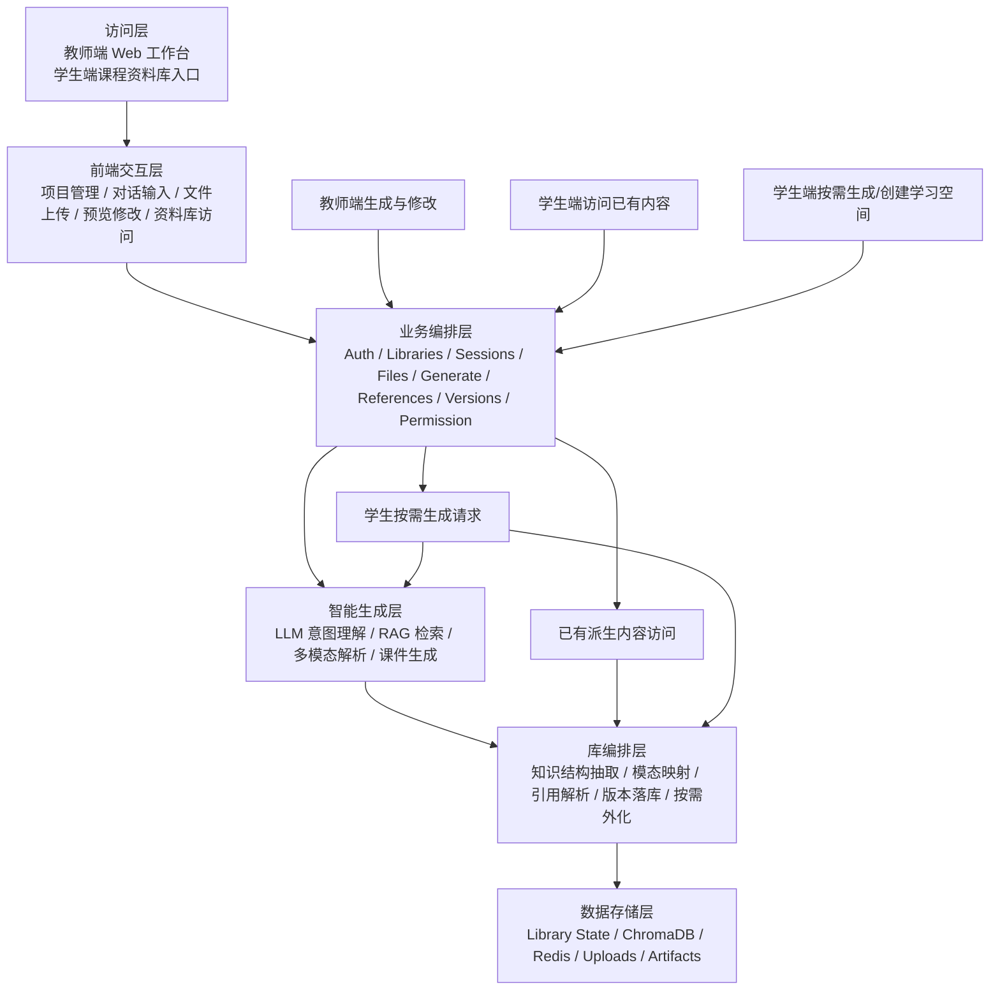
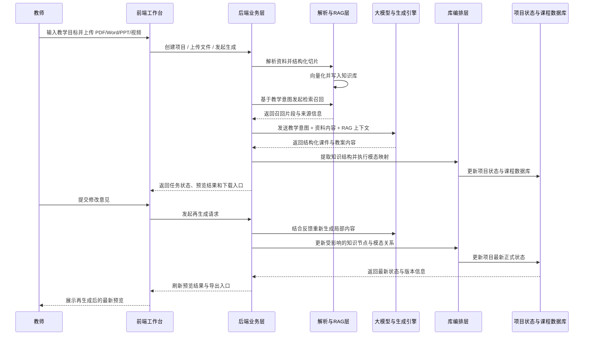
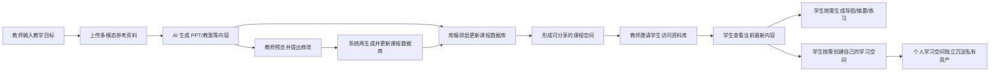

# 4. 系统架构设计

## 4.1 架构设计原则

`Spectra` 的系统架构围绕一个核心原则展开：教师的正常备课行为，必须能够被系统自动转换为课程知识资产。也就是说，架构设计不仅要支持“生成课件”，还要支持“在生成过程中完成知识沉淀、模态映射和资料库分发准备”。

从系统本体上说，平台真正维护的不是 `PPT` 文件集合，而是“库”。库在实现层可映射为 `project`，但其产品语义是一个课程数据库节点，内含知识结构、资源索引、权限设置、生成入口和跨库引用关系。

因此，系统架构遵循以下五项原则：

1. 生成与沉淀一体化：课件生成链路与课程资料库沉淀链路同步发生。
2. 多模态共用一套知识逻辑：PPT、教案、导图、讲义、动画和网页内容应来源于同一套底层知识结构。
3. 修改驱动知识源同步：教师修改一个知识点时，课程数据库同步更新，相关模态内容在访问或重生成时按需刷新。
4. 分享建立在资产化基础上：学生访问的不是一次性文件，而是持续更新的课程资料库。
5. 库与导出物分层：正式长期沉淀的是库状态，`PPTX`、`DOCX`、导图和网页只是基于某个库版本的外化结果。

从架构视角看，`Spectra` 对多模态的理解同样不是并列堆放多个生成结果，而是先形成统一课程数据库，再由数据库向不同界面、文档和互动场景外化内容。因此，课程资料库不是流程末端的归档仓库，而是连接生成、更新和分发的核心中枢。

## 4.2 整体架构设计思路

`Spectra` 采用面向教学场景的分层式架构，将复杂的多模态理解、知识检索、文档生成和资产沉淀能力拆解为可协同工作的模块。整体上可概括为六个核心层次：

1. 访问层：教师端与学生端入口。
2. 前端交互层：项目管理、对话输入、上传、预览、修改与资料库访问界面。
3. 业务编排层：鉴权、库、会话、文件、生成、引用、版本、协作和权限管理。
4. 智能生成层：大模型调用、RAG 检索、资料解析与课件生成。
5. 库编排层：知识结构抽取、模态映射、引用解析、版本落库与按需外化。
6. 数据存储层：关系型数据、向量数据、上传文件和导出物存储。

相比传统“生成系统 + 文件下载”的结构，`Spectra` 多出了一层专门的“库编排层”。这一层正是无感化资产沉淀成立的关键，也使课程资料库从结果存储位置升级为系统中的统一生成源。

## 4.3 整体架构图

下图展示了 `Spectra` 的六层系统架构，以及“教师端生成”“学生端访问”“个人学习空间创建/按需生成”三条核心业务路径：

## 4.4 分层架构说明

### 4.4.1 访问层

系统面向教师用户提供 Web 工作台，同时面向学生提供课程资料库访问入口。教师完成内容生产与修改，学生完成资料访问与再利用。

### 4.4.2 前端交互层

前端基于 `Next.js 15 + TypeScript` 构建，负责承载以下交互：

- 注册登录
- 项目创建与列表
- 对话输入与状态反馈
- 文件上传与资料管理
- 生成任务进度展示
- 预览、修改和下载
- 课程资料库分享与访问入口

### 4.4.3 业务编排层

后端基于 `FastAPI` 实现，承担以下职责：

- 权限校验与统一 API 暴露
- 项目和文件元数据管理
- RAG 查询与结果组装
- 生成任务创建、状态追踪和结果分发
- 预览修改请求的接入与转发
- 课程资料库权限控制与邀请关系管理
- `project` 级数据边界与 `session` 级工作上下文隔离

### 4.4.4 智能生成层

这一层负责完成“理解、检索、生成”三项核心能力：

- 大模型推理：负责意图理解、内容生成和增量修改
- 解析链路：负责 PDF、Word、PPT、视频等资料的结构化提取
- RAG 链路：负责分块、向量化、召回与来源追踪
- 文档生成引擎：负责将结构化内容转换为 `PPTX` 与 `DOCX`

### 4.4.5 库编排层

这一层是 `Spectra` 与普通课件生成系统最关键的结构差异，其职责包括：

- 在课件生成时抽取知识结构和页面关系
- 将教师生成结果写回课程数据库
- 将同一套知识逻辑映射为导图、讲义、动画和资料索引
- 为学生按需生成个人结果或创建个人学习空间提供统一数据源
- 维护项目引用关系、引用优先级与上游更新感知
- 在教师修改后同步更新课程数据库与相关模态内容
- 为教师分享、学生访问和多人协作准备统一资源入口
- 维护正式版本号、导出物来源版本和候选变更合入后的状态推进
- 对话与生成结果保留引用与溯源信息，供用户验证来源

可以说，智能生成层解决“生成内容”，库编排层解决“让内容变成长期可复用的课程资产”。二者联动后，课程资料库既是沉淀结果，也是多模态内容持续外化的统一来源。上游维护者维护权威空间（常见为教师课程空间），学生默认只读访问；需要持续沉淀个人资料时，再创建自己的学习空间。权威关系可层级传递，派生空间对其下游即为权威。多人协作者则通过独立会话提交候选变更，由空间维护者审核合入。

### 4.4.6 数据存储层

系统主要使用：

- `PostgreSQL`：存储项目、用户、会话、任务、权限、引用关系、版本和资源元数据
- `ChromaDB`：存储向量化后的知识切片
- 本地文件目录：存储上传资料和导出物
- `Redis`：支撑异步任务队列

## 4.5 核心数据流

### 4.5.1 从教师输入到课件生成

1. 教师输入教学意图并上传资料。
2. 系统解析资料，提取可检索内容。
3. 检索模块从知识库召回相关片段。
4. 业务层将教师意图、资料信息和 RAG 结果融合为指令集。
5. 生成引擎输出 PPT 和教案草稿。
6. 库编排层同步提取知识结构并构建课程资产。
7. 前端展示预览结果并接受修改指令。

### 4.5.2 多模态数据流时序图

### 4.5.3 从生成结果到课程资料库分享

1. 系统将上游维护者生成结果中的知识结构、案例关系和资源索引写入同一课程数据库。
2. 上游维护者对外分享的是课程资料库访问入口，而不是单个静态文件。
3. 学生在被邀请并获得授权后，可以访问当前上游空间的最新权威内容。
4. 学生若仅查看或临时生成导图、摘要，不会写入上游权威空间。
5. 学生若需要持续整理个人资料，可基于上游空间创建自己的学习空间。
6. 上游维护者继续修改和再生成时，课程数据库同步更新，无需额外上传和重复转发。
7. 已有导出物不会被强制覆盖，只记录“来自哪个库、基于哪个版本”。
8. 默认黑盒：下游访问不穿透上游来源链；公开库可透明访问来源。

这里的关键不只是“多个结果放到同一空间”，而是“多个结果共享同一课程知识结构”。因此，课程资料库承担的不是简单归档职责，而是统一组织和持续外化课程内容的中枢职责。学生侧在未创建自己的学习空间之前始终只作为访问者存在；创建学习空间后，其个人资产也不会直接写回上游权威空间。

### 4.5.4 无感化资产沉淀机制

1. 教师发起 PPT 或教案生成时，系统同步抽取知识结构、页面关系和素材索引。
2. 库编排层将这些结构信息自动映射为讲义节点、资源索引和资料库条目，并在需要时驱动导图、摘要等内容按需外化。
3. 整个过程不要求教师额外执行“上传到资料库”或“转发到共享平台”的操作。
4. 教师感知到的是正常备课流程，系统完成的是课程资产自动沉淀。

### 4.5.5 课程资料库分享闭环图

### 4.5.6 从反馈到再生成

1. 教师在预览界面提出修改意见。
2. 系统识别修改范围和修改类型。
3. 重新检索相关上下文并保留未修改部分。
4. 触发局部或整体再生成。
5. 库编排层同步更新受影响的讲义节点、资料条目与引用关系。
6. 形成新状态供教师比较与下载，同时学生端在下次访问或重新生成时获取最新内容。

### 4.5.7 引用与协作机制

1. 一个项目可以拥有一个主基底引用和多个辅助引用。
2. 引用支持 `follow` 与 `pinned` 两种模式，并要求整体引用网络满足 `DAG` 约束。
3. `follow` 模式下，底层知识源自动跟踪上游最新合法状态，导图、摘要、PPT 等表现层结果按需刷新。
4. 多源冲突时遵循“本地显式内容 > 主基底 > 辅助引用顺序 > 系统默认模板”的优先级。
5. 多人协作围绕同一项目进行，但每位协作者使用独立 `session` 工作。
6. 协作者的生成结果先形成候选变更，再由项目维护者审核合入正式状态。

## 4.6 架构设计优势

1. 业务与 AI 能力解耦，便于替换模型和解析器。
2. 库编排层独立建模，使“无感沉淀”成为架构级能力，而不是业务附加动作。
3. 异步任务设计适合处理生成、解析和同步更新等耗时流程。
4. 分层架构利于逐步增强多模态处理深度，而不破坏主流程。
5. 为课程资料库、分享协作和学生端访问提供了完整支撑。
6. 以 `project + session` 作为内部主语义，对外以“库”统一产品表达，既满足当前教学场景，也保留跨场景扩展能力。
