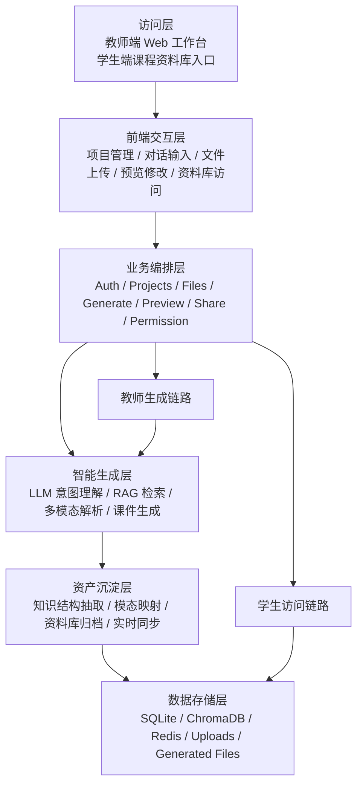
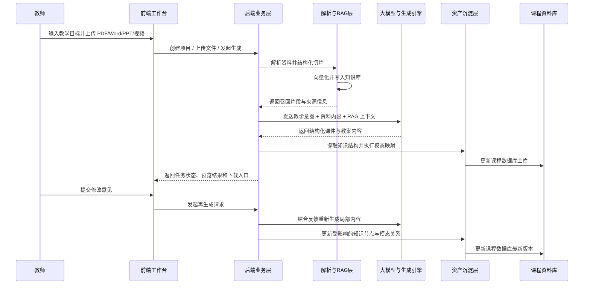
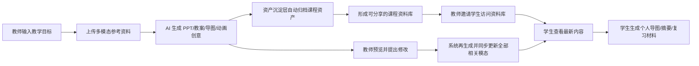

# 4. 系统架构设计

## 4.1 架构设计原则

`Spectra` 的系统架构围绕一个核心原则展开：教师的正常备课行为，必须能够被系统自动转换为课程知识资产。也就是说，架构设计不仅要支持“生成课件”，还要支持“在生成过程中完成知识沉淀、模态映射和资料库分发准备”。

因此，系统架构遵循以下四项原则：

1. 生成与沉淀一体化：课件生成链路与课程资料库沉淀链路同步发生。
2. 多模态共用一套知识逻辑：PPT、教案、导图、讲义、动画和网页内容应来源于同一套底层知识结构。
3. 修改驱动全模态同步：教师修改一个知识点时，相关模态内容同步更新。
4. 分享建立在资产化基础上：学生访问的不是一次性文件，而是持续更新的课程资料库。

从架构视角看，`Spectra` 对多模态的理解同样不是并列堆放多个生成结果，而是先形成统一课程数据库，再由数据库向不同界面、文档和互动场景外化内容。因此，课程资料库不是流程末端的归档仓库，而是连接生成、更新和分发的核心中枢。

## 4.2 整体架构设计思路

`Spectra` 采用面向教学场景的分层式架构，将复杂的多模态理解、知识检索、文档生成和资产沉淀能力拆解为可协同工作的模块。整体上可概括为六个核心层次：

1. 访问层：教师端与学生端入口。
2. 前端交互层：项目管理、对话输入、上传、预览、修改与资料库访问界面。
3. 业务编排层：鉴权、项目、文件、生成、预览、分享和权限管理。
4. 智能生成层：大模型调用、RAG 检索、资料解析与课件生成。
5. 资产沉淀层：知识结构抽取、模态映射、资料库归档与更新同步。
6. 数据存储层：关系型数据、向量数据、上传文件和生成成果存储。

相比传统“生成系统 + 文件下载”的结构，`Spectra` 多出了一层专门的“资产沉淀层”。这一层正是无感化资产沉淀成立的关键，也使课程资料库从结果存储位置升级为系统中的统一生成源。

## 4.3 整体架构图

下图展示了 `Spectra` 的六层系统架构，以及“教师端生成”和“学生端访问课程资料库”两条核心业务路径：

## 4.4 分层架构说明

### 4.4.1 访问层

系统面向教师用户提供 Web 工作台，同时面向学生提供课程资料库访问入口。教师完成内容生产与修改，学生完成资料访问与再利用。

### 4.4.2 前端交互层

前端基于 `Next.js 15 + TypeScript` 构建，负责承载以下交互：

- 注册登录
- 项目创建与列表
- 对话输入与状态反馈
- 文件上传与资料管理
- 生成任务进度展示
- 预览、修改和下载
- 课程资料库分享与访问入口

### 4.4.3 业务编排层

后端基于 `FastAPI` 实现，承担以下职责：

- 权限校验与统一 API 暴露
- 项目和文件元数据管理
- RAG 查询与结果组装
- 生成任务创建、状态追踪和结果分发
- 预览修改请求的接入与转发
- 课程资料库权限控制与邀请关系管理

### 4.4.4 智能生成层

这一层负责完成“理解、检索、生成”三项核心能力：

- 大模型推理：负责意图理解、内容生成和增量修改
- 解析链路：负责 PDF、Word、PPT、视频等资料的结构化提取
- RAG 链路：负责分块、向量化、召回与来源追踪
- 文档生成引擎：负责将结构化内容转换为 `PPTX` 与 `DOCX`

### 4.4.5 资产沉淀层

这一层是 `Spectra` 与普通课件生成系统最关键的结构差异，其职责包括：

- 在课件生成时抽取知识结构和页面关系
- 将教师生成结果写回课程数据库主库
- 将同一套知识逻辑映射为导图、讲义、动画和资料索引
- 为学生生成隔离分支资产提供统一数据源
- 在教师修改后同步更新主数据库与相关模态内容
- 为教师分享与学生访问准备统一的资源入口

可以说，智能生成层解决“生成内容”，资产沉淀层解决“让内容变成长期可复用的课程资产”。二者联动后，课程资料库既是沉淀结果，也是多模态内容同步更新与持续外化的统一来源。教师维护权威主库，学生围绕主库生成隔离分支资产。

### 4.4.6 数据存储层

系统主要使用：

- `SQLite`：存储项目、用户、任务、权限和资源元数据
- `ChromaDB`：存储向量化后的知识切片
- 本地文件目录：存储上传资料和生成结果
- `Redis`：支撑异步任务队列

## 4.5 核心数据流

### 4.5.1 从教师输入到课件生成

1. 教师输入教学意图并上传资料。
2. 系统解析资料，提取可检索内容。
3. 检索模块从知识库召回相关片段。
4. 业务层将教师意图、资料信息和 RAG 结果融合为指令集。
5. 生成引擎输出 PPT 和教案草稿。
6. 资产沉淀层同步提取知识结构并构建课程资产。
7. 前端展示预览结果并接受修改指令。

### 4.5.2 多模态数据流时序图

### 4.5.3 从生成结果到课程资料库分享

1. 系统将教师生成结果中的知识结构、案例关系和资源索引写入同一课程数据库。
2. 教师对外分享的是课程资料库访问入口，而不是单个静态文件。
3. 学生在被邀请并获得授权后，可以访问当前课程的最新权威内容。
4. 教师继续修改和再生成时，主数据库同步更新，无需额外上传和重复转发。

这里的关键不只是“多个结果放到同一空间”，而是“多个结果共享同一课程知识结构”。因此，课程资料库承担的不是简单归档职责，而是统一组织和持续外化课程内容的中枢职责。学生侧内容则作为独立分支资产存在，不直接写回教师主库。

### 4.5.4 无感化资产沉淀机制

1. 教师发起 PPT 或教案生成时，系统同步抽取知识结构、页面关系和素材索引。
2. 资产沉淀层将这些结构信息自动映射为思维导图、讲义节点、资源索引和资料库条目。
3. 整个过程不要求教师额外执行“上传到资料库”或“转发到共享平台”的操作。
4. 教师感知到的是正常备课流程，系统完成的是课程资产自动沉淀。

### 4.5.5 课程资料库分享闭环图

### 4.5.6 从反馈到再生成

1. 教师在预览界面提出修改意见。
2. 系统识别修改范围和修改类型。
3. 重新检索相关上下文并保留未修改部分。
4. 触发局部或整体再生成。
5. 资产沉淀层同步更新受影响的导图、讲义节点和资料条目。
6. 形成新版本供教师比较与下载，同时学生端获取最新内容。

## 4.6 架构设计优势

1. 业务与 AI 能力解耦，便于替换模型和解析器。
2. 资产沉淀层独立建模，使“无感沉淀”成为架构级能力，而不是业务附加动作。
3. 异步任务设计适合处理生成、解析和同步更新等耗时流程。
4. 分层架构利于逐步增强多模态处理深度，而不破坏主流程。
5. 为课程资料库、分享协作和学生端访问提供了完整支撑。
