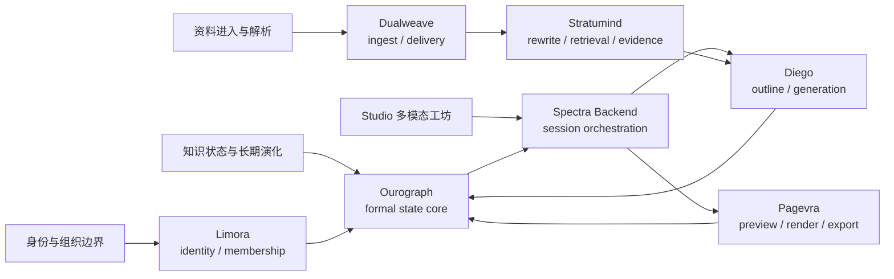
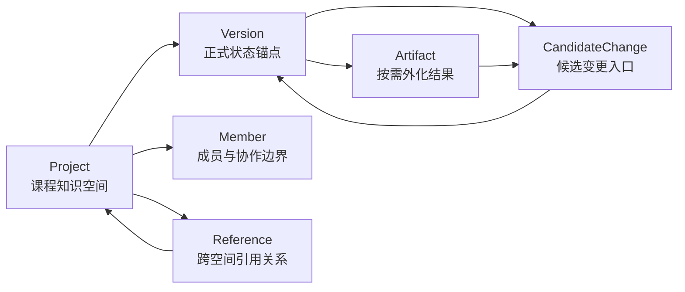
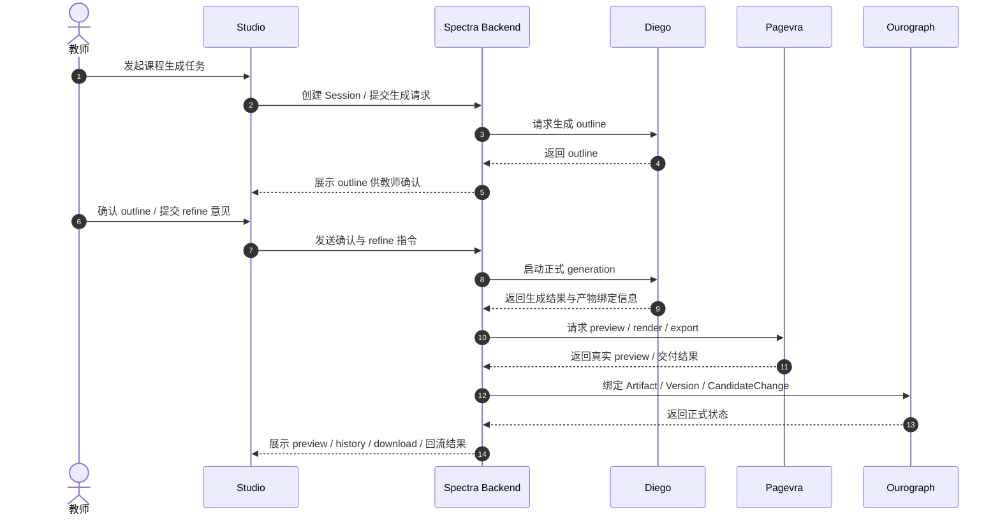
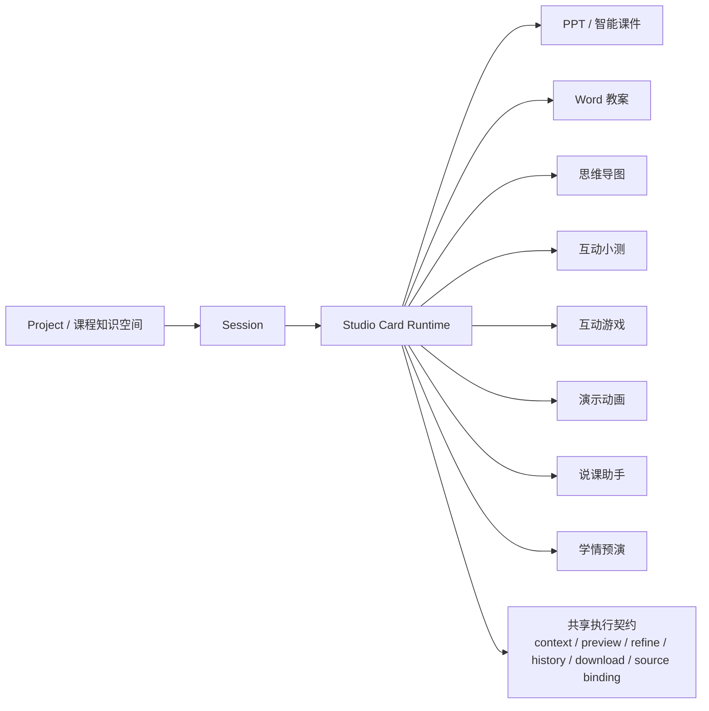
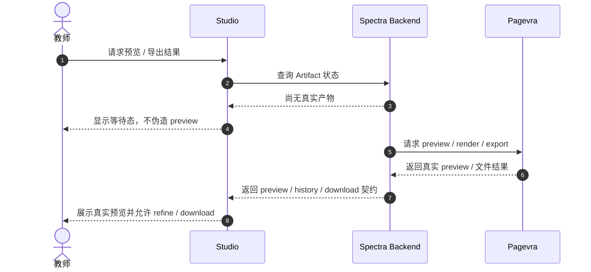
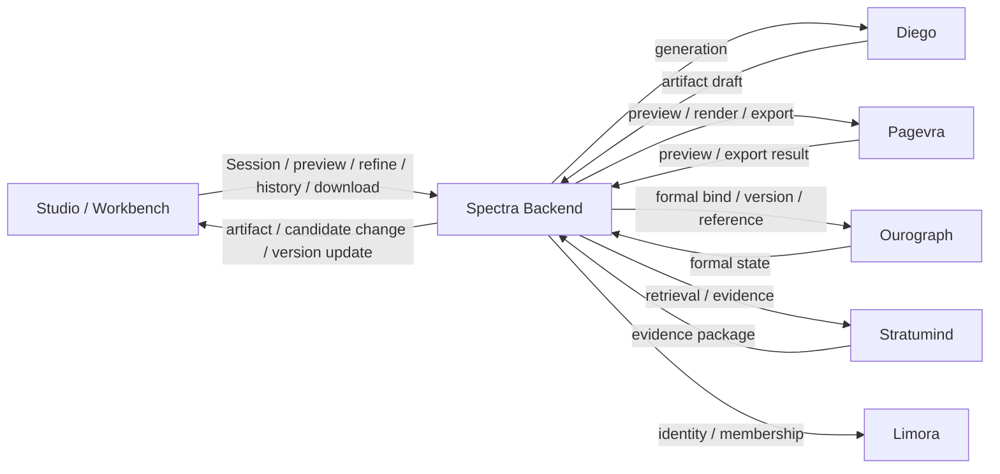
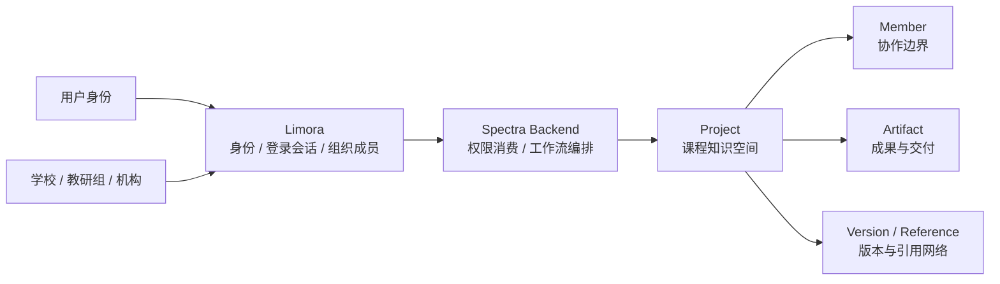
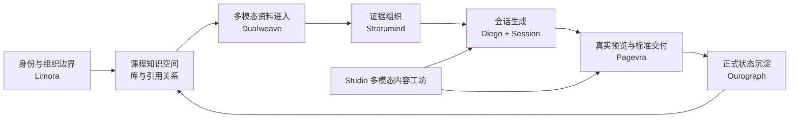

# 5. 关键技术与实现

## 5.1 关键技术总体架构

第 4 章已说明系统架构形态、分层逻辑与主链设计。本章旨在详述系统底座的实现细节：

**为实现课程知识空间系统的稳定交付与效果验证，系统解决了五类核心技术问题，并通过相应的技术组合实现。**

本章按”能力目标与技术实现”组织，围绕五组关键能力展开：

1. 课程知识的正式状态管理、版本锚点与长期演化能力；
2. 教师通过 `Studio` 实现可管理、可修改、可回流的多模态内容工坊；
3. 预览、渲染与标准交付的统一结果链；
4. 多模态资料进入、检索增强与证据组织的稳定底座；
5. 身份、组织与成员边界的独立管理，支撑系统长期产品化。

本章说明：成熟模型、检索方法、远端服务、标准导出链和正式状态能力，已通过标准化通信协议与数据交换契约组织成可控、可解释、可评估的系统。

图 5-1 回答的是：每一组产品能力背后，都有一条清晰的技术承接链。

## 5.2 知识空间本体与正式状态管理

### 5.2.1 业务问题

传统课件系统仅能生成结果，无法将结果纳入正式知识体系。文件导出后，系统失去对后续复用、追踪、引用和演化的管理能力，导致：

- 课件、教案、导图、动画等成果彼此割裂；
- 修改过程无法形成正式版本与历史锚点；
- 课程内容无法沉淀为可复用、可引用、可协作、可演化的长期资产。

### 5.2.2 产品能力

系统以”知识空间”为本体，通过正式状态机制支撑以下核心对象的生命周期管理：

- `Project`：长期存在的课程知识空间；
- `Session`：围绕一次备课、修改或生成展开的局部工作过程；
- `Artifact`：PPT、Word 教案、导图、动画、互动内容等外化结果；
- `Version`：正式状态锚点；
- `Reference`：知识空间之间的引用关系；
- `CandidateChange`：进入正式演化前的候选变更入口；
- `Member`：参与组织、协作与治理的成员语义。

该对象语言使”生产即沉淀，沉淀即交付”具备可实现、可绑定、可演化的正式状态结构。

### 5.2.3 技术实现

- `Ourograph`：正式知识状态权威源，负责 `Project / Artifact / Version / Reference / CandidateChange / Member` 的权责边界管理；
- `Spectra Backend`：作为消费方和控制平面，负责会话编排、artifact 绑定、下载契约与状态整形；
- 课程知识空间对象语言与版本演化机制：支撑知识沉淀、外化绑定与后续复用。

通过解耦权责边界，`Ourograph` 使知识空间、版本与引用关系拥有独立的权威源，确保了系统的可维护性与演进能力。

### 5.2.4 核心机制

系统通过以下机制将外化结果收束回知识空间：

- 以 `Project` 作为课程数据库的长期容器；
- 以 `Version` 锚定正式状态，支持版本回溯；
- 以 `CandidateChange` 承接修改、优化和再生成前的候选状态；
- 以 `Reference` 形成空间之间的引用关系和知识网络；
- 以 `Member` 维护协作、组织治理和权限边界。

图 5-2 对应外化结果回到正式知识状态的路径。

### 5.2.5 实现效果

通过正式状态机制，系统实现了 PPT、Word 教案、导图、动画和互动内容的统一知识空间收束。该技术实现支撑可持续积累的课程数据库能力。

## 5.3 Studio 多模态内容工坊与生成主链

### 5.3.1 业务问题

传统教学生成工具仅聚焦单一产物生成。教师的真实工作流程包括：

- 教学意图表达与多轮澄清；
- PPT 初稿生成；
- Word 教案生成；
- 导图、动画、互动内容等多模态外化；
- 预览、修改、追踪与再次生成。

单次黑箱生成无法支撑真实教师工作流。系统需要将生成能力纳入可管理的会话和可回流的结果链。

### 5.3.2 产品能力

系统通过统一生成链和会话链组织以下能力簇：

- `PPT`：课堂主展示内容和讲解节奏；
- `Word 教案`：教案、讲稿、讲义等教学文档；
- `互动小测`：即时测验与理解检查内容；
- `互动游戏`：课堂互动玩法与练习流程；
- `思维导图`：知识结构与章节关系图谱；
- `演示动画`：抽象动态过程的可视化表达；
- `说课助手`：讲解提示、说课稿与过渡表达支撑；
- `学情预演`：针对课堂反馈与学生提问的预演辅助。

各能力共享同一课程知识空间，通过标准化通信协议实现会话、上下文、产物绑定和回流逻辑的一致性。

### 5.3.3 技术实现

- `Spectra Backend`：承担 `Session` 生命周期管理、事件流、任务编排、状态协调和 artifact 绑定；
- `Diego`：承担课件与演示文稿主生成权威源，负责 outline 与 generation 主链；
- `Studio` 前端卡片能力簇：将不同产物统一组织在同一工作台中；
- 会话主链与 refine 契约：使生成过程可管理、可追踪。

设计逻辑在于：将生成能力纳入可管理工作流，教师可确认方向、查看中间状态、提交 refine，结果回流至正式系统。

### 5.3.4 核心机制

正式生成主链围绕 `Session` 组织成可管理闭环：

1. 教师在工作台中发起会话；
2. `Spectra Backend` 建立 `Session`、组织上下文与任务状态；
3. `Diego` 先形成课件大纲；
4. 教师确认 outline 后进入正式生成；
5. 生成结果进入 `Studio` 的真实 preview/refine 链；
6. 结果经由交付层和知识状态层完成绑定与沉淀。

图 5-3 对应可确认、可修改、可回流的会话闭环。

图 5-4 对应由同一课程知识空间、同一会话主链和同一结果契约共同驱动的卡片执行体系。

图 5-4 的重点是：`Studio` 的多模态能力由同一课程知识空间、`Session` 和共享执行契约共同驱动。

### 5.3.5 当前结果

当前系统已经形成真实的多模态内容工坊。`Studio` 承接多种卡片能力，`Spectra Backend` 组织会话与状态，`Diego` 承担主生成 authority。这组技术让系统从单产物工具升级为围绕课程知识空间运作的内容生产平台。

## 5.4 预览、渲染与标准交付

### 5.4.1 要解决的业务问题

很多系统的问题，在于预览链和正式交付链根本不是一回事。前端展示的是临时结构，导出的却是另一套结果；或者为了让界面看起来顺畅，前端直接伪造占位内容，把“像是成功”误当成“已经成功”。

对于商业级系统，这种做法不可接受。因为真正可交付的系统，必须保证：

- 预览结果与正式交付结果是一条链；
- 前端不制造假产物；
- 用户修改的是正式能力链上的真实产物，而不是前端自编的示意内容。

### 5.4.2 对应的产品能力

本项目的预览与交付能力主要覆盖：

- `PPT` 的 preview、标准导出与历史追踪；
- `Word 教案` 的 preview 与下载；
- 导图、动画、互动内容等非 PPT 产物的真实 preview contract；
- history、download、artifact binding 等正式交付语义。

用户看到的因此不只是“界面效果”，而是真正来自正式能力层的可交付结果。这一节讨论的重点，就是这条结果链如何被做实。

### 5.4.3 采用的微服务与关键技术

这一能力主要由以下技术组合承接：

- `Pagevra`：负责 preview、render、`PPTX` / `DOCX` 等标准导出 authority；
- `Spectra Backend`：负责响应整形、artifact 下载绑定和正式交付链的统一契约；
- 前端 preview contract：确保所有 preview 都有真实后端产物支撑。

`Pagevra` 的价值，在于把展示和交付统一到同一能力层，避免系统出现“前端可看、实际不可交付”的断裂。没有这一步，产品体验就会一直停留在演示级别。

### 5.4.4 核心机制

系统在预览与交付上坚持一个关键产品原则：

**前端不提供假预览，必须等待后端真实产物。**

这条原则已经在当前前端产品面中落实到非 `PPT` 产物上：当后端尚未返回真实内容时，前端只展示等待态。只有当正式产物返回后，系统才允许用户执行 preview、refine、history 和 download。

图 5-5 对应真实 preview / export 必须来自同一条交付链。

### 5.4.5 当前结果

系统当前已经把 `PPT`、`Word` 以及部分非 `PPT` 产物纳入统一的 preview / render / export 结果链。这组技术让系统具备了真正可交付的约束，并进入正式交付语义。

## 5.5 关键接口与契约实现

### 5.5.1 业务问题

系统各层之间若缺乏标准化通信协议与数据交换契约，将出现三类典型问题：

- 前端工作台与正式能力层之间只能靠临时字段拼接；
- preview、history、download、bind 变成彼此割裂的局部功能；
- 过程数据、正式状态和交付结果无法在主链中持续回流。

### 5.5.2 产品能力

当前核心标准化通信协议与数据交换契约包括：

- `Session` 创建、推进和事件追踪；
- `preview / refine / history / download` 结果契约；
- `Artifact / CandidateChange / Version` 绑定契约；
- `identity / membership` 权限消费契约；
- retrieval evidence 回接 generation 的证据契约。

该组契约将 `Studio` 产品面、控制平面和正式能力层收束为同一套工作语言，实现跨语言（Polyglot）环境下的强一致性协同。

### 5.5.3 技术实现

该层由以下组合共同承接：

- `Spectra Backend`：统一承接 `Session` 生命周期管理、事件流、结果整形和 artifact binding；
- `Diego`：提供 outline / generation 主结果契约；
- `Pagevra`：提供 preview / render / export 正式交付契约；
- `Ourograph`：提供 formal state、version、reference、candidate change 契约；
- `Stratumind`：提供 retrieval / evidence package 契约；
- `Limora`：提供 identity / session / organization / membership 契约。

设计逻辑在于：通过标准化通信协议明确各契约的同步/异步边界，确保跨语言环境下的强一致性协同。

### 5.5.4 核心机制

主链契约实现分为四层：

1. `工作台契约`：前端围绕 `Session`、catalog、preview、history、download 发起统一请求；
2. `控制平面契约`：`Spectra Backend` 负责 run / event / command / query 编排和结果整形；
3. `权责边界契约`：`Diego / Pagevra / Ourograph / Stratumind / Limora` 各自承接正式能力结果；
4. `回流契约`：生成结果经 preview / export / bind / candidate change / version update 回到课程知识空间。

图 5-6 对应从工作台到正式状态回流的实现链。

### 5.5.5 数据流转与回流机制

标准化通信协议与数据交换契约确保数据在主链中的持续流转：

- 上传资料进入 ingest / parse / retrieval 底座；
- 证据结果进入 `Session` 与 generation 主链；
- 生成结果进入 preview / export 正式交付链；
- 交付结果绑定为 `Artifact`，并通过 `CandidateChange / Version` 进入正式状态；
- 正式状态成为后续引用、复用和协作的基础。

系统数据流实现”输入 -> 组织 -> 交付 -> 回流 -> 再利用”的闭环。

### 5.5.6 实现效果

通过标准化通信协议与数据交换契约，`Spectra` 实现了 `Studio` 工作台、控制平面和正式能力层之间的清晰结果契约、事件契约和回流契约。系统从”多个服务可调用”升级为”同一条主链在不同权责边界之间可持续运转”，实现跨语言环境下的强一致性协同。

## 5.6 多模态资料进入、检索增强与证据组织

### 5.6.1 业务问题

系统若仅将上传资料作为”附加参考”，生成结果将缺乏证据支撑。教育场景中该问题尤为突出：

- 多模态资料未被真正解析和组织；
- 检索仅停留在基础召回层面；
- 生成缺乏证据支撑，容易事实漂移；
- 课程知识库无法形成稳定底层能力。

系统需要解决两类核心问题：

1. 多模态资料如何稳定进入系统；
2. 检索结果如何从”命中内容”升级为”组织可信证据”。

### 5.6.2 产品能力

系统支持以下产品能力：

- PDF、Word、图片、视频等多模态资料进入系统；
- 资料解析、内容标准化、进入知识库或检索链；
- 生成过程利用本地知识库与检索增强结果；
- 上传资料与生成、修改、回流之间形成真实关联。

该能力构成知识空间系统的输入底座。

### 5.6.3 采用的微服务与关键技术

该能力由两组核心服务共同承接：

- `Dualweave`
  - 负责上传编排、远端解析入口、多阶段交付语义；
  - 作为 ingest/delivery 底座，支持高并发上传处理能力；
  - 通过异步编排机制实现高吞吐量的资料处理流水线；
- `Stratumind`
  - 负责项目级资料索引、混合检索、可选重排、证据打包、检索遥测和质量评估；
  - 作为面向上游产品复用的 retrieval core；
  - 通过低延迟索引机制支持毫秒级检索响应；
  - 采用混合检索策略（dense + sparse）提升召回率与精确度。

`Spectra Backend` 负责组织查询、协调超时、消费结果并将证据支撑回接到生成主链。通过解耦权责边界，资料进入和证据组织可持续增强，控制平面无需重新实现检索内核。

### 5.6.4 核心机制

这条主链的关键，是一个显式的证据组织过程：

1. 教师上传 PDF、Word、图片、视频等资料；
2. `Dualweave` 组织上传编排和远端解析入口，通过异步队列实现高并发处理；
3. 资料转化为可检索的文本、chunk、元数据与来源信息；
4. `Stratumind` 进行查询改写、自适应规划、混合检索、可选重排、证据组织和结果打包；
5. 证据结果进入生成主链，支撑 `Studio` 内容工坊。

图 5-7 对应从解析到底层证据组织的分层能力链。

```mermaid
flowchart LR
    subgraph INPUT["资料进入层"]
        A["PDF / Word / 图片 / 视频"]
        B["Dualweave<br/>上传编排 / 远端解析入口"]
        C["标准化内容<br/>chunk / metadata / source"]
        A --> B --> C
    end

    subgraph CORE["Stratumind 检索与引证核心"]
        subgraph CONTROL["控制面"]
            D["Search API<br/>POST /search/text"]
            E["Query Rewrite<br/>查询改写"]
            F["Adaptive Planning<br/>自适应规划"]
            D --> E --> F
        end

        subgraph RECALL["召回面"]
            G["Dense Retrieval<br/>语义召回"]
            H["Sparse Retrieval<br/>词面召回"]
            I["Hybrid Fusion<br/>dense + sparse 融合"]
            G --> I
            H --> I
        end

        subgraph RERANK["排序面"]
            J{"Rerank Mode<br/>重排模式"}
            K["API Rerank"]
            L["Late Interaction<br/>实验性精排"]
            M["Vector Result<br/>不重排路径"]
            J --> K
            J --> L
            J --> M
        end

        subgraph EVIDENCE["证据面"]
            N["Evidence Packing<br/>definition / fact / citation / context"]
            O["Citation-Aware Package<br/>可引用证据包"]
            N --> O
        end

        subgraph OBS["评估与观测面"]
            P["Trace / Telemetry<br/>rewrite / planning / rerank / evidence"]
            Q["Benchmark / Scan / Compare<br/>正式集与调参闭环"]
            P --> Q
        end

        F --> G
        F --> H
        I --> J
        K --> N
        L --> N
        M --> N
        O --> P
    end

    subgraph PRODUCT["产品消费层"]
        R["Spectra Backend<br/>查询组织 / 超时控制 / 结果整形"]
        S["Diego / Studio<br/>生成、预览、修改"]
        T["Artifact / Reference<br/>沉淀与回流"]
        R --> S --> T
    end

    C --> D
    O --> R
```

在这条链路里，`Dualweave` 负责让资料稳定进入系统，`Stratumind` 负责把资料转化为可引用、可观测、可评测的证据结果。这种设计借鉴了混合检索、查询改写、重排和证据选择等成熟方法，但关键在于把它们工程化为面向课程资料的 staged retrieval pipeline，而不是停留在“向量库 top-k + prompt 拼接”的普通 RAG。

### 5.6.5 当前结果

在最新正式评估集中，`Stratumind` 的 advanced 检索链已经表现出明确优势：60 题正式集达到 `80.8%` Hit@3、`79.3%` Quality，105 题正式集达到 `83.8%` Hit@3、`81.3%` Quality。相较基础 dense 检索，advanced 链路不仅命中率更高，在 MRR@3、Evidence Hit、Evidence MRR 等证据排序指标上也达到约两倍水平，说明它解决的是“组织可支撑生成的可信证据”。

这组结果说明，`Dualweave + Stratumind` 已经构成课程知识空间的资料进入与证据底座：前者让资料稳定进入系统，后者让资料变成能支撑生成、修改和回流的证据。`Stratumind` 也已经形成统一实验面，使检索能力可以持续调参、对比、复验和提升。系统已经把检索能力做成了可评测、可演进的核心底座。

## 5.7 权限、身份与组织治理实现

### 5.7.1 要解决的业务问题

如果身份、组织、成员关系长期掺杂在主产品仓里，系统规模一旦扩大，就会同时出现两种问题：

- 工作流本体被大量权限与组织逻辑污染；
- 产品很难自然扩展到学校、教研组、机构等更复杂的真实场景。

一个要长期交付的商业系统，必须让“内容系统”和“身份组织系统”形成边界，而不是混成一个难以维护的大仓。边界不成立，后续所有平台化和机构化叙事都会变虚。

### 5.7.2 对应的产品能力

围绕长期协作与组织治理，本项目需要至少支撑：

- 用户身份与登录会话；
- 组织、成员与协作边界；
- 教师侧、学生侧、学校/机构侧不同角色的使用场景；
- 后续课程数据库和知识空间的稳定治理。

这部分虽然不是最显眼的演示能力，但对商业项目而言，它决定了系统能否长期进入真实场景。

### 5.7.3 采用的微服务与关键技术

这一能力主要由以下组合支撑：

- `Limora`：承担 identity、login session、organization/member identity container；
- `Spectra Backend`：作为 consumer 调用，不在主仓内复制第二套身份真相源；
- 工作流与权限分层：保证课程知识空间系统与组织语义之间边界清晰。

### 5.7.4 核心机制

`Limora` 的意义不只是“能登录”，而是把身份、会话、组织和成员语义独立成正式能力层，让 `Spectra` 可以持续专注于知识空间和工作流本体。这样做的直接收益是：

- 课程知识空间不会被组织逻辑吞没；
- 主生成链与交付链不需要再背负第二套身份语义；
- 系统可以更自然地扩展到更大的教研和机构场景。

图 5-8 对应身份与组织语义与课程知识空间本体的分离。

### 5.7.5 当前结果

通过把身份与组织边界独立出去，系统已经不仅有了“能登录”的能力，更有了组织治理和课程空间权限成立的基础。`Limora` 负责身份与组织 authority，`Ourograph` 与课程知识空间对象继续承接正式状态与成员语义，`Spectra Backend` 只消费边界而不重新发明第二套真相源。对后续平台化、组织化交付而言，这组技术首先成立了一个前提：系统可以扩，而不会在扩张时先把自己拖回混乱的大仓。

## 5.8 关键技术组合带来的系统级结果

## 5.8 技术先进性总结

系统实现了以下五组关键技术能力：

- `Ourograph` 提供正式知识状态管理，支持版本锚点与长期演化；
- `Diego` 实现可管理、可确认、可回流的生成主链；
- `Pagevra` 实现预览、渲染与导出的统一交付能力；
- `Dualweave` 提供多模态资料进入与远端解析的稳定底座，支持高并发处理；
- `Stratumind` 实现从基础召回到证据组织的检索增强能力，支持低延迟索引；
- `Limora` 提供身份、组织与成员边界的独立管理，支撑长期协作。

系统设计逻辑在于：将课程知识空间、教师工作流、多模态内容生产、标准交付与长期演化组织成统一系统主线。

图 5-9 展示六个正式能力层如何围绕同一课程知识空间形成闭环。

## 5.9 本章小结

本章详述了系统底座的实现细节：

**系统将五类核心技术问题分别交由对应能力层处理，通过标准化通信协议与数据交换契约组织成可生产、可沉淀、可交付、可回流的完整闭环。**

该技术实现构成项目从一般教学工具升级为商业级知识空间系统方案的核心技术基础。本章验证了系统的工程化实现能力、稳定性与长期演进潜力。
