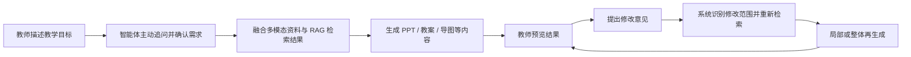
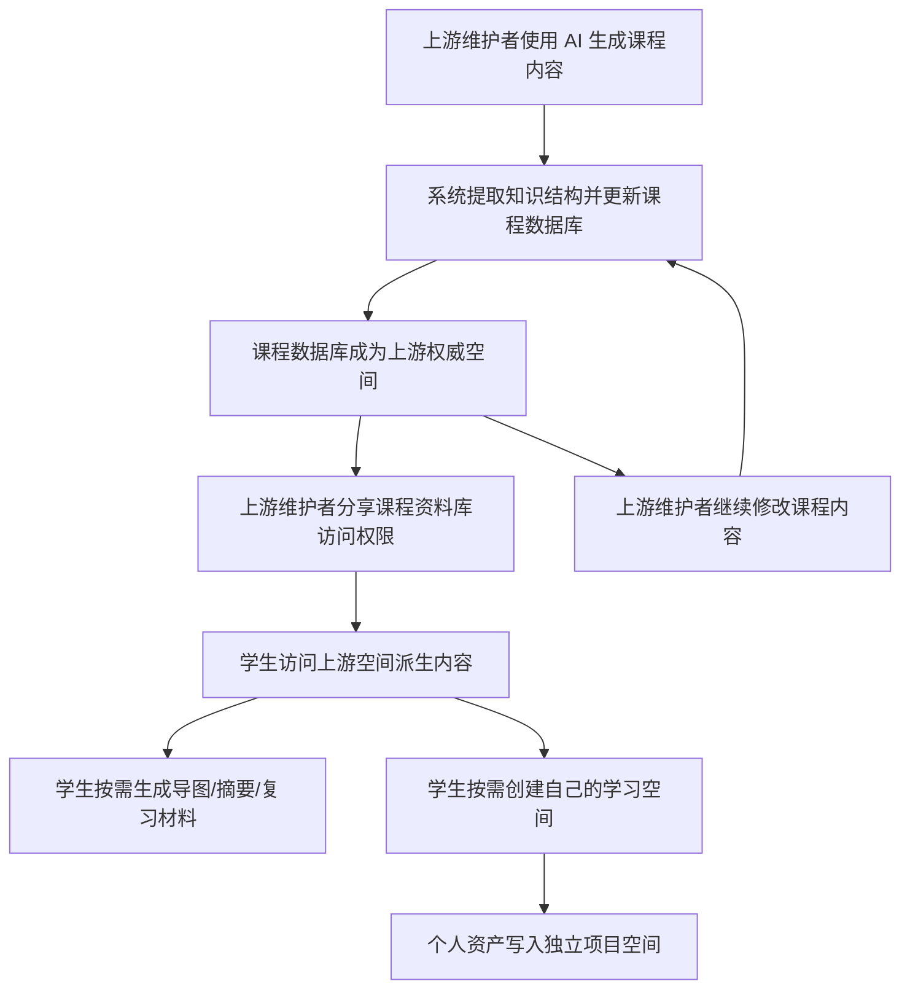

# 5. 关键技术实现

## 5.1 技术实现主线

`Spectra` 的关键技术实现不是简单把“大模型、RAG、PPT 生成”几个模块串起来，而是围绕一条完整主线展开：

`意图理解 -> 多模态融合 -> 结构化生成 -> 无感沉淀 -> 按需外化与持续演化`

这意味着系统不仅要回答“如何生成课件”，还要回答“如何让课件生成行为自动转化为课程资产沉淀行为”。

从技术视角看，`Spectra` 对多模态的理解也不是“分别生成 PPT、教案、导图和动画”，而是先构建同一课程数据库，再由这一统一知识源稳定派生出不同模态结果。因此，多模态只是表现层，课程数据库才是生成层。更进一步说，系统真正长期维护的是“库”，而版本与导出物只是围绕库展开的稳定标识与场景化结果。

## 5.2 多模态交互式理解

### 5.2.1 主动追问机制

`Spectra` 的第一步不是立即生成，而是先理解教师到底想要什么。系统通过多轮对话补齐以下信息：

- 教学主题与课时安排
- 重点难点
- 目标学段与班级情况
- 希望采用的案例、风格和互动方式

当教师表达不完整时，系统会主动追问，例如补充学科范围、时长要求和难度层级。这种“先澄清再生成”的逻辑，是智能体区别于普通生成工具的关键。

### 5.2.2 多模态输入统一建模

系统将教师文字描述、语音转写结果和上传资料视为同一项目上下文中的不同信息源，通过统一的项目维度进行组织。这使得生成并非只依赖一段 prompt，而是依赖完整上下文。

更关键的是，系统会为每份资料建立与教师当前教学意图的语义对应关系。例如，当教师强调“增加实验案例”或“保持某种版式风格”时，系统会优先检索与该目标直接相关的资料片段、案例节点和版式特征，而不是无差别地把全部资料送入生成流程。

### 5.2.3 教学逻辑结构化

在完成意图理解后，系统会将教师表达转化为结构化教学要素，例如：

- 教学目标
- 知识点顺序
- 重点难点
- 课堂活动形式
- 风格与呈现要求

这一结构化结果既是课件生成的输入，也是课程数据库知识骨架的来源。后续无论生成 `PPT`、教案还是导图、摘要，都会围绕这套结构化骨架展开。

## 5.3 本地知识库 RAG 搭建

### 5.3.1 资料入库流程

RAG 模块是 `Spectra` 降低幻觉、增强可信度的关键。其基本过程包括：

1. 对上传资料进行文本提取和结构化清洗。
2. 提取知识结构、案例信息和版式风格特征。
3. 将内容按语义切片。
4. 对切片执行向量化。
5. 写入向量数据库。
6. 在生成时按项目上下文执行检索召回。

系统以 `ChromaDB` 为主构建向量检索能力，并支持面向更大规模场景的平滑扩展。

### 5.3.2 检索增强生成

在课件生成前，系统会根据教师的教学意图召回最相关的资料片段，并将其与教学目标、对话历史一起交给大模型。这样可以减少“空想式生成”，提高内容与资料的一致性。

### 5.3.3 来源可追溯

RAG 不仅用于提升质量，也为“为什么这样生成”提供依据。来源溯源能力通过文件名、章节、页码或片段标识加以体现，这对竞赛评审是重要加分项。

## 5.4 课件自动生成引擎

### 5.4.1 指令集到结构化内容

系统不会直接让大模型输出一个二进制 PPT，而是先生成结构化内容，再交给专门的导出工具处理。这样做有两个好处：

1. 便于控制页面结构、文本长度和逻辑顺序。
2. 便于局部修改与版本管理。

### 5.4.2 多端输出链路

系统的课件生成链路为：

- 大模型生成结构化课件文本
- `Marp CLI` 输出 `PPTX`
- `Pandoc` 输出 `DOCX`

在这一基础上，系统进一步将相同知识结构映射为导图、讲义节点、动画创意、互动小游戏和网页化资源，实现多端内容同步生成。

其中，动画创意与互动内容支持以 `HTML5` 网页形式集成，也支持导出为 `GIF` 或 `MP4` 等演示资源，从而满足课堂展示与课件集成的双重需求。

### 5.4.3 结构化生成的意义

结构化生成对 `Spectra` 来说不只是技术实现细节，而是无感沉淀成立的前提。只有当课件内容已经被组织为明确的知识节点、页面关系和资源引用，系统才能进一步将其自动转换为课程数据库资产。

## 5.5 迭代优化闭环

### 5.5.1 基于反馈的再生成

教师在预览阶段可以提出修改要求，例如：

- 增加案例
- 简化某页内容
- 调整顺序
- 改变风格或表达方式

系统需要识别这些指令的修改范围，并在保留总体结构的基础上进行再生成，而不是每次完全推翻原结果。

### 5.5.2 版本化思路

每次生成和修改并不都直接构成正式版本。`Spectra` 采用轻量版本思路：只有正式入库的结构化变化才形成新的稳定版本；草稿、预览和临时导出结果不单独视为正式版本。这样既方便回溯，也避免把会话过程误当成正式课程状态。

### 5.5.3 互动-生成-反馈-再生成流程图

## 5.6 无感化资产沉淀机制

### 5.6.1 设计原则

`Spectra` 的课程资料库机制遵循一个核心原则：资料库建设不能成为教师的额外任务。系统必须把“知识沉淀”嵌入“课件生成”本身，使教师在无额外负担的情况下完成教学资产化。这里真正沉淀的不是导图或网页这些表现层结果，而是课程数据库本身，也就是“库”的正式状态。

### 5.6.2 三步技术链路

无感化资产沉淀由三步技术动作构成：

1. 抽取：从生成结果中提取知识结构、页面关系、资源索引和逻辑层次。
2. 映射：将同一套知识逻辑同步映射为导图、讲义、动画、网页和资料库条目。
3. 同步：当教师修改知识点时，系统先更新课程数据库，并在访问或重生成时按需刷新受影响的模态内容。

这三步共同决定了“资料库不是另一个上传平台，而是课件生成的副产物”。

### 5.6.3 从生成结果到课程资产

系统并不把 PPT 和教案视为流程终点，而是把它们视为课程数据库的权威更新输入。教师在生成课件的过程中，系统会将 PPT、教案中体现的知识结构、案例引用、页面逻辑和表达关系写回数据库，而不是简单保存一组静态衍生物。

这意味着教师不需要在生成完成后再做二次整理，也不需要额外把内容上传到其他共享平台。生成过程本身，就是课程数据库的建设过程；数据库本身，就是课件生产的副产物。

### 5.6.4 数据库驱动的按需外化

在 `Spectra` 中，并不是先批量生成所有多模态结果再提供访问，而是由课程数据库根据访问场景按需外化内容：

- 教师备课时可外化为 `PPT` 与 `DOCX` 教案
- 学生复习时可外化为思维导图、摘要与复习提纲
- 演示与互动时可外化为动画创意、网页化内容和互动小游戏
- 资源检索时可外化为讲义节点、案例索引与素材索引

因此，数据库中长期沉淀的是知识节点、案例关系、结构顺序、资源索引和版本状态，而导图、网页、摘要等则是在需要时生成的表现形式。导出物需要记录其来源库与来源版本，但不会自动反向替代库本体。

### 5.6.5 权威空间与个人学习空间

`Spectra` 的数据库更新遵循“权威空间优先、个人空间隔离”的机制。这里的权威是相对关系：上游空间对其下游即为权威：

1. 上游空间（常见为教师维护的课程空间）是课程数据库的权威更新源。
2. 上游维护者生成的 PPT、教案和修改结果会反向写入课程数据库。
3. 下游用户在未创建自己的学习空间之前，只以访问者身份读取上游空间，并可按需生成导图、摘要、复习提纲等结果。
4. 下游用户在创建自己的学习空间后，个人资产写入自己的项目空间，不直接回写上游权威空间。

这种机制保证上游空间的权威性，同时保留下游个性化整理与长期沉淀能力。权威关系可层级传递，任意派生空间都可成为其下游的权威源。默认采用黑盒共享：下游仅访问结果，不下发上游来源链与素材细节；公开库默认透明可见。

### 5.6.6 实时更新机制

与传统通过群聊或网盘分享单个文件不同，课程资料库以数据库为中心组织内容。当上游维护者继续修改课程内容时，主数据库首先更新，下游访问者访问到的是基于最新权威数据库派生出的结果，而不是历史上某次转发的旧文件。

更重要的是，系统不会默认永久保存全部衍生形态，而是根据数据库变化重新生成需要的结果。例如，教师调整了 PPT 中的某个知识点，学生端请求导图或摘要时，将基于更新后的数据库重新生成对应内容。对于已经生成过的个人结果，系统提供“上游已更新”的提醒，而不是粗暴强制覆盖。

### 5.6.7 引用机制与更新模式

为了支持课程资料库的复用与跨学科组合，系统在项目层引入引用机制：

1. 一个项目可以绑定一个主基底引用。
2. 一个项目可以继续引用多个辅助来源。
3. 引用模式分为 `follow` 与 `pinned`。
4. `follow` 模式下，上游知识源自动跟踪最新合法状态，表现层结果按需刷新。
5. `pinned` 模式下，项目固定使用某个稳定起点，后续独立演化。
6. 所有引用关系必须满足 `DAG` 约束，避免循环依赖。
7. `follow` 不复制上游素材，仅保存引用状态与必要派生结果，避免存储膨胀。

多引用冲突按“当前项目本地内容 -> 主基底引用 -> 辅助引用顺序 -> 系统默认模板”的优先级处理。

### 5.6.8 权限与隐私控制

课程资料库分享建立在授权机制之上。系统支持：

- 上游维护者邀请下游访问者加入指定课程资料库（教师/学生为常见示例）
- 不同班级或课程设置不同访问范围
- 针对导图、PPT、教案等不同内容配置可见权限
- 针对学生个人资产配置独立存储与隔离访问
- 将可见、可引用、可协作、可管理四类权限拆分管理
- 保护库需邀请访问；公开库默认透明可见
- 黑盒仅截断跨空间引用链，空间内仍保留可验证引用

这一点对于教育场景非常关键，因为教学资料往往具有班级、校本或教学阶段的使用边界。

### 5.6.9 协作与审核机制

`Spectra` 不采用“多人直接改同一实时上下文”的粗放协作方式，而是采用“同项目协作 + 会话隔离 + 候选变更审核”机制：

1. 协作者在同一项目下工作，但使用独立 `session`。
2. 协作者的对话、草稿与临时生成结果彼此隔离。
3. 协作者提交的修改先形成候选变更。
4. 只有项目维护者审核合入后，候选变更才进入正式项目状态。

这使教研组协作既可控，又不会把权威知识空间写乱。

### 5.6.10 课程资料库技术闭环图

## 5.7 多模态能力体系

为体现技术深度，系统构建了完整的多模态能力体系：

1. 复杂 PDF 版式解析：引入更强解析器提升图文混排理解能力。
2. 视频关键帧分析：抽取实验步骤、讲解片段和教学画面语义。
3. 语音输入纠错：结合学科术语词表优化识别结果。
4. 互动内容生成：输出 HTML5 小游戏、动画创意或网页化资源。

这些能力共同支撑了教学场景下从资料理解到课件生成，再到课程资产沉淀、版本管理和按需外化的统一闭环。
