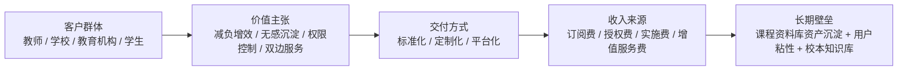

# 7. 组织管理与商业价值

## 7.1 团队组织与协作方式

为了保证项目既具备工程可交付性，又具备商业方案完整性，`Spectra` 团队采用“产品方案 + 前端体验 + 后端架构 + AI/RAG + 测试材料”五位一体协作模式。

1. 产品与方案：负责需求梳理、业务建模、竞赛文档和价值表达。
2. 前端与体验：负责工作台交互、预览修改、分享入口和资料库访问体验。
3. 后端与架构：负责 API、任务编排、鉴权、数据模型和系统边界控制。
4. AI 与 RAG：负责提示词、意图理解、知识检索、解析链路和生成质量优化。
5. 测试与材料：负责测试验证、样例准备、图表整理和提交材料集成。

这种分工方式的优点在于：既能保证技术方案深度，也能保证业务方案、演示效果和交付材料同步推进。

## 7.2 项目管理与实施节奏

项目采用短周期迭代与敏捷协作机制，保障产品、技术、测试与材料输出保持一致性。管理方式围绕三类工作节奏组织：

1. 核心链路节奏：围绕输入、检索、生成、修改、导出和资料库沉淀主链路持续收敛。
2. 质量验证节奏：围绕接口、任务、导出、RAG 和端到端流程持续验证。
3. 材料集成节奏：围绕架构图、测试表、商业分析和执行摘要持续完善提交材料。

这种管理方式使系统既保持工程完整性，也保持商业文档、测试证据和交付表达的一致性。

## 7.3 目标客户与用户画像

服务外包项目的商业表达不能只讲“用户是谁”，还要讲“谁采购、谁使用、谁受益”。`Spectra` 的核心对象可划分为三层。

### 7.3.1 直接使用者：教师

教师是系统的核心高频用户，典型特征如下：

- 需要高频备课，时间碎片化严重
- 具备丰富教学经验，但不愿在重复性排版和资料整理上消耗大量时间
- 希望工具真正理解教学思路，而不是只会“写一份通用 PPT”
- 需要生成后还能快速修改，而不是每次从头来过

### 7.3.2 间接受益者：学生

学生是课程资料库模式下的重要受益者，也是可以独立转化为客户的用户群体，典型需求包括：

- 查看课程相关的最新权威版本内容
- 统一访问由教师权威数据库派生的课程内容
- 基于课程资料库生成个人化的复习摘要、导图和知识提炼内容
- 在需要时创建自己的学习空间并保存个人资产，而不影响教师课程空间

### 7.3.3 采购决策者：学校与教育机构

学校、培训机构和教育平台并非高频直接操作系统的人群，但往往是主要采购方。他们关注的重点包括：

- 是否能降低教师备课成本
- 是否能沉淀校本课程资产
- 是否能形成权限可控、可持续复用的数字资源体系
- 是否具备部署可控、成本清晰、扩展合理的方案

## 7.4 价值主张

### 7.4.1 对教师的价值

- 减负增效：缩短备课时间，减少资料整理与排版劳动。
- 聚焦教学设计：让教师把精力从格式劳动转移到教学逻辑本身。
- 满足个性化表达：系统可根据教师风格和班级特点进行调整。
- 降低复用成本：同一课程的内容在生成时自然沉淀为课程资产，无需重复整理。
- 无感资产化：教师原本就要完成 PPT 生产，系统则在后台自动完成资料库建设，不新增数字化负担。

### 7.4.2 对学生的价值

- 获得更结构化、更生动的课程内容。
- 可直接访问由课程数据库按需派生的导图、PPT、教案、动画、网页、程序示例和复习材料。
- 支持个性化的二次学习与内容生成。
- 始终查看到教师更新后的最新内容，而不是过期文件。

从商业角度看，学生并不只是被动使用者。由于学生可以围绕主数据库生成个人导图、摘要、练习和复习资产，高级生成能力、扩展存储空间和更深层个性化服务都具备独立收费基础，这使学生既是用户，也是潜在客户。

### 7.4.3 对学校和机构的价值

- 沉淀校本课程资源。
- 提升教学资源复用率。
- 降低优质课件生产门槛。
- 为教学数字化提供可落地工具链。
- 建立“生产-沉淀-分发-复用”一体化课程资源体系。

从学校与机构视角看，课程资料库的价值并不只是多一个资源展示入口，而是形成统一课程知识源。只有当 PPT、教案、导图、动画和学生侧学习材料都来自同一套课程资产时，学校获得的才不是一批离散文件，而是一套可以持续治理、持续更新和持续复用的数字课程体系。

## 7.5 服务外包交付模式

`Spectra` 不是单一软件售卖思路，而是一个可服务化交付的解决方案。针对服务外包场景，可形成三种交付模式。

### 7.5.1 标准化交付

面向中小团队、学校教研组或试点班级，提供标准产品能力：

- 教师工作台
- 资料上传与生成闭环
- PPT/教案导出
- 课程资料库访问
- 无感化课程资产沉淀

这一模式交付快、成本低，适合作为首批试点和规模化复制入口。

### 7.5.2 定制化交付

面向学校、培训机构或教育平台，提供定制化方案：

- 校本知识库接入
- 权限体系定制
- 课程模板与品牌化界面
- 数据存储与部署方式适配

这一模式更符合服务外包项目“按客户业务场景定制解决方案”的特点。

### 7.5.3 平台化交付

面向具备长期资源运营需求的客户，提供平台化能力：

- 教师端内容生产
- 学生端课程资料访问
- 课程资料库沉淀与管理
- 资源复用、权限控制与持续更新

这一模式使 `Spectra` 从工具交付升级为平台交付，形成更高的客户粘性和更强的续费能力。

从服务外包视角看，这三种模式并不是彼此割裂的产品形态，而是同一套技术底座面向不同客户成熟度、预算规模和组织治理需求的交付分层。这意味着 `Spectra` 能够以较低试点门槛进入学校或教研组场景，并在后续向更高层级的平台能力平滑升级。

## 7.6 商业模式设计

### 7.6.1 收入结构

`Spectra` 的收入模型采用“基础服务费 + 增值能力费 + 定制实施费”的组合结构：

1. 基础订阅费：面向个人教师或小团队提供基础 AI 备课与资料管理能力。
2. 机构授权费：面向学校或教育机构提供账户授权、资源管理和权限体系。
3. 定制实施费：针对校本知识库、界面定制、部署适配等需求收取实施费用。
4. 增值服务费：针对高级模板、课程资料库扩展能力、学生端导图生成、个人资产空间与高级学习生成能力等功能提供增值收费。

这一收入结构的优点在于：既能支撑个人教师与小团队的轻量试用，也能支撑学校与机构侧按账号、按空间、按实施范围进行更稳定的预算规划，符合服务外包项目“先切入、再扩展、后续费”的商业节奏。

### 7.6.2 商业核心逻辑

`Spectra` 的商业核心并不只是“帮教师更快生成 PPT”，而是“把教师原本就要做的备课行为，自动转化为可持续经营的数字资产生产过程”。这一点决定了它的价值高于普通生成工具：

1. 对教师而言，它是无感的，不增加额外工作量。
2. 对学校而言，它是资产化的，能持续沉淀课程资源。
3. 对学生而言，它是可消费的，能持续获取最新的课程内容。

因此，`Spectra` 的商业价值来自“无感化生产 + 结构化沉淀 + 持续化分发”的统一闭环。更进一步说，商业成立的关键并不在于系统能输出多少种模态，而在于这些模态是否都由同一课程资料库稳定派生。统一生成源带来的持续更新能力、复用能力和学生侧扩展能力，正是 `Spectra` 最重要的商业基础。系统内部继续以 `project` 作为通用主对象，以 `session` 作为工作会话边界，因此该方案既能服务教育场景，也保留更广泛的内容生产与协作扩展空间。

### 7.6.3 商业模式画布

## 7.7 客户采购逻辑与推广路径

### 7.7.1 采购逻辑

对于教师个人，采购理由是效率提升和备课体验改善。  
对于学校和机构，采购理由则更偏向资源沉淀、统一管理和数字化建设。

因此，`Spectra` 的采购逻辑可以概括为：

1. 先用“节省教师时间”打开入口。
2. 再用“无感化课程资料库沉淀”建立长期价值。
3. 最后用“学生侧访问与资源复用”形成平台级扩张。

### 7.7.2 推广路径

推广路径采用由轻到重的渗透方式：

1. 个人教师试用：以 AI 备课效率工具切入。
2. 教研组试点：以课程模板复用、同项目协作与候选变更审核切入。
3. 校级部署：以课程资料库、权限控制和校本知识资产管理切入。
4. 平台扩张：以学生端访问与个性化学习材料生成切入。

这种路径符合教育软件的典型渗透逻辑，也更容易在早期形成真实案例。对于服务外包项目而言，这也意味着交付策略可以从“小范围试点 -> 场景验证 -> 组织级扩展”逐步推进，降低一次性大规模部署的决策阻力。

## 7.8 SWOT 分析

### 优势（Strengths）

- 面向真实教师痛点，场景明确。
- 形成完整的多轮对话、资料理解、RAG 与课件生成闭环。
- 将对话、资料理解、RAG 和课件生成打通。
- 课程资料库分享机制具备明确创新叙事和用户扩张空间。
- 基于项目空间、引用关系和学习空间的演进路径具备平台化延展性。

### 劣势（Weaknesses）

- 多模态深度处理复杂度较高。
- 生成质量仍受到资料质量和场景差异影响。
- 在学校采购场景中，客户对长期稳定性与管理能力要求更高。

### 机会（Opportunities）

- 教育数字化转型持续推进。
- 教师对高效备课工具需求长期存在。
- 课程资料库与学生侧服务可扩展新的使用场景。
- 学校和机构对统一知识资产沉淀与权限管理工具存在潜在需求。

### 威胁（Threats）

- 通用 AI 工具快速演进，竞争激烈。
- 教育场景对准确性、稳定性要求更高。
- 数据隐私、版权和校内部署要求可能提高落地门槛。

## 7.9 PEST 分析

### 政策（Political）

- 教育数字化和智能化教学是长期政策方向，项目具有较强政策契合度。
- 涉及教学资源与学生信息时，需要同步考虑数据安全与合规要求。

### 经济（Economic）

- 教师与学校对高效工具有现实需求，但预算敏感，因此产品需要具备清晰的效率收益。
- 对学校侧而言，若系统能显著提升资源复用率，则具备较高采购合理性。

### 社会（Social）

- 教师群体普遍存在备课压力和资源管理压力。
- 学生对更生动、更结构化的数字课程内容接受度较高。

### 技术（Technological）

- 大模型、RAG 和多模态解析能力持续成熟，为产品升级提供持续技术红利。
- 技术成熟使“课程资料库”这一模式具备真正落地基础，而不再停留在概念层。

## 7.10 竞争壁垒与长期价值

`Spectra` 的竞争壁垒不只是“能生成 PPT”，而是以下三层：

1. 教学场景壁垒：围绕教师备课这一高频刚需场景深度设计。
2. 数据资产壁垒：课程内容在使用过程中自然沉淀为资料库，形成长期累积价值。
3. 网络演化壁垒：项目空间之间可形成可控引用与协作关系，提升复用深度和迁移成本。
4. 双边网络壁垒：教师持续生产内容，学生持续消费和二次生成内容，使平台形成双边增长结构。

其中，课程资料库是最重要的长期价值来源。而“无感化资产沉淀”正是这一路径成立的关键，因为只有当资产化不额外增加教师负担时，课程资料库才可能真正成为高频使用结果，而不是低频维护功能。它让 `Spectra` 不再只是一个生成工具，而成为课程内容的生产平台、沉淀平台和分发平台。

同样重要的是，课程资料库在商业上承担了统一生成源的角色。它使课件、教案、导图、动画、互动内容和学生侧学习材料不再彼此割裂，而是围绕同一课程知识结构持续演化。这种一致性直接转化为更高的资源复用效率、更强的组织治理能力和更稳固的平台壁垒。进一步地，以项目空间、引用关系、候选变更审核和学习空间为核心的演进路径，使 `Spectra` 具备从单一教学工具走向内容协作平台的可能性。

## 7.11 结论

从服务外包项目角度看，`Spectra` 具备完整的商业成立条件：需求明确、用户真实、价值清晰、技术可交付、交付模式可拆分、商业模式可持续。其最强差异化不在于“又一个 AI 备课工具”，而在于通过无感化课程资料库机制，把一次课件生成升级为长期教学内容资产的生产与运营体系。也正因此，`Spectra` 更适合作为学校数字化建设与教研内容治理的一部分被采购，而不只是被当作一个单点效率工具来比较。
