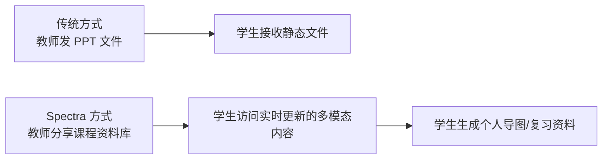
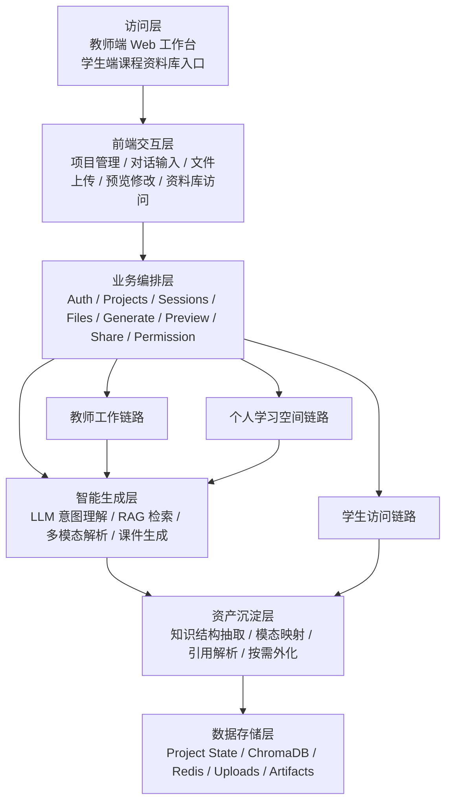
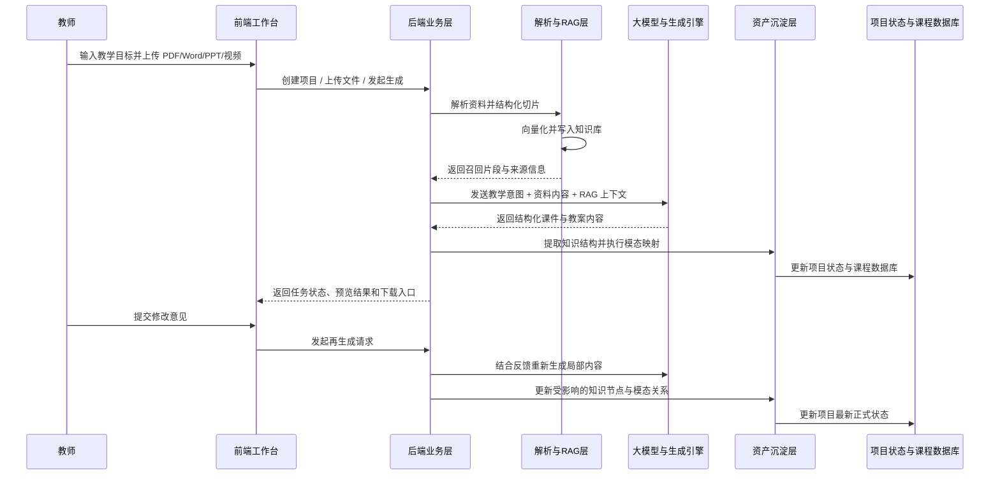
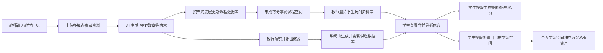
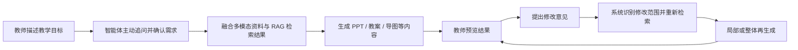
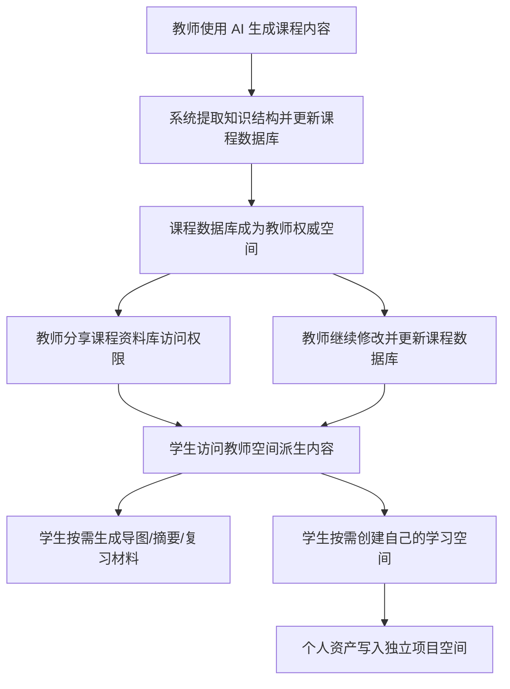
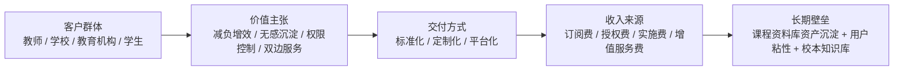

# Spectra 服务外包大赛提交文档草案

> 本文档由 `docs/competition/` 各章节合并生成，用于正式提交前的统一审阅与导出。

---

# Spectra 项目执行摘要

## 项目定位

`Spectra` 是一个面向教师备课场景的多模态 AI 互动式教学智能体。系统以教师教学思路为驱动，融合多模态参考资料与本地知识库，自动生成 PPT、教案、导图等课程成果，并将这些成果在生成过程中无感沉淀为可分享、可持续更新、可权限控制的课程资料库。其交付对象不仅是教师工作台本身，更是一套面向学校、教研组与学生侧持续运行的课程内容生产与分发机制。

## 核心判断

教师真正需要的不是“更快生成一份 PPT”，而是把教学设计、资料利用、课件生成、内容修改、资源沉淀与学生分发整合为一套统一系统。更关键的是，这套系统不能把数字化建设变成教师的额外负担，而必须建立在教师原本就要完成的备课行为之上。

因此，`Spectra` 的关键创新不只是“生成能力更强”，而是把教师正常生成 PPT 的过程，自动转化为课程资产沉淀与资料库交付过程，实现“生产即沉淀，沉淀即交付”。

进一步说，`Spectra` 对“多模态”的理解并不止于同时输出多种内容形态。多模态真正的关键，不在于模态本身，而在于存在一个统一的课程数据库作为生成源。PPT、教案、导图、动画、网页、程序示例和视频索引，都只是同一套课程知识结构向不同使用场景的按需外化结果。真正被持续沉淀和更新的是数据库，而不是预先批量生成好的导图或其他表现形式。

## 业务痛点

当前教学场景中普遍存在以下问题：

1. 备课工具链割裂，教师需要在多个平台间反复切换。
2. 系统交互浅层化，难以真正理解教师的教学目标与课堂逻辑。
3. 既有 PDF、PPT、视频、图片等资料难以高质量参与生成。
4. 教学资源通常以静态文件形式分发，版本更新、权限管理和隐私控制能力不足。
5. 数字化资源沉淀往往依赖额外整理、上传和维护，教师使用成本高。

## 解决方案

`Spectra` 围绕教师备课全流程构建统一工作台，通过“对话理解 + 多模态解析 + RAG 检索增强 + 结构化生成 + 无感化资产沉淀”的方式，形成完整业务闭环：

1. 教师通过文字或语音输入教学目标、重点难点和课堂设计。
2. 系统主动追问并形成结构化教学需求。
3. 教师上传 PDF、Word、PPT、图片、视频等参考资料。
4. 系统完成解析、切片、向量化与检索增强。
5. 系统生成 PPT、教案及相关多模态课程内容。
6. 教师在预览界面提出修改意见，系统执行局部或整体再生成。
7. 教师侧生成结果反向更新课程数据库，学生按权限访问数据库派生的课程内容；只有在需要持续个性化整理时，学生才创建自己的学习空间。

## 核心创新

### 1. 教师思路驱动的智能体模式

系统不是围绕模板填写展开，而是围绕教师的教学设计思路展开。`Spectra` 能够通过多轮对话主动澄清需求、理解教学逻辑，并据此组织课程内容。

### 2. 多模态资料与知识库协同生成

系统将 PDF、Word、PPT、图片、视频、语音等资料统一纳入项目上下文，通过本地知识库 RAG 进行检索增强，提升生成结果的相关性、可信度和可追溯性。多模态能力并不是分散生成多个互不相关的结果，而是让同一课程数据库稳定地产生多种课程表达。

### 3. 互动式闭环生成

教师并非一次性接受 AI 结果，而是可以围绕预览结果持续修改。系统对修改意见进行理解、重检索与再生成，形成真实可用的教学共创流程。

### 4. 课程资料库分享范式

教师最终分享的不是单个静态 PPT 文件，而是一个动态课程资料库。学生被邀请后，可以访问由课程数据库按需生成或派生的 PPT、教案、导图、动画、网页、程序示例和视频等内容，并始终看到以教师权威更新为基础的最新版本。

### 5. 无感化资产沉淀机制

课程资料库不是教师额外整理出来的，而是教师在正常制作 PPT 的过程中自动形成的副产物。系统在生成过程中同步抽取知识结构、内容关系和素材索引，并将其写入持续演化的课程数据库。教师感知到的是正常备课流程，系统完成的是课程数据库自动沉淀与更新。

## 系统交付

`Spectra` 交付的是一套完整系统，而不是单点生成工具，核心交付内容包括：

1. 教师工作台：项目创建、对话输入、资料上传、生成、预览、修改与导出。
2. 多模态理解链路：多格式资料解析、知识切片与检索增强。
3. 内容生成引擎：`PPTX`、`DOCX` 及多模态课程内容生成。
4. 课程资料库：多模态课程资产无感沉淀、动态更新与资料库分享。
5. 权限与资源管理：项目隔离、访问控制、邀请分发、学习空间隔离与隐私管理。

## 应用价值

### 对教师

- 降低重复性备课劳动
- 提升资料利用率与内容组织质量
- 保留个性化教学表达能力
- 将一次性课件成果转化为长期课程资产

### 对学生

- 统一访问结构化、持续更新的课程内容
- 基于课程数据库按需生成个性化导图、摘要和复习材料
- 从被动接收文件转为主动使用课程知识空间

### 对学校与机构

- 沉淀校本课程资源
- 提升教学资源复用率
- 建立统一、可管理、可持续扩展的课程资料体系
- 支撑教育数字化建设与资源平台化治理

## 服务外包价值

从服务外包项目角度看，`Spectra` 具备明确的交付合理性：

1. 需求真实：教师备课效率、资源管理和资源分发痛点普遍存在。
2. 方案完整：覆盖输入、理解、生成、优化、沉淀、分享与复用全链路。
3. 技术可交付：采用成熟 Web 架构、RAG、异步任务和文档导出工具链。
4. 业务可扩展：同时服务教师、学生、学校和教育机构。
5. 商业可持续：支持标准化交付、定制化交付和平台化交付。

## 竞争优势

`Spectra` 的竞争优势集中在三个层面：

1. 场景深度：围绕教师备课这一高频刚需场景深度设计。
2. 资产沉淀：课程成果在使用过程中无感沉淀为课程资料库，形成长期数据资产。
3. 双边扩张：教师持续生产内容，学生持续消费并二次生成内容，具备平台化增长潜力。

进一步说，`Spectra` 并不依赖“单次生成效果”建立价值，而是依赖“持续沉淀、持续复用、持续分发”建立价值。这使它天然更接近可交付、可运营、可持续采购的服务外包方案，而不是一次性演示型工具。

## 结论

`Spectra` 的本质不是单次生成课件的工具，而是一套面向教学场景的课程内容生产、优化、沉淀与分发系统。它通过多模态 AI 智能体能力，把教师备课从“制作静态文件”升级为“构建动态课程数据库”，并由此实现从教师单边工具到教师-学生双边平台的价值跃迁。在这一体系中，多模态不是目标本身，课程数据库才是核心生成源；不同模态只是同一课程知识结构的不同外化形式。教师维护权威课程空间，学生默认以访问者身份读取最新内容，只有在创建自己的学习空间后才沉淀个人资产，二者不相互污染。

---

# 1. 前言与项目综述

## 1.1 编写目的

本文档用于作为 `Spectra` 参加服务外包创新创业大赛的项目详细方案基础稿，服务于系统设计、实现说明、提交材料整理和评审理解。文档既面向项目团队内部协作，也面向评审专家对项目创新性、工程完整性、商业落地性和社会价值的综合评估。

## 1.2 术语说明

为保证全文口径一致，本文中的关键术语采用如下定义：

- `LLM`：大语言模型，用于意图理解、内容规划和文本生成
- `RAG`：检索增强生成，用于将资料检索结果融入生成流程
- `Multimodal Agent`：多模态智能体，指具备主动追问、资料理解、内容生成和再优化能力的系统
- `Course Knowledge Hub`：课程资料库，指围绕同一课程持续沉淀、可分享、可更新、可权限控制的多模态课程空间

## 1.3 项目背景

当前 AI 辅助教学工具已经能够在局部环节帮助教师提升效率，但仍存在三个结构性问题：

1. 工具链割裂。教师需要在对话工具、PPT 工具、资料搜索工具和共享平台之间来回切换。
2. 交互过浅。很多工具只能响应单轮指令，无法真正理解教师的教学目标、知识结构与课堂设计思路。
3. 资料利用不足。教师已有的 PDF、教案、PPT、图片或视频材料难以被系统高质量吸收并重用于生成流程。

在真实备课场景中，教师往往将大量时间消耗在内容整理、资料查找、格式调整和重复修订上，而不是放在教学设计本身。更重要的是，教学资源数字化沉淀通常被视为额外工作，而不是备课行为的一部分。这正是 `Spectra` 要解决的问题。

## 1.4 项目定位

`Spectra` 是一个面向教师备课场景的多模态 AI 互动式教学智能体。系统以教师思路为驱动，通过自然语言对话、多模态资料解析和本地知识库 RAG，生成可讲授、可修改、可导出的课程成果。

与传统“只生成单个文件”的工具不同，`Spectra` 不是一次性产出 PPT 的单点工具，而是一个持续演化的课程内容工作台。教师在生成 PPT、教案、导图、动画创意等内容的过程中，知识会自然沉淀为可复用的课程资产，并进一步组织为可分享、可持续更新的课程资料库。

因此，`Spectra` 对“多模态”的理解并不是简单增加更多输出格式，而是以课程数据库作为统一生成源，让同一套课程知识结构在不同教学与学习场景中按需外化为不同模态结果。系统内部继续以 `project` 作为主对象，以 `session` 作为工作会话边界；对外则将其组织为课程空间与学习空间。

## 1.5 项目目标

本项目的核心目标包括：

1. 理解教师意图：通过多轮对话准确理解教学目标、重点难点、讲授逻辑和互动要求。
2. 融合多模态资料：对 PDF、Word、PPT、图片、视频等资料进行解析，并提取关键内容参与生成。
3. 自动生成课程成果：输出结构完整的 PPT 课件和 Word 教案，并为动画、互动内容预留扩展空间。
4. 支持迭代优化：允许教师在预览阶段提出修改意见，系统再生成新版本，形成闭环。
5. 构建课程资料库：让生成过程中的多模态成果自然沉淀为可分享、可持续更新的课程资料库。

这五个目标并不是彼此独立的模块，而是共同指向同一件事：让教师的一次正常备课行为，同时完成内容生产、资源沉淀与课程分发准备。

## 1.6 核心亮点

### 亮点一：以教师教学思路为中心

`Spectra` 不要求教师先手工搭建模板再逐页填空，而是从教师表达的教学意图出发，自动组织课件结构和讲授内容。

### 亮点二：多模态资料与知识库联合驱动

系统不仅读取教师输入，还会结合上传资料和本地知识库进行检索增强，降低纯大模型生成的幻觉风险。更重要的是，系统将多模态资料沉淀为统一课程资料库，使多模态能力建立在共同知识源之上，而不是建立在彼此割裂的内容输出之上。

### 亮点三：形成“互动-生成-反馈-再生成”闭环

教师并非一次性接受 AI 产物，而是可以通过预览、修改和再生成逐步逼近理想课件。

### 亮点四：从文件生成走向课程资料库

`Spectra` 的关键创新点不是“再做一个更快的 PPT 工具”，而是把 PPT、教案、导图、网页、动画、程序示例和视频等内容统一沉淀为一个可分享、可实时更新、可权限控制的课程资料库。教师不需要向学生逐个转发 PPT、思维导图或视频链接，只需要分享课程资料库即可。

### 亮点五：生成即沉淀，沉淀即可分享

传统教学分享方式通常是教师手动导出 PPT、再上传到不同平台、再逐个转发给学生。`Spectra` 则把“生成”和“沉淀”合并为一个过程：教师在使用 AI 生成 PPT、教案和其他多模态内容时，这些内容会自然成为课程资料库的一部分，不需要额外整理、上传或转发。

### 亮点六：无感化的资产沉淀

`Spectra` 的课程资料库不是教师额外维护出来的，它是教师原本就要完成的 PPT 生产流程所带来的副产物。系统在后台自动捕获教学逻辑、知识结构和素材关系，并将其持续写入课程数据库。教师感知到的是“正常完成备课”，系统完成的则是“顺带把课程数据库沉淀好了”。导图、讲义索引和其他多模态资源则在需要时从数据库按需生成；学生若不创建自己的学习空间，就始终只作为课程空间的访问者，不会污染教师侧内容。

### 亮点七：用户范围从教师扩展到学生

学生被教师邀请注册后，可以直接访问课程资料库中由教师权威数据库派生的 PPT、教案、动画、网页、程序示例和视频等内容。更进一步，学生还可以先以访问者身份按需生成自己的思维导图、复习提纲和知识摘要；当需要持续整理与上传个人资料时，再创建自己的学习空间并沉淀私有资产，从而让系统的服务对象从单一教师扩展到教师与学生双边用户。

## 1.7 革命性价值说明

从教学资源分发方式看，`Spectra` 完成了一次范式转换：

1. 从“分享一个静态文件”转向“分享一个动态知识空间”。
2. 从“教师手工维护多个渠道”转向“AI 生成过程自动沉淀资产”。
3. 从“学生被动接收文件”转向“学生按权限访问并二次生成学习内容”。

这一本质变化意味着，教学资源不再以离散文件形式存在，而是以课程知识空间形式持续存在。课程的每一次生成、修改和再分发，都建立在同一套底层知识结构之上。

也正因如此，题目要求中的意图理解、多模态融合、PPT/教案生成、预览修改和标准导出，并不是几块彼此独立的功能，而是课程资料库这一核心生成源向外展开的不同环节。

这种方式带来的直接优势包括：

- 内容实时更新，学生始终获取最新版本
- 具备权限管理与隐私控制能力
- 多种内容形态统一管理，避免资料碎片化
- 教师额外操作更少，分享成本显著下降
- 教学资产在课件生产过程中无感形成，不增加教师额外负担
- 平台用户从教师侧扩展到学生侧，形成更完整的教育内容生态

### 1.7.1 创新点示意图

## 1.8 系统交付形态

`Spectra` 以统一工作台形式交付完整系统能力，覆盖以下核心环节：

1. 注册与登录
2. 项目创建与管理
3. 多模态资料上传、解析与入库
4. RAG 检索与课件生成任务
5. `PPTX` 与 `DOCX` 产出
6. 预览、修改与再生成
7. 课程资料库沉淀、分享与学生访问

由此，系统形成了从教师输入到学生使用的完整业务闭环，也形成了从内容生成到课程资产沉淀的完整交付闭环。

---

# 2. 可行性分析

可行性分析的目的，不是简单证明“技术上可以实现”，而是证明 `Spectra` 作为一套服务外包项目方案，具备完整的成立条件：技术可交付、成本可接受、客户有采购理由、社会价值清晰、风险可控制。

## 2.1 可行性总览

| 维度 | 关键判断 | 结论 |
|---|---|---|
| 技术可行性 | 核心技术链路成熟，模块职责清晰 | 具备完整交付条件 |
| 经济可行性 | 开发与部署成本可控，客户收益明确 | 具备采购合理性 |
| 社会可行性 | 契合教育数字化与教师减负需求 | 应用价值明确 |
| 服务外包可行性 | 可标准化交付，也可定制化扩展 | 具备服务化实施基础 |
| 风险可控性 | 关键风险可识别、可拆分、可治理 | 具备工程落地稳定性 |

## 2.2 技术可行性

### 2.2.1 技术架构具备完整闭环

`Spectra` 采用“前端工作台 + 后端业务编排 + 多模态解析 + RAG 检索 + 文档生成引擎 + 课程资料库沉淀”的整体架构。该架构覆盖教师备课的完整业务闭环：

1. 教师输入教学目标与课堂设计思路。
2. 系统主动追问，形成结构化教学需求。
3. 多模态资料进入解析与知识库入库流程。
4. 系统通过 RAG 召回相关内容并生成课程成果。
5. 教师在预览中修改，系统完成再生成。
6. 成果沉淀为课程资料库并向学生开放。

这说明 `Spectra` 并不是依赖单个模型完成全部工作，而是通过分层协作完成教学场景中的完整任务链路，具备较强工程可实施性。更重要的是，系统并不是先零散生成多个结果再进行拼接，而是围绕统一课程资料库持续组织与外化内容，这使多模态能力具备稳定的一致性来源。

### 2.2.2 大模型能力满足核心任务要求

以 `Qwen` 等大语言模型为代表的通用模型，已经具备较强的自然语言理解、结构化生成和多轮对话能力，能够承担以下核心任务：

- 理解教师教学目标、重点难点与课堂设计逻辑
- 进行多轮追问与意图补全
- 输出结构化课件内容与教案文本
- 根据教师反馈执行内容修改与局部重生成

在 `Spectra` 中，大模型的职责被严格限定在“理解、规划、生成、修改”四类任务中，而不承担数据库、文件渲染或权限控制等职责。这样的职责拆分降低了系统复杂度，也提升了整体可维护性。

### 2.2.3 RAG 体系具备高可信度支撑

纯大模型生成容易出现事实偏差或内容漂移，尤其在教材、公式、术语和教学规范场景中风险较高。`Spectra` 通过本地知识库 RAG 建立“资料入库 -> 分块向量化 -> 检索召回 -> 生成增强”的链路，使生成内容建立在真实资料基础上。

系统采用 `ChromaDB` 作为向量检索基础设施，兼顾以下要求：

- 部署轻量，便于快速交付
- 检索延迟低，满足教学场景实时性需求
- 支持元数据过滤，便于按项目、学科、章节进行精准检索

相较于更重型的 `Milvus` 方案，`ChromaDB` 更适合服务外包项目初期的交付节奏与成本结构，同时保留了平滑扩展能力。

### 2.2.4 文档解析与多模态处理具备可靠路径

教学资料往往包含复杂 PDF、PPT、Word、图片、视频与语音内容。`Spectra` 针对不同类型资料建立了对应技术路径：

- PDF / Word / PPT：通过结构化解析提取标题、段落、图表、公式等内容
- 图片：通过 OCR 与视觉标签形成检索素材
- 视频：通过关键帧、字幕与片段语义提取参与生成
- 语音：通过语音识别与术语纠错进入需求理解链路

在解析器选择上，系统采用“本地链路 + 高质量解析器”的组合思路，兼顾离线能力、成本控制和复杂文档质量。这个设计非常适合教育场景下对隐私、安全和本地知识库的要求。

从可行性角度看，`Spectra` 对多模态的处理逻辑也更稳定。系统不是把 PDF、视频、图片分别导向彼此独立的生成支路，而是先将其统一沉淀到课程资料库，再由这一统一知识源派生 PPT、教案、导图、动画和网页等不同内容形态。这种“先沉淀、再外化”的思路，比单纯追求模态数量更适合服务外包项目的持续交付与质量控制。

### 2.2.5 输出与导出链路稳定

`Spectra` 采用以下生成与导出链路：

- `Marp CLI`：负责 `PPTX` 和 HTML5 课件输出
- `Pandoc`：负责 `DOCX` 教案输出
- `Redis + RQ`：负责异步任务编排和状态追踪

这一工具链具备三个明显优势：

1. 稳定：避免手工操作 Office 坐标导致的高不确定性。
2. 可控：结构化输出便于统一版式、风格和模板管理。
3. 易交付：工具链成熟，部署与维护成本较低。

因此，从内容生成到结果交付，`Spectra` 具备较高的工程稳定性。

### 2.2.6 技术可行性结论

综合来看，`Spectra` 所采用的核心技术并非实验室级概念拼接，而是围绕“可实现、可维护、可交付”三项原则做出的系统化组合。这使其具备较强的技术可行性。

## 2.3 经济可行性

### 2.3.1 成本结构可控

`Spectra` 的技术栈以开源组件和通用 Web 架构为主：

- 前端：`Next.js + TypeScript`
- 后端：`FastAPI + Prisma`
- 检索：`ChromaDB`
- 异步：`Redis + RQ`
- 导出：`Marp + Pandoc`

这种组合的优势在于：

- 无需过重基础设施即可起步
- 具备较低的试点部署门槛
- 能够在学校、教研组、小团队等场景中快速落地
- 可根据规模逐步升级数据库、对象存储和解析能力

因此，项目在开发成本、部署成本和扩容成本上都具备较好的可控性。

### 2.3.2 客户收益明确

客户愿意采购服务外包项目，前提是收益必须足够明确。对 `Spectra` 而言，收益主要体现在三个层面：

1. 对教师：减少备课中的重复性劳动，提升内容生产效率。
2. 对学校：沉淀课程资源，提高资源复用率和统一管理能力。
3. 对学生：获得更及时、更丰富、更个性化的课程内容。

换言之，`Spectra` 的核心收益不是“AI 很先进”，而是“它能替客户节省时间、提高资源产出效率，并形成长期可复用内容资产”。

### 2.3.3 采购合理性强

从采购角度看，`Spectra` 同时满足了个人采购与机构采购的逻辑：

| 采购对象 | 核心理由 |
|---|---|
| 教师个人 | 提升备课效率，减少排版与资料整理成本 |
| 教研组 | 统一模板与课程资源，提高协作效率 |
| 学校与机构 | 建立课程资料库、权限控制和校本资源管理能力 |

因此，项目不仅“有人用”，而且“有理由买”。

### 2.3.4 商业延展空间充足

`Spectra` 具备多层收入结构：

1. 教师订阅服务
2. 学校与机构授权服务
3. 定制实施与部署服务
4. 课程资料库与学生侧增值服务

其中，课程资料库模式是最关键的商业延展点。它将产品从教师生产工具扩展为课程内容平台，使系统具备更高的客户粘性和更强的长期收入潜力。课程资料库之所以能成为商业延展点，本质上正是因为它承担了统一生成源的角色，使多模态内容生产、持续更新和学生侧复用都建立在同一套资产之上。

### 2.3.5 经济可行性结论

`Spectra` 的经济可行性体现在“低门槛交付 + 明确客户收益 + 多层收入结构”三方面，因此具备较强的商业成立基础。

## 2.4 社会可行性

### 2.4.1 契合教育数字化发展方向

当前教育场景持续推进数字化教学资源建设、智能教学辅助和个性化学习支持。`Spectra` 聚焦教师减负、资源沉淀和教学内容数字化，与教育数字化方向高度一致。

### 2.4.2 具有教师减负现实价值

教师在备课中面临大量非创造性劳动，包括资料搜集、内容整合、页面排版和重复修改。`Spectra` 将这些环节整合为统一工作流，直接回应了教师减负这一现实需求。

### 2.4.3 有助于缩小教学资源差距

优秀教师具备较强的教学设计与内容组织能力，而经验较少的教师在教学表达、结构设计和资源整合上存在差距。`Spectra` 通过结构化生成与课程资料库沉淀，有助于提升教学内容的基础质量下限，并提高优质资源复用能力。

### 2.4.4 改善学生学习体验

学生不再只接收一个静态文件，而是访问一个动态更新的课程资料库。这种模式让学习内容更丰富、更新更及时，也更有利于学生根据自身需求生成导图、摘要和复习材料。

### 2.4.5 社会可行性结论

`Spectra` 不仅服务于教师效率提升，也服务于学校资源建设和学生学习体验优化，因此具备明确的社会可行性。

## 2.5 服务外包适配性分析

### 2.5.1 方案边界清晰

`Spectra` 围绕教师备课和课程资源沉淀这一明确业务场景展开，业务边界清晰，不属于泛化 AI 平台。这种聚焦使项目更适合服务外包交付。

### 2.5.2 交付模式可拆分

系统既可标准化交付，也可定制化交付：

- 标准化交付：面向教师个人、教研组和试点学校
- 定制化交付：面向校本知识库、权限体系和品牌化需求
- 平台化交付：面向课程资源平台和学生访问场景

这种可拆分性使方案具备很强的服务外包适配性。

### 2.5.3 客户沟通成本较低

与底层技术平台不同，`Spectra` 的业务价值非常直观，教师、学校和机构都能快速理解其作用。这意味着从需求沟通、方案展示到项目验收，认知成本相对较低，更有利于服务外包模式落地。

### 2.5.4 服务外包适配性结论

从业务清晰度、交付模式和客户理解成本来看，`Spectra` 具备较强的服务外包项目适配性。

## 2.6 风险与控制措施

### 2.6.1 风险总览

| 风险项 | 风险说明 | 控制措施 |
|---|---|---|
| 内容正确性 | 大模型可能生成事实偏差 | 教师复核 + RAG 增强 + 来源溯源 |
| 多模态复杂度 | 视频、复杂版面解析难度较高 | 采用可插拔解析器与模块化架构 |
| 数据安全 | 教学资料可能涉及内部内容 | 权限控制、项目隔离、最小访问原则 |
| 商业落地 | 教育采购周期相对较长 | 先从个人与教研组场景切入，再扩展机构市场 |
| 产品边界 | 功能范围扩张可能削弱核心价值 | 始终围绕备课、生成、资料库三条主线展开 |

### 2.6.2 风险可控性说明

`Spectra` 的关键风险并非不可控风险，而是典型的工程和业务治理问题。系统通过模块拆分、权限机制、RAG 增强、教师复核和分层交付模式，对主要风险均形成了明确控制路径。

## 2.7 结论

综合判断，`Spectra` 在技术、经济、社会和服务外包适配性四个层面均具备较强可行性。它最大的优势在于不是凭空构想一个“全能 AI 平台”，而是围绕教师备课这一高频刚需场景，构建出一套完整的教学内容生产、优化、沉淀与分发系统。对服务外包大赛而言，这种“需求明确、技术扎实、采购逻辑清楚、交付模式完整、商业延展充分”的方案具有较强说服力。

---

# 3. 业务与需求分析

## 3.1 核心业务机制

`Spectra` 的业务核心，不是“生成一份 PPT”，而是把教师原本就要进行的课件生产过程，转化为一条同时完成内容生成、知识沉淀和资源分发准备的工作流。

这条机制可以概括为：

1. 教师正常备课并生成 PPT。
2. 系统在后台自动抽取教学逻辑、知识结构和素材关系。
3. 同一套知识逻辑被写入课程数据库，并可按需映射为思维导图、教案、讲义、动画、网页和资源索引。
4. 持续沉淀的是课程数据库，而不是预先批量生成的表现形态。
5. 学生通过授权访问数据库派生的课程内容；只有在需要持续沉淀个人资料时，才创建自己的学习空间并生成个人学习资产。

这意味着 `Spectra` 的关键价值不在于“多一个分享平台”，而在于将“资料库建设”变成“课件生产的副产物”。教师不需要额外做数字化整理，系统已经在其原本的工作行为中完成了资产沉淀。

进一步说，`Spectra` 对多模态的理解，也不是“多做几种内容形态”，而是“先形成统一课程数据库，再让不同内容形态从这一数据库按需外化”。因此，多模态是课程数据库的表现方式，而不是与数据库并列存在的一组孤立功能。

## 3.2 应用对象分析

`Spectra` 的直接核心用户是中小学及高校教师，延展用户是被教师邀请进入课程资料库的学生。

### 3.2.1 教师侧场景

教师的典型使用场景包括：

1. 新课备课：根据教学目标和参考资料快速生成首版课件。
2. 旧课重构：将已有教案、PPT 或 PDF 资料重新整理成新的课程表达。
3. 多轮打磨：基于预览结果进行局部修改、案例替换和结构微调。
4. 资源复用：将同一门课程的多种成果沉淀为课程资料库并持续更新。

教师侧的共性痛点包括：

- 资料分散，难以统一利用
- 备课耗时长，重复劳动多
- 教学设计很复杂，但工具理解能力很浅
- 生成后仍需多轮修改
- 不愿为了“数字化沉淀”再额外增加整理、上传和转发成本

### 3.2.2 学生侧场景

学生通过教师邀请进入课程资料库后，典型场景包括：

1. 查看课程相关的最新权威版本内容。
2. 统一访问由课程数据库派生的 PPT、教案、动画、网页、程序示例和视频等资料。
3. 基于课程数据库生成个人化的导图、摘要、复习提纲和练习内容。

学生侧的共性需求包括：

- 希望获取最新而非过期版本的课程资料
- 希望统一查看课程内容，而不是在多个群聊或平台中搜索
- 希望基于课程资料快速生成自己的复习材料

## 3.3 业务流程分析

从教师与学生双端视角看，系统的完整业务链路如下：

1. 教师创建项目，输入学段、学科、课时和主题。
2. 教师通过文字或语音描述教学目标、重点难点和课堂设计想法。
3. 系统主动追问并形成结构化需求。
4. 教师上传 PDF、Word、PPT、图片、视频等参考资料。
5. 系统解析资料并写入本地知识库。
6. 系统结合教师意图和检索结果形成生成指令集。
7. 系统生成 PPT、教案以及相关多模态课程内容。
8. 在生成过程中，系统自动沉淀知识结构、资源索引和课程资产。
9. 教师在预览界面提出修改意见，系统完成局部再生成。
10. 教师侧生成结果反向更新课程数据库及其关联知识结构。
11. 教师邀请学生进入课程资料库并配置访问权限。
12. 学生查看最新课程内容，并可先按需生成思维导图、摘要或复习提纲；若需要持续整理，再创建独立学习空间。

这一流程的关键不在“生成后再分享”，而在“生成时即完成沉淀，沉淀后即可分享”。

## 3.4 核心需求结构

结合比赛原始要求与项目功能清单，`Spectra` 的核心需求并不是并列堆叠的一组功能，而是围绕一条主轴展开：

`意图理解 -> 多模态融合 -> 内容生成 -> 无感沉淀 -> 权限分享 -> 学生再利用`

基于这条主轴，可将系统需求划分为七个核心板块。

### 3.4.1 意图理解需求

- 支持文字与语音输入
- 支持多轮对话
- 能主动追问模糊需求
- 能将需求总结为结构化教学意图

### 3.4.2 多模态融合需求

- 支持多格式资料上传
- 支持文档结构化解析
- 支持提取知识结构、案例信息与排版风格特征
- 支持视频信息提取与摘要
- 支持知识库检索增强
- 支持建立教师教学意图与参考资料之间的对应关系

### 3.4.3 内容生成需求

- 生成结构完整的 PPT
- 生成配套 Word 教案，覆盖教学目标、教学过程、教学方法、课堂活动设计和课后作业
- 生成导图、讲义、动画创意、互动小游戏、网页化表达等多模态内容

### 3.4.4 无感沉淀需求

- 支持在 PPT 与教案生成过程中自动沉淀课程资产
- 不要求教师额外上传、转发或整理资料库内容
- 支持同一套知识逻辑同步映射到导图、讲义、动画和网页等多种资源形态
- 支持知识点修改后自动更新课程数据库，并驱动相关模态内容按需刷新

### 3.4.5 统一生成源需求

- 支持以课程数据库作为多模态内容的统一生成源
- 支持 PPT、教案、导图、动画、网页和互动内容共享同一课程知识结构
- 支持不同模态内容之间保持知识节点、案例引用和结构顺序一致
- 支持教师权威更新驱动数据库变化，并由数据库驱动不同模态内容按需外化

### 3.4.6 权威源与空间隔离需求

- 支持教师作为课程数据库的权威更新源
- 支持教师生成的 PPT、教案等成果反向更新课程数据库
- 支持学生在未创建个人学习空间前仅以访问者身份查看与按需生成，不污染教师空间
- 支持学生在创建个人学习空间后独立生成与存储个人资产
- 支持学生侧内容不直接反向写入教师权威数据库

### 3.4.7 引用与复用需求

- 支持基于已有项目创建新的课程空间或学习空间
- 支持跟随引用与固定引用两种基础复用方式
- 支持一个项目绑定一个主基底引用和多个辅助引用
- 支持引用优先级控制，避免多源内容冲突
- 支持个人学习空间默认不可被外部引用，并允许维护者在设置中手动开启

### 3.4.8 资料库分享需求

- 支持教师邀请学生访问课程资料库
- 支持课程成果以资料库形式持续更新
- 支持不同身份的访问权限控制
- 支持按班级、群体、内容范围进行精细化分发

### 3.4.9 学生再利用需求

- 支持学生基于资料库按需生成思维导图和学习材料
- 支持学生将课堂资料转化为个人笔记、摘要和复习内容
- 支持学生围绕同一知识结构进行交互式学习

### 3.4.10 协作与审核需求

- 支持多人围绕同一课程空间协作
- 支持协作者使用独立会话进行资料理解、生成和修改
- 支持协作者提交候选变更而非直接写入正式空间状态
- 支持维护者对候选变更进行审核、接受或驳回

### 3.4.11 导出与交付需求

- 支持 `PPTX` 标准课件导出
- 支持 `DOCX` 标准教案导出
- 支持动画创意或互动小游戏以 `HTML5` 网页、`GIF` 或 `MP4` 形式导出或集成到课件中
- 支持教师下载后继续进行本地修改

## 3.5 非功能需求

除功能需求外，系统还必须满足以下非功能要求：

1. 易用性：教师无需学习复杂提示词，即可完成备课。
2. 无感性：资源沉淀与分享准备不增加教师额外操作负担。
3. 实时性：课程数据库更新后，授权学生可查看最新版本内容。
4. 安全性：项目、文件和生成结果具备基本权限隔离。
5. 隐私控制：不同课程、班级和学生群体应具备不同可见范围。
6. 权威性：教师更新优先于学生派生内容，教师空间保持权威一致。
7. 可控复用：项目的可见性、可引用性、可协作性应拆分管理。
8. 可维护性：模块分层清晰，前后端边界明确。
9. 可扩展性：能平滑接入更强解析器、更多模型和更多导出格式。
10. 稳定性：耗时任务异步执行，避免长请求阻塞。

## 3.6 需求优先级划分

结合完整系统交付目标，可将需求优先级划分为三层：

- `P0`：项目创建、对话输入、资料上传、RAG、PPT/Word 生成、无感沉淀、预览修改、导出
- `P1`：教学法建议、学段适配、互动内容增强、来源溯源、资料库权限配置
- `P2`：版本管理、模板复用、分享协作、学生端深度二次生成

这种优先级划分说明，`Spectra` 的核心不是把“分享”放在流程末端，而是把“无感沉淀 + 资料库化 + 统一生成源”放进系统主链路。

## 3.7 需求价值总结

`Spectra` 的业务需求与传统课件工具存在本质区别。传统工具解决的是“如何做出一份文件”，而 `Spectra` 解决的是“如何在教师正常备课过程中，无感地形成一套可持续更新、可权限分发、可多端复用的课程知识资产数据库系统”。

也正因为如此，`Spectra` 的价值不止在教师生产侧，而是同时覆盖教师、学生和学校三方角色，并把一次备课行为扩展为长期可运营的数字资产沉淀行为。在这一体系中，多模态成果并不是终点，而是课程数据库这一统一知识源持续外化的结果。教师维护权威课程空间，学生默认只读访问并按需生成；只有在创建自己的学习空间后才持续沉淀个人资产，这使双边扩展与后续平台化能力同时成立。

---

# 4. 系统架构设计

## 4.1 架构设计原则

`Spectra` 的系统架构围绕一个核心原则展开：教师的正常备课行为，必须能够被系统自动转换为课程知识资产。也就是说，架构设计不仅要支持“生成课件”，还要支持“在生成过程中完成知识沉淀、模态映射和资料库分发准备”。

因此，系统架构遵循以下四项原则：

1. 生成与沉淀一体化：课件生成链路与课程资料库沉淀链路同步发生。
2. 多模态共用一套知识逻辑：PPT、教案、导图、讲义、动画和网页内容应来源于同一套底层知识结构。
3. 修改驱动知识源同步：教师修改一个知识点时，课程数据库同步更新，相关模态内容在访问或重生成时按需刷新。
4. 分享建立在资产化基础上：学生访问的不是一次性文件，而是持续更新的课程资料库。

从架构视角看，`Spectra` 对多模态的理解同样不是并列堆放多个生成结果，而是先形成统一课程数据库，再由数据库向不同界面、文档和互动场景外化内容。因此，课程资料库不是流程末端的归档仓库，而是连接生成、更新和分发的核心中枢。

## 4.2 整体架构设计思路

`Spectra` 采用面向教学场景的分层式架构，将复杂的多模态理解、知识检索、文档生成和资产沉淀能力拆解为可协同工作的模块。整体上可概括为六个核心层次：

1. 访问层：教师端与学生端入口。
2. 前端交互层：项目管理、对话输入、上传、预览、修改与资料库访问界面。
3. 业务编排层：鉴权、项目、文件、生成、预览、分享和权限管理。
4. 智能生成层：大模型调用、RAG 检索、资料解析与课件生成。
5. 资产沉淀层：知识结构抽取、模态映射、资料库归档与更新同步。
6. 数据存储层：关系型数据、向量数据、上传文件和生成成果存储。

相比传统“生成系统 + 文件下载”的结构，`Spectra` 多出了一层专门的“资产沉淀层”。这一层正是无感化资产沉淀成立的关键，也使课程资料库从结果存储位置升级为系统中的统一生成源。

## 4.3 整体架构图

下图展示了 `Spectra` 的六层系统架构，以及“教师端生成”“学生端访问”“个人学习空间创建/按需生成”三条核心业务路径：

## 4.4 分层架构说明

### 4.4.1 访问层

系统面向教师用户提供 Web 工作台，同时面向学生提供课程资料库访问入口。教师完成内容生产与修改，学生完成资料访问与再利用。

### 4.4.2 前端交互层

前端基于 `Next.js 15 + TypeScript` 构建，负责承载以下交互：

- 注册登录
- 项目创建与列表
- 对话输入与状态反馈
- 文件上传与资料管理
- 生成任务进度展示
- 预览、修改和下载
- 课程资料库分享与访问入口

### 4.4.3 业务编排层

后端基于 `FastAPI` 实现，承担以下职责：

- 权限校验与统一 API 暴露
- 项目和文件元数据管理
- RAG 查询与结果组装
- 生成任务创建、状态追踪和结果分发
- 预览修改请求的接入与转发
- 课程资料库权限控制与邀请关系管理
- `project` 级数据边界与 `session` 级工作上下文隔离

### 4.4.4 智能生成层

这一层负责完成“理解、检索、生成”三项核心能力：

- 大模型推理：负责意图理解、内容生成和增量修改
- 解析链路：负责 PDF、Word、PPT、视频等资料的结构化提取
- RAG 链路：负责分块、向量化、召回与来源追踪
- 文档生成引擎：负责将结构化内容转换为 `PPTX` 与 `DOCX`

### 4.4.5 资产沉淀层

这一层是 `Spectra` 与普通课件生成系统最关键的结构差异，其职责包括：

- 在课件生成时抽取知识结构和页面关系
- 将教师生成结果写回课程数据库
- 将同一套知识逻辑映射为导图、讲义、动画和资料索引
- 为学生按需生成个人结果或创建个人学习空间提供统一数据源
- 维护项目引用关系、引用优先级与上游更新感知
- 在教师修改后同步更新课程数据库与相关模态内容
- 为教师分享、学生访问和多人协作准备统一资源入口

可以说，智能生成层解决“生成内容”，资产沉淀层解决“让内容变成长期可复用的课程资产”。二者联动后，课程资料库既是沉淀结果，也是多模态内容持续外化的统一来源。教师维护权威课程空间，学生默认只读访问；需要持续沉淀个人资料时，再创建自己的学习空间。多人协作者则通过独立会话提交候选变更，由空间维护者审核合入。

### 4.4.6 数据存储层

系统主要使用：

- `SQLite`：存储项目、用户、会话、任务、权限、引用关系和资源元数据
- `ChromaDB`：存储向量化后的知识切片
- 本地文件目录：存储上传资料和生成结果
- `Redis`：支撑异步任务队列

## 4.5 核心数据流

### 4.5.1 从教师输入到课件生成

1. 教师输入教学意图并上传资料。
2. 系统解析资料，提取可检索内容。
3. 检索模块从知识库召回相关片段。
4. 业务层将教师意图、资料信息和 RAG 结果融合为指令集。
5. 生成引擎输出 PPT 和教案草稿。
6. 资产沉淀层同步提取知识结构并构建课程资产。
7. 前端展示预览结果并接受修改指令。

### 4.5.2 多模态数据流时序图

### 4.5.3 从生成结果到课程资料库分享

1. 系统将教师生成结果中的知识结构、案例关系和资源索引写入同一课程数据库。
2. 教师对外分享的是课程资料库访问入口，而不是单个静态文件。
3. 学生在被邀请并获得授权后，可以访问当前课程空间的最新权威内容。
4. 学生若仅查看或临时生成导图、摘要，不会写入教师空间。
5. 学生若需要持续整理个人资料，可基于教师空间创建自己的学习空间。
6. 教师继续修改和再生成时，课程数据库同步更新，无需额外上传和重复转发。

这里的关键不只是“多个结果放到同一空间”，而是“多个结果共享同一课程知识结构”。因此，课程资料库承担的不是简单归档职责，而是统一组织和持续外化课程内容的中枢职责。学生侧在未创建自己的学习空间之前始终只作为访问者存在；创建学习空间后，其个人资产也不会直接写回教师空间。

### 4.5.4 无感化资产沉淀机制

1. 教师发起 PPT 或教案生成时，系统同步抽取知识结构、页面关系和素材索引。
2. 资产沉淀层将这些结构信息自动映射为讲义节点、资源索引和资料库条目，并在需要时驱动导图、摘要等内容按需外化。
3. 整个过程不要求教师额外执行“上传到资料库”或“转发到共享平台”的操作。
4. 教师感知到的是正常备课流程，系统完成的是课程资产自动沉淀。

### 4.5.5 课程资料库分享闭环图

### 4.5.6 从反馈到再生成

1. 教师在预览界面提出修改意见。
2. 系统识别修改范围和修改类型。
3. 重新检索相关上下文并保留未修改部分。
4. 触发局部或整体再生成。
5. 资产沉淀层同步更新受影响的讲义节点、资料条目与引用关系。
6. 形成新状态供教师比较与下载，同时学生端在下次访问或重新生成时获取最新内容。

### 4.5.7 引用与协作机制

1. 一个项目可以拥有一个主基底引用和多个辅助引用。
2. 引用支持 `follow` 与 `pinned` 两种模式。
3. `follow` 模式下，底层知识源自动跟踪上游最新合法状态，导图、摘要、PPT 等表现层结果按需刷新。
4. 多人协作围绕同一项目进行，但每位协作者使用独立 `session` 工作。
5. 协作者的生成结果先形成候选变更，再由项目维护者审核合入正式状态。

## 4.6 架构设计优势

1. 业务与 AI 能力解耦，便于替换模型和解析器。
2. 资产沉淀层独立建模，使“无感沉淀”成为架构级能力，而不是业务附加动作。
3. 异步任务设计适合处理生成、解析和同步更新等耗时流程。
4. 分层架构利于逐步增强多模态处理深度，而不破坏主流程。
5. 为课程资料库、分享协作和学生端访问提供了完整支撑。
6. 以 `project + session` 作为内部主语义，既满足当前教学场景，也保留跨场景扩展能力。

---

# 5. 关键技术实现

## 5.1 技术实现主线

`Spectra` 的关键技术实现不是简单把“大模型、RAG、PPT 生成”几个模块串起来，而是围绕一条完整主线展开：

`意图理解 -> 多模态融合 -> 结构化生成 -> 无感沉淀 -> 按需外化与持续演化`

这意味着系统不仅要回答“如何生成课件”，还要回答“如何让课件生成行为自动转化为课程资产沉淀行为”。

从技术视角看，`Spectra` 对多模态的理解也不是“分别生成 PPT、教案、导图和动画”，而是先构建同一课程数据库，再由这一统一知识源稳定派生出不同模态结果。因此，多模态只是表现层，课程数据库才是生成层。

## 5.2 多模态交互式理解

### 5.2.1 主动追问机制

`Spectra` 的第一步不是立即生成，而是先理解教师到底想要什么。系统通过多轮对话补齐以下信息：

- 教学主题与课时安排
- 重点难点
- 目标学段与班级情况
- 希望采用的案例、风格和互动方式

当教师表达不完整时，系统会主动追问，例如补充学科范围、时长要求和难度层级。这种“先澄清再生成”的逻辑，是智能体区别于普通生成工具的关键。

### 5.2.2 多模态输入统一建模

系统将教师文字描述、语音转写结果和上传资料视为同一项目上下文中的不同信息源，通过统一的项目维度进行组织。这使得生成并非只依赖一段 prompt，而是依赖完整上下文。

更关键的是，系统会为每份资料建立与教师当前教学意图的语义对应关系。例如，当教师强调“增加实验案例”或“保持某种版式风格”时，系统会优先检索与该目标直接相关的资料片段、案例节点和版式特征，而不是无差别地把全部资料送入生成流程。

### 5.2.3 教学逻辑结构化

在完成意图理解后，系统会将教师表达转化为结构化教学要素，例如：

- 教学目标
- 知识点顺序
- 重点难点
- 课堂活动形式
- 风格与呈现要求

这一结构化结果既是课件生成的输入，也是课程数据库知识骨架的来源。

## 5.3 本地知识库 RAG 搭建

### 5.3.1 资料入库流程

RAG 模块是 `Spectra` 降低幻觉、增强可信度的关键。其基本过程包括：

1. 对上传资料进行文本提取和结构化清洗。
2. 提取知识结构、案例信息和版式风格特征。
3. 将内容按语义切片。
4. 对切片执行向量化。
5. 写入向量数据库。
6. 在生成时按项目上下文执行检索召回。

系统以 `ChromaDB` 为主构建向量检索能力，并支持面向更大规模场景的平滑扩展。

### 5.3.2 检索增强生成

在课件生成前，系统会根据教师的教学意图召回最相关的资料片段，并将其与教学目标、对话历史一起交给大模型。这样可以减少“空想式生成”，提高内容与资料的一致性。

### 5.3.3 来源可追溯

RAG 不仅用于提升质量，也为“为什么这样生成”提供依据。来源溯源能力通过文件名、章节、页码或片段标识加以体现，这对竞赛评审是重要加分项。

## 5.4 课件自动生成引擎

### 5.4.1 指令集到结构化内容

系统不会直接让大模型输出一个二进制 PPT，而是先生成结构化内容，再交给专门的导出工具处理。这样做有两个好处：

1. 便于控制页面结构、文本长度和逻辑顺序。
2. 便于局部修改与版本管理。

### 5.4.2 多端输出链路

系统的课件生成链路为：

- 大模型生成结构化课件文本
- `Marp CLI` 输出 `PPTX`
- `Pandoc` 输出 `DOCX`

在这一基础上，系统进一步将相同知识结构映射为导图、讲义节点、动画创意、互动小游戏和网页化资源，实现多端内容同步生成。

其中，动画创意与互动内容支持以 `HTML5` 网页形式集成，也支持导出为 `GIF` 或 `MP4` 等演示资源，从而满足课堂展示与课件集成的双重需求。

### 5.4.3 结构化生成的意义

结构化生成对 `Spectra` 来说不只是技术实现细节，而是无感沉淀成立的前提。只有当课件内容已经被组织为明确的知识节点、页面关系和资源引用，系统才能进一步将其自动转换为课程数据库资产。

## 5.5 迭代优化闭环

### 5.5.1 基于反馈的再生成

教师在预览阶段可以提出修改要求，例如：

- 增加案例
- 简化某页内容
- 调整顺序
- 改变风格或表达方式

系统需要识别这些指令的修改范围，并在保留总体结构的基础上进行再生成，而不是每次完全推翻原结果。

### 5.5.2 版本化思路

每次生成和修改都对应一个版本快照。这样不仅方便回溯，也使课程数据库具备持续迭代基础。

### 5.5.3 互动-生成-反馈-再生成流程图

## 5.6 无感化资产沉淀机制

### 5.6.1 设计原则

`Spectra` 的课程资料库机制遵循一个核心原则：资料库建设不能成为教师的额外任务。系统必须把“知识沉淀”嵌入“课件生成”本身，使教师在无额外负担的情况下完成教学资产化。这里真正沉淀的不是导图或网页这些表现层结果，而是课程数据库本身。

### 5.6.2 三步技术链路

无感化资产沉淀由三步技术动作构成：

1. 抽取：从生成结果中提取知识结构、页面关系、资源索引和逻辑层次。
2. 映射：将同一套知识逻辑同步映射为导图、讲义、动画、网页和资料库条目。
3. 同步：当教师修改知识点时，系统先更新课程数据库，并在访问或重生成时按需刷新受影响的模态内容。

这三步共同决定了“资料库不是另一个上传平台，而是课件生成的副产物”。

### 5.6.3 从生成结果到课程资产

系统并不把 PPT 和教案视为流程终点，而是把它们视为课程数据库的权威更新输入。教师在生成课件的过程中，系统会将 PPT、教案中体现的知识结构、案例引用、页面逻辑和表达关系写回数据库，而不是简单保存一组静态衍生物。

这意味着教师不需要在生成完成后再做二次整理，也不需要额外把内容上传到其他共享平台。生成过程本身，就是课程数据库的建设过程；数据库本身，就是课件生产的副产物。

### 5.6.4 数据库驱动的按需外化

在 `Spectra` 中，并不是先批量生成所有多模态结果再提供访问，而是由课程数据库根据访问场景按需外化内容：

- 教师备课时可外化为 `PPT` 与 `DOCX` 教案
- 学生复习时可外化为思维导图、摘要与复习提纲
- 演示与互动时可外化为动画创意、网页化内容和互动小游戏
- 资源检索时可外化为讲义节点、案例索引与素材索引

因此，数据库中长期沉淀的是知识节点、案例关系、结构顺序、资源索引和版本快照，而导图、网页、摘要等则是在需要时生成的表现形式。

### 5.6.5 权威空间与个人学习空间

`Spectra` 的数据库更新遵循“权威空间优先、个人空间隔离”的机制：

1. 教师维护的课程空间是课程数据库的权威更新源。
2. 教师生成的 PPT、教案和修改结果会反向写入课程数据库。
3. 学生在未创建自己的学习空间之前，只以访问者身份读取教师空间，并可按需生成导图、摘要、复习提纲等结果。
4. 学生在创建自己的学习空间后，个人资产写入自己的项目空间，不直接回写教师空间。

这种机制保证教师空间的权威性，同时保留学生个性化整理与长期沉淀能力。

### 5.6.6 实时更新机制

与传统通过群聊或网盘分享单个文件不同，课程资料库以数据库为中心组织内容。当教师继续修改课程内容时，主数据库首先更新，学生访问到的是基于最新权威数据库派生出的结果，而不是历史上某次转发的旧文件。

更重要的是，系统不会默认永久保存全部衍生形态，而是根据数据库变化重新生成需要的结果。例如，教师调整了 PPT 中的某个知识点，学生端请求导图或摘要时，将基于更新后的数据库重新生成对应内容。对于已经生成过的个人结果，系统提供“上游已更新”的提醒，而不是粗暴强制覆盖。

### 5.6.7 引用机制与更新模式

为了支持课程资料库的复用与跨学科组合，系统在项目层引入引用机制：

1. 一个项目可以绑定一个主基底引用。
2. 一个项目可以继续引用多个辅助来源。
3. 引用模式分为 `follow` 与 `pinned`。
4. `follow` 模式下，上游知识源自动跟踪最新合法状态，表现层结果按需刷新。
5. `pinned` 模式下，项目固定使用某个稳定起点，后续独立演化。

多引用冲突按“当前项目本地内容 -> 主基底引用 -> 辅助引用顺序 -> 系统默认模板”的优先级处理。

### 5.6.8 权限与隐私控制

课程资料库分享建立在授权机制之上。系统支持：

- 教师邀请学生加入指定课程资料库
- 不同班级或课程设置不同访问范围
- 针对导图、PPT、教案等不同内容配置可见权限
- 针对学生个人资产配置独立存储与隔离访问
- 将可见、可引用、可协作、可管理四类权限拆分管理

这一点对于教育场景非常关键，因为教学资料往往具有班级、校本或教学阶段的使用边界。

### 5.6.9 协作与审核机制

`Spectra` 不采用“多人直接改同一实时上下文”的粗放协作方式，而是采用“同项目协作 + 会话隔离 + 候选变更审核”机制：

1. 协作者在同一项目下工作，但使用独立 `session`。
2. 协作者的对话、草稿与临时生成结果彼此隔离。
3. 协作者提交的修改先形成候选变更。
4. 只有项目维护者审核合入后，候选变更才进入正式项目状态。

这使教研组协作既可控，又不会把权威知识空间写乱。

### 5.6.10 课程资料库技术闭环图

## 5.7 多模态能力体系

为体现技术深度，系统构建了完整的多模态能力体系：

1. 复杂 PDF 版式解析：引入更强解析器提升图文混排理解能力。
2. 视频关键帧分析：抽取实验步骤、讲解片段和教学画面语义。
3. 语音输入纠错：结合学科术语词表优化识别结果。
4. 互动内容生成：输出 HTML5 小游戏、动画创意或网页化资源。

这些能力共同支撑了教学场景下从资料理解到课件生成，再到课程资产沉淀的统一闭环。

---

# 6. 项目测试与效果评估

`Spectra` 的测试与评估围绕一个核心判断展开：系统是否真正形成了“理解教师意图、融合多模态资料、生成课程成果、接受反馈再生成、沉淀课程资料库并向学生分发”的完整闭环。与传统只验证单点功能的项目不同，`Spectra` 的评估重点同时覆盖功能正确性、业务闭环完整性、生成结果可用性和工程稳定性。

## 6.1 测试目标

本项目测试聚焦以下五类目标：

1. 验证教师端主流程完整可用，系统能够从需求输入走通到成果输出。
2. 验证多模态资料能够被解析、入库、检索并参与生成。
3. 验证教师反馈能够驱动局部或整体再生成，形成可持续优化闭环。
4. 验证课程成果能够以无感方式沉淀为课程资料库，并支持分享访问。
5. 验证系统在接口、任务、检索和导出层面具备可交付的工程稳定性。

## 6.2 测试体系

结合项目业务特征，`Spectra` 构建了覆盖“模块能力 + 业务流程 + 工程稳定性 + 应用效果”的四层测试体系。

| 测试层级 | 核心目的 | 重点验证内容 |
|---|---|---|
| 功能测试 | 验证单模块能力是否正确 | 登录鉴权、项目管理、文件上传、检索、生成、预览、下载 |
| 流程测试 | 验证完整业务链路是否闭环 | 输入、上传、生成、修改、导出、分享 |
| 工程测试 | 验证系统稳定性与异常处理 | 队列执行、接口契约、错误场景、回归检查 |
| 效果评估 | 验证系统在教学场景中的应用价值 | 备课效率、内容质量、资料复用、资料库模式价值 |

## 6.3 功能测试结果

### 6.3.1 意图理解测试

该部分重点验证系统是否具备智能体应有的主动性，而不是仅对单轮提示词做被动响应。

| 测试编号 | 测试内容 | 预期结果 | 测试结论 |
|---|---|---|---|
| T1 | 输入模糊教学主题 | 系统主动追问学科、学段、课时和重点难点 | 通过 |
| T2 | 连续多轮补充教学要求 | 系统保持上下文一致并汇总最终需求 | 通过 |
| T3 | 中途调整教学目标 | 系统重新组织结构化教学需求 | 通过 |
| T4 | 混合输入风格、案例与课堂活动要求 | 系统提炼教学逻辑并形成结构化结果 | 通过 |

测试结果表明，`Spectra` 能够把教师自然语言表达转化为结构化教学意图，为生成与资料沉淀提供稳定输入。

### 6.3.2 多模态资料处理测试

该部分验证多种格式资料是否真正进入知识处理和生成闭环，而不是仅作为上传附件存在。

| 测试编号 | 测试内容 | 预期结果 | 测试结论 |
|---|---|---|---|
| T5 | 上传 PDF 资料 | 成功提取标题、正文和知识片段并进入检索链路 | 通过 |
| T6 | 上传 Word / PPT 资料 | 成功提取结构化文本并写入项目上下文 | 通过 |
| T7 | 上传图片或图文混排资料 | 保留版式语义并参与内容组织 | 通过 |
| T8 | 上传视频资料 | 提取关键内容并参与生成 | 通过 |

测试结果表明，系统能够将多模态资料统一纳入项目知识空间，支撑检索增强与内容生成。

### 6.3.3 课件生成测试

该部分验证系统是否能够稳定生成可交付、可打开、可继续编辑的课程成果。

| 测试编号 | 测试内容 | 预期结果 | 测试结论 |
|---|---|---|---|
| T9 | 发起 PPT 生成任务 | 任务成功完成并返回课件结果 | 通过 |
| T10 | 发起教案生成任务 | 成功输出 `DOCX` 教案 | 通过 |
| T11 | 检查课件结构完整性 | 课件包含封面、目录、正文与总结等核心页面 | 通过 |
| T12 | 检查导出结果可用性 | `PPTX` 与 `DOCX` 文件可正常打开、下载与交付 | 通过 |
| T13 | 检查扩展内容输出 | 动画创意或互动内容可生成并以 `HTML5`、`GIF`、`MP4` 等形式导出或集成 | 通过 |

测试结果表明，`Spectra` 已形成结构化生成与文档导出的稳定链路，能够满足服务外包项目对交付物可用性的要求。

### 6.3.4 修改闭环测试

该部分验证“预览 - 修改 - 再生成”的核心闭环是否成立。

| 测试编号 | 测试内容 | 预期结果 | 测试结论 |
|---|---|---|---|
| T14 | 提出“增加一个案例” | 系统新增案例页或对应案例内容 | 通过 |
| T15 | 提出“简化某页文案” | 系统压缩文字密度且保持主题一致 | 通过 |
| T16 | 提出“调整结构顺序” | 系统重新组织页面顺序与逻辑 | 通过 |
| T17 | 比较修改前后版本 | 非目标部分保持稳定，目标部分准确调整 | 通过 |

测试结果表明，`Spectra` 并非一次性生成系统，而是具备真实可用的教学共创能力。

### 6.3.5 课程资料库与分享测试

该部分是 `Spectra` 区别于普通生成工具的关键测试内容，重点验证无感化资产沉淀与课程资料库分享能力。

| 测试编号 | 测试内容 | 预期结果 | 测试结论 |
|---|---|---|---|
| T18 | 生成课件后检查课程空间 | 系统沉淀课程数据库及其结构化资产，而不是强制预生成全部导图等衍生物 | 通过 |
| T19 | 教师修改知识点后重新查看资料库 | 教师权威修改成功回写数据库 | 通过 |
| T20 | 教师发起课程资料库分享 | 学生按授权访问基于主数据库派生的课程内容 | 通过 |
| T21 | 学生基于课程资料库生成个人导图或摘要 | 学生侧按需生成能力可用，个人资产独立存储 | 通过 |

测试结果表明，`Spectra` 已经将“生成成果”进一步转化为“课程数据库”，并形成面向教师与学生双边用户的分发体系。教师维护权威课程空间，学生默认只读访问并按需生成；只有创建个人学习空间后才沉淀私有资产，二者边界清晰。

## 6.4 工程测试基础与证据映射

项目仓库已建立完整的测试体系，测试内容覆盖接口、服务、生成、检索、任务执行、导出链路和端到端流转。正式方案中的技术可信度，不依赖抽象描述，而由明确的测试证据支撑。

### 6.4.1 测试证据映射表

| 能力模块 | 证据文件 | 对应说明 |
|---|---|---|
| 认证与用户体系 | `backend/tests/test_auth_api.py` `backend/tests/test_auth_service.py` `backend/tests/test_auth_schemas.py` | 验证注册、登录、鉴权与认证数据结构 |
| 项目与文件管理 | `backend/tests/test_projects_api.py` `backend/tests/test_files_api.py` `backend/tests/test_file_parser.py` | 验证项目、文件上传、文件解析与资源管理 |
| 意图理解与对话交互 | `backend/tests/test_chat_api.py` `backend/tests/test_intent_classification.py` `backend/tests/test_prompt_service.py` | 验证对话接口、意图识别与提示词组织 |
| 知识切片与向量检索 | `backend/tests/test_chunking.py` `backend/tests/test_vector_service.py` `backend/tests/test_embedding_service.py` | 验证切片、向量化与检索基础能力 |
| RAG 入库与召回 | `backend/tests/test_rag_service.py` `backend/tests/test_rag_indexing_service.py` `backend/tests/test_rag_eval.py` `backend/tests/test_rag_schemas.py` | 验证知识入库、召回和评估能力 |
| 生成能力 | `backend/tests/test_generate_api.py` `backend/tests/test_generation_service.py` `backend/tests/test_courseware_ai.py` `backend/tests/test_generate_requirements.py` | 验证课件生成接口、生成服务与教学需求生成 |
| 导出能力 | `backend/tests/test_integration_pptx.py` `backend/tests/test_integration_docx.py` `backend/tests/test_marp_generator.py` `backend/tests/test_template_marp.py` | 验证导出链路、模板渲染和交付文件生成 |
| 预览与修改闭环 | `backend/tests/test_preview_api.py` `backend/tests/test_phase4_preview.py` | 验证预览接口、修改响应与再生成闭环 |
| 异步任务与执行可靠性 | `backend/tests/test_task_queue.py` `backend/tests/test_e2e_task_queue.py` `backend/tests/test_task_executor.py` `backend/tests/test_redis_manager.py` | 验证任务调度、执行器与异步稳定性 |
| 端到端业务闭环 | `backend/tests/test_integration_flow.py` `backend/tests/test_e2e_generation_with_ai.py` `backend/tests/test_ai_service_integration.py` | 验证从输入到生成的完整流程与 AI 集成能力 |
| 稳定性与回归质量 | `backend/tests/test_contract_regression.py` `backend/tests/test_parser_quality_regression.py` `backend/tests/test_error_scenarios.py` `backend/tests/test_observability.py` | 验证接口契约、解析质量回归、错误处理和可观测性 |
| 前端基础质量 | `frontend/__tests__/example.test.tsx` `frontend/__tests__/utils.test.ts` | 验证前端基础逻辑与工具层正确性 |

### 6.4.2 工程测试结论

从测试文件分布可以看出，`Spectra` 的测试并非只集中在单一接口，而是覆盖了“输入、理解、检索、生成、修改、导出、任务调度、回归保障”这一完整工程链路。这一测试布局能够支撑项目作为服务外包系统交付时对稳定性、可维护性和可扩展性的要求。

## 6.5 业务流程评估

围绕教师真实备课场景，系统形成了如下可验证的业务闭环：

1. 教师输入教学需求并上传资料。
2. 系统主动追问并组织结构化教学目标。
3. 系统解析资料、执行 RAG 检索并生成 PPT 与教案。
4. 教师在预览界面提出修改意见。
5. 系统执行局部或整体再生成。
6. 生成结果自动沉淀为课程资料库并同步更新。
7. 学生按权限访问课程资料库并进行二次学习利用。

该流程说明 `Spectra` 的业务价值不只体现在首版生成速度，更体现在资料复用、持续优化和课程资产化能力上。

## 6.6 效果评估

### 6.6.1 与传统方式对比

为体现系统的应用价值，将 `Spectra` 与传统人工备课方式、普通单轮生成工具进行对比，结果如下：

| 评估维度 | 传统人工备课 | 普通单轮生成工具 | Spectra |
|---|---|---|---|
| 教学需求理解 | 依赖教师手工组织 | 多为单轮提示词输入 | 多轮追问并形成结构化教学需求 |
| 资料利用方式 | 手工阅读与摘录 | 通常难以深度结合本地资料 | 项目级多模态资料解析与 RAG 融合 |
| 结果形态 | 单一 PPT 或文档 | 单次文本或单份文件 | PPT、教案、导图、讲义与课程资料库 |
| 修改机制 | 手工重做 | 多数重新整段生成 | 支持预览后局部再生成 |
| 分享方式 | 群聊、邮件或网盘发文件 | 仍以文件分发为主 | 分享可持续更新的课程资料库 |
| 资产沉淀能力 | 几乎没有 | 局限于单次结果 | 生成即沉淀、沉淀即交付 |

对比结果表明，`Spectra` 的核心提升不只是“更快生成”，而是把备课流程升级为课程资产生产与分发流程。

### 6.6.2 教师侧效果评估

从教师视角看，系统价值主要体现在以下四点：

1. 备课时间显著缩短，重复劳动明显下降。
2. 多模态资料得到统一利用，已有素材复用率明显提高。
3. 修改成本下降，教师能够围绕预览结果持续迭代，而不必从头重做。
4. 一次备课自然沉淀为长期可复用的课程资料库，提高课程资产留存率。

### 6.6.3 学生侧效果评估

从学生视角看，系统价值主要体现在以下三点：

1. 学生访问的是持续更新的课程资料库，而不是一次性文件。
2. 学生能够统一查看导图、PPT、教案、讲义、代码示例和视频索引等多模态资源。
3. 学生可以基于课程资料库生成个人导图、摘要和复习材料，形成个性化学习路径。

### 6.6.4 学校与机构侧效果评估

从学校与机构视角看，系统价值主要体现在以下三点：

1. 教师个人备课成果被沉淀为可管理的校本课程资产。
2. 教研组可以在同一知识框架下复用课程资源，提升协作效率。
3. 学校获得统一的权限管理、资源追踪和课程资料分发能力，提升教育数字化治理水平。

## 6.7 测试与评估结论

综合功能测试、流程测试、工程测试和应用效果评估，`Spectra` 已经证明其并非单点生成工具，而是一套具备完整教学闭环、稳定工程基础和明确应用价值的多模态 AI 教学系统。

更重要的是，项目通过“无感化资产沉淀”将教师原本就要完成的课件生产过程，自动转化为课程资料库建设过程，实现了从课件生成工具到课程资产平台的跃迁。这一能力使 `Spectra` 在服务外包项目、教育数字化平台和教学资源管理场景中具备显著竞争力。

---

# 7. 组织管理与商业价值

## 7.1 团队组织与协作方式

为了保证项目既具备工程可交付性，又具备商业方案完整性，`Spectra` 团队采用“产品方案 + 前端体验 + 后端架构 + AI/RAG + 测试材料”五位一体协作模式。

1. 产品与方案：负责需求梳理、业务建模、竞赛文档和价值表达。
2. 前端与体验：负责工作台交互、预览修改、分享入口和资料库访问体验。
3. 后端与架构：负责 API、任务编排、鉴权、数据模型和系统边界控制。
4. AI 与 RAG：负责提示词、意图理解、知识检索、解析链路和生成质量优化。
5. 测试与材料：负责测试验证、样例准备、图表整理和提交材料集成。

这种分工方式的优点在于：既能保证技术方案深度，也能保证业务方案、演示效果和交付材料同步推进。

## 7.2 项目管理与实施节奏

项目采用短周期迭代与敏捷协作机制，保障产品、技术、测试与材料输出保持一致性。管理方式围绕三类工作节奏组织：

1. 核心链路节奏：围绕输入、检索、生成、修改、导出和资料库沉淀主链路持续收敛。
2. 质量验证节奏：围绕接口、任务、导出、RAG 和端到端流程持续验证。
3. 材料集成节奏：围绕架构图、测试表、商业分析和执行摘要持续完善提交材料。

这种管理方式使系统既保持工程完整性，也保持商业文档、测试证据和交付表达的一致性。

## 7.3 目标客户与用户画像

服务外包项目的商业表达不能只讲“用户是谁”，还要讲“谁采购、谁使用、谁受益”。`Spectra` 的核心对象可划分为三层。

### 7.3.1 直接使用者：教师

教师是系统的核心高频用户，典型特征如下：

- 需要高频备课，时间碎片化严重
- 具备丰富教学经验，但不愿在重复性排版和资料整理上消耗大量时间
- 希望工具真正理解教学思路，而不是只会“写一份通用 PPT”
- 需要生成后还能快速修改，而不是每次从头来过

### 7.3.2 间接受益者：学生

学生是课程资料库模式下的重要受益者，也是可以独立转化为客户的用户群体，典型需求包括：

- 查看课程相关的最新权威版本内容
- 统一访问由教师权威数据库派生的课程内容
- 基于课程资料库生成个人化的复习摘要、导图和知识提炼内容
- 在需要时创建自己的学习空间并保存个人资产，而不影响教师课程空间

### 7.3.3 采购决策者：学校与教育机构

学校、培训机构和教育平台并非高频直接操作系统的人群，但往往是主要采购方。他们关注的重点包括：

- 是否能降低教师备课成本
- 是否能沉淀校本课程资产
- 是否能形成权限可控、可持续复用的数字资源体系
- 是否具备部署可控、成本清晰、扩展合理的方案

## 7.4 价值主张

### 7.4.1 对教师的价值

- 减负增效：缩短备课时间，减少资料整理与排版劳动。
- 聚焦教学设计：让教师把精力从格式劳动转移到教学逻辑本身。
- 满足个性化表达：系统可根据教师风格和班级特点进行调整。
- 降低复用成本：同一课程的内容在生成时自然沉淀为课程资产，无需重复整理。
- 无感资产化：教师原本就要完成 PPT 生产，系统则在后台自动完成资料库建设，不新增数字化负担。

### 7.4.2 对学生的价值

- 获得更结构化、更生动的课程内容。
- 可直接访问由课程数据库按需派生的导图、PPT、教案、动画、网页、程序示例和复习材料。
- 支持个性化的二次学习与内容生成。
- 始终查看到教师更新后的最新内容，而不是过期文件。

从商业角度看，学生并不只是被动使用者。由于学生可以围绕主数据库生成个人导图、摘要、练习和复习资产，高级生成能力、扩展存储空间和更深层个性化服务都具备独立收费基础，这使学生既是用户，也是潜在客户。

### 7.4.3 对学校和机构的价值

- 沉淀校本课程资源。
- 提升教学资源复用率。
- 降低优质课件生产门槛。
- 为教学数字化提供可落地工具链。
- 建立“生产-沉淀-分发-复用”一体化课程资源体系。

从学校与机构视角看，课程资料库的价值并不只是多一个资源展示入口，而是形成统一课程知识源。只有当 PPT、教案、导图、动画和学生侧学习材料都来自同一套课程资产时，学校获得的才不是一批离散文件，而是一套可以持续治理、持续更新和持续复用的数字课程体系。

## 7.5 服务外包交付模式

`Spectra` 不是单一软件售卖思路，而是一个可服务化交付的解决方案。针对服务外包场景，可形成三种交付模式。

### 7.5.1 标准化交付

面向中小团队、学校教研组或试点班级，提供标准产品能力：

- 教师工作台
- 资料上传与生成闭环
- PPT/教案导出
- 课程资料库访问
- 无感化课程资产沉淀

这一模式交付快、成本低，适合作为首批试点和规模化复制入口。

### 7.5.2 定制化交付

面向学校、培训机构或教育平台，提供定制化方案：

- 校本知识库接入
- 权限体系定制
- 课程模板与品牌化界面
- 数据存储与部署方式适配

这一模式更符合服务外包项目“按客户业务场景定制解决方案”的特点。

### 7.5.3 平台化交付

面向具备长期资源运营需求的客户，提供平台化能力：

- 教师端内容生产
- 学生端课程资料访问
- 课程资料库沉淀与管理
- 资源复用、权限控制与持续更新

这一模式使 `Spectra` 从工具交付升级为平台交付，形成更高的客户粘性和更强的续费能力。

从服务外包视角看，这三种模式并不是彼此割裂的产品形态，而是同一套技术底座面向不同客户成熟度、预算规模和组织治理需求的交付分层。这意味着 `Spectra` 能够以较低试点门槛进入学校或教研组场景，并在后续向更高层级的平台能力平滑升级。

## 7.6 商业模式设计

### 7.6.1 收入结构

`Spectra` 的收入模型采用“基础服务费 + 增值能力费 + 定制实施费”的组合结构：

1. 基础订阅费：面向个人教师或小团队提供基础 AI 备课与资料管理能力。
2. 机构授权费：面向学校或教育机构提供账户授权、资源管理和权限体系。
3. 定制实施费：针对校本知识库、界面定制、部署适配等需求收取实施费用。
4. 增值服务费：针对高级模板、课程资料库扩展能力、学生端导图生成、个人资产空间与高级学习生成能力等功能提供增值收费。

这一收入结构的优点在于：既能支撑个人教师与小团队的轻量试用，也能支撑学校与机构侧按账号、按空间、按实施范围进行更稳定的预算规划，符合服务外包项目“先切入、再扩展、后续费”的商业节奏。

### 7.6.2 商业核心逻辑

`Spectra` 的商业核心并不只是“帮教师更快生成 PPT”，而是“把教师原本就要做的备课行为，自动转化为可持续经营的数字资产生产过程”。这一点决定了它的价值高于普通生成工具：

1. 对教师而言，它是无感的，不增加额外工作量。
2. 对学校而言，它是资产化的，能持续沉淀课程资源。
3. 对学生而言，它是可消费的，能持续获取最新的课程内容。

因此，`Spectra` 的商业价值来自“无感化生产 + 结构化沉淀 + 持续化分发”的统一闭环。更进一步说，商业成立的关键并不在于系统能输出多少种模态，而在于这些模态是否都由同一课程资料库稳定派生。统一生成源带来的持续更新能力、复用能力和学生侧扩展能力，正是 `Spectra` 最重要的商业基础。系统内部继续以 `project` 作为通用主对象，以 `session` 作为工作会话边界，因此该方案既能服务教育场景，也保留更广泛的内容生产与协作扩展空间。

### 7.6.3 商业模式画布

## 7.7 客户采购逻辑与推广路径

### 7.7.1 采购逻辑

对于教师个人，采购理由是效率提升和备课体验改善。  
对于学校和机构，采购理由则更偏向资源沉淀、统一管理和数字化建设。

因此，`Spectra` 的采购逻辑可以概括为：

1. 先用“节省教师时间”打开入口。
2. 再用“无感化课程资料库沉淀”建立长期价值。
3. 最后用“学生侧访问与资源复用”形成平台级扩张。

### 7.7.2 推广路径

推广路径采用由轻到重的渗透方式：

1. 个人教师试用：以 AI 备课效率工具切入。
2. 教研组试点：以课程模板复用、同项目协作与候选变更审核切入。
3. 校级部署：以课程资料库、权限控制和校本知识资产管理切入。
4. 平台扩张：以学生端访问与个性化学习材料生成切入。

这种路径符合教育软件的典型渗透逻辑，也更容易在早期形成真实案例。对于服务外包项目而言，这也意味着交付策略可以从“小范围试点 -> 场景验证 -> 组织级扩展”逐步推进，降低一次性大规模部署的决策阻力。

## 7.8 SWOT 分析

### 优势（Strengths）

- 面向真实教师痛点，场景明确。
- 形成完整的多轮对话、资料理解、RAG 与课件生成闭环。
- 将对话、资料理解、RAG 和课件生成打通。
- 课程资料库分享机制具备明确创新叙事和用户扩张空间。
- 基于项目空间、引用关系和学习空间的演进路径具备平台化延展性。

### 劣势（Weaknesses）

- 多模态深度处理复杂度较高。
- 生成质量仍受到资料质量和场景差异影响。
- 在学校采购场景中，客户对长期稳定性与管理能力要求更高。

### 机会（Opportunities）

- 教育数字化转型持续推进。
- 教师对高效备课工具需求长期存在。
- 课程资料库与学生侧服务可扩展新的使用场景。
- 学校和机构对统一知识资产沉淀与权限管理工具存在潜在需求。

### 威胁（Threats）

- 通用 AI 工具快速演进，竞争激烈。
- 教育场景对准确性、稳定性要求更高。
- 数据隐私、版权和校内部署要求可能提高落地门槛。

## 7.9 PEST 分析

### 政策（Political）

- 教育数字化和智能化教学是长期政策方向，项目具有较强政策契合度。
- 涉及教学资源与学生信息时，需要同步考虑数据安全与合规要求。

### 经济（Economic）

- 教师与学校对高效工具有现实需求，但预算敏感，因此产品需要具备清晰的效率收益。
- 对学校侧而言，若系统能显著提升资源复用率，则具备较高采购合理性。

### 社会（Social）

- 教师群体普遍存在备课压力和资源管理压力。
- 学生对更生动、更结构化的数字课程内容接受度较高。

### 技术（Technological）

- 大模型、RAG 和多模态解析能力持续成熟，为产品升级提供持续技术红利。
- 技术成熟使“课程资料库”这一模式具备真正落地基础，而不再停留在概念层。

## 7.10 竞争壁垒与长期价值

`Spectra` 的竞争壁垒不只是“能生成 PPT”，而是以下三层：

1. 教学场景壁垒：围绕教师备课这一高频刚需场景深度设计。
2. 数据资产壁垒：课程内容在使用过程中自然沉淀为资料库，形成长期累积价值。
3. 网络演化壁垒：项目空间之间可形成可控引用与协作关系，提升复用深度和迁移成本。
4. 双边网络壁垒：教师持续生产内容，学生持续消费和二次生成内容，使平台形成双边增长结构。

其中，课程资料库是最重要的长期价值来源。而“无感化资产沉淀”正是这一路径成立的关键，因为只有当资产化不额外增加教师负担时，课程资料库才可能真正成为高频使用结果，而不是低频维护功能。它让 `Spectra` 不再只是一个生成工具，而成为课程内容的生产平台、沉淀平台和分发平台。

同样重要的是，课程资料库在商业上承担了统一生成源的角色。它使课件、教案、导图、动画、互动内容和学生侧学习材料不再彼此割裂，而是围绕同一课程知识结构持续演化。这种一致性直接转化为更高的资源复用效率、更强的组织治理能力和更稳固的平台壁垒。进一步地，以项目空间、引用关系、候选变更审核和学习空间为核心的演进路径，使 `Spectra` 具备从单一教学工具走向内容协作平台的可能性。

## 7.11 结论

从服务外包项目角度看，`Spectra` 具备完整的商业成立条件：需求明确、用户真实、价值清晰、技术可交付、交付模式可拆分、商业模式可持续。其最强差异化不在于“又一个 AI 备课工具”，而在于通过无感化课程资料库机制，把一次课件生成升级为长期教学内容资产的生产与运营体系。也正因此，`Spectra` 更适合作为学校数字化建设与教研内容治理的一部分被采购，而不只是被当作一个单点效率工具来比较。

---

# 8. 题目要求覆盖说明

本章用于将比赛原始题目 `docs/project/requirements.md` 与 `Spectra` 方案逐项对应，确保提交材料不仅叙事完整，也完整满足题目要求。对于 `Spectra` 而言，题目要求是系统必须满足的基础能力，而不是另外附加的一组勾选项。系统的核心解法主线是：以教师教学思路为起点，将原本就要发生的课件生产过程，转化为“理解、生成、优化、沉淀、分发”一体化工作流。课程资料库并不是额外附加物，而是这一工作流对题目要求的统一抽象结果。

## 8.1 总体说明

原题要求可以概括为五个判断：

1. 系统必须是以教师思路为驱动的互动式智能体。
2. 系统必须能处理多模态资料，并将其真正融入生成。
3. 系统必须生成可交付的 PPT、Word 教案及至少一种扩展内容形态。
4. 系统必须支持预览、修改、再生成和标准格式导出。
5. 系统必须以本地知识库 RAG 为基础，并体现实际教学场景中的易用性与创新性。

`Spectra` 对这五项要求全部形成了明确覆盖，并进一步以“无感化资产沉淀 + 课程资料库分享”将原题中的生成、优化、导出和分发能力整合为一条更完整的业务主线。题目要求中的各项功能，在 `Spectra` 中都以完整系统能力的形式存在，而不是以附属能力或补充能力存在。

## 8.2 项目背景与目标对应

| 原题要求 | `Spectra` 对应方案 |
|---|---|
| 以教师教学思路为核心 | 系统以教师自然语言表达为起点，通过多轮对话理解教学目标、知识点、重点难点和课堂设计 |
| 降低课件制作中的重复劳动 | 系统整合资料上传、知识检索、PPT/教案生成、修改与导出，减少排版与资料整理成本 |
| 形成深度互动闭环 | 系统支持主动追问、预览修改、再生成与版本更新 |

对应章节：

- `01-overview.md`
- `03-requirements-analysis.md`
- `05-key-technologies.md`

## 8.3 核心功能要求对应

### 8.3.1 理解意图

| 原题要求 | `Spectra` 覆盖方式 |
|---|---|
| 文字/语音多轮对话 | 教师通过文字或语音输入教学需求，系统保持上下文连续性 |
| 主动询问、确认细节 | 智能体主动追问学段、学科、课时、重点难点、课堂活动形式和风格要求 |
| 理解教学目标、知识点、逻辑和互动设计思路 | 系统将教师表达结构化为教学目标、知识点顺序、重点难点、活动设计和表达风格 |

对应章节：

- `03-requirements-analysis.md` 中的意图理解需求
- `05-key-technologies.md` 中的主动追问机制与教学逻辑结构化

### 8.3.2 融合多模态参考

| 原题要求 | `Spectra` 覆盖方式 |
|---|---|
| 支持 PDF、Word、视频、图片等资料上传 | 系统支持 PDF、Word、PPT、图片、视频、语音等多模态资料接入 |
| 提取知识结构、案例、排版风格 | 解析链路提取文本结构、案例节点、版式风格特征与视频关键信息 |
| 将提取信息融入生成过程 | 系统通过意图-资料对应关系与 RAG 检索结果，将资料内容并入生成指令集 |

对应章节：

- `03-requirements-analysis.md` 中的多模态融合需求
- `04-architecture.md` 中的智能生成层与数据流
- `05-key-technologies.md` 中的多模态统一建模与 RAG 入库流程

### 8.3.3 生成课件初稿

| 原题要求 | `Spectra` 覆盖方式 |
|---|---|
| 生成结构完整、内容丰富的多模态课件初稿 | 系统先生成结构化内容，再导出多模态课程成果 |
| 包括 PPT 演示文稿、Word 教案文档 | 系统输出 `PPTX` 与 `DOCX` 两类核心交付物 |
| 按要求生成动画创意、互动小游戏等 | 系统输出动画创意、互动小游戏与网页化资源，并支持课件集成 |

对应章节：

- `03-requirements-analysis.md` 中的内容生成需求
- `05-key-technologies.md` 中的课件自动生成引擎与多端输出链路

### 8.3.4 支持迭代优化

| 原题要求 | `Spectra` 覆盖方式 |
|---|---|
| 教师基于预览提出修改意见 | 系统提供预览界面与修改入口 |
| 智能体理解修改要求并调整再生 | 系统识别修改范围，执行局部或整体再生成 |
| 形成互动-生成-反馈-再生成闭环 | 系统建立版本化生成闭环 |
| 支持下载后自行修改 | 系统支持 `PPTX`、`DOCX` 标准导出与本地继续编辑 |

对应章节：

- `03-requirements-analysis.md` 中的导出与交付需求
- `04-architecture.md` 中的预览修改链路
- `05-key-technologies.md` 中的迭代优化闭环
- `06-testing-evaluation.md` 中的修改闭环测试

## 8.4 技术实现要求对应

### 8.4.1 本地知识库 RAG

| 原题要求 | `Spectra` 覆盖方式 |
|---|---|
| 收集本专业知识库资料作为 RAG 输入 | 系统以课程资料、教材内容、上传资料和项目知识切片构建本地知识库 |
| 实现文本处理、向量化、检索 | 系统采用结构化清洗、语义切片、向量化、召回与增强生成完整链路 |
| 多媒体资料需说明处理方案 | 视频通过关键帧、字幕和片段语义提取参与生成，图片与复杂版面资料通过解析器抽取结构信息 |

对应章节：

- `02-feasibility.md`
- `04-architecture.md`
- `05-key-technologies.md`

### 8.4.2 多模态交互式需求输入界面

| 原题要求 | `Spectra` 覆盖方式 |
|---|---|
| 语音输入和文字输入 | 教师端工作台支持文字输入与语音输入 |
| 主动发起提问澄清需求 | 智能体主动补齐教学目标、知识要点、课时、风格等缺失信息 |
| 支持多轮对话并总结最终需求 | 系统输出结构化教学意图作为生成输入 |
| 支持 PDF、Word、PPT、图片、视频上传 | 前端工作台提供多模态资料上传能力 |
| 参考资料与教师输入意图有对应关系 | 系统建立意图-资料绑定关系，按需求优先召回相关资料片段 |

对应章节：

- `03-requirements-analysis.md`
- `04-architecture.md`
- `05-key-technologies.md`

### 8.4.3 教学意图理解与知识融合模块

| 原题要求 | `Spectra` 覆盖方式 |
|---|---|
| 理解教师输入和对话历史 | 系统基于多轮上下文进行意图解析 |
| 结构化提取教学要素 | 提取知识点清单、逻辑顺序、重点难点和课堂活动设计 |
| 解析上传资料内容 | 支持文本提取、版式风格提取、视频关键帧与摘要分析 |
| 融合教师意图、参考资料、本地知识库 | 系统通过 RAG 和结构化指令集完成三方融合 |
| 形成详细课件生成指令集 | 系统在生成前组织完整的结构化输入 |

对应章节：

- `04-architecture.md`
- `05-key-technologies.md`

### 8.4.4 多模态课件生成引擎

| 原题要求 | `Spectra` 覆盖方式 |
|---|---|
| PPT 包含封面、目录、内容页、总结页 | 系统按结构化模板输出完整课件结构 |
| Word 教案包括目标、过程、方法、活动、作业 | 系统输出与 PPT 配套的详细 `DOCX` 教案 |
| 至少支持一种扩展内容 | 系统支持动画创意与互动小游戏，并提供网页化输出 |

对应章节：

- `03-requirements-analysis.md`
- `05-key-technologies.md`
- `06-testing-evaluation.md`

### 8.4.5 迭代优化与导出

| 原题要求 | `Spectra` 覆盖方式 |
|---|---|
| 提供预览界面 | 教师端提供预览与修改入口 |
| 理解“调整顺序”“简化某页”“增加案例”等修改意见 | 系统识别修改范围并定向再生成 |
| 支持 `.pptx`、`.docx` 下载 | 系统提供标准格式导出能力 |
| 动画或小游戏以 HTML5、GIF、MP4 等形式导出或集成 | 系统支持网页化导出、演示资源导出与课件集成 |

对应章节：

- `04-architecture.md`
- `05-key-technologies.md`
- `06-testing-evaluation.md`

## 8.5 技术要求对应

| 原题要求 | `Spectra` 覆盖方式 |
|---|---|
| 本地知识库 | 已构建课程级本地知识库与向量检索链路 |
| 至少一个大语言模型 | 大模型承担意图理解、对话交互、内容生成与修改任务 |
| 至少两种不同格式资料提取能力 | 系统明确支持 PDF 与视频两类资料深度处理，并扩展至 Word、PPT、图片、语音 |
| 实用性和创新性 | 以教师备课真实场景为主线，并通过无感化资产沉淀形成更高层次的解法统一性 |

## 8.6 项目价值对应

| 原题价值目标 | `Spectra` 对应表达 |
|---|---|
| 减负增效 | 减少资料整理、排版和重复修改成本 |
| 思路聚焦 | 教师把精力集中在教学设计而非格式劳动上 |
| 个性化满足 | 智能体理解教师风格、课堂逻辑和表达偏好 |
| 提升质量 | 融合参考资料、RAG 与多模态生成，提升内容完整性与准确性 |
| 促进创新 | 以动画创意、互动小游戏和资料库分发降低创新教学成本 |

对应章节：

- `README.md`
- `02-feasibility.md`
- `07-organization-business.md`

## 8.7 统一解题主线说明

原题要求看似由“理解意图、融合资料、生成 PPT/教案、预览修改、导出”五个模块组成，但如果仅将其理解为一组并列功能，方案会停留在普通 AI 备课工具层面。

`Spectra` 对题目的完整回应，是用一条更高层的业务主线将这些要求统一起来：

`教师表达教学思路 -> 智能体主动澄清 -> 多模态资料与本地知识库融合 -> 生成课程成果 -> 预览反馈再生成 -> 无感沉淀为课程资料库 -> 按权限向学生分发并支持二次利用`

这条主线既完整满足原题每一项硬性要求，又使方案在业务上更完整、在工程上更闭环、在商业上更具延展性。

更重要的是，`Spectra` 认为多模态的关键不在于“有多少种模态”，而在于“是否存在一个统一的课程数据库作为生成源”。只有当 PPT、教案、导图、动画、网页和互动内容都来自同一课程知识结构时，题目要求中的多模态解析、多模态生成、迭代优化和资源分发才会真正连成一个完整系统。数据库由教师作为权威源持续更新，学生默认先作为访问者读取与按需生成；只有在创建自己的学习空间后才持续沉淀个人资产，这使系统既保持权威性，也具备双边扩展能力。

