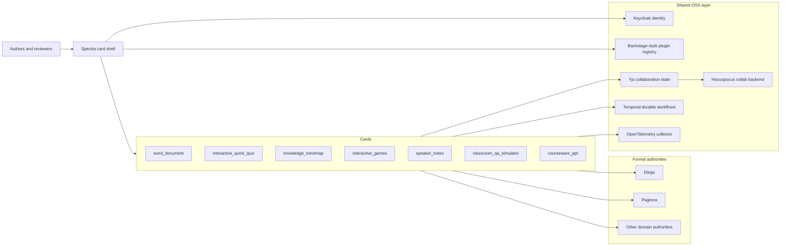
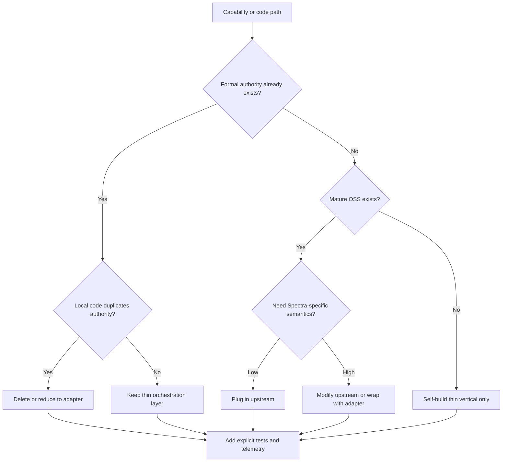

# Spectra Studio Cards Open Source Research Report

## Executive summary

I am reading Spectra as a card-based authoring shell that sits above several formal authorities and shared horizontal layers, with the card surfaces responsible for guided creation, refinement, preview, and workflow control rather than becoming independent “truth systems.” That reading comes directly from your uploaded brief, which frames Spectra as a Studio-card system with vertical cards, horizontal shared services, and explicit concern about overbuild, fallback duplication, and authority drift. fileciteturn0file0 [Pasted markdown](sandbox:/mnt/data/Pasted%20markdown.md)

The strongest conclusion is structural rather than library-specific: **Spectra should stay thin where the market is already deep, and get opinionated only where your card semantics are genuinely domain-specific.** For document-like cards, the open-source ecosystem is already mature enough that self-building editors, collaboration, notes, graph canvases, quiz engines, or mini-game runtimes would create redundant maintenance burden and hidden divergence from your formal authorities. Tiptap, Lexical, BlockNote, React Flow, X6, H5P, Numbas, Phaser, reveal.js, Slidev, LangGraph, Yjs, and OpenTelemetry all show either sustained release cadence, large user communities, or strong extension surfaces. citeturn18view0turn14view0turn13view0turn28view0turn27view1turn19view0turn22view0turn30view0turn36view0turn40view0turn43view0turn46view0turn46view4

For Spectra specifically, the best default pattern is:

- **plug in** mature OSS for generic authoring surfaces;
- **modify** those surfaces only to encode Spectra-specific schemas, anchors, graph semantics, or workflow rules;
- **buy** managed/enterprise layers where operations and collaboration become expensive but the surface itself is not differentiating;
- **self-build** only the thin domain orchestration layer, adapter contracts, and card-specific semantics that bind to your formal authorities. citeturn18view0turn17view0turn23view0turn47view1turn47view3

The internal cleanup priority is equally clear. From your brief, the most suspicious areas are any shared `template_engine`, `fallback.py`, card-local export/transform paths, blanket “FOUNDATION_READY” claims, and card-level shadow implementations of auth, storage, indexing, versioning, or generation. Those are classic signs of authority overlap and hidden truth forks. The OSS evidence strengthens that diagnosis: the community already supplies robust primitives for rich-text editing, collaborative state, graph editing, quizzes, presentation notes, and workflow orchestration, so locally re-implementing them is unlikely to be the best use of engineering time unless the behavior is unique to Spectra’s protocol layer. fileciteturn0file0 citeturn18view0turn46view0turn47view0turn28view0turn19view0turn36view0turn43view0turn47view1

The recommended near-term roadmap is to freeze scope, make protocol boundaries explicit, remove hidden fallbacks, standardize shared collaboration and telemetry, then replace custom card internals with thin adapters over proven OSS. If you do only three things first, they should be: **turn off shadow generation paths, standardize one collaboration stack, and publish a capability-readiness rubric that is stricter than “FOUNDATION_READY.”** fileciteturn0file0 citeturn46view0turn47view0turn46view4

## Project context and decision lens

From your brief, Spectra currently appears to have seven vertical cards—`word_document`, `interactive_quick_quiz`, `knowledge_mindmap`, `interactive_games`, `speaker_notes`, `classroom_qa_simulator`, and `courseware_ppt`—plus horizontal concerns such as an artifact workbench/editor shell, a protocol-driven card framework, versioned artifact editing, and platform layers for auth, storage, collaboration, search, observability, and deployment. The brief also implies multiple existing authorities outside Spectra, especially around formal PPT/material generation and downstream preview/export. That makes Spectra closer to a *workflow and refinement shell* than a monolithic content system. fileciteturn0file0

That architecture implies a practical decision lens:

1. **If a formal authority already owns the artifact**, Spectra should not become a second truth source for the same artifact.
2. **If a mature OSS project already solves the generic surface**, Spectra should usually plug in or extend it.
3. **If the user-facing behavior is Spectra-specific**—for example, paragraph anchors to slide pages, authority-aware repair loops, or card semantics—then Spectra should self-build only that thin layer.
4. **If the capability is ops-heavy and generic**—realtime sync, workflow durability, telemetry, or identity—buying a managed wrapper around OSS is acceptable because budget is not the primary constraint in your brief. fileciteturn0file0

The most plausible user personas, inferred from the card mix, are internal content creators, learning-experience designers, teacher trainers, SME authors, QA/review operators, and platform engineers responsible for protocol stability, deployment, and security. That persona mix matters because it strongly favors **high-ergonomic authoring surfaces, observable workflows, and constrained extension points** over low-level infrastructure novelty. fileciteturn0file0

Methodologically, I treated repository vitality as a combination of **stars, releases, commit depth, issue/PR load, docs quality, and ecosystem breadth**. GitHub’s anonymous HTML no longer exposes exact contributor counts consistently for every repo, so I use exact counts where the page exposes them and otherwise a qualitative community-size proxy inferred from contributors sections, forks, commit history, and “used by” signals. All repository observations are current to April 18, 2026 in Asia/Tokyo. citeturn43view0turn28view0turn40view0turn35view0

## Shared capability direction

The right mental model for Spectra is a thin orchestration shell over formal authorities plus a small number of shared OSS building blocks.

The most important shared choices are already well-served by OSS:

| Shared capability | Primary OSS direction | Why it fits Spectra | Default motion |
|---|---|---|---|
| Realtime collaboration | Yjs + Hocuspocus citeturn46view0turn47view0turn18view0 | Yjs gives CRDT shared types, offline editing, snapshots, shared cursors, and editor integrations; Hocuspocus is a plug-and-play Yjs backend with a clean WebSocket server model. | Plug in |
| Durable orchestration | Temporal citeturn47view1 | Best fit if Spectra workflows become long-running, retry-heavy, human-in-the-loop, or span multiple authorities. | Plug in or buy managed |
| Identity and access | Keycloak citeturn46view3 | Mature open-source IAM for multi-application auth; strong fit if Spectra should not grow card-local auth logic. | Plug in |
| Observability | OpenTelemetry Collector citeturn46view4 | Standardized collection pipeline lets every card emit traces, metrics, and logs without bespoke instrumentation stacks. | Plug in |
| Plugin / extension registry | Backstage design patterns citeturn46view5 | Backstage is a strong reference for plugin registration, ownership metadata, and extension boundaries, even if you do not adopt it wholesale. | Modify pattern, not product |

Two practical implications follow from those choices. First, **card code should not own collaboration, identity, or observability independently**. Second, the plugin system should be **protocol-first, not runtime-first**: declare what a card can do, what authority it may call, what artifacts it may emit, and what lifecycle hooks it exposes, then bind OSS surfaces underneath that contract. That is closer to the discipline seen in systems influenced by entity["company","Spotify","technology company"]’s Backstage than to ad hoc extension loading. citeturn46view5turn46view4turn46view0

The secondary capabilities in your original checklist—storage, search/indexing, data connectors, visualization, ML inference, and CI/CD—should be treated as **platform services borrowed from org-standard infrastructure unless a card’s UX makes them first-order product features**. In other words, Spectra should consume them, not reinvent them, unless they become visibly differentiating inside the card surface. That principle is consistent with the brief’s concern about avoiding duplicate authorities. fileciteturn0file0

## Card capability landscape

### Word document

For `word_document`, the ecosystem is mature enough that a custom editor core would almost certainly be redundant. The key question is not whether to build an editor, but **which editor substrate best matches Spectra’s schema discipline, collaboration needs, and export boundaries**.

| Project | Purpose | Maturity and activity | License and stack | Integration complexity | Docs and signals | Recommendation |
|---|---|---|---|---|---|---|
| Tiptap citeturn18view0 | Headless rich-text editor on ProseMirror; extension-based; collab story tied to Hocuspocus | 36.3k★; 960 releases; latest Apr 8, 2026; 7,671 commits; 818 issues; broad contributor base | MIT; TypeScript | Medium | Strong docs, examples, UI templates; explicit extension model | **Plug in** as default editor core; **buy** Pro only if comments/versioning/conversion save major schedule |
| Lexical citeturn14view0turn11view0 | Headless extensible editor from entity["company","Meta","technology company"] | ~20.5k★; 601 releases; latest Apr 16, 2026; large commit base; active issues/PRs | MIT; TypeScript | Medium to high | Excellent engineering quality; less batteries-included authoring UI than Tiptap/BlockNote | **Modify** if you want deep control and can invest more editor engineering |
| BlockNote citeturn13view0turn12search0 | Block-based editor with real-time collaboration and AI-facing ergonomics | 11.3k★; 635 releases; latest Apr 4, 2026; 97 issues | MPL-2.0; TypeScript | Medium | Strong docs and block UX; good Notion-like mental model | **Plug in** if block-first UX matters more than low-level schema control |
| ONLYOFFICE Docs citeturn17view0 | Full collaborative office suite with review, version history, notes, plugins, OOXML compatibility | 6.4k★; 115 releases; latest Mar 3, 2026 | AGPL-3.0; server-heavy stack | High | Rich office semantics, but substantial ops and license implications | **Buy / plug in selectively** only if true Google-Docs-style office parity is mandatory |
| docx.js citeturn17view1 | Generate and modify `.docx` in JS/TS for browser and Node | 5.6k★; 93 releases; latest Mar 10, 2026; 4,004 commits | MIT; TypeScript | Low | Great for export and template transforms, not primary editing | **Plug in** as export utility, never as editor-of-record |

The default recommendation here is **Tiptap + Yjs/Hocuspocus + Spectra-specific schema adapters**. Tiptap’s extension model, ProseMirror foundation, and collaboration story are the best match for a Studio-card shell that needs reusable blocks, embedded controls, and a controlled domain schema. citeturn18view0turn46view0turn47view0

Use **BlockNote** if the card is meant to feel closer to a block editor than a document editor. Use **Lexical** only if your team wants maximum control and is willing to own more editor internals. Use **ONLYOFFICE** only if you truly need office-suite semantics such as tracked changes, mail merge, rich review features, and live coediting immediately, because the server footprint and AGPL boundary make it materially heavier than Spectra likely needs. citeturn13view0turn14view0turn17view0

The main risk is **ambient lock-in through “just one more feature.”** Tiptap’s Pro tier explicitly covers collaboration, commenting, versioning, conversion, and AI-adjacent features; if Spectra increments into too many Pro dependencies, the editor becomes a disguised buy-decision rather than an OSS-first foundation. That is manageable, but it should be explicit. citeturn18view0

### Interactive quick quiz

`interactive_quick_quiz` is best treated as an authoring-and-analytics shell over mature assessment primitives rather than a new quiz engine. The OSS field has good solutions, but they differ sharply in embedding model and deployment weight.

| Project | Purpose | Maturity and activity | License and stack | Integration complexity | Docs and signals | Recommendation |
|---|---|---|---|---|---|---|
| H5P ecosystem core/editor citeturn19view0turn21view0turn20view3 | Reusable interactive content ecosystem built for LMS/CMS integration | Core: 1,829 commits, 146 tags, 143★; Editor: 2,063 commits, 144 tags, 77★, used by 170+; repo stars understate ecosystem size | GPL-3.0 core + MIT editor; PHP/JS/CSS | Medium to high | Explicit platform-integration interfaces; mature content-type model | **Plug in** for general interaction patterns; **modify** only the authoring wrapper |
| Numbas citeturn21view1turn22view0 | Browser-based e-assessment system, especially strong for mathematics | 214★; 26 releases; latest Dec 5, 2025; 4,085 commits | Apache-2.0; JS/Python | Medium | Strong docs; public editor; assessment logic is proven | **Plug in** for STEM-heavy quiz variants |
| Moodle citeturn20view1turn22view1 | Full LMS with robust quiz ecosystem | 7k★; 570 tags; 121,524 commits | GPL-3.0; PHP/JS | High | Extremely mature but platform-sized | **Borrow patterns**, do not embed whole platform into Spectra |
| Open edX Studio citeturn23view0 | Authoring and LMS platform at scale | 8.1k★; 68,143 commits; AGPL; many services and MFEs | AGPL-3.0; Python/JS/React MFE | Very high | Official docs explicitly say production install is not simple and recommend Tutor/service providers | **Avoid as embed target**; useful only as reference architecture |

The best default is **H5P for general-purpose interactive assessment**, especially if Spectra wants a broad library of interaction types quickly. The main drawback is that H5P’s ecosystem is integration-oriented and historically centered on PHP/CMS/LMS environments, so the Spectra team should avoid dragging the whole platform assumption into the card. Instead, treat H5P as a packaged interaction/runtime boundary. citeturn19view0turn21view0

For math-heavy or logic-heavy training content, **Numbas** is much more compelling than rolling your own. It is narrower than H5P but stronger where scoring semantics matter. By contrast, Moodle and Open edX are much too heavy to become card internals; the Open edX repo explicitly warns that production deployment is complex and strongly recommends packaged distributions or service providers. citeturn21view1turn23view0

The main risk here is not technology but **scope creep into a learning platform**. Spectra should author and orchestrate quizzes, not silently become Moodle-lite or Studio-lite. fileciteturn0file0

### Knowledge mindmap

This capability is well served by mature node-editing and graph-canvas libraries. The key distinction is whether Spectra needs **structured semantic graph editing**, **pure mind mapping**, or **freeform whiteboard behavior**.

| Project | Purpose | Maturity and activity | License and stack | Integration complexity | Docs and signals | Recommendation |
|---|---|---|---|---|---|---|
| React Flow / xyflow citeturn24view0turn28view0 | Node-based UI library for React/Svelte | 36.2k★; 372 releases; latest Mar 27, 2026; 6,089 commits; used by 13k+ | MIT; TypeScript/Svelte | Medium | Excellent docs and examples; strong app-builder adoption | **Plug in** as default structured graph editor |
| X6 citeturn25view1turn27view1turn26view2 | Graph editing and visualization engine from AntV | 6.5k★; 104 releases; latest Mar 18, 2026; 7,255 commits | MIT; TypeScript | Medium | Strong graph-editing semantics; official Simplified Chinese docs | **Plug in** if team values graph affordances and Chinese docs |
| Mind Elixir citeturn25view3turn28view1turn26view4 | Framework-agnostic mind-map core | 3k★; 110 releases; latest Mar 29, 2026; multilingual docs | MIT; TypeScript | Low to medium | Pure mind-map UX; multilingual docs including Chinese and Japanese | **Plug in** for true mind-map mode, not general graph workbench |
| tldraw citeturn29view0 | Infinite-canvas SDK with diagramming, collaboration, AI, and starter kits | 46.4k★; 112 releases; latest Apr 14, 2026 | Custom tldraw SDK license; production key required | Medium | Great canvas UX, but licensing is not plain OSS for production | **Modify / adjunct only** for whiteboard experiences, not canonical semantic graph |
| Cytoscape.js citeturn25view2turn28view2 | Graph theory visualization and analysis library | 10.9k★; 168 releases; latest Apr 6, 2026; very low issue count | MIT; JavaScript | Medium | Excellent for network analysis and large graph rendering | **Plug in** for analysis/viz layers, not as primary editor |

The best recommendation is **React Flow for general structured graph editing**, with **X6** as the strongest alternative when graph-editing semantics and Chinese-language documentation matter more than React-native ecosystem weight. **Mind Elixir** is the best fit for a card that truly wants to behave like a mind map rather than a graph-workbench. citeturn28view0turn27view1turn28view1

I would be careful with **tldraw**. It is an excellent whiteboard SDK, but its strengths are freeform canvas behavior, multiplayer whiteboarding, and broad extensibility, not strict semantic graph enforcement. It also now uses a licensing model in which production use requires a license key, which materially changes the governance profile for an OSS-first architecture. That makes it a good adjunct, not the safest canonical core. citeturn29view0

### Interactive games

This is the card where “self-build” is easiest to over-rationalize and hardest to justify. For Spectra, the winning move is likely **not** a bespoke game engine, but a **thin sandboxed HTML5 app runtime** with a few curated engines underneath.

| Project | Purpose | Maturity and activity | License and stack | Integration complexity | Docs and signals | Recommendation |
|---|---|---|---|---|---|---|
| Phaser citeturn30view0 | HTML5 2D game framework for browser/mobile, Canvas/WebGL | 39.4k★; 20,879 commits; 90 issues; actively maintained for 10+ years | MIT; JS/TS | Medium | Excellent examples and starter templates | **Plug in** as default engine for interactive learning mini-games |
| GDevelop citeturn32search0turn31search1 | No-code / low-code game engine with extensions and templates | 19k★; 255 releases; latest Dec 26, 2025 | MIT; JS/C++/TS | Medium to high | Strong extension/tutorial ecosystem; published game showcase | **Modify** only if empowering non-coder authors is core |
| Twine citeturn35view1 | Interactive nonlinear stories and branching narrative | 2.7k★; 67 releases; latest Apr 10, 2026 | GPL-3.0; TypeScript/Electron | Low | Ideal for branching dialogue and narrative exercises | **Plug in** for scenario storytelling, not physics/action loops |
| p5.js citeturn34view1turn35view0 | Accessible creative coding and lightweight browser interactivity | 23.6k★; 154 releases; latest Mar 23, 2026 | LGPL-2.1; JavaScript | Low | Excellent docs, tutorials, community, multilingual stewardship | **Plug in** for lightweight sketches, simulations, and teaching sandboxes |
| Godot citeturn34view2 | Full 2D/3D multiplatform game engine | 110k★; 68 releases; latest Apr 1, 2026; huge issue/PR volume | MIT; C++/C#/Java | Very high | Huge ecosystem, but far beyond browser-first card needs | **Avoid for card internals** unless games become a major product in themselves |

The default recommendation is **self-build only the Spectra game-card runtime boundary**, while **plugging in Phaser** for most actual game logic and **p5.js or Twine** for simpler pedagogical subtypes. That keeps Spectra opinionated at the artifact boundary—manifest, sandboxing, policy, preview, packaging—but avoids inventing a new engine. citeturn30view0turn35view0turn35view1

**GDevelop** is the interesting wildcard. It is a serious engine with a real extension and tutorial ecosystem, and it could be useful if Spectra’s long-term goal is to empower non-programmer authors to build interactive artifacts themselves. But it is still much heavier than a thin HTML5 mini-app runtime and introduces its own asset-store and engine semantics. citeturn32search0turn31search1

The cleanup implication is straightforward: if Spectra currently contains any internally-grown `game_template_engine`, it should be treated as a likely cleanup candidate unless it encodes genuinely proprietary behavior that Phaser/Twine/p5 cannot express. Otherwise it is probably just a private reimplementation of a solved category. fileciteturn0file0

### Speaker notes

`speaker_notes` is one of the few cards where a thin self-built layer is justified, because the valuable part is likely not “slide deck rendering” but **note extraction, anchor binding, rehearsal support, and authority-aware page linkage**.

| Project | Purpose | Maturity and activity | License and stack | Integration complexity | Docs and signals | Recommendation |
|---|---|---|---|---|---|---|
| reveal.js citeturn36view0 | HTML presentation framework with speaker notes, PDF export, API | 71k★; 51 releases; latest Apr 11, 2026 | MIT; JS/TS/HTML | Low to medium | Includes speaker notes as first-class feature | **Borrow patterns** for presenter UI |
| Slidev citeturn39view0 | Developer slide system with presenter mode, drawing, recording, PPTX export | 45.8k★; 420 releases; latest Apr 5, 2026 | MIT; TypeScript/Vue | Medium | Strong docs with Chinese translation; integrated editor | **Borrow patterns** for notes + rehearsal UX |
| Marp CLI citeturn38view1turn40view1 | Markdown-based slide conversion to HTML/PDF/PPTX | 3.4k★; 127 releases; latest Mar 16, 2026 | MIT; TypeScript | Low | Very good for markdown-to-slide pipelines | **Plug in** for prototyping and conversion utilities |
| Tiptap editor core citeturn18view0 | Headless editor substrate for the notes surface | 36.3k★; latest Apr 8, 2026 | MIT; TypeScript | Medium | Extension system maps well to anchor-aware notes editor | **Plug in** as editing substrate |

The recommendation here is **self-build the domain layer, plug in the primitives**. The domain layer is where Spectra differentiates: paragraph anchors to slide/page IDs, note-to-artifact synchronization, rehearsal cues, script timing, compare mode, and possibly “explain this page” or “generate notes from page diff” workflows. The rendering/editor surface should come from mature OSS. citeturn36view0turn39view0turn18view0

In practice, the fastest route is a **Tiptap-based notes editor plus a presenter shell inspired by reveal.js and Slidev**. This avoids accidentally turning `speaker_notes` into a second slide engine. citeturn36view0turn39view0turn18view0

### Classroom QA simulator

This card is not well served by a single off-the-shelf project, but it is very well served by a **composed stack**: one workflow/orchestration engine, one UI shell, and one evaluation framework.

| Project | Purpose | Maturity and activity | License and stack | Integration complexity | Docs and signals | Recommendation |
|---|---|---|---|---|---|---|
| LangGraph citeturn43view0 | Stateful agent orchestration with durable execution, human-in-the-loop, memory | 29.5k★; 502 releases; latest Apr 17, 2026; 291 contributors explicitly shown | MIT; Python | Medium | Strong docs, guides, academy, case studies | **Plug in** as the default simulation state machine |
| Rasa citeturn44view1 | Conversation framework with NLU, flows, channels, and strict logic | 21.1k★; 254 releases; latest OSS release Jan 14, 2025 | Apache-2.0; Python | High | Mature, but OSS path now looks legacy relative to newer CALM/community positioning | **Modify / selective use** if deterministic business flows matter most |
| Open WebUI citeturn44view0turn45view0 | Self-hosted AI UI with roles, tools, artifacts, local RAG, and model integrations | 132k★; 156 releases; latest Mar 27, 2026 | Mixed / custom licensing history; Python/Svelte/JS | Medium | Huge momentum, rich self-host features, but license governance must be reviewed carefully | **Plug in internally**; **avoid as redistributable core without legal review** |
| DeepEval citeturn43view2turn45view1 | LLM evaluation framework with task completion, tool correctness, conversational metrics | 14.9k★; 53 releases; latest Dec 1, 2025 | Apache-2.0; Python | Low to medium | Good metric coverage for agentic and conversational QA loops | **Plug in** for rubric/eval harness |

The best path is **self-build the pedagogy, not the agent runtime**. Use **LangGraph** for the simulator’s turn-state machine, branching policy, retries, and multi-role control. Use **DeepEval** to score task completion, tool correctness, quality, or conversational metrics. Then wrap both in a custom Spectra card surface. citeturn43view0turn45view1

**Rasa** is still a strong system, but the repo’s own presentation now clearly distinguishes a “legacy” open-source branch from the newer CALM-oriented experience. The latest OSS release visible on the repo is January 14, 2025, so I would not choose it as the default greenfield substrate for a modern multi-turn LLM simulator unless your primary constraint is deterministic flow control over flexible agent behavior. citeturn44view1

**Open WebUI** is very powerful for internal or tightly controlled use, especially when you want self-hosted role-based chat, RAG, and tools. But its current licensing stance includes branding-preservation and mixed-license history, which means it should be reviewed as a governance choice rather than assumed to be a standard permissive OSS dependency. citeturn44view0turn45view0

### Courseware PPT

`courseware_ppt` should be where Spectra is most disciplined about not creating a second authority. The entire ecosystem says there are good slide surfaces and conversion tools, but your own brief implies the formal PPT/material authority already lives elsewhere.

| Project | Purpose | Maturity and activity | License and stack | Integration complexity | Docs and signals | Recommendation |
|---|---|---|---|---|---|---|
| reveal.js citeturn36view0 | HTML slide framework with notes, markdown, PDF export, API | 71k★; 51 releases; latest Apr 11, 2026 | MIT; JS/TS | Low | Great presenter semantics and slide navigation ideas | **Borrow UX patterns**, not authority |
| Slidev citeturn39view0 | Markdown/Vue slide system with presenter mode and PPTX export | 45.8k★; 420 releases; latest Apr 5, 2026 | MIT; TS/Vue | Medium | Strong docs, Chinese docs, integrated editor | **Borrow authoring and rehearsal patterns** |
| Marp CLI citeturn38view1turn40view1 | Markdown converter to HTML/PDF/PPTX | 3.4k★; 127 releases; latest Mar 16, 2026 | MIT; TypeScript | Low | Very useful for conversion and preview pipelines | **Plug in** for prototyping/utilities |
| PptxGenJS citeturn38view2turn40view2 | Programmatic PPTX generation for JS/TS, browser and Node | 5.1k★; 48 releases; latest Jun 26, 2025 | MIT; TypeScript | Low to medium | Great demos and docs, but no canonical model semantics | **Use only as utility**, not second PPT authority |

The recommendation is unambiguous: **self-build only the Spectra front-end workflow layer for PPT courseware, while keeping formal generation/export in the existing authority stack**. That means local edits should usually be represented as structured deltas or refinement intents, not as a second canonical slide model. fileciteturn0file0

Among OSS projects, **Slidev** and **reveal.js** are best treated as UX references, while **Marp CLI** and **PptxGenJS** are utilities for non-authoritative transforms, previews, tests, fixtures, or fallback recovery tooling. If Spectra already contains card-local PPT generation beyond those utility boundaries, that code should be a top cleanup target. citeturn36view0turn39view0turn40view2

## Cleanup priorities and decision framework

The cleanup question is not “what code looks ugly,” but “what code creates a second truth.” Your uploaded brief already points to exactly the places where Spectra may be drifting into that trap. fileciteturn0file0

### High-priority cleanup candidates

| Candidate | Why it looks redundant or over-engineered | Evidence | Priority |
|---|---|---|---|
| Shared `template_engine` / card-local generators | Duplicates mature editor/export ecosystems and risks authority drift | Brief signals hidden fallbacks and duplicate artifact paths; doc/PPT ecosystems already mature | Highest |
| `fallback.py`, `allow_fallback`, silent degrade paths | Creates shadow truths and makes readiness impossible to reason about | Brief explicitly flags these patterns; formal-authority architecture makes hidden fallbacks dangerous | Highest |
| Card-local PPT or DOCX export ownership | Competes with formal authorities instead of orchestrating them | Brief suggests external authorities already own formal outputs; PptxGenJS/docx.js are utility-grade, not canonical authority replacements | Highest |
| Per-card collaboration/versioning logic | Reimplements solved infra instead of centralizing on CRDT + backend | Yjs/Hocuspocus already provide collaboration primitives with snapshots and editor integrations | High |
| Card-local auth/storage/search/indexing | Generic platform work with poor ROI inside card code | Best handled as shared platform layers, not card-specific reinventions | High |
| Premature plugin system without protocol discipline | Extension points become ungovernable if capabilities are not explicitly typed | Backstage-style plugin lessons favor explicit ownership and contracts first | Medium-high |
| “All cards are FOUNDATION_READY” style readiness labels | Encourages false confidence and hides actual capability gaps | Brief suggests readiness inflation; many cards still clearly sit on heavy dependencies and integration risk | High |

That priority order is reinforced by community signals. For example, Open edX’s own docs say production installation is complex; ONLYOFFICE is a real office suite with heavy deployment and AGPL implications; tldraw’s production licensing is no longer plain permissive OSS; and Open WebUI has mixed licensing history. Those signals all point to the same governance lesson: **make boundaries explicit and keep generic capabilities centralized.** citeturn23view0turn17view0turn29view0turn45view0

### Capability health-check rubric

A good cleanup framework for Spectra should score every capability on these axes:

| Dimension | What to ask | Red flag |
|---|---|---|
| Authority overlap | Does this code duplicate a formal authority’s responsibility? | Same artifact can be produced or mutated in two places |
| OSS maturity available | Does a proven OSS alternative already exist? | Team is maintaining bespoke generic surface code |
| Domain specificity | Is the local logic truly Spectra-specific? | “Custom” code mostly wraps solved editor/runtime behavior |
| Operational burden | Does this introduce hosting, scaling, or security work? | Card becomes an ops surface instead of a UX surface |
| License and governance | Are we silently taking on copyleft or custom terms? | Engineers assume “open source” means “safe to embed” |
| Observability | Can this path be traced, replayed, and measured centrally? | Hidden fallbacks or implicit state mutations |
| Migration cost | Can we replace it without changing user semantics? | Tight coupling between card UI and hidden implementation |
| Differentiation value | Would users notice if this were replaced by upstream OSS? | No visible product advantage |

A simple prioritization formula works well in practice:

The decision rule hidden inside that flow is simple: **the more generic the capability, the less justification Spectra has for owning it locally.** fileciteturn0file0

## Actionable roadmap

The roadmap below assumes you want to preserve momentum while moving toward cleaner boundaries and higher leverage.

| Milestone | What changes | Effort | Quick wins | Outcome |
|---|---|---|---|---|
| Truth-first stabilization | Inventory every artifact-producing path; flag duplicate generators; disable silent fallbacks behind explicit feature flags | Low to medium | Remove blanket `FOUNDATION_READY`; add explicit status fields per card; log fallback usage centrally | Stops hidden truth forks |
| Shared capability extraction | Standardize one collaboration stack, one telemetry pipeline, one identity boundary | Medium | Adopt Yjs/Hocuspocus for collaborative cards; emit OTel traces for every authority call | Makes cards observable and comparable |
| Card substrate replacement | Replace bespoke editor/canvas internals with upstream OSS where fit is clear | Medium to high | Tiptap for doc/notes, React Flow or X6 for graph, Phaser/p5/Twine for game runtime, H5P/Numbas for quiz | Shrinks maintenance surface |
| Authority-boundary hardening | Convert card-local exports/transforms into structured refinement operations against formal authorities | Medium | Treat PPT/DOCX libraries as utilities only; forbid card-owned canonical exports by policy | Eliminates duplicate authority paths |
| Protocol and plugin hardening | Publish typed card contracts, lifecycle hooks, and extension registry rules | High | Add capability manifest per card; explicit action/result schemas | Makes extension system governable |
| Evaluation and release governance | Define health scores, owner assignments, deprecation rules, and release gates | Medium | Add rubric scorecard before new capability work; require ADR for any self-build generic layer | Prevents re-accumulation of redundancy |

A pragmatic sequence for the first three months would look like this:

| Time window | Focus | Deliverables |
|---|---|---|
| First two weeks | Cleanup freeze | Capability inventory, fallback audit, readiness rubric, telemetry baseline |
| Weeks three to six | Shared infra standardization | Yjs/Hocuspocus rollout, OTel collector path, explicit authority adapter layer |
| Weeks six to ten | Highest-ROI card migrations | `word_document`, `speaker_notes`, and `knowledge_mindmap` moved to upstream edit/canvas substrates |
| Weeks ten to twelve | Quiz and simulator hardening | H5P/Numbas adapter decision; LangGraph + DeepEval simulator skeleton |
| After quarter one | PPT and extension hardening | PPT card reduced to refinement shell; plugin API alpha |

If you want a single operating principle for the roadmap, it is this: **Spectra should become more opinionated at the protocol layer and less opinionated at the primitive-implementation layer.** That is the best way to preserve differentiated product architecture without paying the long-term tax of re-implementing mature open-source ecosystems. fileciteturn0file0 citeturn18view0turn28view0turn19view0turn30view0turn43view0turn46view0turn47view1turn46view4