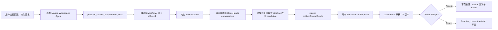

# Presentation AI Refine 设计方案

> 状态：设计提案
> 日期：2026-08-02
> 范围：Spectra、`spectra-agent-runtime`、Deckelier 之间的 Presentation AI Refine 交互、执行与版本审核链路。

## 结论

Presentation AI Refine 采用一条最小闭环：

**Mastra 理解用户要求并调用工具；DBOS 持久执行；OpenHands 续跑原始创作会话；Spectra 把结果作为现有 Artifact Proposal 展示；Accept 后才创建 revision。**

首版直接复用：

- 当前 Workspace Agent 的 `aiRun.id`，作为请求、DBOS workflow 和 Proposal 的统一身份。
- 原 Presentation generation attempt 的 OpenHands runtime 与 conversation。
- `artifactSourceBundles` 和 `presentationEditorSnapshots`。
- `artifactEditProposals`、现有 Accept/Reject 模式和 revision 冲突检查。
- Deckelier `stream-preview`，同时渲染原稿和 AI candidate。

首版不新增 `presentation_refinement_runs` 或 `presentation_source_packages`，也不建设通用 Agent Job、Source Package 或多候选平台。

## 已有基础

当前 `main` 已具备：

- Ready Presentation 默认留在 Workbench，通过 Deckelier `stream-preview` 查看。
- 用户可以选择幻灯片，选区写入 `spectraSurfaceContext`。
- 服务端重新加载 artifact，校验 Actor、revision 和页面范围。
- Assistant 显示“已选择第 x/n 张幻灯片”。
- 全屏 Deckelier 可以手动编辑并创建新 revision。
- 生成结果已经保存完整 `.pptd/.page`、图片、manifest 和 source archive。
- 手动编辑 revision 保存 `presentationEditorSnapshots`。
- `aiRuns` 已提供请求身份，DBOS 已提供持久 workflow、stream 和恢复能力。
- `artifactEditProposals` 已提供 pending、accepted、dismissed 和 base revision 冲突边界。

当前缺的是 Presentation 专用的工具、OpenHands 续跑 workflow、candidate 收集和 Proposal 接入，不需要重做预览器或另建任务平台。

## 目标

1. 用户选择页面后，在现有 Assistant 中发起修改。
2. 默认续跑生成该 PPT 的原 OpenHands conversation，保留创作上下文。
3. 每次执行前用用户指定的 `baseRevisionId` 重置文件事实。
4. AI 只产生 candidate，不直接覆盖 current revision。
5. 页面刷新、Spectra 重启、DBOS 恢复和 OpenHands runtime 重启不会重复提交指令。
6. 图片和其他二进制资产可以完整重放和审核。
7. 手动编辑与 AI Refine 冲突时返回 stale/superseded，不静默覆盖。
8. 日志不包含用户 prompt、PPT 内容、凭据或完整 URL。

## 非目标

第一版不实现：

- 多个 Presentation Refine 并发执行。
- 页面级部分 Accept。
- 三方 merge 或自动 rebase。
- 多个 candidate 并排比较。
- candidate 全屏编辑。
- 精确元素级 diff。
- 半写入文件的实时预览。
- 原会话不可用时自动创建新会话。
- 通用 `agent_jobs`、Source Package 平台或第二套 Proposal 系统。

## 五条必须保持的不变量

### 1. 会话提供记忆，revision 提供事实

原 OpenHands conversation 保存最初目标、引用资料、风格和历史决策，应当续跑。

但 conversation 和 workspace 可能落后于用户的手动编辑。因此每次续跑前，必须把 `baseRevisionId` 对应的文件重新物化到原 workspace。Agent instruction 明确：

> 历史会话用于理解创作上下文；本轮由 Spectra 写入 workspace 的 base revision 是唯一文件事实。

### 2. Workspace 只是执行缓存

失败、Reject 或取消后不回滚 OpenHands workspace。下一次任务开始前重新物化 base revision，即可恢复一致状态。

### 3. AI 只能产生 candidate

OpenHands 的输出先存为 staged source bundle，并发布 Proposal。只有 Accept 可以创建 revision 和更新 artifact current revision。

### 4. Accept 必须检查 base revision

Proposal 发布和 Accept 都必须检查 artifact current revision 仍等于 `baseRevisionId`。不相等则任务或 Proposal 变为 stale/superseded。

### 5. Continuation 必须由 runtime 原子幂等

网络错误不能导致同一指令被追加两次。`spectra-agent-runtime` 必须在持久事件存储层接受并原子保证 `Idempotency-Key` 唯一。

## 组件职责

| 组件 | 负责 | 不负责 |
| --- | --- | --- |
| Workbench | 页面选择、任务反馈、candidate 预览、Accept/Reject | Agent 编排和文件修改 |
| Deckelier stream-preview | 渲染 current revision 和 candidate | 任务状态和版本决策 |
| Mastra Workspace Agent | 理解要求、绑定 surface context、调用工具 | 等待长任务、直接写 PPTD |
| Presentation Domain | 权限、lineage、source 解析、Proposal、revision 冲突 | 自主推理 |
| DBOS | 持久 workflow、重试、恢复、阶段 stream | 内容生成 |
| OpenHands | 在原创作上下文中修改 Presentation 文件 | 决定 canonical revision |
| PostgreSQL / 对象存储 | 状态、不可变 source bundle 和 revision | Agent 推理 |

## 总体流程



## 统一身份与持久状态

### 复用当前 aiRun

一次用户消息已经对应一个 `aiRuns` 记录。Presentation Refine 不再创建第二个 run：

- Mastra tool 从当前 Agent context 取得 `runId`。
- DBOS workflow ID 使用该 `runId`。
- OpenHands idempotency key 使用该 `runId`。
- `artifactEditProposals.runId` 使用该 `runId`。
- accepted revision 的 `producingRunId` 仍使用该 `runId`。

Mastra 单轮可以在工具成功入队后结束。长任务状态由 DBOS workflow status 和 durable stream 提供；不把 `aiRuns.state` 扩展成第二套 Presentation 阶段状态机。

### DBOS workflow input

```ts
type PresentationRefineWorkflowInput = {
  actor: Actor;
  artifactId: string;
  baseRevisionId: string;
  conversationId: string;
  focus: Array<{ index: number; path: string }>;
  instruction: string;
  runId: string;
  workspaceId: string;
};
```

该输入通过 Zod 校验并由 DBOS 持久化。无需为相同字段再建领域表。

页面 index 只用于 UI；后台身份使用 Deckelier page `path`。工具入队前把 index 解析成 `{ index, path }`。

### 并发边界

第一版使用独立 Presentation Refine DBOS queue，`concurrencyLimit = 1`。每个 workflow 开始和发布 Proposal 前都重新检查 base revision。

这是有意的首版上限：当真实吞吐量证明全局串行成为瓶颈时，再增加按 OpenHands workspace 的锁或索引表；现在不为尚未出现的并发需求建设状态平台。

## 复用现有 source 存储

### artifactSourceBundles

现有 `artifactSourceBundles` 已包含：

- artifact、revision 和 generation attempt 关联。
- staged / published 状态。
- object key、object version、media type、size 和 SHA-256。
- source manifest。
- 清理和读取链路。

因此只做最小 schema 扩展：

```text
artifact_source_bundles
  generation_attempt_id  改为 nullable
  producing_run_id       uuid nullable -> ai_runs.id
```

约束：

- generation 产生的 bundle 使用 `generationAttemptId`。
- AI candidate 使用 `producingRunId`，state 为 `staged`，revision 为空。
- Accept 后 candidate 绑定新 revision 并变为 `published`，不复制对象正文。
- 手动 revision 延迟合成的 published bundle 可以没有 producer。
- 同一个 `producingRunId` 最多一个 source bundle。
- bundle 的对象身份、hash、size 和 manifest 不可变。

### 手动编辑 revision

不要求每次 Deckelier 保存都立即重打完整 archive。

Refine 读取 base revision 时：

1. 若该 revision 已有 published `artifactSourceBundle`，直接使用。
2. 否则读取该 revision 的 `presentationEditorSnapshot`。
3. 沿 parent revision 找到最近的完整 published source bundle，取得仍被引用的历史资产。
4. 用 editor snapshot 的 `.pptd/.page` 覆盖旧文本；保留 data URL，复制仍被引用的历史资产。
5. 调用现有 deterministic archive/pipeline 校验并生成完整 bundle。
6. 将结果作为该 base revision 的 published `artifactSourceBundle` 缓存。

这样只在 AI 真正需要完整文件时支付打包成本，也不会为同一 revision 重复构建。

## OpenHands lineage 与 workspace

### 找回原创作会话

从 `baseRevisionId` 沿 `parentRevisionId` 向上查找最近拥有 `generationAttemptId` 的 ancestor，然后取得：

- 原 generation attempt ID。
- `providerConversationId`。
- 由原 generation attempt 解析出的 runtime binding。

必须使用原 generation attempt 解析 runtime URL，不能使用当前 `aiRun.id` 创建新的 authoring runtime。

若 runtime 或 conversation 无法恢复：

- workflow 失败为 `authoring_session_unavailable`。
- UI 明确提示原创作上下文不可用。
- 不静默创建空 conversation。

新会话降级只有真实需求出现后再设计。

### 安全物化

只替换原 workspace 的 Presentation 输出子树，不替换 conversation workspace 根目录或其他上下文文件：

1. 下载并验证 base source bundle。
2. 解压到 workspace 内的 staging 目录。
3. 拒绝绝对路径、`..`、重复路径、符号链接、超限文件和超限 archive。
4. 原子替换受控的 Presentation `out/` 子树。
5. 写入 base revision 和 source hash marker。
6. continuation 才能开始。

下一轮总是重新物化，不能依赖上一次失败或 Reject 后的 workspace 内容。

## Mastra 工具

新增单一工具：

```ts
propose_current_presentation_edits({
  artifactId,
  expectedRevisionId,
  focus,
  instruction,
})
```

工具必须：

- 使用当前 Agent context 的 Actor 和 `runId`。
- 校验 artifact 属于当前 workspace，且 Actor `canManage`。
- 校验 artifact 为 ready Presentation。
- 校验 `expectedRevisionId` 仍为 current revision。
- 重新解析 index 到 page path。
- 使用现有 PostgreSQL DBOS enqueue 路径，以 `runId` 作为 workflow ID 幂等入队。
- 快速返回 `{ runId, status: "queued" }`，不等待 OpenHands。

工具不读写 PPTD、不调用内部 HTTP API、不返回 source bundle 正文。

## DBOS workflow

新增一个 Presentation 专用 workflow，但只保留四个外部副作用边界：

```text
presentation-refinement-v1

1. prepare-workspace
2. continue-authoring
3. collect-and-validate-candidate
4. publish-proposal
```

### 1. prepare-workspace

- 加载 artifact 和 base revision。
- 检查 base revision 仍为 current。
- 解析 OpenHands lineage。
- 解析或延迟构建完整 base source bundle。
- Probe runtime/conversation。
- 安全替换 Presentation `out/` 子树。

### 2. continue-authoring

- 调用原 conversation continuation API。
- 使用 `Idempotency-Key: presentation-refine:<runId>`。
- prompt 包含同一个 operation marker，方便审计和诊断。

### 3. collect-and-validate-candidate

- 恢复或轮询 conversation，直到完成或失败。
- 从受控输出目录收集完整 archive。
- 调用现有 Presentation pipeline 解析和校验。
- 与 base 计算页面 hash，确认至少一个实际变化。
- 保存 staged `artifactSourceBundle`，`producingRunId = runId`。

### 4. publish-proposal

- 再次检查 artifact current revision。
- 发布现有 `artifactEditProposal` 的 `presentation` variant。
- 写入 durable stream 的完成事件。

每个步骤重试前先 reconcile 已有 DBOS、runtime、bundle 或 Proposal 状态，不能把网络错误当作请求未执行。

## OpenHands continuation 幂等

P0 直接修改 `spectra-agent-runtime`：

- continuation API 接受 `Idempotency-Key` 或 `client_event_id`。
- Agent Server 在持久事件存储层原子保证唯一。
- 重复请求返回第一次创建的 event/run 状态。
- runtime 重启后该唯一性仍然存在。

Spectra 不实现 `listEvents` 文本扫描回退。workspace marker 只记录当前物化的 base revision，不承担 API 幂等责任。

## Candidate 校验

复用现有：

- `readTaskAgentSourceArchive` 的 archive 大小、文件数、单文件、路径、类型和重复路径限制。
- `runPresentationPipeline` 的 entrypoint、PPTD、page、manifest 和 deterministic archive 逻辑。
- `parsePptdProject` 的 Deckelier schema 解析。
- 现有图片和 source policy。

Refine 只补三个条件：

1. 所有被引用的本地资源存在。
2. candidate 能被 Deckelier 完整解析。
3. candidate 相对 base 至少有一个页面或资源变化。

任何条件失败都不发布部分成功 Proposal。

## Proposal、Accept 与 Reject

### Proposal contract

扩展现有 discriminated union：

```ts
type PresentationEditProposal = {
  artifactId: string;
  baseRevisionId: string;
  candidateSourceBundleId: string;
  changedSlidePaths: string[];
  kind: "presentation";
  request: string;
  runId: string;
  summary: string;
  title: string;
};
```

Proposal 只保存 staged bundle ID 和轻量 diff，不存 PPTD、图片正文或对象存储凭据。

### Accept

在一个数据库事务中：

1. 锁定 artifact。
2. 重新校验 Actor `canManage`。
3. 检查 Proposal 仍为 pending。
4. 检查 artifact current revision 等于 Proposal base revision。
5. 检查 staged bundle 属于该 artifact、run 且 hash/manifest 已校验。
6. 创建新 artifact revision，`producingRunId = runId`。
7. 将 bundle 绑定新 revision 并改为 published。
8. 更新 artifact current revision。
9. 标记 Proposal accepted，并 dismiss 旧 pending Proposal。

### Reject

- 标记 Proposal dismissed。
- current revision 不变。
- staged bundle 延迟清理。
- 下一次 Refine 仍从 canonical base revision 重新物化 workspace。

### Stale conflict

若运行期间用户保存了新 revision：

- workflow 不发布 Proposal，返回 superseded；或现有 pending Proposal 在 Accept 时冲突。
- UI 提示“原稿已发生变化，请基于最新版本重新修改”。
- 不自动 merge 或 rebase。

## Workbench 交互

继续使用现有 Workbench、Assistant 和 `stream-preview`。

### 发起和执行中

- 用户选择页面并发送要求。
- 工具入队后显示“AI 修改中”。
- UI 从 DBOS durable stream 恢复四个阶段：准备、修改、校验、待审核。
- 不展示伪造百分比。

### Proposal ready

P0 必须允许用户看到 candidate：

- 默认将左侧预览切换到 AI candidate。
- 顶部提供“原稿 / AI 版本”切换。
- 显示 Accept / Reject。
- 页面选择继续可用。

P0 不做紫色精确 diff、高级比较或 candidate 全屏编辑。

### 完成

- Accept 后留在 Workbench，加载新 revision。
- Reject 后切回 current revision。
- 只有 candidate 通过完整解析后才更新预览。

## 安全与日志

- 所有 tool input、DBOS input、surface context、runtime result 和 Proposal 通过 Zod。
- Presentation feature 接收 Actor，不读取 cookie/session。
- 同进程模块直接调用 feature function，不调用内部 HTTP API。
- source archive 复用现有 traversal、member type、重复路径和大小限制。
- 对象存储 key 由服务端生成，不接受用户提供。
- runtime 只得到任务所需文件访问能力，不得到数据库或通用对象存储凭据。
- 日志只记录稳定 ID、阶段、耗时、计数和错误码。
- 不记录 prompt、PPT 正文、headers、cookies、凭据或完整 URL。

## 可观测性

P0 复用 DBOS workflow status、durable stream 和现有 Pino/OTel，不建设新的指标平台。

只增加四个阶段事件：

```text
presentation_refinement.prepared
presentation_refinement.authoring_started
presentation_refinement.candidate_validated
presentation_refinement.proposal_published
```

失败继续使用一个 `presentation_refinement.failed` 事件，字段仅包含 run、artifact、base revision、stage、duration 和 failure code。

当实际运维数据出现后，再决定是否增加 Accept 比例、runtime 恢复率或逐阶段 dashboard。

## 最小测试集

P0 留下五个能阻止回归的测试：

1. source resolver 能从 generated bundle 或 editor snapshot + ancestor assets 构造同一完整输入，包含图片。
2. runtime 收到两次相同 idempotency key 时只追加一次 continuation，重启后仍成立。
3. workflow 从原 conversation 完成 candidate 并发布 Presentation Proposal。
4. Accept 原子创建 revision；Reject 不改变 revision；base revision 变化时冲突。
5. 浏览器闭环：选择页面、发起、刷新恢复、预览 candidate、Accept/Reject。

其余格式和恶意 archive 场景继续由现有 pipeline 测试覆盖，不为 Refine 复制测试矩阵。

## 分阶段实施

### P0：一条可靠闭环

1. 给 `spectra-agent-runtime` continuation 增加原生幂等键。
2. 最小扩展 `artifactSourceBundles`，支持 `producingRunId` 和 staged AI candidate。
3. 增加 Mastra Presentation tool 和四步 DBOS workflow。
4. 增加 Presentation Proposal、candidate 预览、Accept/Reject 和 stale conflict。
5. 增加上述五个测试。

### P1：有证据后增强

- 按 workspace 并发替代全局串行。
- 运行中取消。
- changed slide 精确高亮。
- candidate 全屏查看。
- 原 runtime 不可用时的显式新会话降级。
- staged bundle 清理和诊断工具。

### P2：高级协作

- 独立 operation worktree。
- 页面级部分 Accept。
- 三方 rebase/merge。
- 多 candidate 比较。
- parse-valid checkpoint 增量预览。

## P0 验收标准

- 用户可以选择页面并通过现有 Assistant 发起 Refine。
- 工具立即返回当前 `runId`，不等待 OpenHands。
- DBOS 使用同一 `runId`，刷新和进程重启后可恢复。
- Refine 续跑原 generation attempt 的 OpenHands conversation。
- 每次续跑前从指定 base revision 重置 Presentation 文件。
- 图片新增、替换和历史引用能够进入完整 candidate bundle。
- continuation 重试不会追加重复指令。
- candidate 不能直接覆盖 current revision。
- 用户能在 Workbench 切换原稿和 candidate 后 Accept/Reject。
- Accept 原子创建 revision；Reject 不改变 revision。
- 手动保存导致 stale/superseded，不覆盖用户修改。
- 外部输入、archive 和持久不变量继续通过现有安全边界校验。
- 日志不包含用户内容或凭据。

## 最终判断

Presentation AI Refine 不需要新的 Agent、Viewer、Run 平台或 Source Package 平台。首版只需把已有边界接通：

- Mastra：理解和工具路由。
- DBOS：持久执行。
- OpenHands：复用原始创作记忆修改文件。
- `artifactSourceBundles`：base 与 candidate 文件事实。
- Proposal：用户审核边界。
- Deckelier：统一预览和编辑表面。

先交付这一条闭环。只有现有表、全局串行或轻量 diff 被真实使用证明不足时，再增加专用模型。
